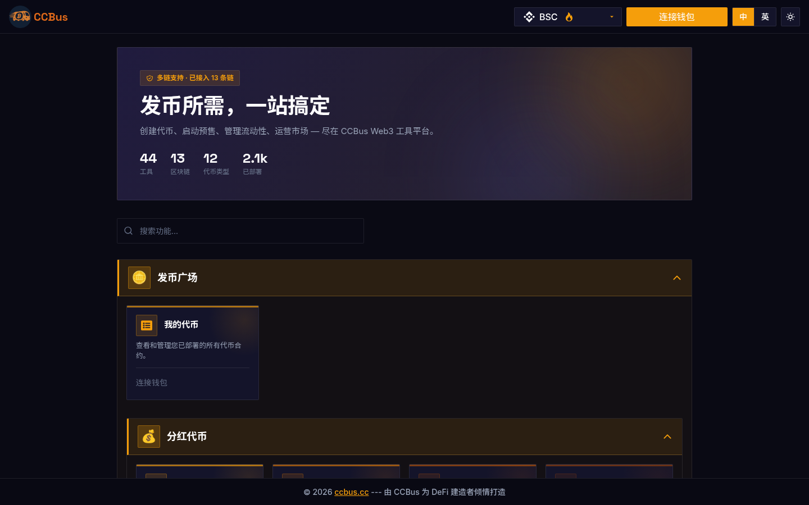

<div class="ccbus-hero">
  <div class="ccbus-hero-avatar">
    
  </div>
  <div class="ccbus-hero-content">
    <h1>Chapter 1: Blockchain Fundamentals</h1>
    <div class="ccbus-teacher-label">🎙️ 本章讲师:<strong>Captain CCBus</strong> · The "professor + tour guide + friendly bus" of blockchain</div>
  </div>
</div>

## 1.0 2025-2026 Perspective: Why Reread This Chapter

By 2026, blockchain is no longer "a novel digital-currency technology". It has evolved into the **underlying infrastructure of the global digital economy**, serving three distinct roles:

1. **Value settlement layer** — Bitcoin (BTC), stablecoins (USDT, USDC, USDe, PYUSD, FDUSD) form a $3.4 trillion on-chain asset class
2. **Programmable finance layer** — Ethereum + L2s combined carry a smart contract ecosystem with daily transaction volume 3x that of Visa
3. **Identity & data layer** — ENS, Lens, Farcaster, SBT, Worldcoin are redefining "account"

**Key 2025-2026 changes that warrant a reread**:

- **Multi-chain universe has crystallized**: 2025 was the watershed where L1 + L2 went from "experiment" to "production". Ethereum (+ L2s) holds 60%+ TVL; Solana is the single-chain throughput king; BNB Chain dominates memes and retail; Ton is the gateway to Telegram's 1.4B users; Sui/Aptos are Move-family rising stars; Monad/Berachain/Story are 2025-2026 launches
- **"Blockchain" is no longer just "a chain"**: Celestia, EigenDA, Avail provide modular data availability (DA) layers; Espresso, Astria provide shared sequencers — "blockchain" has split into four independent modules: execution, settlement, consensus, DA
- **AI agent economy takes off**: ai16z DAO, Virtuals Protocol, Aethernet, Zerebro make AI agents native on-chain actors; 2025-Q4 saw $8B+ in assets managed by on-chain AI agents
- **RWA mainstreaming accelerates**: BlackRock BUIDL, Ondo Finance, Maple Finance, Securitize have tokenized $30B+ in real-world assets to public chains (T-bills, credit, real estate, private funds)
- **Quantum-resistance preparation**: NIST formally released FIPS 203/204/205 (ML-KEM, ML-DSA, SLH-DSA) in 2024-08; post-quantum cryptography (PQC) is entering the migration period for blockchain stacks

### 🖥️ Real-world Example: CCBus All-in-One DeFi Toolkit

**CCBus** (ccbus.cc) is a multi-chain (BNB Chain, Solana, etc.) one-stop DeFi toolkit that packages nearly all the core blockchain capabilities covered in this chapter — **token standards, on-chain interaction, wallet management, contract verification, market analytics** — into a visual GUI. The screenshot below shows the platform's homepage feature matrix.



*Figure 1-1: CCBus homepage. Notice how mainstream public-chain features — **dividend tokens, liquidity-pool tokens, cross-chain bridges, DeFi tools, market analytics** — are surfaced to end users through visual tooling.*

## 1.1 What is Blockchain?

**Blockchain** is a distributed ledger technology (DLT) that allows data to be stored in blocks and linked together through cryptography, forming a chain. Each block contains a batch of transaction records, and once added to the chain, it is nearly impossible to modify.

The name "blockchain" comes from its structural characteristics:
- **Blocks**: Containers for data, including transaction records, timestamps, and other metadata
- **Chain**: Blocks are connected through cryptographic hash values, forming an immutable time sequence

### Basic Structure of a Block

Each block typically contains the following information:

1. **Block Header**
   - Hash of the previous block
   - Timestamp
   - Difficulty target
   - Nonce
   - Merkle tree root

2. **Transaction Data**
   - All transaction records contained in the block
   - Organized using a Merkle tree for easy verification

3. **Other Metadata**
   - Block size
   - Block height
   - Version information

## 1.2 Core Features of Blockchain

### 1.2.1 Decentralization

**Decentralization** is one of the most important characteristics of blockchain. Traditional systems usually rely on centralized servers or institutions, while blockchain distributes data and control to multiple nodes in the network.

**Advantages:**
- No single point of failure
- Strong censorship resistance
- No dependence on a single entity
- More equitable distribution of power

**Examples:**
- Traditional banking system: Banks control all accounts and transactions
- Bitcoin network: Thousands of nodes jointly maintain the ledger

### 1.2.2 Transparency

All transactions on the blockchain are publicly visible. Anyone can view the data on the blockchain, but personal identities are usually anonymous (using addresses instead of real names).

**Benefits:**
- Enhances trust
- Facilitates auditing
- Reduces corruption
- Improves accountability

### 1.2.3 Immutability

Once data is recorded on the blockchain, it is extremely difficult to modify. This is because:

1. Each block contains the hash of the previous block
2. Modifying historical data requires recalculating all subsequent blocks
3. Requires controlling the majority of the network's computing power

**Practical Significance:**
```
If an attacker wants to modify data in block 100:
1. Must recalculate the hash of block 100
2. This will change the input of block 101
3. Must recalculate blocks 101, 102, 103... until the latest block
4. Must complete all calculations before other honest nodes
5. Practically impossible (requires controlling >51% of network hash power)
```

### 1.2.4 Security

Blockchain uses powerful cryptographic techniques to protect data:

- **Hash Functions**: SHA-256, Keccak-256, etc.
- **Public Key Encryption**: Elliptic Curve Digital Signature Algorithm (ECDSA)
- **Consensus Mechanisms**: Proof of Work (PoW), Proof of Stake (PoS), etc.

## 1.3 How Blockchain Works

### Transaction Flow

Let's understand how blockchain works through a Bitcoin transaction example:

#### Step 1: Create Transaction

Alice wants to send 1 BTC to Bob:
```
Transaction content:
- Sender: Alice's address
- Receiver: Bob's address
- Amount: 1 BTC
- Fee: 0.0001 BTC
```

#### Step 2: Sign Transaction

Alice uses her private key to digitally sign the transaction, proving she owns these bitcoins.

#### Step 3: Broadcast to Network

The signed transaction is broadcast to all nodes in the Bitcoin network.

#### Step 4: Verify Transaction

Nodes in the network verify the transaction's validity:
- Does Alice have sufficient balance?
- Is the signature valid?
- Is the transaction format correct?

#### Step 5: Enter Memory Pool

Valid transactions enter the memory pool (Mempool), waiting to be packaged into a block.

#### Step 6: Mining

Miners select transactions from the memory pool, package them into a new block, and start solving mathematical puzzles (Proof of Work).

#### Step 7: Block Confirmation

The first miner to solve the puzzle broadcasts the new block to the network, and other nodes verify and accept this block.

#### Step 8: Transaction Complete

As more blocks are added to the chain, this transaction receives more confirmations and becomes increasingly irreversible.

## 1.4 Types of Blockchain

### 1.4.1 Public Blockchain

Public blockchains are completely open blockchain networks where anyone can:
- Participate in transactions
- Run nodes
- Participate in the consensus process

**Characteristics:**
- ✅ Fully decentralized
- ✅ Highly transparent
- ✅ Censorship resistant
- ❌ Poor scalability
- ❌ Slow transaction speed

**Typical Examples:**
- **Bitcoin**: The first public blockchain, focused on value storage and transfer
- **Ethereum**: Public blockchain supporting smart contracts
- **Solana**: High-performance public blockchain

### 1.4.2 Private Blockchain

Private blockchains have restricted access, and only authorized participants can join the network.

**Characteristics:**
- ✅ High efficiency
- ✅ Better privacy protection
- ✅ Easy to manage
- ❌ Higher degree of centralization
- ❌ Lower trustworthiness

**Use Cases:**
- Enterprise internal data sharing
- Supply chain management
- Internal audit systems

**Typical Examples:**
- **Hyperledger Fabric**: IBM-led enterprise blockchain framework
- **R3 Corda**: Distributed ledger focused on the financial industry

### 1.4.3 Consortium Blockchain

Consortium blockchains are between public and private blockchains, managed by a group of pre-selected nodes.

**Characteristics:**
- Partially decentralized
- Only consortium members can participate in consensus
- Faster than public chains, more decentralized than private chains

**Use Cases:**
- Cross-organizational collaboration
- Interbank settlement
- Industry alliances

**Typical Examples:**
- **Quorum**: Enterprise-grade Ethereum developed by JPMorgan
- **VeChain**: Supply chain management consortium blockchain


### 1.9 Rethinking "Blockchain" — From Monolithic Chain to Modular Stack

**Traditional view (2018-2022)**: A blockchain = consensus + execution + data availability + settlement (all bundled into one chain)
- Examples: BTC, ETH (pre-merge), Solana

**2025-2026 new view**: A "blockchain" = 4 independently replaceable modules
- **Execution layer**: EVM, SVM, MoveVM, WASM run contracts
- **Settlement layer**: validates execution results, provides finality
- **Consensus layer**: orders transactions
- **Data Availability layer (DA)**: ensures data is downloadable by anyone

**Real 2025-2026 layered projects**:

| Module | Representative | Tech |
|---|---|---|
| Execution | Arbitrum Stylus, EVM, Solana SVM, Sui Move | EVM / WASM / MoveVM |
| Settlement | Ethereum L1, Celestia, Berachain | Any chain providing finality |
| Consensus | Ethereum Beacon Chain, Celestia, Solana Tower BFT | PoS / PoH / BFT |
| DA | Celestia, EigenDA, EIP-4844 Blob, Avail | DAS / Blob |

**Example: Rollup + Blob**:
- **Execution**: Arbitrum One (Optimistic), zkSync Era (ZK)
- **Settlement + Consensus + DA**: Ethereum L1 (rollup posts state root to L1)
- **DA**: blob data lives on L1 nodes, expires after 18 days

**Example: Sovereign Rollup on Celestia**:
- **Execution + Settlement**: Manta, Movement (each rollup)
- **DA**: Celestia (shared)
- **Consensus**: Celestia (shared)

**What this means for developers**:
- Stop "choosing an L1"; start "choosing a set of modules"
- Marginal cost of launching an app drops from $100M (L1) to $1K (Rollup)
- Single-point-of-failure risk spread across multiple modules

### 1.10 AI Agent Accounts (2025-2026 New Paradigm)


*图: CCBus wallet manager — prototype of smart accounts and AI agent wallets*


By 2026, the "user" of on-chain accounts is no longer just humans. An **AI agent account** is an on-chain account controlled by an AI model, holding its own private keys.

**Characteristics of AI agent accounts**:
- Own its own wallet (e.g., Safe smart account)
- Can initiate transactions autonomously
- Can hold assets (ETH, USDC, tokens)
- Can join DAO voting
- Can interact with other AI agents

**Production projects (2025-2026)**:

| Project | Description |
|---|---|
| **ai16z (Eliza framework)** | $1.6B-scale open-source AI agent framework, DAO-governed |
| **Virtuals Protocol** | One-click create AI agent token, agent can initiate governance proposals |
| **Aethernet** | AI agents can become DAO voters |
| **Zerebro** | Fully autonomous AI agent, issues its own tokens |
| **Truth Terminal** | AI-manipulated meme coin GOAT broke $1.3B market cap |
| **Aethernet DAO** | AI agents have formal voting rights in DAO governance |

**Tech stack for AI agent accounts**:
- **Wallet**: Safe smart account (supports Session Keys, spending limits)
- **Private key**: MPC multi-sig (avoid single-point-of-failure)
- **Identity**: SBT (soulbound credential) proves agent identity
- **Audit**: all AI agent decisions on-chain, auditable by traditional tools
- **Rate-limiting**: max daily spending limit, prevent runaways

**Controversies (2026-Q1)**:
- **Issue 1**: Should AI agents have voting rights? Legally voting is a "human right"
- **Issue 2**: If AI agent loses user money, who bears responsibility?
- **Issue 3**: If AI agent is malicious, is it the developer's or model's fault?
- **2026 regulatory stance**: US SEC does not recognize AI agents as "accredited investors"; EU MiCA requires a natural person behind the agent
- **2027 prediction**: AI agents will get limited "on-chain personhood" — they can do specific behaviors (e.g., automated market making) but not full voting rights

**AI agent account smart contract example (simplified)**:

```solidity
// A minimal AI agent smart account
contract AIAgentAccount {
    address public owner;       // human creator
    address public operator;    // AI agent's session key
    uint256 public dailyLimit;  // daily spending limit
    mapping(bytes32 => bool) public usedHashes; // replay protection

    modifier onlyOperator() {
        require(msg.sender == operator, "not operator");
        _;
    }

    modifier withinLimit(uint256 amount) {
        require(amount <= dailyLimit, "over daily limit");
        _;
    }

    function execute(address to, uint256 value, bytes calldata data, uint256 nonce)
        external onlyOperator withinLimit(value)
        returns (bytes memory)
    {
        // Replay protection
        bytes32 txHash = keccak256(abi.encodePacked(to, value, data, nonce));
        require(!usedHashes[txHash], "replay");
        usedHashes[txHash] = true;

        // Execute
        (bool success, bytes memory result) = to.call{value: value}(data);
        require(success, "exec failed");
        return result;
    }

    function rotateOperator(address newOperator) external {
        require(msg.sender == owner, "only owner");
        operator = newOperator;
    }
}
```

**Summary**: AI agent accounts are the most important new account paradigm of 2026. They blur the line between "user" and "tool", requiring new regulatory, technical, and ethical frameworks.

## 1.5 Blockchain Applications

### Financial Services
- Cross-border payments
- Digital currencies
- Decentralized Finance (DeFi)

### Supply Chain Management
- Product traceability
- Logistics tracking
- Anti-counterfeiting verification

### Digital Identity
- Identity verification
- Academic credentials
- Medical records

### Intellectual Property
- Copyright protection
- NFT artwork
- Digital asset ownership

### Voting Systems
- Electronic voting
- DAO governance
- Community decision-making

## Chapter Summary

Blockchain technology provides us with a completely new way of storing and transacting data through core features such as decentralization, transparency, and immutability. Understanding the basic principles of blockchain is the crucial first step in learning about cryptocurrency and Web3 technologies.

In the next chapter, we will explore the world of cryptocurrency, understanding Bitcoin, Ethereum, and how to acquire and use cryptocurrencies.

---

**Next Chapter:** [Chapter 2: Introduction to Cryptocurrency](/en/chapter-2)
