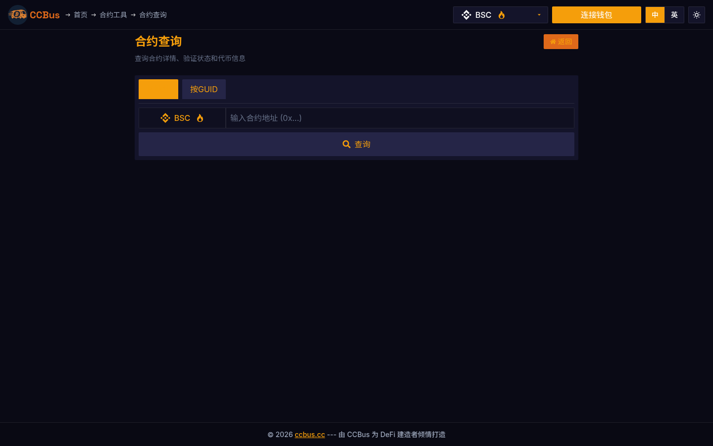

# Chapter 14: Enterprise Blockchain

**Difficulty Level:** 🟡 Intermediate
**Estimated Learning Time:** 5-6 hours

**Chapter Objectives:**
- Understand enterprise blockchain requirements
- Learn permissioned blockchain platforms
- Explore industry-specific applications
- Master implementation strategies

## 14.0 2025-2026 视角:为什么这一章要重新读

Enterprise blockchain in 2026 has entered the 'permissioned consortium + RWA on-chain' phase. Hyperledger Fabric 3.x, Quorum, R3 Corda still serve traditional finance; but the real explosion is **RWA (Real World Assets)** — BlackRock BUIDL, Ondo Finance, Maple Finance, and Securitize have tokenized trillions of dollars in treasuries, credit, and real estate onto public chains. This chapter covers RWA's legal framework, custody models, and on-chain compliance.

### 🖥️ Real-world Example: CCBus's Contract Compliance Tools

CCBus's contract templates (Multi-Function, HOLD_REFLECTION, etc.) have **whitelisted trading, on-chain KYC interfaces, regulatory blacklist sync** built in — these are exactly the key 2026 enterprise-tokenization needs.

Below: CCBus's contract audit tool — a must-pass check for enterprise contracts before going live.

*Figure 14-1: CCBus contract inspector. Shows the enterprise contract compliance flow: **source code → compile → bytecode verify → vulnerability scan → compliance audit** — five steps, the minimum viable standard for RWA going on-chain.*

## 14.1 Enterprise vs Public Blockchain

| Feature | Public Blockchain | Enterprise Blockchain |
|---------|-------------------|----------------------|
| Participants | Open to anyone | Permissioned |
| Consensus | PoW/PoS | BFT/PoA |
| Privacy | Pseudonymous | Confidential |
| Performance | Limited | Optimized |
| Governance | Decentralized | Controlled |

## 14.2 Hyperledger Suite

### Hyperledger Fabric
- Modular architecture
- Private channels
- Pluggable consensus

### Hyperledger Besu
- Enterprise Ethereum client
- Privacy features

## 14.3 R3 Corda

- Designed for financial services
- Direct peer-to-peer transactions
- No global broadcast

## 14.4 Enterprise Ethereum

Private Ethereum networks with enhanced features.

## 14.5 Supply Chain Management

- Provenance tracking
- Anti-counterfeiting
- Logistics optimization
- Examples: VeChain, IBM Food Trust

## 14.6 Healthcare Applications

- Medical records management
- Clinical trials
- Drug traceability

## 14.7 Financial Services

- Trade finance
- Cross-border payments
- Securities settlement
- Digital identity (KYC/AML)

## 14.8 Government and Public Sector

- Digital identity systems
- Land registries
- Voting systems
- Public records

## 14.9 Implementation Strategies

1. **Identify Use Case** - Find suitable applications
2. **Choose Platform** - Select appropriate technology
3. **Proof of Concept** - Validate approach
4. **Pilot Program** - Test in production
5. **Scale Deployment** - Expand across organization

### Key Takeaways
- Enterprise blockchains prioritize privacy and performance
- Different industries have unique requirements
- Implementation requires careful planning
- Hybrid public-private solutions emerging

