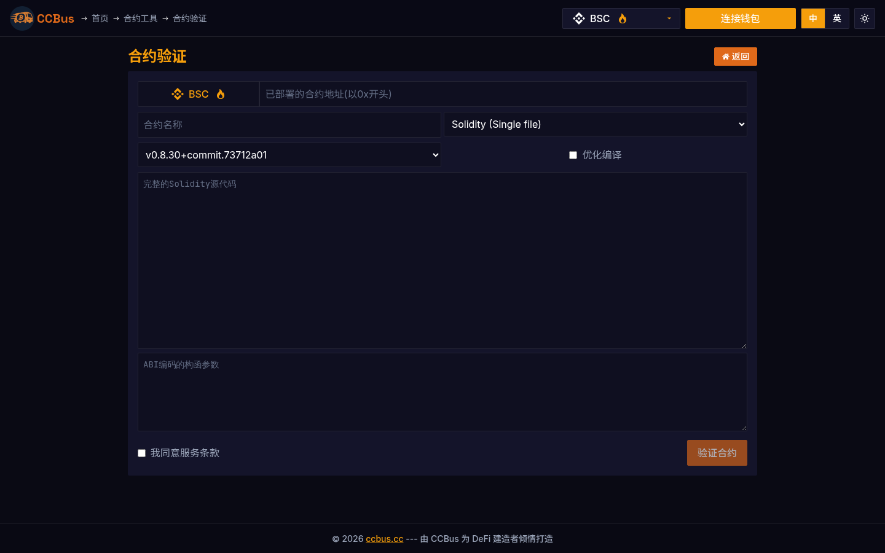

# Chapter 15: Security and Best Practices

**Difficulty Level:** 🔴 Advanced
**Estimated Learning Time:** 6-7 hours

**Chapter Objectives:**
- Establish comprehensive security awareness
- Master wallet security practices
- Understand attack vectors
- Learn incident response procedures

## 15.0 2025-2026 视角:为什么这一章要重新读

Blockchain security in 2026 faces three new attack waves: **private-key phishing (Approval Phishing), upgrade-trap hijack (Upgradeable Proxy Hijack), AI-driven contract vulnerability mining**. This chapter covers classic attacks (reentrancy, integer overflow, front-running, flash loans) and new threats (EIP-7702 delegation phishing, **Permit2 signature abuse**), plus the full toolchain: **Slither, Mythril, Echidna, Certora, Tenderly, Forta, Chainalysis**.

### 🖥️ Real-world Example: CCBus's Contract Audit and Verification Tools

CCBus ships two complementary contract-security tools:

- **Contract Verifier**: decompile + source-match deployed bytecode to ensure   the contract a user interacts with is the one the team published — the   first line of defense against phishing.
- **Contract Inspector**: static analysis + vulnerability pattern matching   (Slither-like detectors: reentrancy-eth, uninitialized-state, tx-origin,   unchecked-lowlevel, timestamp, etc.).

*Figures 15-1/2: CCBus's contract security toolchain. **Verifier answers "am I interacting with the code you claim?"**; **Inspector answers "is this code itself vulnerable?"**. Together they are the 2026 DeFi security standard workflow.*

## 15.1 Wallet Security

### Hardware Wallets
- **Ledger** - Secure Element chip
- **Trezor** - Open source
- **Coldcard** - Bitcoin-only

### Software Wallets
- Hot wallets for daily use
- Cold storage for long-term holdings

### Multi-Signature Wallets
- Require multiple signatures for transactions
- Reduces single point of failure

## 15.2 Private Key Management

**Critical Rule**: Never share your private keys or seed phrases.

### Best Practices
- ✅ Use hardware wallets for large amounts
- ✅ Store seed phrases offline
- ✅ Use metal backup devices
- ✅ Test recovery process
- ❌ Never store keys digitally
- ❌ Never share with anyone

## 15.3 Smart Contract Security Audits

### Audit Process
1. Code review
2. Automated analysis tools
3. Manual testing
4. Formal verification
5. Report generation

### Top Audit Firms
- CertiK
- Trail of Bits
- OpenZeppelin
- Consensys Diligence

## 15.4 Common Attack Vectors

### Smart Contract Attacks
- **Reentrancy** - Recursive external calls
- **Front-running** - Transaction order manipulation
- **Oracle Manipulation** - Price feed attacks
- **Flash Loan Attacks** - Exploit price oracles

### Network Attacks
- **51% Attack** - Control majority hash power
- **Eclipse Attack** - Isolate nodes
- **Sybil Attack** - Create multiple identities

## 15.5 Social Engineering and Phishing

Common scams:
- Fake airdrops
- Impersonation
- Phishing websites
- Fake support

### Protection
- Verify URLs carefully
- Use bookmarks
- Enable 2FA
- Be skeptical of unsolicited messages

## 15.6 Compliance (KYC/AML)

- Know Your Customer (KYC)
- Anti-Money Laundering (AML)
- Regulatory requirements vary by jurisdiction

## 15.7 Incident Response and Recovery

### Response Plan
1. Identify the breach
2. Contain the damage
3. Assess impact
4. Notify affected parties
5. Remediate vulnerabilities
6. Review and improve

## 15.8 Security Tools and Resources

- **Slither** - Static analysis for Solidity
- **MythX** - Security analysis platform
- **Etherscan** - Contract verification
- **Tenderly** - Transaction debugging

### Key Takeaways
- Security is paramount in blockchain
- Hardware wallets are essential for significant holdings
- Smart contract audits are not optional
- Social engineering is a major threat
- Always have an incident response plan

