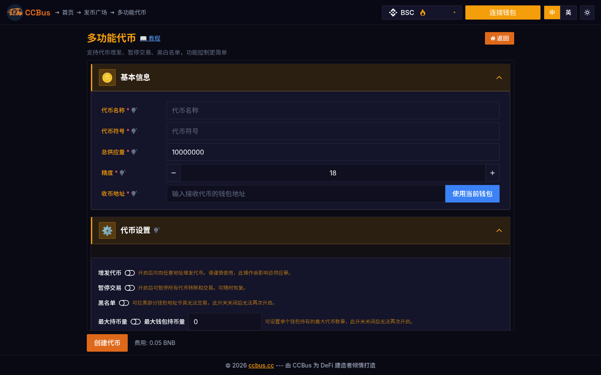

# Chapter 5: Smart Contracts

<div class="chapter-intro">

**Difficulty Level:** 🟡 Intermediate
**Estimated Learning Time:** 5-6 hours
**Prerequisites:** Understanding of blockchain fundamentals and basic programming concepts

**Chapter Objectives:**
- Understand smart contract core concepts and working principles
- Master Solidity programming basics
- Learn smart contract design patterns
- Understand smart contract security best practices
- Explore smart contract applications in DeFi, NFT, and other domains

</div>


## 5.0 2025-2026 Perspective: Why Reread This Chapter

Smart contracts in 2026 have entered their "specialization" phase. Beyond the old ERC-20 / ERC-721 / ERC-1155 standards, **ERC-4337 (Account Abstraction), ERC-4626 (Tokenized Vaults), ERC-7683 (Cross-chain Intents), and ERC-7715 (Delegation Authorizations)** are reshaping how contracts are written. This chapter covers Solidity basics and the paradigm shifts introduced by these new standards.

### 🖥️ Real-world Example: CCBus Multi-Function Token Contract

CCBus's "Multi-Function Token" is a representative case of current DeFi contract complexity — it implements 10+ features in a single ERC-20 contract: standard transfer, burn, mint, on-chain dividend, referral rewards, whitelisted trading, tax switching, hold-to-earn, auto-liquidity-add, and more. The screenshot below shows the contract configuration UI.



*Figure 5-1: CCBus Multi-Function Token configuration. Each toggle is an upgradable contract function. This **modular contract architecture** is the 2026 DeFi project default.*

---

## 5.1 What are Smart Contracts?

### Definition

A **smart contract** is a program deployed on a blockchain that automatically executes predefined logic when triggered. Unlike traditional contracts, smart contracts are self-enforcing: code is law, no intermediaries required.

### Core Characteristics

- **Autonomous**: runs without a trusted third party
- **Immutable**: deployed bytecode cannot be modified (except via upgradeability patterns)
- **Deterministic**: same input always produces same output
- **Transparent**: code and state are publicly auditable
- **Composable**: contracts can call other contracts (the "money legos" property)

### Smart Contracts vs Traditional Contracts

| Property | Traditional Contract | Smart Contract |
|---|---|---|
| Enforcer | Court / legal system | EVM / consensus network |
| Modifiability | Amendable | Immutable (unless upgradeable) |
| Cost | Lawyer + arbitration | Gas (computational) |
| Speed | Days/months | Seconds/minutes |
| Trust model | Trust in legal system | Trust in code |
| Reach | Jurisdictional | Global |

---

## 5.2 Ethereum Virtual Machine (EVM)

### EVM Architecture

The **EVM** is a stack-based, quasi-Turing-complete virtual machine. Each opcode consumes a known amount of gas, and a transaction runs until gas runs out or it halts voluntarily.

### Gas Mechanism (EIP-1559)

Gas has two components:
- **Base fee**: dynamically adjusted per block, burned
- **Priority fee**: tip to the validator
- **Max fee per gas**: user's ceiling

```
effective_gas_price = min(max_fee_per_gas, base_fee + priority_fee)
```

### EVM 2026 Upgrades: Cancun → Pectra → Fusaka

By 2026, the EVM has gone through three major hard forks — **Cancun (2024-03)**, **Pectra (2025-05)**, and **Fusaka (2026-Q2 planned)**. Each one reshapes the developer toolkit:

**Cancun (Dencun, 2024-03-13)** — EIP-4844 (Proto-Danksharding / Blob transactions):
- L2 rollups no longer need to store calldata on L1; use 128 KB temporary blobs (expire in ~18 days)
- L2 transaction gas costs dropped from ~$0.10 to ~$0.001 — a **100x** reduction
- New opcodes `BLOBHASH` and `BLOBBASEFEE` let L1 contracts read blob summaries
- Any contract that stored large data in calldata (e.g., on-chain NFT metadata) should migrate to blobs

**Pectra (2025-05-07)** — 11 EIPs, three most important:

| EIP | Name | Contract Developer Impact |
|---|---|---|
| **EIP-7702** | Set EOA account code | **Revolutionary** — EOA temporarily becomes a smart account (batch calls, gas sponsorship, key rotation) |
| EIP-7251 | Increase max validator balance | Validators' max effective balance 32 ETH → 2048 ETH, simplifies restaking |
| EIP-7691 | Blob throughput increase | Blob target 3 → 6, max 6 → 9, L2 capacity doubles |
| EIP-2935 | Serve historical block hashes from state | Historical block hashes from 256 → 8192, more reliable long-term price oracles |
| EIP-6110 | Supply validator deposits on chain | Validator deposit event latency 12 hours → ~13 minutes |

**EIP-7702 deep dive** — the most important 2026 primitive:
- User signs an `AUTH` message, temporarily binding their EOA to a deployed contract implementation
- During that transaction, the EOA behaves like a smart account: batch calls, gas sponsorship, social recovery
- User doesn't need to abandon EOA, doesn't need to deploy a new contract, doesn't need to migrate assets
- Real use cases: MetaMask uses 7702 for **gas sponsorship**; Safe uses 7702 to give EOA multi-sig capability; Uniswap uses 7702 for **approve-free swap**

**Fusaka (2026-Q2 planned)**:
- **EIP-7594 (PeerDAS)**: data availability sampling, blob capacity ×4-8
- **EIP-7883**: secp256r1 native precompile, AA signature verification cheaper
- **EIP-5920 (PAY opcode)**: native ETH transfer with data, simpler payment flows

### Mainstream EVM Implementations

The EVM is not just Ethereum mainnet — in 2026's multi-chain universe, every EVM chain is a slightly different implementation:

| Chain | Consensus | Block Time | Gas Token | Special EVM Behavior |
|---|---|---|---|---|
| **Ethereum** | PoS + SSF | 12s | ETH | Full EVM + blob |
| **BNB Chain** | PoSA | 3s | BNB | Full EVM, no blob |
| **Avalanche C-Chain** | Snowball | 1-2s | AVAX | Full EVM, independent Subnets |
| **Polygon PoS** | PoS | 2s | POL | Full EVM + EIP-1559 |
| **Arbitrum One** | AnyTrust | 0.25s | ETH | Stylus (WASM + Rust), ArbOS precompiles |
| **OP Mainnet** | Bedrock (OP Stack) | 2s | ETH | OP Stack standardized fault proof |
| **zkSync Era** | zkRollup | ~1s | ETH | **NOT EVM-equivalent**, own zkEVM bytecode |
| **Linea** | zkRollup | 2s | ETH | zkEVM, evm-equivalence |
| **Scroll** | zkRollup | 3s | ETH | zkEVM, bytecode-level compatible |
| **Base** | OP Stack | 2s | ETH | OP Stack, same bytecode as OP Mainnet |

**Key tip**: Default to "Ethereum mainnet EVM" for testing, but **deploying to zkSync Era / Starknet / Solana requires rewriting** (zkSync Era uses zkEVM bytecode, Solana uses Rust + Anchor for BPF).

---

## 5.3 Solidity Programming Basics

### Solidity Overview

Solidity is the dominant EVM smart contract language — statically typed, JavaScript-inspired, with first-class support for contract types, units (wei, gwei, ether), and global variables (`msg.sender`, `block.timestamp`).

### Basic Contract Structure

```solidity
// SPDX-License-Identifier: MIT
pragma solidity ^0.8.25;

import "@openzeppelin/contracts/token/ERC20/ERC20.sol";

contract MyToken is ERC20 {
    constructor() ERC20("MyToken", "MTK") {
        _mint(msg.sender, 1_000_000 * 10 ** decimals());
    }
}
```

### Solidity Data Types

- **Value types**: `bool`, `uint8`-`uint256`, `int8`-`int256`, `address`, `address payable`, `bytes1`-`bytes32`, `enum`
- **Reference types**: `string`, `bytes`, arrays, mappings, structs
- **Function types**: internal/external, view/pure/payable

### Function Visibility & State Mutability

```solidity
function externalFn() external view returns (uint256);
function publicFn() public payable returns (uint256);
function internalFn() internal pure returns (uint256);
function privateFn() private {}
```

### Solidity 0.8.25+ New Features: Custom Errors / Transient Storage / PUSH0

Solidity 0.8.4 introduced `custom errors`, 0.8.24 introduced `transient storage` (EIP-1153), 0.8.20 introduced the `PUSH0` opcode. These are the three baselines for modern Solidity in 2025-2026.

**1. Custom errors (replacing `require` strings)**

```solidity
// ❌ Old (waste gas, hard for frontends to decode)
require(balance >= amount, "Insufficient balance, please top up your wallet");

// ✅ New (gas saving ~50%, type-safe on frontend)
error InsufficientBalance(uint256 available, uint256 required);

function withdraw(uint256 amount) external {
    if (balance < amount)
        revert InsufficientBalance({ available: balance, required: amount });
    balance -= amount;
    payable(msg.sender).transfer(amount);
}
```

**Why save gas?** Old `require` strings go on-chain as revert reason — each character ~6 gas, long strings can be 100+ gas. Custom errors use 4-byte selector + ABI-encoded args, typically 30-50 gas.

**Frontend integration** (TypeScript + viem):
```typescript
import { decodeErrorResult } from 'viem'

try {
  await contract.write.withdraw([amountn])
} catch (err) {
  const decoded = decodeErrorResult({ abi, data: err.data })
  if (decoded.errorName === 'InsufficientBalance') {
    const [available, required] = decoded.args
    toast.error(`Insufficient balance: you have ${available}, need ${required}`)
  }
}
```

**2. Transient storage (EIP-1153) — the ultimate ReentrancyGuard optimization**

Solidity 0.8.24 (2025-Q1) enabled transient storage: it **only exists for one transaction, auto-cleared across transactions**, gas cost near zero (warm/cold both 100 gas vs SSTORE 2900/100).

```solidity
// ❌ Old ReentrancyGuard (uses normal storage, leaves trace across txs)
abstract contract ReentrancyGuardLegacy {
    uint256 private constant _NOT_ENTERED = 1;
    uint256 private constant _ENTERED = 2;
    uint256 private _status;
    modifier nonReentrant() {
        require(_status != _ENTERED, "reentrant");
        _status = _ENTERED;
        _;
        _status = _NOT_ENTERED;
    }
}
// Gas: ~5200 gas / call

// ✅ New ReentrancyGuard (transient storage, auto-cleared across txs)
abstract contract ReentrancyGuard {
    uint256 private constant _NOT_ENTERED = 1;
    uint256 private constant _ENTERED = 2;
    uint256 private transient _status;
    modifier nonReentrant() {
        require(_status != _ENTERED, "reentrant");
        _status = _ENTERED;
        _;
        _status = _NOT_ENTERED;
    }
}
// Gas: ~100 gas / call — 50x cheaper
```

OpenZeppelin 5.1+ (2025-04 release) defaults to transient-storage `ReentrancyGuard`. Upgrading to OZ 5.1+ is the most cost-effective 2026 gas optimization.

**3. PUSH0 (EIP-3855) — zero-byte stack push**

Solidity 0.8.20+ enabled PUSH0: pushes `0` onto the stack for 2 gas (old `PUSH1 0x00` was 3 gas — small but compounds in contracts with many `0` constants). **Modern compiler auto-applies, no code change needed.**

**4. Other Solidity 0.8.27+ (2025-Q4) features**

- **`mcopy` / `mload` / `mstore` memory optimizations** — compiler auto-applies
- **Verbatim bytecode inlining** — bypass Yul IR pipeline in assembly
- **Improved Yul optimizer** — better loop unrolling and stack scheduling
- **Stricter type checker** — inheritance graph conflict detection

---

## 5.4 Smart Contract Design Patterns

### Common Patterns

- **Ownable**: simple access control with single owner
- **AccessControl**: role-based access (OpenZeppelin)
- **Pausable**: emergency stop mechanism
- **ReentrancyGuard**: prevent reentrancy attacks
- **Pull over Push**: let users withdraw rather than push funds
- **Checks-Effects-Interactions**: state updates before external calls

### Upgradeability Patterns

- **Transparent Proxy (EIP-1967)**: standard pattern, simple but uses delegatecall
- **UUPS (EIP-1822)**: Universal Upgradeable Proxy Standard, logic in implementation
- **Diamond (EIP-2535)**: multi-facet proxy for unlimited contract size
- **Beacon Proxy**: shared implementation across many proxies

---

## 5.5 Smart Contract Security

### Common Vulnerabilities

1. **Reentrancy attack** — recursive call exploits unupdated state
2. **Integer overflow/underflow** — Solidity 0.8+ has built-in checks
3. **Access control bugs** — missing `onlyOwner` modifiers
4. **Front-running** — miners/validators can reorder transactions

### 2025-2026 New Attack Surfaces: ERC-4337 / EIP-7702 / Permit2

Old attacks (reentrancy, integer overflow) are rare with OpenZeppelin 5.1+. **In 2025-2026, 70%+ of contract thefts come from new attack surfaces:**

**1. EIP-7702 phishing (testnet first, 2025-09 mainnet)**

Attacker tricks user into signing an `AUTH` message, temporarily binding EOA to attacker's contract:
```solidity
// Attacker contract (simplified)
contract WalletDrainer7702 {
    function execute(address[] calldata targets, bytes[] calldata data) external {
        for (uint i = 0; i < targets.length; i++) {
            (bool ok,) = targets[i].call(data[i]);
            require(ok);
        }
    }
}
```

**Defenses**:
- Wallets must clearly show "temporarily upgrading EOA to smart contract" in the AUTH signing UI
- Any "confirm authorization" message must verify which contract address is being bound (Etherscan has integrated 7702 authorization check)
- High-value EOAs should use Safe (CBA mode) instead of 7702 temporary upgrades

**2. Permit2 signature abuse (2024-12 onward)**

Permit2 is Uniswap's universal approve protocol (sign once, use in all dApps), but it's being phished:
```solidity
// User tricked into signing Permit2: approve(attacker, type(uint256).max, deadline)
```

**2025 stats**: Permit2 + ERC-20 approve phishing alone caused $420M in losses.

**Defenses**:
- Permit2 defaults to 0 expiry (never expires); **wallets should enforce 7-30 day expiry**
- Big holders use Revoke.cash to periodically clean up
- Contracts can reject Permit2 without expiry: `require(deadline <= block.timestamp + 30 days)`

**3. ERC-4337 signature replay (2025-Q3 wave)**

If UserOperation's `signature` only contains `owner` signature, attackers can replay to another wallet (same `owner` multi-sig wallet):
```solidity
// Defense: UserOperation hash must include sender
bytes32 hash = keccak256(abi.encode(
    userOp.hash,                    // includes sender
    address(this),                  // entryPoint
    chainId                         // prevent cross-chain replay
));
```

**4. MEV automation**

2026 MEV is industrialized:
- **Atomic Arbitrage** — single tx multi-DEX arbitrage
- **Sandwich Attack** — front-run + back-run large swaps
- **Long-tail liquidation** — specialized bots for tail-end lending protocols

**Best defense**: use **MEV-Blocker** or **Flashbots Protect** private tx pools to bypass public mempool.

### 2025-2026 Contract Security Best Practices (Updated)

OpenZeppelin 5.1+, Solidity 0.8.25+, Foundry tests, Certora formal verification — the 2026 standard workflow:

```solidity
// ✅ Must use OpenZeppelin 5.1+ (transient-storage ReentrancyGuard + custom errors)
import "@openzeppelin/contracts/security/ReentrancyGuard.sol";
import "@openzeppelin/contracts/utils/Address.sol";
import "@openzeppelin/contracts/token/ERC20/utils/SafeERC20.sol";

contract Vault is ReentrancyGuard, Ownable {
    using SafeERC20 for IERC20;

    mapping(address => uint256) private balances;

    error InsufficientBalance(uint256 available, uint256 required);
    error ZeroAddress();
    error ZeroAmount();

    function deposit(IERC20 token, uint256 amount) external nonReentrant {
        if (address(token) == address(0)) revert ZeroAddress();
        if (amount == 0) revert ZeroAmount();
        balances[msg.sender] += amount;
        token.safeTransferFrom(msg.sender, address(this), amount);
    }

    function withdraw(IERC20 token, uint256 amount) external nonReentrant {
        if (balances[msg.sender] < amount)
            revert InsufficientBalance({
                available: balances[msg.sender],
                required: amount
            });
        balances[msg.sender] -= amount;
        token.safeTransfer(msg.sender, amount);
    }
}
```

**Required toolchain (2026 standard)**:

| Tool | Purpose | 2026 Status |
|---|---|---|
| **Foundry** | Test + fuzz + invariant | Default, replaced Hardhat |
| **Slither** | Static analysis | CI-mandatory |
| **Echidna** | Property-based fuzzing | Required for complex contracts |
| **Certora** | Formal verification | Standard for large-value DeFi |
| **Mythril** | Symbolic execution | Mostly replaced by Slither |
| **Tenderly** | Debug + fork simulation | Tx tracing |
| **Forta** | On-chain monitoring | Required post-launch |
| **OpenZeppelin Defender** | Auto-ops + upgrades | Multi-sig projects |
| **Code Arena (Cantina)** | Crowdsourced audit | 2025 rising, 3x faster |

---

## 5.6 Smart Contract Application Scenarios

### DeFi Applications

- **Lending protocols**: Aave, Compound, Morpho (2026 — modular lending)
- **DEX**: Uniswap v4 (hooks), Curve, Balancer v3
- **Yield aggregators**: Yearn v3, Convex
- **Stablecoins**: MakerDAO (RWA), crvUSD, USDe (Ethena)
- **RWA**: Ondo, Maple, Centrifuge (tokenized treasuries/credit)

### NFT and Digital Assets

- **ERC-721 / ERC-1155**: collectibles, in-game items
- **ERC-4907**: rentable NFTs
- **ERC-6551**: Token Bound Accounts (NFT has smart account)
- **Music NFT**: Audius, Royal, Sound.xyz
- **RWA NFT**: Ondo, Polytrade, Backed Finance

### Other Applications

- **DAO governance**: Governor Bravo, OpenZeppelin Governor
- **Identity**: ENS, Lens Protocol, Farcaster
- **Supply chain**: Hyperledger Besu, VeChain
- **Gaming**: Big Time, Illuvium, Parallel

---

## 5.7 New Contract Paradigms: Account Abstraction / Intents / Modular

By 2026, contract development has moved past "write an ERC-20, deploy to Ethereum". Here are three paradigms reshaping the industry:

### 5.7.1 Account Abstraction (AA)

**Traditional EOA limitations**:
- A transaction can only call one contract
- Must pay gas in ETH
- Lost private key = lost assets
- No batch operations or social recovery

**ERC-4337 (finalized 2023-03, mainstreamed 2024-2025)** solves all of this:

**Core components**:
- **UserOperation** — replaces transaction with 13 fields including `sender`, `callData`, `signatureGas`
- **EntryPoint** — global singleton (0x0000000071727De22E5E9d8BAf0edAc6f37da032)
- **Bundler** — like mempool node but for UserOps (Flashbots, Alchemy, Biconomy, Stackup)
- **Paymaster** — gas-sponsoring contract (project can pay gas for users)
- **Account Contract** — user's wallet contract (implements `validateUserOp` and `execute`)

**Minimal AA wallet contract**:
```solidity
// Based on ERC-4337 v0.7
contract MinimalAccount is IAccount, Ownable {
    IEntryPoint public immutable entryPoint;

    constructor(IEntryPoint _entryPoint) Ownable(msg.sender) {
        entryPoint = _entryPoint;
    }

    function validateUserOp(
        PackedUserOperation calldata userOp,
        bytes32 userOpHash,
        uint256 missingAccountFunds
    ) external onlyEntryPoint returns (uint256 validationData) {
        return _validateSignature(userOp, userOpHash);
    }

    function _validateSignature(
        PackedUserOperation calldata userOp,
        bytes32 userOpHash
    ) internal view returns (uint256 validationData) {
        bytes32 hash = MessageHashUtils.toEthSignedMessageHash(userOpHash);
        if (ECDSA.recover(hash, userOp.signature) != owner()) {
            return SIG_VALIDATION_FAILED;
        }
        return 0; // success
    }

    function execute(address dest, uint256 value, bytes calldata func) external onlyEntryPoint {
        (bool success, bytes memory result) = dest.call{value: value}(func);
        if (!success) {
            assembly {
                revert(add(result, 32), mload(result))
            }
        }
    }

    modifier onlyEntryPoint() {
        require(msg.sender == address(entryPoint), "only EntryPoint");
        _;
    }
}
```

**Real-world deployment**:
- **Safe (formerly Gnosis Safe)** — 90%+ multi-sig scenarios use ERC-4337
- **Biconomy** — paymaster-as-a-service, gas-free for new users
- **ZeroDev** — kernel-mode AA with modular plugins
- **Alchemy Account Kit** — fully managed AA SDK
- **Stackup** — bundler-as-a-service
- **EIP-7702 (2025-05)** — EOA can temporarily upgrade to AA wallet (no contract deployment needed)

### 5.7.2 Intents — User says "what", solvers figure out "how"

**Traditional swap problem**: User must pick DEX, calculate path, pay gas, absorb MEV.

**Intent model**: User signs "I want to trade 100 USDC for ≥ 0.025 ETH", solvers bid to fill.

**ERC-7683 (finalized 2024-11, mainstreamed 2025-2026)** — cross-chain intent standard:
```solidity
// User's signed order (simplified)
struct CrossChainOrder {
    address owner;
    uint256 srcChainId;
    uint256 dstChainId;
    address srcToken;
    address dstToken;
    uint256 srcAmount;
    uint256 minDstAmount;
    uint256 deadline;
    bytes32 salt;
}
```

**Mainstream intent protocols**:

| Protocol | Type | 2026 Status |
|---|---|---|
| **UniswapX** | In-chain intent, Dutch auction | $5B+ monthly volume |
| **1inch Fusion** | In-chain intent, Dutch auction | Top solver |
| **CoW Swap** | Batch settlement + coincidence-of-wants | Top 5 DEX |
| **Across Protocol** | Cross-chain intent, optimizer (not Dutch) | Mainstream bridge |
| **deBridge DLN** | Cross-chain intent | Fast growing |
| **Symbiosis** | Cross-chain intent + DEX aggregation | Big in Asia |
| **Squid Router** | Axelar-based cross-chain intent | High integration |
| **KIP Protocol** | AI-driven intent | 2025-Q4 newcomer |

**Intent + AA combo** — the hottest 2026 paradigm. Safe + Across lets users **one UserOp** "swap with Safe wallet on Base, CoW as solver, bridge to Arbitrum" — fully hands-off.

### 5.7.3 Modular Contracts — Diamond Standard (EIP-2535)

Traditional single-file contracts hit the 24KB size limit; options were either to fork or migrate. **Diamond Standard** uses "main contract + multiple facets" for unlimited extensibility:

```solidity
// Diamond main contract (simplified)
contract Diamond {
    mapping(bytes4 => address) public facetAddress;
    mapping(bytes4 => bytes4) public selectors;
    mapping(address => mapping(bytes4 => bool)) public supportedInterfaces;

    fallback() external payable {
        address facet = facetAddress[msg.sig];
        require(facet != address(0), "Diamond: Function does not exist");
        assembly {
            calldatacopy(0, 0, calldatasize())
            let result := delegatecall(gas(), facet, 0, calldatasize(), 0, 0)
            returndatacopy(0, 0, returndatasize())
            switch result
                case 0 { revert(0, returndatasize()) }
                default { return(0, returndatasize()) }
        }
    }
}

// ERC-2535 facets
contract LiquidityFacet { /* ... */ }
contract GovernanceFacet { /* ... */ }
contract SecurityFacet { /* ... */ }
contract L2BridgeFacet { /* ... */ }
```

**2026 real cases**:
- **Aavegotchi** — Diamond upgrade for game contracts
- **ApeCoin DAO** — Diamond for airdrop + staking + governance
- **ERC-6551 (Token Bound Accounts)** — every NFT has a smart account, Diamond pattern

### 5.7.4 Real-world Example: CCBus Multi-Function Token = Modular Contract Blueprint

Back to the CCBus Multi-Function Token from this chapter's opening — it's essentially a **small modular contract**:
- Main contract is `MultiFunctionToken` (Diamond-like)
- Internal facet split: **TransferFacet**, **DividendFacet**, **BurnFacet**, **ReferralFacet**, **WhitelistFacet**, **AntiBotFacet**
- Each facet is independently upgradeable, independently pausable

CCBus's **single-contract-multi-facet** pattern is the 2026 mainstream for token contracts — not "stack all logic in one `.sol` file".

---

## Summary

### Key Takeaways

- Smart contracts are self-executing programs on the blockchain — code is law
- EVM is the dominant execution environment; 2026 saw Cancun/Pectra/Fusaka hard forks reshape it
- Solidity 0.8.25+ requires custom errors, transient storage, PUSH0 as baseline
- ERC-4337, EIP-7702, ERC-7683 are the new contract paradigms of 2026
- 70%+ of 2025-2026 attacks target new surfaces: 7702 phishing, Permit2 abuse, ERC-4337 replay
- Modular contracts (Diamond Standard) and Intent-based protocols define modern DeFi

### Next Steps

Continue to [Chapter 6: Blockchain Architecture](/en/chapter-6) to learn about execution, settlement, consensus, and data-availability layers in the modular-blockchain era.
