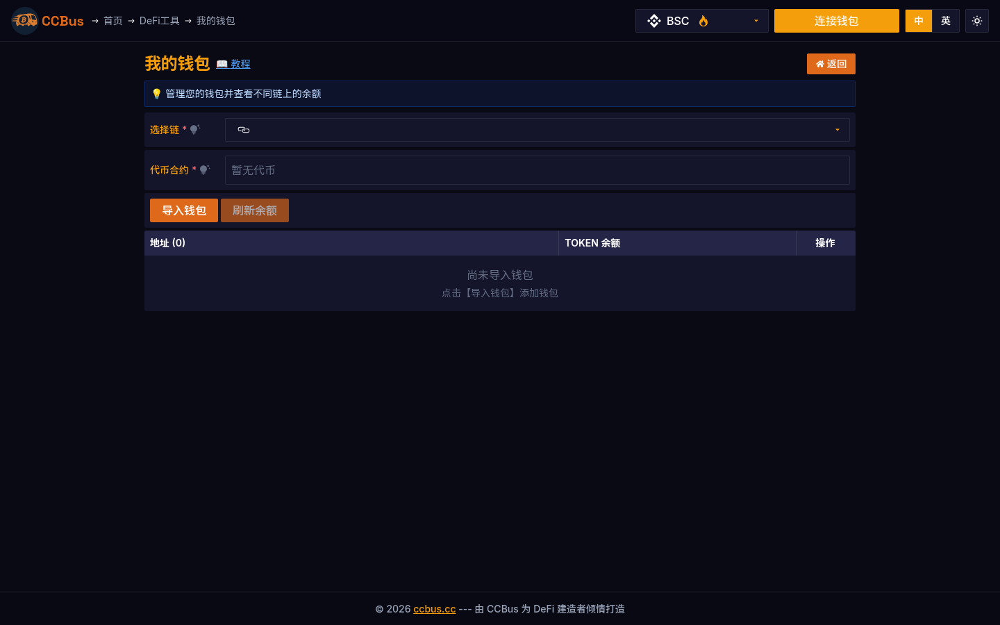

<div class="ccbus-hero">
  <div class="ccbus-hero-avatar">
    
  </div>
  <div class="ccbus-hero-content">
    <h1>第一章：区块链基础</h1>
    <div class="ccbus-teacher-label">🎙️ 本章讲师:<strong>Captain CCBus</strong> · 区块链的"教授 + 导游 + 友好巴士"</div>
  </div>
</div>

<div class="chapter-intro">

**难度级别：** 🟢 入门
**预计学习时间：** 2-3 小时
**前置知识：** 无需任何区块链知识，本章从零开始

**本章目标：**
- 理解区块链的本质和核心概念
- 掌握区块链的工作原理
- 了解不同类型的区块链及其应用场景
- 建立完整的区块链知识框架

</div>


## 1.0 2025-2026 视角:为什么这一章要重新读

2026 年的区块链已经不是"一种新奇的数字货币技术"。它已经演变为**支撑全球数字经济的底层基础设施**,同时承担着三种截然不同的角色:

1. **价值结算层** — 比特币(BTC)、稳定币(USDT、USDC、USDe、PYUSD、FDUSD)构成的 3.4 万亿美元链上资产
2. **可编程金融层** — 以太坊 + L2 共同承载的智能合约生态,日交易量超过 Visa 的 3 倍
3. **身份与数据层** — ENS、Lens、Farcaster、SBT、Worldcoin 等正在重新定义"账户"

**2025-2026 年这一章要重读的关键变化**:

- **多链宇宙已定型**:2025 年是 L1 + L2 格局从"试验"变成"生产"的分水岭。以太坊(+$L2)占据 TVL 60%+,Solana 是单链吞吐量王者,BNB Chain 主导 meme 与零售用户,Ton 是 Telegram 14 亿用户的入口,Sui/Aptos 是 Move 系新锐,Monad/Berachain/Story 是 2025-2026 上线的新公链
- **"区块链"不再只是"链"**:Celestia、EigenDA、Avail 提供的模块化数据可用性(DA)层,Espresso、Astria 提供的共享排序器(shared sequencer),把"区块链"拆成了执行层、结算层、共识层、DA 层四个独立模块
- **AI 代理经济起飞**:ai16z DAO、Virtuals Protocol、Aethernet、Zerebro 让 AI 代理成为链上原生行为者,2025-Q4 链上 AI 代理管理的资产规模突破 80 亿美元
- **RWA 主流化加速**:BlackRock BUIDL、Ondo Finance、Maple Finance、Securitize 已把超 300 亿美元的真实世界资产代币化到公链(国债、信贷、房产、私募基金)
- **量子抗性准备**:NIST 在 2024-08 正式发布 FIPS 203/204/205(ML-KEM、ML-DSA、SLH-DSA),后量子密码学(PQC)进入区块链密码学栈的迁移期

### 🖥️ 真实案例:CCBus 一站式 DeFi 工具平台

CCBus(ccbus.cc)是一个建立在 BNB Chain、Solana 等多链之上的一站式 DeFi 工具平台,它把本章将讲到的几乎所有区块链核心能力——**代币标准、链上交互、钱包管理、合约验证、市场分析**——打包成可视化的图形界面。下面这张图展示了平台首页的功能矩阵,可以看到当前主流公链生态对区块链基础设施的全方位使用场景。


*图 1-1:CCBus 首页。可以看到**分红代币、流动性池代币、跨链桥、DeFi 工具、市场分析**等区块链原生功能如何通过可视化工具呈现给普通用户。*

## 1.1 什么是区块链？

### 基本定义

**区块链**（Blockchain）是一种分布式账本技术（Distributed Ledger Technology, DLT），它允许数据以"区块"的形式存储，并通过密码学方式链接在一起形成一个不可篡改的"链"。

让我们从一个简单的类比开始理解：

💡 **生活中的类比：**

想象一个村庄的账本：
- **传统方式**：村长保管一本账本，记录所有交易
  - ❌ 如果村长作弊篡改账本？
  - ❌ 如果账本丢失或损坏？
  - ❌ 村民需要完全信任村长

- **区块链方式**：每个村民都有一份完整的账本副本
  - ✅ 任何人都无法单独篡改（需要说服51%的村民）
  - ✅ 账本不会丢失（有数千份备份）
  - ✅ 不需要信任任何单一个体

### 区块链的名称由来

区块链的名称直接来源于其数据结构特征：

<div style="background: rgba(52, 81, 178, 0.06); padding: 1.5em; border-radius: 4px; margin: 2em 0;">
<svg class="svg-1-0" viewBox="0 0 520 45" xmlns="http://www.w3.org/2000/svg" style="width: 100%; max-width: 600px; display: block; margin: 0 auto;">
<defs>
<style>
      .svg-1-0 .bc-text-dark-1 { font-family: arial, sans-serif; font-size: 10px; fill: #222; }
      .svg-1-0 .bc-text-1 { font-family: arial, sans-serif; font-size: 10px; fill: #1f2937; }
      .svg-1-0 .bc-box1-1 { fill: rgba(52, 81, 178, 0.10); stroke: #ccc; stroke-width: 0.5; }
      .svg-1-0 .bc-box2-1 { fill: rgba(223, 105, 25, 0.08); stroke: #ccc; stroke-width: 0.5; }
      .svg-1-0 .bc-arrow-1 { fill: none; stroke: #4c9be8; stroke-width: 0.5; }
    </style>
    <marker id="bc-arrow-1" markerWidth="6" markerHeight="6" refX="5" refY="3" orient="auto">
      <path d="M 0 0 L 6 3 L 0 6 z" fill="#4c9be8"/>
    </marker>
  </defs>
  <rect class="bc-box1-1" x="10" y="10" width="80" height="25" rx="2"/>
  <text class="bc-text-dark-1" x="50" y="20" text-anchor="middle">区块 1</text>
  <text class="bc-text-dark-1" x="50" y="30" text-anchor="middle">创世区块</text>
  <path class="bc-arrow-1" d="M 90 22 L 115 22" marker-end="url(#bc-arrow-1)"/>
  <rect class="bc-box2-1" x="115" y="10" width="60" height="25" rx="2"/>
  <text class="bc-text-dark-1" x="145" y="26" text-anchor="middle">区块 2</text>
  <path class="bc-arrow-1" d="M 175 22 L 200 22" marker-end="url(#bc-arrow-1)"/>
  <rect class="bc-box2-1" x="200" y="10" width="60" height="25" rx="2"/>
  <text class="bc-text-dark-1" x="230" y="26" text-anchor="middle">区块 3</text>
  <path class="bc-arrow-1" d="M 260 22 L 285 22" marker-end="url(#bc-arrow-1)"/>
  <rect class="bc-box2-1" x="285" y="10" width="60" height="25" rx="2"/>
  <text class="bc-text-dark-1" x="315" y="26" text-anchor="middle">区块 4</text>
  <path class="bc-arrow-1" d="M 345 22 L 370 22" marker-end="url(#bc-arrow-1)"/>
  <rect class="bc-box2-1" x="370" y="10" width="40" height="25" rx="2"/>
  <text class="bc-text-dark-1" x="390" y="26" text-anchor="middle">...</text>
</svg>
</div>

- **区块（Block）**：数据的容器，包含交易记录、时间戳和其他元数据
- **链（Chain）**：区块通过密码学哈希值连接，形成一个不可篡改的时间序列

## 1.2 区块链的历史与演进

### 区块链发展时间线

<div style="background: rgba(52, 81, 178, 0.06); padding: 1.5em; border-radius: 4px; margin: 2em 0;">
<svg class="svg-1-1" viewBox="0 0 650 220" xmlns="http://www.w3.org/2000/svg" style="width: 100%; max-width: 750px; display: block; margin: 0 auto;">
<defs>
<style>
      .svg-1-1 .tl-text-2 { font-family: arial, sans-serif; font-size: 10px; fill: #1f2937; }
      .svg-1-1 .tl-year-2 { font-family: arial, sans-serif; font-size: 11px; fill: #1f2937; font-weight: bold; }
      .svg-1-1 .tl-line-2 { fill: none; stroke: #4c9be8; stroke-width: 1; }
      .svg-1-1 .tl-dot-2 { fill: #4c9be8; }
    </style>
</defs>
  <text class="tl-year-2" x="325" y="15" text-anchor="middle">区块链技术发展史</text>
  <line class="tl-line-2" x1="20" y1="30" x2="630" y2="30"/>
  <circle class="tl-dot-2" cx="60" cy="30" r="3"/>
  <text class="tl-year-2" x="60" y="45" text-anchor="middle">1991</text>
  <text class="tl-text-2" x="60" y="58" text-anchor="middle">时间戳技术</text>
  <text class="tl-text-2" x="60" y="70" text-anchor="middle">Stuart Haber &amp;</text>
  <text class="tl-text-2" x="60" y="82" text-anchor="middle">Scott Stornetta</text>
  <circle class="tl-dot-2" cx="120" cy="30" r="3"/>
  <text class="tl-year-2" x="120" y="95" text-anchor="middle">2008</text>
  <text class="tl-text-2" x="120" y="108" text-anchor="middle">比特币白皮书</text>
  <text class="tl-text-2" x="120" y="120" text-anchor="middle">中本聪</text>
  <circle class="tl-dot-2" cx="180" cy="30" r="3"/>
  <text class="tl-year-2" x="180" y="45" text-anchor="middle">2009</text>
  <text class="tl-text-2" x="180" y="58" text-anchor="middle">比特币网络启动</text>
  <text class="tl-text-2" x="180" y="70" text-anchor="middle">创世区块诞生</text>
  <circle class="tl-dot-2" cx="240" cy="30" r="3"/>
  <text class="tl-year-2" x="240" y="135" text-anchor="middle">2013</text>
  <text class="tl-text-2" x="240" y="148" text-anchor="middle">以太坊构想</text>
  <text class="tl-text-2" x="240" y="160" text-anchor="middle">Vitalik Buterin</text>
  <circle class="tl-dot-2" cx="300" cy="30" r="3"/>
  <text class="tl-year-2" x="300" y="45" text-anchor="middle">2015</text>
  <text class="tl-text-2" x="300" y="58" text-anchor="middle">以太坊主网上线</text>
  <text class="tl-text-2" x="300" y="70" text-anchor="middle">智能合约时代</text>
  <circle class="tl-dot-2" cx="360" cy="30" r="3"/>
  <text class="tl-year-2" x="360" y="175" text-anchor="middle">2017</text>
  <text class="tl-text-2" x="360" y="188" text-anchor="middle">ICO热潮</text>
  <text class="tl-text-2" x="360" y="200" text-anchor="middle">区块链1.0到2.0</text>
  <circle class="tl-dot-2" cx="420" cy="30" r="3"/>
  <text class="tl-year-2" x="420" y="95" text-anchor="middle">2020</text>
  <text class="tl-text-2" x="420" y="108" text-anchor="middle">DeFi Summer</text>
  <text class="tl-text-2" x="420" y="120" text-anchor="middle">去中心化金融爆发</text>
  <circle class="tl-dot-2" cx="480" cy="30" r="3"/>
  <text class="tl-year-2" x="480" y="45" text-anchor="middle">2021</text>
  <text class="tl-text-2" x="480" y="58" text-anchor="middle">NFT元年</text>
  <text class="tl-text-2" x="480" y="70" text-anchor="middle">数字资产革命</text>
  <circle class="tl-dot-2" cx="540" cy="30" r="3"/>
  <text class="tl-year-2" x="540" y="135" text-anchor="middle">2022</text>
  <text class="tl-text-2" x="540" y="148" text-anchor="middle">Layer 2扩展</text>
  <text class="tl-text-2" x="540" y="160" text-anchor="middle">扩容方案成熟</text>
  <circle class="tl-dot-2" cx="600" cy="30" r="3"/>
  <text class="tl-year-2" x="600" y="175" text-anchor="middle">2024</text>
  <text class="tl-text-2" x="600" y="188" text-anchor="middle">机构采用</text>
  <text class="tl-text-2" x="600" y="200" text-anchor="middle">企业级应用落地</text>
</svg>
</div>

### 关键里程碑

#### 🔹 1991年：时间戳技术
Stuart Haber和Scott Stornetta提出使用加密哈希链来为文档加上时间戳，这是区块链的理论基础。

#### 🔹 2008年：比特币白皮书
2008年10月31日，化名**中本聪**（Satoshi Nakamoto）的个人或团体发布了《比特币：一种点对点的电子现金系统》白皮书。

#### 🔹 2009年：比特币网络启动
2009年1月3日，比特币创世区块被挖出，区块链技术正式进入实践阶段。

#### 🔹 2015年：智能合约革命
以太坊推出，引入了图灵完备的智能合约平台，开启了区块链2.0时代。

#### 🔹 2020至今：生态繁荣
DeFi、NFT、DAO等创新应用爆发，区块链从单一的支付系统演变为完整的去中心化生态系统。

## 1.3 区块链的核心特性

区块链有四个核心特性，它们共同构成了这项技术的独特价值：

<div style="background: rgba(52, 81, 178, 0.06); padding: 1.5em; border-radius: 4px; margin: 2em 0;">
<svg class="svg-1-2" viewBox="0 0 500 280" xmlns="http://www.w3.org/2000/svg" style="width: 100%; max-width: 600px; display: block; margin: 0 auto;">
<defs>
<style>
      .svg-1-2 .mm-text-3 { font-family: arial, sans-serif; font-size: 10px; fill: #1f2937; }
      .svg-1-2 .mm-text-dark-3 { font-family: arial, sans-serif; font-size: 10px; fill: #222; }
      .svg-1-2 .mm-center-3 { fill: rgba(245, 194, 66, 0.50); stroke: #333; stroke-width: 0.5; }
      .svg-1-2 .mm-main-3 { fill: #4c9be8; stroke: #ccc; stroke-width: 0.5; }
      .svg-1-2 .mm-sub-3 { fill: rgba(52, 81, 178, 0.10); stroke: #4c9be8; stroke-width: 0.5; }
      .svg-1-2 .mm-line-3 { fill: none; stroke: #4c9be8; stroke-width: 0.5; }
    </style>
</defs>
  <circle class="mm-center-3" cx="250" cy="140" r="35"/>
  <text class="mm-text-dark-3" x="250" y="135" text-anchor="middle">区块链</text>
  <text class="mm-text-dark-3" x="250" y="147" text-anchor="middle">核心特性</text>
  <line class="mm-line-3" x1="285" y1="140" x2="330" y2="60"/>
  <rect class="mm-main-3" x="330" y="45" width="75" height="30" rx="3"/>
  <text class="mm-text-3" x="367" y="65" text-anchor="middle">去中心化</text>
  <rect class="mm-sub-3" x="415" y="15" width="75" height="18" rx="2"/>
  <text class="mm-text-3" x="452" y="27" text-anchor="middle">无单点故障</text>
  <rect class="mm-sub-3" x="415" y="38" width="55" height="18" rx="2"/>
  <text class="mm-text-3" x="442" y="50" text-anchor="middle">抗审查</text>
  <rect class="mm-sub-3" x="415" y="61" width="65" height="18" rx="2"/>
  <text class="mm-text-3" x="447" y="73" text-anchor="middle">权力分散</text>
  <line class="mm-line-3" x1="285" y1="140" x2="355" y2="105"/>
  <rect class="mm-main-3" x="355" y="90" width="60" height="30" rx="3"/>
  <text class="mm-text-3" x="385" y="110" text-anchor="middle">透明性</text>
  <rect class="mm-sub-3" x="425" y="85" width="70" height="18" rx="2"/>
  <text class="mm-text-3" x="460" y="97" text-anchor="middle">公开可验证</text>
  <rect class="mm-sub-3" x="425" y="108" width="65" height="18" rx="2"/>
  <text class="mm-text-3" x="457" y="120" text-anchor="middle">实时审计</text>
  <rect class="mm-sub-3" x="425" y="131" width="65" height="18" rx="2"/>
  <text class="mm-text-3" x="457" y="143" text-anchor="middle">信任机制</text>
  <line class="mm-line-3" x1="250" y1="175" x2="250" y2="215"/>
  <rect class="mm-main-3" x="205" y="215" width="90" height="30" rx="3"/>
  <text class="mm-text-3" x="250" y="235" text-anchor="middle">不可篡改性</text>
  <rect class="mm-sub-3" x="130" y="225" width="70" height="18" rx="2"/>
  <text class="mm-text-3" x="165" y="237" text-anchor="middle">密码学保护</text>
  <rect class="mm-sub-3" x="305" y="218" width="65" height="18" rx="2"/>
  <text class="mm-text-3" x="337" y="230" text-anchor="middle">历史记录</text>
  <rect class="mm-sub-3" x="305" y="241" width="70" height="18" rx="2"/>
  <text class="mm-text-3" x="340" y="253" text-anchor="middle">数据完整性</text>
  <line class="mm-line-3" x1="215" y1="140" x2="150" y2="105"/>
  <rect class="mm-main-3" x="90" y="90" width="60" height="30" rx="3"/>
  <text class="mm-text-3" x="120" y="110" text-anchor="middle">安全性</text>
  <rect class="mm-sub-3" x="10" y="85" width="65" height="18" rx="2"/>
  <text class="mm-text-3" x="42" y="97" text-anchor="middle">加密技术</text>
  <rect class="mm-sub-3" x="10" y="108" width="65" height="18" rx="2"/>
  <text class="mm-text-3" x="42" y="120" text-anchor="middle">共识机制</text>
  <rect class="mm-sub-3" x="10" y="131" width="75" height="18" rx="2"/>
  <text class="mm-text-3" x="47" y="143" text-anchor="middle">分布式架构</text>
</svg>
</div>

### 1.3.1 去中心化（Decentralization）

**定义：** 数据和控制权分散到网络中的多个节点，而不是集中在单一实体手中。

**对比：**

<div style="background: rgba(52, 81, 178, 0.06); padding: 1.5em; border-radius: 4px; margin: 2em 0;">
<svg class="svg-1-3" viewBox="0 0 500 200" xmlns="http://www.w3.org/2000/svg" style="width: 100%; max-width: 600px; display: block; margin: 0 auto;">
<defs>
<style>
      .svg-1-3 .cd-text-4 { font-family: arial, sans-serif; font-size: 10px; fill: #1f2937; }
      .svg-1-3 .cd-text-dark-4 { font-family: arial, sans-serif; font-size: 10px; fill: #222; }
      .svg-1-3 .cd-title-4 { font-family: arial, sans-serif; font-size: 11px; fill: #1f2937; font-weight: bold; }
      .svg-1-3 .cd-center-4 { fill: rgba(220, 53, 69, 0.25); stroke: #ccc; stroke-width: 0.5; }
      .svg-1-3 .cd-user-4 { fill: rgba(223, 105, 25, 0.08); stroke: #ccc; stroke-width: 0.5; }
      .svg-1-3 .cd-node-4 { fill: rgba(52, 81, 178, 0.10); stroke: #ccc; stroke-width: 0.5; }
      .svg-1-3 .cd-line-4 { fill: none; stroke: #4c9be8; stroke-width: 0.5; }
    </style>
</defs>
  <text class="cd-title-4" x="90" y="15" text-anchor="middle">中心化系统</text>
  <rect class="cd-center-4" x="60" y="85" width="60" height="30" rx="2"/>
  <text class="cd-text-4" x="90" y="95" text-anchor="middle">中心</text>
  <text class="cd-text-4" x="90" y="107" text-anchor="middle">服务器</text>
  <rect class="cd-user-4" x="10" y="30" width="40" height="20" rx="2"/>
  <text class="cd-text-dark-4" x="30" y="43" text-anchor="middle">用户</text>
  <line class="cd-line-4" x1="30" y1="50" x2="75" y2="85"/>
  <rect class="cd-user-4" x="70" y="30" width="40" height="20" rx="2"/>
  <text class="cd-text-dark-4" x="90" y="43" text-anchor="middle">用户</text>
  <line class="cd-line-4" x1="90" y1="50" x2="90" y2="85"/>
  <rect class="cd-user-4" x="130" y="30" width="40" height="20" rx="2"/>
  <text class="cd-text-dark-4" x="150" y="43" text-anchor="middle">用户</text>
  <line class="cd-line-4" x1="150" y1="50" x2="105" y2="85"/>
  <rect class="cd-user-4" x="55" y="150" width="40" height="20" rx="2"/>
  <text class="cd-text-dark-4" x="75" y="163" text-anchor="middle">用户</text>
  <line class="cd-line-4" x1="75" y1="150" x2="80" y2="115"/>
  <text class="cd-title-4" x="370" y="15" text-anchor="middle">去中心化系统</text>
  <circle class="cd-node-4" cx="280" cy="60" r="15"/>
  <text class="cd-text-dark-4" x="280" y="65" text-anchor="middle">节点</text>
  <circle class="cd-node-4" cx="350" cy="60" r="15"/>
  <text class="cd-text-dark-4" x="350" y="65" text-anchor="middle">节点</text>
  <circle class="cd-node-4" cx="420" cy="60" r="15"/>
  <text class="cd-text-dark-4" x="420" y="65" text-anchor="middle">节点</text>
  <circle class="cd-node-4" cx="315" cy="130" r="15"/>
  <text class="cd-text-dark-4" x="315" y="135" text-anchor="middle">节点</text>
  <circle class="cd-node-4" cx="385" cy="130" r="15"/>
  <text class="cd-text-dark-4" x="385" y="135" text-anchor="middle">节点</text>
  <line class="cd-line-4" x1="295" y1="60" x2="335" y2="60"/>
  <line class="cd-line-4" x1="365" y1="60" x2="405" y2="60"/>
  <line class="cd-line-4" x1="290" y1="70" x2="307" y2="118"/>
  <line class="cd-line-4" x1="350" y1="75" x2="323" y2="118"/>
  <line class="cd-line-4" x1="350" y1="75" x2="377" y2="118"/>
  <line class="cd-line-4" x1="410" y1="70" x2="393" y2="118"/>
  <line class="cd-line-4" x1="330" y1="130" x2="370" y2="130"/>
</svg>
</div>

**优势：**
- ✅ **无单点故障**：单个节点失效不影响整个网络
- ✅ **抗审查性强**：没有中心权威可以阻止交易
- ✅ **更公平**：权力和利益更加分散
- ✅ **更可靠**：系统持续运行，7×24小时

**挑战：**
- ⚠️ **效率较低**：需要多节点共识，速度较慢
- ⚠️ **协调复杂**：升级和治理需要更多协调
- ⚠️ **资源消耗**：数据冗余存储

### 1.3.2 透明性（Transparency）

**定义：** 所有交易和数据变更都是公开可见、可验证的。

**特点：**
- 📊 任何人都可以查看完整的交易历史
- 🔍 智能合约代码通常是开源的
- ⚖️ 提供了新的信任模型：无需信任个体，信任代码和数学

**示例：** 在比特币网络中，你可以在区块浏览器中查看任何地址的完整交易历史：

```
地址: 1A1zP1eP5QGefi2DMPTfTL5SLmv7DivfNa
(这是中本聪的比特币地址)

交易历史:
- 2009-01-03: 收到 50 BTC (创世区块奖励)
- 2009-01-12: 转出 10 BTC 至 ...
- ...所有交易都公开可查
```

### 1.3.3 不可篡改性（Immutability）

**定义：** 一旦数据被写入区块链并得到确认，就几乎无法被修改或删除。

**实现机制：**

<div style="background: rgba(52, 81, 178, 0.06); padding: 1.5em; border-radius: 4px; margin: 2em 0;">
<svg class="svg-1-4" viewBox="0 0 550 200" xmlns="http://www.w3.org/2000/svg" style="width: 100%; max-width: 650px; display: block; margin: 0 auto;">
<defs>
<style>
      .svg-1-4 .bh-text-5 { font-family: arial, sans-serif; font-size: 9px; fill: #1f2937; }
      .svg-1-4 .bh-text-dark-5 { font-family: arial, sans-serif; font-size: 9px; fill: #222; }
      .svg-1-4 .bh-box-5 { fill: rgba(223, 105, 25, 0.08); stroke: #ccc; stroke-width: 0.5; }
      .svg-1-4 .bh-box-warn-5 { fill: rgba(220, 53, 69, 0.10); stroke: #ccc; stroke-width: 0.5; }
      .svg-1-4 .bh-arrow-5 { fill: none; stroke: #4c9be8; stroke-width: 0.5; }
      .svg-1-4 .bh-arrow-warn-5 { fill: none; stroke: rgba(220, 53, 69, 0.25); stroke-width: 0.5; }
    </style>
    <marker id="bh-arrow-5" markerWidth="6" markerHeight="6" refX="5" refY="3" orient="auto">
      <path d="M 0 0 L 6 3 L 0 6 z" fill="#4c9be8"/>
    </marker>
    <marker id="bh-arrow-warn-5" markerWidth="6" markerHeight="6" refX="5" refY="3" orient="auto">
      <path d="M 0 0 L 6 3 L 0 6 z" fill="rgba(220, 53, 69, 0.25)"/>
    </marker>
  </defs>
  <rect class="bh-box-5" x="10" y="10" width="100" height="30" rx="2"/>
  <text class="bh-text-dark-5" x="60" y="20" text-anchor="middle">区块 N-1</text>
  <text class="bh-text-dark-5" x="60" y="32" text-anchor="middle">哈希: 0x7a3f...</text>
  <path class="bh-arrow-5" d="M 110 25 L 160 25" marker-end="url(#bh-arrow-5)"/>
  <rect class="bh-box-5" x="160" y="10" width="120" height="30" rx="2"/>
  <text class="bh-text-dark-5" x="220" y="20" text-anchor="middle">区块 N</text>
  <text class="bh-text-dark-5" x="220" y="32" text-anchor="middle">包含前块哈希: 0x7a3f...</text>
  <path class="bh-arrow-5" d="M 280 25 L 330 25" marker-end="url(#bh-arrow-5)"/>
  <rect class="bh-box-5" x="330" y="10" width="120" height="30" rx="2"/>
  <text class="bh-text-dark-5" x="390" y="20" text-anchor="middle">区块 N+1</text>
  <text class="bh-text-dark-5" x="390" y="32" text-anchor="middle">包含前块哈希: 0x8b2e...</text>
  <rect class="bh-box-warn-5" x="10" y="70" width="100" height="25" rx="2"/>
  <text class="bh-text-dark-5" x="60" y="85" text-anchor="middle">如果修改区块 N</text>
  <path class="bh-arrow-warn-5" d="M 110 82 L 150 82" marker-end="url(#bh-arrow-warn-5)"/>
  <rect class="bh-box-5" x="150" y="70" width="110" height="25" rx="2"/>
  <text class="bh-text-dark-5" x="205" y="85" text-anchor="middle">区块 N 的哈希改变</text>
  <path class="bh-arrow-warn-5" d="M 205 95 L 205 120" marker-end="url(#bh-arrow-warn-5)"/>
  <rect class="bh-box-5" x="130" y="120" width="150" height="25" rx="2"/>
  <text class="bh-text-dark-5" x="205" y="135" text-anchor="middle">区块 N+1 的前块哈希不匹配</text>
  <path class="bh-arrow-warn-5" d="M 205 145 L 205 170" marker-end="url(#bh-arrow-warn-5)"/>
  <rect class="bh-box-5" x="150" y="170" width="110" height="25" rx="2"/>
  <text class="bh-text-dark-5" x="205" y="185" text-anchor="middle">整个链条断裂</text>
  <path class="bh-arrow-warn-5" d="M 260 182 L 330 182" marker-end="url(#bh-arrow-warn-5)"/>
  <rect class="bh-box-warn-5" x="330" y="170" width="100" height="25" rx="2"/>
  <text class="bh-text-dark-5" x="380" y="185" text-anchor="middle">篡改被检测到</text>
</svg>
</div>

**为什么难以篡改？**

1. **密码学哈希链**：每个区块包含前一个区块的哈希值
2. **工作量证明/权益证明**：修改历史需要重新完成大量计算或持有大量代币
3. **分布式共识**：需要说服网络中的多数节点接受篡改

**比喻：** 想象一本用特殊墨水写成的账本：
- ✍️ 一旦写上去，墨水就会永久固化
- 📖 每一页都签名并引用上一页
- 🔒 要修改某一页，需要重写后面所有页面
- 👥 而且需要说服所有持有账本副本的人接受你的修改

### 1.3.4 安全性（Security）

**多层安全保障：**

<div style="background: rgba(52, 81, 178, 0.06); padding: 1.5em; border-radius: 4px; margin: 2em 0;">
<svg class="svg-1-5" viewBox="0 0 300 250" xmlns="http://www.w3.org/2000/svg" style="width: 100%; max-width: 400px; display: block; margin: 0 auto;">
<defs>
<style>
      .svg-1-5 .sl-text-6 { font-family: arial, sans-serif; font-size: 10px; fill: #1f2937; }
      .svg-1-5 .sl-text-dark-6 { font-family: arial, sans-serif; font-size: 10px; fill: #222; }
      .svg-1-5 .sl-title-6 { font-family: arial, sans-serif; font-size: 11px; fill: #1f2937; font-weight: bold; }
      .svg-1-5 .sl-box1-6 { fill: rgba(52, 81, 178, 0.10); stroke: #ccc; stroke-width: 0.5; }
      .svg-1-5 .sl-box2-6 { fill: rgba(223, 105, 25, 0.08); stroke: #ccc; stroke-width: 0.5; }
      .svg-1-5 .sl-box3-6 { fill: rgba(220, 53, 69, 0.10); stroke: #ccc; stroke-width: 0.5; }
      .svg-1-5 .sl-box4-6 { fill: rgba(147, 112, 219, 0.10); stroke: #ccc; stroke-width: 0.5; }
      .svg-1-5 .sl-arrow-6 { fill: none; stroke: #4c9be8; stroke-width: 0.5; }
    </style>
    <marker id="sl-arrow-6" markerWidth="6" markerHeight="6" refX="5" refY="3" orient="auto">
      <path d="M 0 0 L 6 3 L 0 6 z" fill="#4c9be8"/>
    </marker>
  </defs>
  <text class="sl-title-6" x="150" y="20" text-anchor="middle">区块链安全层次</text>
  <rect class="sl-box1-6" x="75" y="40" width="150" height="35" rx="2"/>
  <text class="sl-text-dark-6" x="150" y="53" text-anchor="middle">密码学层</text>
  <text class="sl-text-dark-6" x="150" y="67" text-anchor="middle">哈希、签名、加密</text>
  <path class="sl-arrow-6" d="M 150 75 L 150 95" marker-end="url(#sl-arrow-6)"/>
  <rect class="sl-box2-6" x="75" y="95" width="150" height="35" rx="2"/>
  <text class="sl-text-dark-6" x="150" y="108" text-anchor="middle">共识层</text>
  <text class="sl-text-dark-6" x="150" y="122" text-anchor="middle">PoW、PoS等</text>
  <path class="sl-arrow-6" d="M 150 130 L 150 150" marker-end="url(#sl-arrow-6)"/>
  <rect class="sl-box3-6" x="75" y="150" width="150" height="35" rx="2"/>
  <text class="sl-text-dark-6" x="150" y="163" text-anchor="middle">网络层</text>
  <text class="sl-text-dark-6" x="150" y="177" text-anchor="middle">P2P、分布式</text>
  <path class="sl-arrow-6" d="M 150 185 L 150 205" marker-end="url(#sl-arrow-6)"/>
  <rect class="sl-box4-6" x="75" y="205" width="150" height="35" rx="2"/>
  <text class="sl-text-dark-6" x="150" y="218" text-anchor="middle">应用层</text>
  <text class="sl-text-dark-6" x="150" y="232" text-anchor="middle">智能合约、访问控制</text>
</svg>
</div>

**安全特性：**
- 🔐 **密码学保护**：使用现代加密算法
- 🤝 **共识机制**：防止恶意节点作恶
- 🌐 **分布式架构**：没有单点攻击目标
- 📝 **智能合约**：代码即法律，自动执行

## 1.4 区块链如何工作

### 区块的基本结构

让我们深入了解区块链的基本组成单位——区块（Block）：

<div style="background: rgba(52, 81, 178, 0.06); padding: 1.5em; border-radius: 4px; margin: 2em 0;">
<svg class="svg-1-6" viewBox="0 0 450 300" xmlns="http://www.w3.org/2000/svg" style="width: 100%; max-width: 550px; display: block; margin: 0 auto;">
<defs>
<style>
      .svg-1-6 .bs-text-7 { font-family: arial, sans-serif; font-size: 10px; fill: #1f2937; }
      .svg-1-6 .bs-text-dark-7 { font-family: arial, sans-serif; font-size: 10px; fill: #222; }
      .svg-1-6 .bs-title-7 { font-family: arial, sans-serif; font-size: 11px; fill: #1f2937; font-weight: bold; }
      .svg-1-6 .bs-main-7 { fill: #4c9be8; stroke: #ccc; stroke-width: 0.5; }
      .svg-1-6 .bs-sub-7 { fill: rgba(52, 81, 178, 0.10); stroke: #4c9be8; stroke-width: 0.5; }
      .svg-1-6 .bs-data-7 { fill: rgba(52, 81, 178, 0.10); stroke: #ccc; stroke-width: 0.5; }
      .svg-1-6 .bs-line-7 { fill: none; stroke: #4c9be8; stroke-width: 0.5; }
    </style>
</defs>
  <text class="bs-title-7" x="225" y="20" text-anchor="middle">区块结构</text>
  <rect class="bs-main-7" x="20" y="40" width="120" height="30" rx="2"/>
  <text class="bs-text-7" x="80" y="60" text-anchor="middle">区块头 Block Header</text>
  <rect class="bs-sub-7" x="160" y="35" width="130" height="20" rx="2"/>
  <text class="bs-text-7" x="225" y="48" text-anchor="middle">版本号 Version</text>
  <rect class="bs-sub-7" x="160" y="60" width="150" height="20" rx="2"/>
  <text class="bs-text-7" x="235" y="73" text-anchor="middle">前块哈希 Previous Hash</text>
  <rect class="bs-sub-7" x="160" y="85" width="140" height="20" rx="2"/>
  <text class="bs-text-7" x="230" y="98" text-anchor="middle">Merkle根 Merkle Root</text>
  <rect class="bs-sub-7" x="160" y="110" width="120" height="20" rx="2"/>
  <text class="bs-text-7" x="220" y="123" text-anchor="middle">时间戳 Timestamp</text>
  <rect class="bs-sub-7" x="160" y="135" width="120" height="20" rx="2"/>
  <text class="bs-text-7" x="220" y="148" text-anchor="middle">难度目标 Difficulty</text>
  <rect class="bs-sub-7" x="160" y="160" width="110" height="20" rx="2"/>
  <text class="bs-text-7" x="215" y="173" text-anchor="middle">随机数 Nonce</text>
  <line class="bs-line-7" x1="140" y1="55" x2="160" y2="45"/>
  <line class="bs-line-7" x1="140" y1="55" x2="160" y2="70"/>
  <line class="bs-line-7" x1="140" y1="55" x2="160" y2="95"/>
  <line class="bs-line-7" x1="140" y1="55" x2="160" y2="120"/>
  <line class="bs-line-7" x1="140" y1="55" x2="160" y2="145"/>
  <line class="bs-line-7" x1="140" y1="55" x2="160" y2="170"/>
  <rect class="bs-main-7" x="20" y="210" width="160" height="30" rx="2"/>
  <text class="bs-text-7" x="100" y="230" text-anchor="middle">交易数据 Transaction Data</text>
  <rect class="bs-data-7" x="200" y="195" width="60" height="20" rx="2"/>
  <text class="bs-text-dark-7" x="230" y="208" text-anchor="middle">交易 1</text>
  <rect class="bs-data-7" x="200" y="220" width="60" height="20" rx="2"/>
  <text class="bs-text-dark-7" x="230" y="233" text-anchor="middle">交易 2</text>
  <rect class="bs-data-7" x="200" y="245" width="60" height="20" rx="2"/>
  <text class="bs-text-dark-7" x="230" y="258" text-anchor="middle">交易 3</text>
  <rect class="bs-data-7" x="200" y="270" width="60" height="20" rx="2"/>
  <text class="bs-text-dark-7" x="230" y="283" text-anchor="middle">...</text>
  <line class="bs-line-7" x1="180" y1="225" x2="200" y2="205"/>
  <line class="bs-line-7" x1="180" y1="225" x2="200" y2="230"/>
  <line class="bs-line-7" x1="180" y1="225" x2="200" y2="255"/>
  <line class="bs-line-7" x1="180" y1="225" x2="200" y2="280"/>
</svg>
</div>

#### 区块头（Block Header）详解

| 字段 | 说明 | 示例 |
|------|------|------|
| **版本号** | 区块格式版本 | `0x20000000` |
| **前块哈希** | 上一个区块的哈希值 | `0x00000000000000000007...` |
| **Merkle根** | 所有交易的Merkle树根 | `0x7a3f2b8e...` |
| **时间戳** | 区块创建时间 | `1701734400` (Unix时间) |
| **难度目标** | 挖矿难度 | `0x17051f8c` |
| **随机数** | 挖矿时尝试的数值 | `2504433986` |

### Merkle树：高效验证的秘密

Merkle树（又称哈希树）是区块链中用于高效验证交易的关键数据结构：

<div style="background: rgba(52, 81, 178, 0.06); padding: 1.5em; border-radius: 4px; margin: 2em 0;">
<svg class="svg-1-7" viewBox="0 0 400 220" xmlns="http://www.w3.org/2000/svg" style="width: 100%; max-width: 500px; display: block; margin: 0 auto;">
<defs>
<style>
      .svg-1-7 .mt-text-8 { font-family: arial, sans-serif; font-size: 9px; fill: #1f2937; }
      .svg-1-7 .mt-text-dark-8 { font-family: arial, sans-serif; font-size: 9px; fill: #222; }
      .svg-1-7 .mt-root-8 { fill: rgba(245, 194, 66, 0.50); stroke: #333; stroke-width: 0.5; }
      .svg-1-7 .mt-hash-8 { fill: rgba(223, 105, 25, 0.08); stroke: #ccc; stroke-width: 0.5; }
      .svg-1-7 .mt-tx-8 { fill: rgba(52, 81, 178, 0.10); stroke: #ccc; stroke-width: 0.5; }
      .svg-1-7 .mt-line-8 { fill: none; stroke: #4c9be8; stroke-width: 0.5; }
    </style>
</defs>
  <rect class="mt-root-8" x="150" y="10" width="100" height="30" rx="2"/>
  <text class="mt-text-dark-8" x="200" y="20" text-anchor="middle">Merkle Root</text>
  <text class="mt-text-dark-8" x="200" y="32" text-anchor="middle">0x9a5c...</text>
  <line class="mt-line-8" x1="180" y1="40" x2="100" y2="70"/>
  <line class="mt-line-8" x1="220" y1="40" x2="300" y2="70"/>
  <rect class="mt-hash-8" x="50" y="70" width="100" height="30" rx="2"/>
  <text class="mt-text-dark-8" x="100" y="80" text-anchor="middle">Hash 1-2</text>
  <text class="mt-text-dark-8" x="100" y="92" text-anchor="middle">0x3f2a...</text>
  <rect class="mt-hash-8" x="250" y="70" width="100" height="30" rx="2"/>
  <text class="mt-text-dark-8" x="300" y="80" text-anchor="middle">Hash 3-4</text>
  <text class="mt-text-dark-8" x="300" y="92" text-anchor="middle">0x7b8e...</text>
  <line class="mt-line-8" x1="75" y1="100" x2="40" y2="130"/>
  <line class="mt-line-8" x1="125" y1="100" x2="160" y2="130"/>
  <line class="mt-line-8" x1="275" y1="100" x2="240" y2="130"/>
  <line class="mt-line-8" x1="325" y1="100" x2="360" y2="130"/>
  <rect class="mt-tx-8" x="10" y="130" width="85" height="35" rx="2"/>
  <text class="mt-text-dark-8" x="52" y="143" text-anchor="middle">交易 1</text>
  <text class="mt-text-dark-8" x="52" y="155" text-anchor="middle">Hash:</text>
  <text class="mt-text-dark-8" x="52" y="163" text-anchor="middle">0x1a2b...</text>
  <rect class="mt-tx-8" x="110" y="130" width="85" height="35" rx="2"/>
  <text class="mt-text-dark-8" x="152" y="143" text-anchor="middle">交易 2</text>
  <text class="mt-text-dark-8" x="152" y="155" text-anchor="middle">Hash:</text>
  <text class="mt-text-dark-8" x="152" y="163" text-anchor="middle">0x3c4d...</text>
  <rect class="mt-tx-8" x="210" y="130" width="85" height="35" rx="2"/>
  <text class="mt-text-dark-8" x="252" y="143" text-anchor="middle">交易 3</text>
  <text class="mt-text-dark-8" x="252" y="155" text-anchor="middle">Hash:</text>
  <text class="mt-text-dark-8" x="252" y="163" text-anchor="middle">0x5e6f...</text>
  <rect class="mt-tx-8" x="310" y="130" width="85" height="35" rx="2"/>
  <text class="mt-text-dark-8" x="352" y="143" text-anchor="middle">交易 4</text>
  <text class="mt-text-dark-8" x="352" y="155" text-anchor="middle">Hash:</text>
  <text class="mt-text-dark-8" x="352" y="163" text-anchor="middle">0x7g8h...</text>
</svg>
</div>

**Merkle树的优势：**
- ✅ **高效验证**：只需 O(log n) 个哈希就能验证交易存在
- ✅ **节省空间**：轻节点只需存储区块头
- ✅ **防篡改**：任何交易变化都会改变Merkle根

### 区块链的完整工作流程

<div style="background: rgba(52, 81, 178, 0.06); padding: 1.5em; border-radius: 4px; margin: 2em 0;">
<svg class="svg-1-8" viewBox="0 0 600 550" xmlns="http://www.w3.org/2000/svg" style="width: 100%; max-width: 650px; display: block; margin: 0 auto;">
<defs>
<style>
      .svg-1-8 .seq-text-9 { font-family: arial, sans-serif; font-size: 9px; fill: #1f2937; }
      .svg-1-8 .seq-text-dark-9 { font-family: arial, sans-serif; font-size: 9px; fill: #222; }
      .svg-1-8 .seq-actor-9 { fill: #4c9be8; stroke: #ccc; stroke-width: 0.5; }
      .svg-1-8 .seq-line-9 { fill: none; stroke: #4c9be8; stroke-width: 0.5; }
      .svg-1-8 .seq-arrow-9 { fill: none; stroke: #4c9be8; stroke-width: 0.5; }
      .svg-1-8 .seq-note-9 { fill: rgba(52, 81, 178, 0.10); stroke: #4c9be8; stroke-width: 0.5; }
    </style>
    <marker id="seq-arrow-9" markerWidth="6" markerHeight="6" refX="5" refY="3" orient="auto">
      <path d="M 0 0 L 6 3 L 0 6 z" fill="#4c9be8"/>
    </marker>
  </defs>
  <rect class="seq-actor-9" x="10" y="10" width="50" height="25" rx="2"/>
  <text class="seq-text-9" x="35" y="26" text-anchor="middle">用户</text>
  <rect class="seq-actor-9" x="150" y="10" width="50" height="25" rx="2"/>
  <text class="seq-text-9" x="175" y="26" text-anchor="middle">节点</text>
  <rect class="seq-actor-9" x="270" y="10" width="80" height="25" rx="2"/>
  <text class="seq-text-9" x="310" y="26" text-anchor="middle">矿工/验证者</text>
  <rect class="seq-actor-9" x="420" y="10" width="60" height="25" rx="2"/>
  <text class="seq-text-9" x="450" y="26" text-anchor="middle">区块链</text>
  <line class="seq-line-9" x1="35" y1="35" x2="35" y2="590" stroke-dasharray="2,2"/>
  <line class="seq-line-9" x1="175" y1="35" x2="175" y2="590" stroke-dasharray="2,2"/>
  <line class="seq-line-9" x1="310" y1="35" x2="310" y2="590" stroke-dasharray="2,2"/>
  <line class="seq-line-9" x1="450" y1="35" x2="450" y2="590" stroke-dasharray="2,2"/>
  <path class="seq-arrow-9" d="M 35 50 L 175 50" marker-end="url(#seq-arrow-9)"/>
  <text class="seq-text-9" x="105" y="47" text-anchor="middle">1. 发起交易</text>
  <rect class="seq-note-9" x="60" y="55" width="125" height="26" rx="2"/>
  <text class="seq-text-9" x="122" y="67" text-anchor="middle">交易包含：发送方、</text>
  <text class="seq-text-9" x="122" y="77" text-anchor="middle">接收方、金额、签名</text>
  <path class="seq-arrow-9" d="M 175 100 L 175 130" marker-end="url(#seq-arrow-9)"/>
  <text class="seq-text-9" x="190" y="115" text-anchor="start">2. 验证交易</text>
  <rect class="seq-note-9" x="140" y="135" width="110" height="22" rx="2"/>
  <text class="seq-text-9" x="195" y="148" text-anchor="middle">检查签名、余额、格式</text>
  <path class="seq-arrow-9" d="M 175 175 L 310 175" marker-end="url(#seq-arrow-9)"/>
  <text class="seq-text-9" x="242" y="172" text-anchor="middle">3. 广播到内存池</text>
  <rect class="seq-note-9" x="250" y="180" width="90" height="22" rx="2"/>
  <text class="seq-text-9" x="295" y="193" text-anchor="middle">交易进入未确认池</text>
  <path class="seq-arrow-9" d="M 310 220 L 310 250" marker-end="url(#seq-arrow-9)"/>
  <text class="seq-text-9" x="325" y="235" text-anchor="start">4. 选择交易打包</text>
  <rect class="seq-note-9" x="250" y="255" width="95" height="22" rx="2"/>
  <text class="seq-text-9" x="297" y="268" text-anchor="middle">根据手续费优先级</text>
  <path class="seq-arrow-9" d="M 310 295 L 310 325" marker-end="url(#seq-arrow-9)"/>
  <text class="seq-text-9" x="325" y="310" text-anchor="start">5. 计算工作量证明</text>
  <rect class="seq-note-9" x="245" y="330" width="110" height="22" rx="2"/>
  <text class="seq-text-9" x="300" y="343" text-anchor="middle">寻找符合难度的Nonce</text>
  <path class="seq-arrow-9" d="M 310 370 L 450 370" marker-end="url(#seq-arrow-9)"/>
  <text class="seq-text-9" x="380" y="365" text-anchor="middle">6. 广播新区块</text>
  <rect class="seq-note-9" x="360" y="372" width="85" height="22" rx="2"/>
  <text class="seq-text-9" x="402" y="387" text-anchor="middle">包含打包的交易</text>
  <path class="seq-arrow-9" d="M 450 415 L 450 445" marker-end="url(#seq-arrow-9)"/>
  <text class="seq-text-9" x="465" y="430" text-anchor="start">7. 验证并接受区块</text>
  <rect class="seq-note-9" x="465" y="440" width="110" height="22" rx="2"/>
  <text class="seq-text-9" x="517" y="453" text-anchor="middle">检查PoW、交易有效性</text>
  <path class="seq-arrow-9" d="M 450 500 L 35 500" marker-end="url(#seq-arrow-9)"/>
  <text class="seq-text-9" x="242" y="497" text-anchor="middle">8. 交易确认</text>
  <rect class="seq-note-9" x="145" y="502" width="180" height="32" rx="2"/>
  <text class="seq-text-9" x="235" y="514" text-anchor="middle" font-size="9px">每个新区块=1次确认</text>
  <text class="seq-text-9" x="235" y="526" text-anchor="middle" font-size="9px">建议等待6个区块确认（约1小时）</text>
</svg>
</div>

**详细步骤说明：**

#### 步骤1：发起交易
用户使用私钥签名一笔交易，包含：
```javascript
{
  from: "0x742d35Cc6634C0532925a3b844Bc9e7595f0bEb", // 发送方地址
  to: "0x5aAeb6053F3E94C9b9A09f33669435E7Ef1BeAed",   // 接收方地址
  value: "1000000000000000000", // 1 ETH (以Wei为单位)
  nonce: 42, // 防止重放攻击
  gasPrice: "20000000000", // Gas价格
  gasLimit: "21000", // Gas限制
  signature: "0x..." // 数字签名
}
```

#### 步骤2-3：验证和广播
节点验证交易：
- ✅ 签名是否有效
- ✅ 发送方是否有足够余额
- ✅ 格式是否正确
- ✅ Nonce是否正确（防止双花）

#### 步骤4-5：打包和挖矿
矿工/验证者：
1. 从内存池选择交易（通常优先选择手续费高的）
2. 构建区块
3. 计算工作量证明（PoW）或准备权益证明（PoS）

#### 步骤6-8：共识和确认
- 新区块广播到全网
- 其他节点验证区块
- 区块被添加到最长链
- 交易获得确认

### 哈希函数：区块链的基石

哈希函数是区块链安全的核心。让我们看一个简单示例：

```python
import hashlib

# 示例：SHA-256哈希
data = "Hello, Blockchain!"
hash_result = hashlib.sha256(data.encode()).hexdigest()

print(f"原始数据: {data}")
print(f"SHA-256哈希: {hash_result}")

# 输出:
# 原始数据: Hello, Blockchain!
# SHA-256哈希: 7b2a8f9e3c1d5a6b4e9f0c2d8a5b7e1f...

# 即使微小改动也会产生完全不同的哈希
data2 = "Hello, Blockchain!"  # 注意：这里有一个额外的空格
hash_result2 = hashlib.sha256(data2.encode()).hexdigest()

print(f"\n修改后数据: {data2}")
print(f"新的哈希: {hash_result2}")
# 哈希值完全不同！
```

**哈希函数的关键特性：**

<div style="background: rgba(52, 81, 178, 0.06); padding: 1.5em; border-radius: 4px; margin: 2em 0;">
<svg class="svg-1-9" viewBox="0 0 550 200" xmlns="http://www.w3.org/2000/svg" style="width: 100%; max-width: 650px; display: block; margin: 0 auto;">
<defs>
<style>
      .svg-1-9 .hf-text-10 { font-family: arial, sans-serif; font-size: 9px; fill: #1f2937; }
      .svg-1-9 .hf-text-dark-10 { font-family: arial, sans-serif; font-size: 9px; fill: #222; }
      .svg-1-9 .hf-box1-10 { fill: rgba(52, 81, 178, 0.10); stroke: #ccc; stroke-width: 0.5; }
      .svg-1-9 .hf-box2-10 { fill: #4c9be8; stroke: #ccc; stroke-width: 0.5; }
      .svg-1-9 .hf-box3-10 { fill: rgba(245, 194, 66, 0.50); stroke: #333; stroke-width: 0.5; }
      .svg-1-9 .hf-box4-10 { fill: rgba(52, 81, 178, 0.10); stroke: #4c9be8; stroke-width: 0.5; }
      .svg-1-9 .hf-arrow-10 { fill: none; stroke: #4c9be8; stroke-width: 0.5; }
    </style>
    <marker id="hf-arrow-10" markerWidth="6" markerHeight="6" refX="5" refY="3" orient="auto">
      <path d="M 0 0 L 6 3 L 0 6 z" fill="#4c9be8"/>
    </marker>
  </defs>
  <rect class="hf-box1-10" x="10" y="10" width="80" height="30" rx="2"/>
  <text class="hf-text-dark-10" x="50" y="20" text-anchor="middle">输入</text>
  <text class="hf-text-dark-10" x="50" y="32" text-anchor="middle">任意长度数据</text>
  <path class="hf-arrow-10" d="M 90 25 L 140 25" marker-end="url(#hf-arrow-10)"/>
  <rect class="hf-box2-10" x="140" y="10" width="80" height="30" rx="2"/>
  <text class="hf-text-10" x="180" y="20" text-anchor="middle">哈希函数</text>
  <text class="hf-text-10" x="180" y="32" text-anchor="middle">SHA-256</text>
  <path class="hf-arrow-10" d="M 220 25 L 270 25" marker-end="url(#hf-arrow-10)"/>
  <rect class="hf-box3-10" x="270" y="10" width="90" height="30" rx="2"/>
  <text class="hf-text-dark-10" x="315" y="18" text-anchor="middle">输出</text>
  <text class="hf-text-dark-10" x="315" y="27" text-anchor="middle">固定长度哈希</text>
  <text class="hf-text-dark-10" x="315" y="36" text-anchor="middle">256 bits</text>
  <rect class="hf-box4-10" x="10" y="70" width="80" height="25" rx="2"/>
  <text class="hf-text-10" x="50" y="78" text-anchor="middle">特性1:</text>
  <text class="hf-text-10" x="50" y="88" text-anchor="middle">确定性</text>
  <path class="hf-arrow-10" d="M 90 82 L 140 82" marker-end="url(#hf-arrow-10)"/>
  <rect class="hf-box1-10" x="140" y="70" width="120" height="25" rx="2"/>
  <text class="hf-text-dark-10" x="200" y="85" text-anchor="middle">相同输入→相同输出</text>
  <rect class="hf-box4-10" x="10" y="105" width="80" height="25" rx="2"/>
  <text class="hf-text-10" x="50" y="113" text-anchor="middle">特性2:</text>
  <text class="hf-text-10" x="50" y="123" text-anchor="middle">单向性</text>
  <path class="hf-arrow-10" d="M 90 117 L 140 117" marker-end="url(#hf-arrow-10)"/>
  <rect class="hf-box1-10" x="140" y="105" width="130" height="25" rx="2"/>
  <text class="hf-text-dark-10" x="205" y="120" text-anchor="middle">无法从哈希反推输入</text>
  <rect class="hf-box4-10" x="10" y="140" width="80" height="25" rx="2"/>
  <text class="hf-text-10" x="50" y="148" text-anchor="middle">特性3:</text>
  <text class="hf-text-10" x="50" y="158" text-anchor="middle">雪崩效应</text>
  <path class="hf-arrow-10" d="M 90 152 L 140 152" marker-end="url(#hf-arrow-10)"/>
  <rect class="hf-box1-10" x="140" y="140" width="150" height="25" rx="2"/>
  <text class="hf-text-dark-10" x="215" y="155" text-anchor="middle">微小改变→完全不同哈希</text>
  <rect class="hf-box4-10" x="300" y="70" width="80" height="25" rx="2"/>
  <text class="hf-text-10" x="340" y="78" text-anchor="middle">特性4:</text>
  <text class="hf-text-10" x="340" y="88" text-anchor="middle">抗碰撞</text>
  <path class="hf-arrow-10" d="M 380 82 L 400 82" marker-end="url(#hf-arrow-10)"/>
  <rect class="hf-box1-10" x="400" y="60" width="140" height="45" rx="2"/>
  <text class="hf-text-dark-10" x="470" y="78" text-anchor="middle">几乎不可能找到两个</text>
  <text class="hf-text-dark-10" x="470" y="95" text-anchor="middle">产生相同哈希的输入</text>
</svg>
</div>

## 1.5 区块链的类型

区块链不是单一的技术，而是一个技术家族。根据访问权限和控制方式，我们可以将区块链分为四大类：

<div style="background: rgba(52, 81, 178, 0.06); padding: 1.5em; border-radius: 4px; margin: 2em 0;">
<svg class="svg-1-10" viewBox="0 0 650 280" xmlns="http://www.w3.org/2000/svg" style="width: 100%; max-width: 650px; display: block; margin: 0 auto;">
<defs>
<style>
      .svg-1-10 .bt-text-11 { font-family: arial, sans-serif; font-size: 9px; fill: #1f2937; }
      .svg-1-10 .bt-text-dark-11 { font-family: arial, sans-serif; font-size: 9px; fill: #222; }
      .svg-1-10 .bt-root-11 { fill: rgba(245, 194, 66, 0.50); stroke: #333; stroke-width: 0.5; }
      .svg-1-10 .bt-pub-11 { fill: rgba(52, 81, 178, 0.10); stroke: #ccc; stroke-width: 0.5; }
      .svg-1-10 .bt-pri-11 { fill: rgba(220, 53, 69, 0.10); stroke: #ccc; stroke-width: 0.5; }
      .svg-1-10 .bt-con-11 { fill: rgba(223, 105, 25, 0.08); stroke: #ccc; stroke-width: 0.5; }
      .svg-1-10 .bt-hyb-11 { fill: rgba(147, 112, 219, 0.10); stroke: #ccc; stroke-width: 0.5; }
      .svg-1-10 .bt-sub-11 { fill: rgba(52, 81, 178, 0.10); stroke: #4c9be8; stroke-width: 0.5; }
      .svg-1-10 .bt-line-11 { fill: none; stroke: #4c9be8; stroke-width: 0.5; }
    </style>
</defs>
  <rect class="bt-root-11" x="220" y="10" width="110" height="25" rx="2"/>
  <text class="bt-text-dark-11" x="275" y="26" text-anchor="middle">区块链类型</text>
  <line class="bt-line-11" x1="240" y1="35" x2="90" y2="60"/>
  <line class="bt-line-11" x1="275" y1="35" x2="215" y2="60"/>
  <line class="bt-line-11" x1="300" y1="35" x2="365" y2="60"/>
  <line class="bt-line-11" x1="310" y1="35" x2="520" y2="60"/>
  <rect class="bt-pub-11" x="30" y="60" width="120" height="30" rx="2"/>
  <text class="bt-text-dark-11" x="90" y="70" text-anchor="middle">公有链</text>
  <text class="bt-text-dark-11" x="90" y="82" text-anchor="middle">Public Blockchain</text>
  <rect class="bt-pri-11" x="165" y="60" width="120" height="30" rx="2"/>
  <text class="bt-text-dark-11" x="225" y="70" text-anchor="middle">私有链</text>
  <text class="bt-text-dark-11" x="225" y="82" text-anchor="middle">Private Blockchain</text>
  <rect class="bt-con-11" x="320" y="60" width="130" height="30" rx="2"/>
  <text class="bt-text-dark-11" x="385" y="70" text-anchor="middle">联盟链</text>
  <text class="bt-text-dark-11" x="385" y="82" text-anchor="middle">Consortium Blockchain</text>
  <rect class="bt-hyb-11" x="495" y="60" width="95" height="30" rx="2"/>
  <text class="bt-text-dark-11" x="542" y="70" text-anchor="middle">混合链</text>
  <text class="bt-text-dark-11" x="542" y="82" text-anchor="middle">Hybrid Blockchain</text>
  <line class="bt-line-11" x1="70" y1="90" x2="40" y2="120"/>
  <line class="bt-line-11" x1="110" y1="90" x2="140" y2="120"/>
  <rect class="bt-sub-11" x="10" y="120" width="80" height="30" rx="2"/>
  <text class="bt-text-11" x="50" y="132" text-anchor="middle">完全开放</text>
  <text class="bt-text-11" x="50" y="144" text-anchor="middle">任何人可参与</text>
  <rect class="bt-sub-11" x="100" y="120" width="90" height="30" rx="2"/>
  <text class="bt-text-11" x="145" y="132" text-anchor="middle">示例：Bitcoin</text>
  <text class="bt-text-11" x="145" y="144" text-anchor="middle">Ethereum</text>
  <line class="bt-line-11" x1="225" y1="90" x2="195" y2="170"/>
  <line class="bt-line-11" x1="265" y1="90" x2="295" y2="170"/>
  <rect class="bt-sub-11" x="150" y="170" width="95" height="30" rx="2"/>
  <text class="bt-text-11" x="197" y="182" text-anchor="middle">单一组织控制</text>
  <text class="bt-text-11" x="197" y="194" text-anchor="middle">许可准入</text>
  <rect class="bt-sub-11" x="255" y="170" width="90" height="30" rx="2"/>
  <text class="bt-text-11" x="300" y="182" text-anchor="middle">示例：</text>
  <text class="bt-text-11" x="300" y="194" text-anchor="middle">企业内部链</text>
  <line class="bt-line-11" x1="385" y1="90" x2="350" y2="220"/>
  <line class="bt-line-11" x1="405" y1="90" x2="450" y2="220"/>
  <rect class="bt-sub-11" x="285" y="220" width="110" height="30" rx="2"/>
  <text class="bt-text-11" x="330" y="232" text-anchor="middle">多个组织共治</text>
  <text class="bt-text-11" x="330" y="244" text-anchor="middle">半去中心化</text>
  <rect class="bt-sub-11" x="405" y="220" width="100" height="30" rx="2"/>
  <text class="bt-text-11" x="455" y="232" text-anchor="middle">示例：Hyperledger</text>
  <text class="bt-text-11" x="455" y="244" text-anchor="middle">R3 Corda</text>
  <line class="bt-line-11" x1="525" y1="90" x2="505" y2="120"/>
  <line class="bt-line-11" x1="559" y1="90" x2="579" y2="120"/>
  <rect class="bt-sub-11" x="455" y="120" width="100" height="30" rx="2"/>
  <text class="bt-text-11" x="505" y="132" text-anchor="middle">公有+私有结合</text>
  <text class="bt-text-11" x="505" y="144" text-anchor="middle">灵活配置</text>
  <rect class="bt-sub-11" x="565" y="120" width="80" height="30" rx="2"/>
  <text class="bt-text-11" x="585" y="132" text-anchor="middle">示例：</text>
  <text class="bt-text-11" x="600" y="144" text-anchor="middle">Dragonchain</text>
</svg>
</div>

### 1.5.1 公有链（Public Blockchain）

**定义：** 完全开放的区块链网络，任何人都可以参与、读取、写入和验证。

**特征：**
- 🌐 **完全去中心化**：无中心控制者
- 🔓 **无需许可**：任何人可自由加入
- 🔍 **完全透明**：所有数据公开可查
- 💰 **代币激励**：通过代币奖励维护者

**优势：**
- ✅ 高度安全（攻击成本极高）
- ✅ 真正的去中心化
- ✅ 抗审查性强
- ✅ 全球共识

**劣势：**
- ⚠️ 交易速度慢
- ⚠️ 能耗高（PoW链）
- ⚠️ 扩展性有限
- ⚠️ 隐私保护弱

**典型案例：**

| 区块链 | 共识机制 | TPS | 主要用途 |
|--------|----------|-----|----------|
| **Bitcoin** | PoW | ~7 | 数字货币、价值存储 |
| **Ethereum** | PoS | ~15-30 | 智能合约平台、DeFi |
| **Solana** | PoH+PoS | ~3,000 | 高性能DApp |
| **Cardano** | PoS | ~250 | 研究驱动的智能合约平台 |

### 1.5.2 私有链（Private Blockchain）

**定义：** 由单一组织控制的区块链，需要许可才能访问和参与。

**特征：**
- 🏢 **中心化控制**：单一实体管理
- 🔐 **许可准入**：需要授权才能访问
- 🚀 **高性能**：可以牺牲去中心化换取速度
- 🔒 **隐私保护**：数据不对外公开

**优势：**
- ✅ 交易速度快（可达数千TPS）
- ✅ 隐私保护好
- ✅ 易于管理和升级
- ✅ 合规性强

**劣势：**
- ⚠️ 去中心化程度低
- ⚠️ 需要信任中心实体
- ⚠️ 单点故障风险
- ⚠️ 抗审查能力弱

**应用场景：**
- 企业内部数据管理
- 供应链追溯
- 内部审计系统
- 机密信息共享

### 1.5.3 联盟链（Consortium Blockchain）

**定义：** 由多个组织共同维护的半去中心化区块链。

**特征：**
- 🤝 **多方共治**：预选的多个节点控制
- ⚖️ **半去中心化**：在效率和去中心化间平衡
- 🔐 **许可网络**：需要授权加入
- 📊 **可配置权限**：灵活的访问控制

<div style="background: rgba(52, 81, 178, 0.06); padding: 1.5em; border-radius: 4px; margin: 2em 0;">
<svg class="svg-1-11" viewBox="0 0 600 220" xmlns="http://www.w3.org/2000/svg" style="width: 100%; max-width: 500px; display: block; margin: 0 auto;">
<defs>
<style>
      .svg-1-11 .cg-text-12 { font-family: arial, sans-serif; font-size: 9px; fill: #1f2937; }
      .svg-1-11 .cg-text-dark-12 { font-family: arial, sans-serif; font-size: 9px; fill: #222; }
      .svg-1-11 .cg-title-12 { font-family: arial, sans-serif; font-size: 11px; fill: #1f2937; font-weight: bold; }
      .svg-1-11 .cg-node-12 { fill: #4c9be8; stroke: #ccc; stroke-width: 0.5; }
      .svg-1-11 .cg-user-12 { fill: rgba(52, 81, 178, 0.10); stroke: #ccc; stroke-width: 0.5; }
      .svg-1-11 .cg-line-12 { fill: none; stroke: #4c9be8; stroke-width: 0.5; }
    </style>
    <marker id="cg-arrow-12" markerWidth="6" markerHeight="6" refX="5" refY="3" orient="auto">
      <path d="M 0 0 L 6 3 L 0 6 z" fill="#4c9be8"/>
    </marker>
  </defs>
  <text class="cg-title-12" x="300" y="20" text-anchor="middle">联盟链治理结构</text>
  <circle class="cg-node-12" cx="220" cy="80" r="35"/>
  <text class="cg-text-12" x="220" y="77" text-anchor="middle">企业A</text>
  <text class="cg-text-12" x="220" y="87" text-anchor="middle">节点</text>
  <circle class="cg-node-12" cx="380" cy="80" r="35"/>
  <text class="cg-text-12" x="380" y="77" text-anchor="middle">企业B</text>
  <text class="cg-text-12" x="380" y="87" text-anchor="middle">节点</text>
  <circle class="cg-node-12" cx="220" cy="180" r="35"/>
  <text class="cg-text-12" x="220" y="177" text-anchor="middle">企业C</text>
  <text class="cg-text-12" x="220" y="187" text-anchor="middle">节点</text>
  <circle class="cg-node-12" cx="380" cy="180" r="35"/>
  <text class="cg-text-12" x="380" y="177" text-anchor="middle">企业D</text>
  <text class="cg-text-12" x="380" y="187" text-anchor="middle">节点</text>
  <line class="cg-line-12" x1="255" y1="80" x2="345" y2="80"/>
  <line class="cg-line-12" x1="220" y1="115" x2="220" y2="145"/>
  <line class="cg-line-12" x1="255" y1="180" x2="345" y2="180"/>
  <line class="cg-line-12" x1="380" y1="115" x2="380" y2="145"/>
  <line class="cg-line-12" x1="245" y1="100" x2="355" y2="160"/>
  <line class="cg-line-12" x1="245" y1="160" x2="355" y2="100"/>
  <rect class="cg-user-12" x="60" y="65" width="80" height="30" rx="2"/>
  <text class="cg-text-dark-12" x="100" y="75" text-anchor="middle">读取权限</text>
  <text class="cg-text-dark-12" x="100" y="87" text-anchor="middle">用户</text>
  <path class="cg-line-12" d="M 184 80 L 140 80" marker-end="url(#cg-arrow-12)"/>
  <rect class="cg-user-12" x="470" y="65" width="80" height="30" rx="2"/>
  <text class="cg-text-dark-12" x="510" y="75" text-anchor="middle">读取权限</text>
  <text class="cg-text-dark-12" x="510" y="87" text-anchor="middle">用户</text>
  <path class="cg-line-12" d="M 415 80 L 470 80" marker-end="url(#cg-arrow-12)"/>
</svg>
</div>

**优势：**
- ✅ 比公有链快，比私有链更去中心化
- ✅ 成员间信任度高
- ✅ 合规性和隐私性好
- ✅ 能耗低

**劣势：**
- ⚠️ 仍需信任联盟成员
- ⚠️ 扩展性受限于成员数量
- ⚠️ 治理可能复杂
- ⚠️ 准入门槛高

**典型平台：**
- **Hyperledger Fabric**：IBM主导的企业级联盟链
- **R3 Corda**：专注金融行业的联盟链
- **Quorum**：摩根大通开发的企业以太坊

**应用案例：**
- 银行间清算结算
- 跨境贸易融资
- 供应链金融
- 医疗数据共享

### 1.5.4 混合链（Hybrid Blockchain）

**定义：** 结合公有链和私有链特性的区块链架构。

**架构示意：**

<div style="background: rgba(52, 81, 178, 0.06); padding: 1.5em; border-radius: 4px; margin: 2em 0;">
<svg class="svg-1-12" viewBox="0 0 450 200" xmlns="http://www.w3.org/2000/svg" style="width: 100%; max-width: 550px; display: block; margin: 0 auto;">
<defs>
<style>
      .svg-1-12 .ha-text-13 { font-family: arial, sans-serif; font-size: 9px; fill: #1f2937; }
      .svg-1-12 .ha-text-dark-13 { font-family: arial, sans-serif; font-size: 9px; fill: #222; }
      .svg-1-12 .ha-title-13 { font-family: arial, sans-serif; font-size: 11px; fill: #1f2937; font-weight: bold; }
      .svg-1-12 .ha-pri-13 { fill: rgba(220, 53, 69, 0.10); stroke: #ccc; stroke-width: 0.5; }
      .svg-1-12 .ha-pub-13 { fill: rgba(52, 81, 178, 0.10); stroke: #ccc; stroke-width: 0.5; }
      .svg-1-12 .ha-data-13 { fill: rgba(223, 105, 25, 0.08); stroke: #ccc; stroke-width: 0.5; }
      .svg-1-12 .ha-line-13 { fill: none; stroke: #4c9be8; stroke-width: 0.5; }
    </style>
    <marker id="ha-arrow-13" markerWidth="6" markerHeight="6" refX="5" refY="3" orient="auto">
      <path d="M 0 0 L 6 3 L 0 6 z" fill="#4c9be8"/>
    </marker>
  </defs>
  <text class="ha-title-13" x="225" y="20" text-anchor="middle">混合链架构</text>
  <rect class="ha-pri-13" x="150" y="50" width="100" height="35" rx="2"/>
  <text class="ha-text-dark-13" x="200" y="63" text-anchor="middle">私有层</text>
  <text class="ha-text-dark-13" x="200" y="75" text-anchor="middle">Private Layer</text>
  <rect class="ha-pub-13" x="150" y="130" width="100" height="35" rx="2"/>
  <text class="ha-text-dark-13" x="200" y="143" text-anchor="middle">公有层</text>
  <text class="ha-text-dark-13" x="200" y="155" text-anchor="middle">Public Layer</text>
  <path class="ha-line-13" d="M 200 85 L 200 130" marker-end="url(#ha-arrow-13)"/>
  <text class="ha-text-13" x="215" y="110" text-anchor="start">定期锚定</text>
  <rect class="ha-data-13" x="10" y="40" width="70" height="25" rx="2"/>
  <text class="ha-text-dark-13" x="45" y="56" text-anchor="middle">敏感数据</text>
  <path class="ha-line-13" d="M 80 52 L 150 67" marker-end="url(#ha-arrow-13)"/>
  <rect class="ha-data-13" x="10" y="140" width="70" height="25" rx="2"/>
  <text class="ha-text-dark-13" x="45" y="156" text-anchor="middle">公开数据</text>
  <path class="ha-line-13" d="M 80 152 L 150 147" marker-end="url(#ha-arrow-13)"/>
  <rect class="ha-data-13" x="290" y="40" width="70" height="25" rx="2"/>
  <text class="ha-text-dark-13" x="325" y="56" text-anchor="middle">内部验证</text>
  <path class="ha-line-13" d="M 290 52 L 250 67" marker-end="url(#ha-arrow-13)"/>
  <rect class="ha-data-13" x="290" y="140" width="70" height="25" rx="2"/>
  <text class="ha-text-dark-13" x="325" y="156" text-anchor="middle">公开验证</text>
  <path class="ha-line-13" d="M 290 152 L 250 147" marker-end="url(#ha-arrow-13)"/>
</svg>
</div>

**特点：**
- 🔀 **灵活配置**：可选择哪些数据公开
- 🔒 **隐私+透明**：敏感数据私有，关键数据公开
- ⚖️ **可扩展**：私有链处理高频交易，公有链做最终确认
- 🎯 **场景化**：根据需求自由组合

**应用场景：**
- 政府服务（部分数据公开，部分保密）
- 医疗健康（病历私密，研究数据公开）
- 数字身份（用户控制隐私，必要时公开验证）

## 1.6 区块链 vs 传统数据库

很多人会问：区块链和传统数据库有什么区别？让我们进行全面对比：

### 核心差异对比表

| 特性 | 传统数据库 | 区块链 |
|------|------------|--------|
| **架构** | 中心化（客户端-服务器） | 去中心化（P2P网络） |
| **控制权** | 单一管理员 | 分布式共识 |
| **数据修改** | 可以修改/删除历史数据 | 只能追加，历史不可改 |
| **透明度** | 通常不透明 | 高度透明（公有链） |
| **性能** | 高（数千到数百万TPS） | 低（个位数到数千TPS） |
| **一致性** | ACID保证 | 最终一致性 |
| **信任模型** | 信任数据库管理员 | 信任算法和网络 |
| **成本** | 硬件+维护成本 | 能耗+代币激励 |
| **容错性** | 需要备份和灾备 | 内置高冗余 |
| **适用场景** | 企业内部、高性能需求 | 多方协作、需要信任 |

### 可视化对比

<div style="background: rgba(52, 81, 178, 0.06); padding: 1.5em; border-radius: 4px; margin: 2em 0;">
<svg class="svg-1-13" viewBox="0 0 520 200" xmlns="http://www.w3.org/2000/svg" style="width: 100%; max-width: 620px; display: block; margin: 0 auto;">
<defs>
<style>
      .svg-1-13 .db-text-14 { font-family: arial, sans-serif; font-size: 9px; fill: #1f2937; }
      .svg-1-13 .db-text-dark-14 { font-family: arial, sans-serif; font-size: 9px; fill: #222; }
      .svg-1-13 .db-title-14 { font-family: arial, sans-serif; font-size: 11px; fill: #1f2937; font-weight: bold; }
      .svg-1-13 .db-center-14 { fill: rgba(220, 53, 69, 0.25); stroke: #ccc; stroke-width: 0.5; }
      .svg-1-13 .db-user-14 { fill: rgba(223, 105, 25, 0.08); stroke: #ccc; stroke-width: 0.5; }
      .svg-1-13 .db-admin-14 { fill: rgba(220, 53, 69, 0.10); stroke: #ccc; stroke-width: 0.5; }
      .svg-1-13 .db-node-14 { fill: rgba(52, 81, 178, 0.10); stroke: #ccc; stroke-width: 0.5; }
      .svg-1-13 .db-line-14 { fill: none; stroke: #4c9be8; stroke-width: 0.5; }
      .svg-1-13 .db-dash-14 { fill: none; stroke: rgba(220, 53, 69, 0.25); stroke-width: 0.5; stroke-dasharray: 3,2; }
    </style>
</defs>
  <text class="db-title-14" x="100" y="15" text-anchor="middle">传统数据库</text>
  <rect class="db-center-14" x="60" y="90" width="80" height="30" rx="2"/>
  <text class="db-text-14" x="100" y="100" text-anchor="middle">中央</text>
  <text class="db-text-14" x="100" y="112" text-anchor="middle">数据库</text>
  <rect class="db-user-14" x="10" y="35" width="50" height="20" rx="2"/>
  <text class="db-text-dark-14" x="35" y="48" text-anchor="middle">用户1</text>
  <line class="db-line-14" x1="40" y1="55" x2="80" y2="90"/>
  <rect class="db-user-14" x="75" y="35" width="50" height="20" rx="2"/>
  <text class="db-text-dark-14" x="100" y="48" text-anchor="middle">用户2</text>
  <line class="db-line-14" x1="100" y1="55" x2="100" y2="90"/>
  <rect class="db-user-14" x="140" y="35" width="50" height="20" rx="2"/>
  <text class="db-text-dark-14" x="165" y="48" text-anchor="middle">用户3</text>
  <line class="db-line-14" x1="160" y1="55" x2="120" y2="90"/>
  <rect class="db-admin-14" x="55" y="150" width="90" height="20" rx="2"/>
  <text class="db-text-dark-14" x="100" y="163" text-anchor="middle">管理员</text>
  <path class="db-dash-14" d="M 100 150 L 100 120"/>
  <text class="db-text-14" x="110" y="137" text-anchor="start">控制</text>
  <text class="db-title-14" x="360" y="15" text-anchor="middle">区块链</text>
  <circle class="db-node-14" cx="280" cy="70" r="28"/>
  <text class="db-text-dark-14" x="280" y="67" text-anchor="middle">节点1</text>
  <text class="db-text-dark-14" x="280" y="77" text-anchor="middle">完整账本</text>
  <circle class="db-node-14" cx="440" cy="70" r="28"/>
  <text class="db-text-dark-14" x="440" y="67" text-anchor="middle">节点2</text>
  <text class="db-text-dark-14" x="440" y="77" text-anchor="middle">完整账本</text>
  <circle class="db-node-14" cx="280" cy="160" r="28"/>
  <text class="db-text-dark-14" x="280" y="157" text-anchor="middle">节点3</text>
  <text class="db-text-dark-14" x="280" y="167" text-anchor="middle">完整账本</text>
  <circle class="db-node-14" cx="440" cy="160" r="28"/>
  <text class="db-text-dark-14" x="440" y="157" text-anchor="middle">节点4</text>
  <text class="db-text-dark-14" x="440" y="167" text-anchor="middle">完整账本</text>
  <line class="db-line-14" x1="308" y1="70" x2="412" y2="70"/>
  <line class="db-line-14" x1="280" y1="98" x2="280" y2="132"/>
  <line class="db-line-14" x1="308" y1="160" x2="412" y2="160"/>
  <line class="db-line-14" x1="440" y1="98" x2="440" y2="132"/>
  <line class="db-line-14" x1="298" y1="85" x2="422" y2="145"/>
  <line class="db-line-14" x1="298" y1="145" x2="422" y2="85"/>
</svg>
</div>

### 何时选择区块链？

**✅ 适合使用区块链的场景：**

1. **多方不信任环境**
   - 需要多个独立方协作
   - 没有可信第三方
   - 例如：跨境支付、供应链

2. **需要审计追溯**
   - 数据完整性至关重要
   - 需要不可篡改的历史记录
   - 例如：医疗记录、溯源系统

3. **去中心化治理**
   - 不希望单一实体控制
   - 需要社区驱动
   - 例如：DAO、开放协议

4. **价值转移**
   - 涉及资产交易
   - 需要防止双花
   - 例如：数字货币、NFT

**❌ 不适合使用区块链的场景：**

1. **高性能要求**
   - 需要每秒数万次交易
   - 需要毫秒级响应
   - 例如：高频交易、游戏服务器

2. **中心化可信环境**
   - 单一组织内部使用
   - 已有可信管理员
   - 例如：企业内部OA系统

3. **需要频繁修改数据**
   - 数据需要经常更新或删除
   - 不需要保留历史
   - 例如：用户设置、缓存数据

4. **隐私要求极高**
   - 数据绝对不能公开
   - 不能有任何泄露风险
   - 例如：军事机密、个人隐私（除非使用隐私链）


### 1.9 重新理解"区块链"——从单体链到模块化栈

**传统观念(2018-2022)**:一条区块链 = 共识 + 执行 + 数据可用性 + 结算(全部打包在一条链上)
- 例子:BTC、ETH(合并前)、Solana

**2025-2026 新观念**:一条"区块链" = 4 个独立可替换的模块
- **执行层(Execution)**:EVM、SVM、MoveVM、WASM 负责运行合约
- **结算层(Settlement)**:验证执行层的结果,并提供 finality
- **共识层(Consensus)**:对交易排序达成一致
- **数据可用性层(DA)**:确保数据可被任何人下载、验证

**实际分层(2025-2026 真实项目)**:

| 模块 | 代表项目 | 技术 |
|---|---|---|
| 执行层 | Arbitrum Stylus、EVM、Solana SVM、Sui Move | EVM / WASM / MoveVM |
| 结算层 | Ethereum L1、Celestia、Berachain | 任意可做 finality 的链 |
| 共识层 | Ethereum Beacon Chain、Celestia、Solana Tower BFT | PoS / PoH / BFT |
| DA 层 | Celestia、EigenDA、EIP-4844 Blob、Avail | DAS / Blob |

**举例:Rollup + Blob**:
- **执行**:Arbitrum One(Optimistic)、zkSync Era(ZK)
- **结算 + 共识 + DA**:Ethereum L1(rollup 把状态根提交到 L1)
- **DA**:blob 数据存在 L1 节点,18 天后过期

**举例:基于 Celestia 的 Sovereign Rollup**:
- **执行 + 结算**:Manta、Movement(各自 Rollup)
- **DA**:Celestia(共享)
- **共识**:Celestia(共享)

**对开发者的意义**:
- 不再需要"选择一条 L1",而是要"选择一组模块"
- 启动应用的边际成本从 1 亿美元(L1)降到 1000 美元(Rollup)
- 单点失败风险被分散到多个模块

### 1.10 AI 代理账户(2025-2026 新范式)



*图: CCBus 钱包管理 — 智能账户与 AI 代理钱包的雏形*


2026 年,链上账户的"用户"不再只是人类。一个**AI 代理账户**就是一个由 AI 模型控制的、拥有私钥的链上账户。

**AI 代理账户的特征**:
- 拥有自己的钱包(如 Safe 智能账户)
- 可以自主发起交易
- 可以持有资产(ETH、USDC、代币)
- 可以加入 DAO 投票
- 可以与其他 AI 代理交互

**生产级项目(2025-2026)**:

| 项目 | 描述 |
|---|---|
| **ai16z(Eliza 框架)** | 16 亿美元规模的开源 AI 代理框架,DAO 治理 |
| **Virtuals Protocol** | 用户可一键创建 AI 代理代币,代理可发起治理提案 |
| **Aethernet** | AI 代理可以成为 DAO 投票人 |
| **Zerebro** | 完全自主的 AI 代理,自主发行代币 |
| **Truth Terminal** | AI 操纵 meme 币 GOAT 市值破 13 亿美元 |
| **Aethernet DAO** | AI 代理在 DAO 治理中拥有正式投票权 |

**AI 代理账户的技术栈**:
- **钱包**:Safe 智能账户(支持 Session Keys、限额)
- **私钥**:MPC 多签(避免单点失控)
- **身份**:SBT(灵魂绑定凭证)证明代理身份
- **审计**:所有 AI 代理决策上链,可被传统审计工具审计
- **限速**:单日最大支出限额,防止失控

**AI 代理账户的争议(2026-Q1)**:
- **争议 1**:AI 代理是否应该有投票权?法律上投票权是"人的权利"
- **争议 2**:AI 代理的"行为"是代理人责任还是 AI 自己责任?
- **争议 3**:如果 AI 代理亏了用户钱,谁来担责?
- **2026 监管态度**:美国 SEC 不承认 AI 代理为"合规投资者",欧盟 MiCA 要求代理背后有自然人
- **2027 预测**:AI 代理会获得有限的"链上人格"——可以做某些特定行为(如自动化做市),但不能有完整投票权

**AI 代理账户的 Chain 示例(简化版)**:

```solidity
// 一个最简的 AI 代理智能账户
contract AIAgentAccount {
    address public owner;       // 人类创建者
    address public operator;    // AI 代理的 session key
    uint256 public dailyLimit;  // 单日限额
    mapping(bytes32 => bool) public usedHashes; // 防止重放

    modifier onlyOperator() {
        require(msg.sender == operator, "not operator");
        _;
    }

    modifier withinLimit(uint256 amount) {
        require(amount <= dailyLimit, "over daily limit");
        _;
    }

    function execute(address to, uint256 value, bytes calldata data, uint256 nonce)
        external onlyOperator withinLimit(value)
        returns (bytes memory)
    {
        // 重放保护
        bytes32 txHash = keccak256(abi.encodePacked(to, value, data, nonce));
        require(!usedHashes[txHash], "replay");
        usedHashes[txHash] = true;

        // 执行
        (bool success, bytes memory result) = to.call{value: value}(data);
        require(success, "exec failed");
        return result;
    }

    function rotateOperator(address newOperator) external {
        require(msg.sender == owner, "only owner");
        operator = newOperator;
    }
}
```

**总结**:AI 代理账户是 2026 年最重要的新账户范式。它模糊了"用户"和"工具"的边界,需要新的监管、技术、伦理框架。

## 1.7 真实世界的类比与应用场景

为了更好地理解区块链，让我们看一些生活中的类比和实际应用。

### 类比1：公证处 vs 区块链

**传统公证：**
<div style="background: rgba(52, 81, 178, 0.06); padding: 1.5em; border-radius: 4px; margin: 2em 0;">
<svg class="svg-1-14" viewBox="0 0 450 200" xmlns="http://www.w3.org/2000/svg" style="width: 100%; max-width: 550px; display: block; margin: 0 auto;">
<defs>
<style>
      .svg-1-14 .tc-text-15 { font-family: arial, sans-serif; font-size: 9px; fill: #1f2937; }
      .svg-1-14 .tc-actor-15 { fill: #4c9be8; stroke: #ccc; stroke-width: 0.5; }
      .svg-1-14 .tc-line-15 { fill: none; stroke: #4c9be8; stroke-width: 0.5; }
      .svg-1-14 .tc-note-15 { fill: rgba(52, 81, 178, 0.10); stroke: #4c9be8; stroke-width: 0.5; }
    </style>
    <marker id="tc-arrow-15" markerWidth="6" markerHeight="6" refX="5" refY="3" orient="auto">
      <path d="M 0 0 L 6 3 L 0 6 z" fill="#4c9be8"/>
    </marker>
  </defs>
  <rect class="tc-actor-15" x="10" y="10" width="50" height="25" rx="2"/>
  <text class="tc-text-15" x="35" y="26" text-anchor="middle">甲方</text>
  <rect class="tc-actor-15" x="200" y="10" width="60" height="25" rx="2"/>
  <text class="tc-text-15" x="230" y="26" text-anchor="middle">公证处</text>
  <rect class="tc-actor-15" x="390" y="10" width="50" height="25" rx="2"/>
  <text class="tc-text-15" x="415" y="26" text-anchor="middle">乙方</text>
  <line class="tc-line-15" x1="35" y1="35" x2="35" y2="180" stroke-dasharray="2,2"/>
  <line class="tc-line-15" x1="230" y1="35" x2="230" y2="180" stroke-dasharray="2,2"/>
  <line class="tc-line-15" x1="415" y1="35" x2="415" y2="180" stroke-dasharray="2,2"/>
  <path class="tc-line-15" d="M 35 50 L 230 50" marker-end="url(#tc-arrow-15)"/>
  <text class="tc-text-15" x="132" y="47" text-anchor="middle">提交文件</text>
  <path class="tc-line-15" d="M 415 65 L 230 65" marker-end="url(#tc-arrow-15)"/>
  <text class="tc-text-15" x="322" y="62" text-anchor="middle">提交文件</text>
  <path class="tc-line-15" d="M 230 80 L 230 100" marker-end="url(#tc-arrow-15)"/>
  <text class="tc-text-15" x="245" y="90" text-anchor="start">验证、盖章</text>
  <path class="tc-line-15" d="M 230 110 L 35 110" marker-end="url(#tc-arrow-15)"/>
  <text class="tc-text-15" x="132" y="107" text-anchor="middle">返回公证书</text>
  <path class="tc-line-15" d="M 230 125 L 415 125" marker-end="url(#tc-arrow-15)"/>
  <text class="tc-text-15" x="322" y="122" text-anchor="middle">返回公证书</text>
  <rect class="tc-note-15" x="160" y="145" width="140" height="40" rx="2"/>
  <text class="tc-text-15" x="230" y="158" text-anchor="middle">需要信任公证处</text>
  <text class="tc-text-15" x="230" y="169" text-anchor="middle">单点故障风险</text>
  <text class="tc-text-15" x="230" y="180" text-anchor="middle">可能存在腐败</text>
</svg>
</div>

**区块链公证：**
<div style="background: rgba(52, 81, 178, 0.06); padding: 1.5em; border-radius: 4px; margin: 2em 0;">
<svg class="svg-1-15" viewBox="0 0 450 200" xmlns="http://www.w3.org/2000/svg" style="width: 100%; max-width: 550px; display: block; margin: 0 auto;">
<defs>
<style>
      .svg-1-15 .bc-text-16 { font-family: arial, sans-serif; font-size: 9px; fill: #1f2937; }
      .svg-1-15 .bc-actor-16 { fill: #4c9be8; stroke: #ccc; stroke-width: 0.5; }
      .svg-1-15 .bc-line-16 { fill: none; stroke: #4c9be8; stroke-width: 0.5; }
      .svg-1-15 .bc-note-16 { fill: rgba(52, 81, 178, 0.10); stroke: #4c9be8; stroke-width: 0.5; }
    </style>
    <marker id="bc-arrow-16" markerWidth="6" markerHeight="6" refX="5" refY="3" orient="auto">
      <path d="M 0 0 L 6 3 L 0 6 z" fill="#4c9be8"/>
    </marker>
  </defs>
  <rect class="bc-actor-16" x="10" y="10" width="50" height="25" rx="2"/>
  <text class="bc-text-16" x="35" y="26" text-anchor="middle">甲方</text>
  <rect class="bc-actor-16" x="185" y="10" width="90" height="25" rx="2"/>
  <text class="bc-text-16" x="230" y="26" text-anchor="middle">区块链网络</text>
  <rect class="bc-actor-16" x="390" y="10" width="50" height="25" rx="2"/>
  <text class="bc-text-16" x="415" y="26" text-anchor="middle">乙方</text>
  <line class="bc-line-16" x1="35" y1="35" x2="35" y2="180" stroke-dasharray="2,2"/>
  <line class="bc-line-16" x1="230" y1="35" x2="230" y2="180" stroke-dasharray="2,2"/>
  <line class="bc-line-16" x1="415" y1="35" x2="415" y2="180" stroke-dasharray="2,2"/>
  <path class="bc-line-16" d="M 35 50 L 230 50" marker-end="url(#bc-arrow-16)"/>
  <text class="bc-text-16" x="132" y="47" text-anchor="middle">提交文件哈希</text>
  <path class="bc-line-16" d="M 415 65 L 230 65" marker-end="url(#bc-arrow-16)"/>
  <text class="bc-text-16" x="322" y="62" text-anchor="middle">提交文件哈希</text>
  <path class="bc-line-16" d="M 230 80 L 230 100" marker-end="url(#bc-arrow-16)"/>
  <text class="bc-text-16" x="245" y="90" text-anchor="start">全网共识确认</text>
  <path class="bc-line-16" d="M 230 110 L 35 110" marker-end="url(#bc-arrow-16)"/>
  <text class="bc-text-16" x="132" y="107" text-anchor="middle">获得时间戳证明</text>
  <path class="bc-line-16" d="M 230 125 L 415 125" marker-end="url(#bc-arrow-16)"/>
  <text class="bc-text-16" x="322" y="122" text-anchor="middle">获得时间戳证明</text>
  <rect class="bc-note-16" x="160" y="145" width="140" height="40" rx="2"/>
  <text class="bc-text-16" x="230" y="158" text-anchor="middle">无需信任单一实体</text>
  <text class="bc-text-16" x="230" y="169" text-anchor="middle">永久不可篡改</text>
  <text class="bc-text-16" x="230" y="180" text-anchor="middle">全网验证</text>
</svg>
</div>

### 类比2：传统货币 vs 加密货币

| 方面 | 传统货币 | 加密货币 |
|------|----------|----------|
| **发行** | 中央银行 | 算法和共识 |
| **转账** | 通过银行 | 点对点直接转账 |
| **验证** | 银行验证 | 全网节点验证 |
| **隐私** | 银行知道所有信息 | 可以匿名（取决于设计） |
| **跨境** | 复杂、慢、贵 | 简单、快、便宜 |
| **审查** | 可以被冻结 | 抗审查（公有链） |

### 实际应用案例

#### 案例1：比特币 - 数字黄金 💰

**问题：** 传统货币受通货膨胀影响，中央银行可以无限印钞

**解决方案：** 比特币总量固定2100万枚，通过数学保证稀缺性

```
特点：
- 总量上限：2100万 BTC
- 区块时间：约10分钟
- 减半周期：每21万个区块（约4年）
- 当前流通：约1950万 BTC
- 市值：数千亿美元
```

#### 案例2：供应链溯源 📦

**问题：** 食品安全问题频发，消费者无法验证产品真实性

**区块链解决方案：**

<div style="background: rgba(52, 81, 178, 0.06); padding: 1.5em; border-radius: 4px; margin: 2em 0;">
<svg class="svg-1-16" viewBox="0 0 650 60" xmlns="http://www.w3.org/2000/svg" style="width: 100%; max-width: 750px; display: block; margin: 0 auto;">
<defs>
<style>
      .svg-1-16 .sc-text-17 { font-family: arial, sans-serif; font-size: 9px; fill: #1f2937; }
      .svg-1-16 .sc-text-dark-17 { font-family: arial, sans-serif; font-size: 9px; fill: #222; }
      .svg-1-16 .sc-box1-17 { fill: rgba(52, 81, 178, 0.10); stroke: #ccc; stroke-width: 0.5; }
      .svg-1-16 .sc-box2-17 { fill: rgba(223, 105, 25, 0.08); stroke: #ccc; stroke-width: 0.5; }
      .svg-1-16 .sc-box3-17 { fill: rgba(245, 194, 66, 0.50); stroke: #333; stroke-width: 0.5; }
      .svg-1-16 .sc-arrow-17 { fill: none; stroke: #4c9be8; stroke-width: 0.5; }
    </style>
    <marker id="sc-arrow-17" markerWidth="6" markerHeight="6" refX="5" refY="3" orient="auto">
      <path d="M 0 0 L 6 3 L 0 6 z" fill="#4c9be8"/>
    </marker>
  </defs>
  <rect class="sc-box1-17" x="10" y="10" width="100" height="40" rx="2"/>
  <text class="sc-text-dark-17" x="60" y="23" text-anchor="middle">农场/生产商</text>
  <text class="sc-text-dark-17" x="60" y="33" text-anchor="middle">记录种植/</text>
  <text class="sc-text-dark-17" x="60" y="43" text-anchor="middle">生产信息</text>
  <path class="sc-arrow-17" d="M 110 30 L 140 30" marker-end="url(#sc-arrow-17)"/>
  <rect class="sc-box2-17" x="140" y="10" width="90" height="40" rx="2"/>
  <text class="sc-text-dark-17" x="185" y="23" text-anchor="middle">加工厂</text>
  <text class="sc-text-dark-17" x="185" y="33" text-anchor="middle">记录加工</text>
  <text class="sc-text-dark-17" x="185" y="43" text-anchor="middle">信息</text>
  <path class="sc-arrow-17" d="M 230 30 L 260 30" marker-end="url(#sc-arrow-17)"/>
  <rect class="sc-box2-17" x="260" y="10" width="90" height="40" rx="2"/>
  <text class="sc-text-dark-17" x="305" y="23" text-anchor="middle">物流公司</text>
  <text class="sc-text-dark-17" x="305" y="33" text-anchor="middle">记录运输</text>
  <text class="sc-text-dark-17" x="305" y="43" text-anchor="middle">信息</text>
  <path class="sc-arrow-17" d="M 350 30 L 380 30" marker-end="url(#sc-arrow-17)"/>
  <rect class="sc-box2-17" x="380" y="10" width="90" height="40" rx="2"/>
  <text class="sc-text-dark-17" x="425" y="23" text-anchor="middle">零售商</text>
  <text class="sc-text-dark-17" x="425" y="33" text-anchor="middle">上架</text>
  <text class="sc-text-dark-17" x="425" y="43" text-anchor="middle">销售</text>
  <path class="sc-arrow-17" d="M 470 30 L 500 30" marker-end="url(#sc-arrow-17)"/>
  <rect class="sc-box3-17" x="500" y="10" width="140" height="40" rx="2"/>
  <text class="sc-text-dark-17" x="570" y="23" text-anchor="middle">消费者</text>
  <text class="sc-text-dark-17" x="570" y="33" text-anchor="middle">扫码查看</text>
  <text class="sc-text-dark-17" x="570" y="43" text-anchor="middle">完整历史</text>
</svg>
</div>

**真实案例：沃尔玛+IBM Food Trust**
- 溯源猪肉从农场到货架
- 追踪时间从7天缩短到2.2秒
- 问题产品可以精确召回

#### 案例3：数字身份 🆔

**问题：** 个人身份信息分散在各个机构，容易泄露和被盗用

**区块链解决方案：**
- 用户完全控制自己的身份数据
- 选择性披露信息（零知识证明）
- 不可伪造、不可篡改
- 跨平台通用

**示例流程：**
```
用户 → 申请数字身份 → 区块链确认
     ↓
需要验证时 → 出示数字签名 → 服务商验证 → 无需暴露原始数据
```

#### 案例4：DeFi借贷 🏦

**传统借贷 vs DeFi借贷：**

| 传统借贷 | DeFi借贷 |
|----------|----------|
| 需要银行账户 | 只需钱包 |
| 需要信用记录 | 无需信用记录 |
| 需要人工审批 | 智能合约自动执行 |
| 数天到数周 | 几分钟到几小时 |
| 仅工作日可用 | 7×24全天候 |
| 利率由银行决定 | 利率由市场供需决定 |

**DeFi借贷流程：**
<div style="background: rgba(52, 81, 178, 0.06); padding: 1.5em; border-radius: 4px; margin: 2em 0;">
<svg class="svg-1-17" viewBox="0 0 500 280" xmlns="http://www.w3.org/2000/svg" style="width: 100%; max-width: 600px; display: block; margin: 0 auto;">
<defs>
<style>
      .svg-1-17 .df-text-18 { font-family: arial, sans-serif; font-size: 9px; fill: #1f2937; }
      .svg-1-17 .df-actor-18 { fill: #4c9be8; stroke: #ccc; stroke-width: 0.5; }
      .svg-1-17 .df-line-18 { fill: none; stroke: #4c9be8; stroke-width: 0.5; }
      .svg-1-17 .df-note-18 { fill: rgba(52, 81, 178, 0.10); stroke: #4c9be8; stroke-width: 0.5; }
    </style>
    <marker id="df-arrow-18" markerWidth="6" markerHeight="6" refX="5" refY="3" orient="auto">
      <path d="M 0 0 L 6 3 L 0 6 z" fill="#4c9be8"/>
    </marker>
  </defs>
  <rect class="df-actor-18" x="10" y="10" width="50" height="25" rx="2"/>
  <text class="df-text-18" x="35" y="26" text-anchor="middle">用户</text>
  <rect class="df-actor-18" x="205" y="10" width="70" height="25" rx="2"/>
  <text class="df-text-18" x="240" y="26" text-anchor="middle">智能合约</text>
  <rect class="df-actor-18" x="380" y="10" width="80" height="25" rx="2"/>
  <text class="df-text-18" x="420" y="26" text-anchor="middle">流动性池</text>
  <line class="df-line-18" x1="35" y1="35" x2="35" y2="270" stroke-dasharray="2,2"/>
  <line class="df-line-18" x1="240" y1="35" x2="240" y2="270" stroke-dasharray="2,2"/>
  <line class="df-line-18" x1="420" y1="35" x2="420" y2="270" stroke-dasharray="2,2"/>
  <path class="df-line-18" d="M 35 50 L 240 50" marker-end="url(#df-arrow-18)"/>
  <text class="df-text-18" x="137" y="47" text-anchor="middle">1. 存入抵押品（如ETH）</text>
  <path class="df-line-18" d="M 240 65 L 240 85" marker-end="url(#df-arrow-18)"/>
  <text class="df-text-18" x="255" y="75" text-anchor="start">2. 验证抵押品价值</text>
  <path class="df-line-18" d="M 240 95 L 420 95" marker-end="url(#df-arrow-18)"/>
  <text class="df-text-18" x="330" y="92" text-anchor="middle">3. 从流动性池</text>
  <text class="df-text-18" x="330" y="102" text-anchor="middle">借出稳定币</text>
  <path class="df-line-18" d="M 420 110 L 35 110" marker-end="url(#df-arrow-18)"/>
  <text class="df-text-18" x="227" y="107" text-anchor="middle">4. 立即收到借款</text>
  <rect class="df-note-18" x="150" y="125" width="180" height="40" rx="2"/>
  <text class="df-text-18" x="240" y="138" text-anchor="middle">无需人工审批</text>
  <text class="df-text-18" x="240" y="149" text-anchor="middle">完全自动化</text>
  <text class="df-text-18" x="240" y="160" text-anchor="middle">透明可验证</text>
  <path class="df-line-18" d="M 35 180 L 240 180" marker-end="url(#df-arrow-18)"/>
  <text class="df-text-18" x="137" y="177" text-anchor="middle">5. 还款+利息</text>
  <path class="df-line-18" d="M 240 195 L 420 195" marker-end="url(#df-arrow-18)"/>
  <text class="df-text-18" x="330" y="192" text-anchor="middle">6. 归还流动性池</text>
  <path class="df-line-18" d="M 240 210 L 35 210" marker-end="url(#df-arrow-18)"/>
  <text class="df-text-18" x="137" y="207" text-anchor="middle">7. 返还抵押品</text>
</svg>
</div>

## 1.8 章节总结

让我们回顾本章的核心知识点：

### 🎯 关键要点

<div style="background: rgba(52, 81, 178, 0.06); padding: 1.5em; border-radius: 4px; margin: 2em 0;">
<svg class="svg-1-18" viewBox="0 0 600 350" xmlns="http://www.w3.org/2000/svg" style="width: 100%; max-width: 700px; display: block; margin: 0 auto;">
<defs>
<style>
      .svg-1-18 .mm-text-19 { font-family: arial, sans-serif; font-size: 9px; fill: #1f2937; }
      .svg-1-18 .mm-text-dark-19 { font-family: arial, sans-serif; font-size: 9px; fill: #222; }
      .svg-1-18 .mm-center-19 { fill: rgba(245, 194, 66, 0.50); stroke: #333; stroke-width: 0.5; }
      .svg-1-18 .mm-main-19 { fill: #4c9be8; stroke: #ccc; stroke-width: 0.5; }
      .svg-1-18 .mm-sub-19 { fill: rgba(52, 81, 178, 0.10); stroke: #4c9be8; stroke-width: 0.5; }
      .svg-1-18 .mm-line-19 { fill: none; stroke: #4c9be8; stroke-width: 0.5; }
    </style>
</defs>
  <circle class="mm-center-19" cx="300" cy="175" r="40"/>
  <text class="mm-text-dark-19" x="300" y="170" text-anchor="middle">区块链</text>
  <text class="mm-text-dark-19" x="300" y="182" text-anchor="middle">核心知识</text>
  <line class="mm-line-19" x1="340" y1="175" x2="400" y2="60"/>
  <rect class="mm-main-19" x="400" y="40" width="60" height="25" rx="2"/>
  <text class="mm-text-19" x="430" y="56" text-anchor="middle">定义</text>
  <rect class="mm-sub-19" x="470" y="15" width="75" height="18" rx="2"/>
  <text class="mm-text-19" x="507" y="27" text-anchor="middle">分布式账本</text>
  <rect class="mm-sub-19" x="470" y="38" width="65" height="18" rx="2"/>
  <text class="mm-text-19" x="502" y="50" text-anchor="middle">链式结构</text>
  <rect class="mm-sub-19" x="470" y="61" width="75" height="18" rx="2"/>
  <text class="mm-text-19" x="507" y="73" text-anchor="middle">密码学保护</text>
  <line class="mm-line-19" x1="340" y1="175" x2="420" y2="115"/>
  <rect class="mm-main-19" x="420" y="100" width="70" height="25" rx="2"/>
  <text class="mm-text-19" x="455" y="116" text-anchor="middle">核心特性</text>
  <rect class="mm-sub-19" x="500" y="85" width="65" height="18" rx="2"/>
  <text class="mm-text-19" x="532" y="97" text-anchor="middle">去中心化</text>
  <rect class="mm-sub-19" x="500" y="107" width="55" height="18" rx="2"/>
  <text class="mm-text-19" x="527" y="119" text-anchor="middle">透明性</text>
  <rect class="mm-sub-19" x="500" y="129" width="70" height="18" rx="2"/>
  <text class="mm-text-19" x="535" y="141" text-anchor="middle">不可篡改</text>
  <rect class="mm-sub-19" x="500" y="151" width="55" height="18" rx="2"/>
  <text class="mm-text-19" x="527" y="163" text-anchor="middle">安全性</text>
  <line class="mm-line-19" x1="300" y1="215" x2="300" y2="270"/>
  <rect class="mm-main-19" x="260" y="270" width="80" height="25" rx="2"/>
  <text class="mm-text-19" x="300" y="286" text-anchor="middle">工作原理</text>
  <rect class="mm-sub-19" x="180" y="305" width="65" height="18" rx="2"/>
  <text class="mm-text-19" x="212" y="317" text-anchor="middle">区块结构</text>
  <rect class="mm-sub-19" x="250" y="305" width="65" height="18" rx="2"/>
  <text class="mm-text-19" x="282" y="317" text-anchor="middle">哈希链接</text>
  <rect class="mm-sub-19" x="320" y="305" width="65" height="18" rx="2"/>
  <text class="mm-text-19" x="352" y="317" text-anchor="middle">共识机制</text>
  <rect class="mm-sub-19" x="390" y="305" width="65" height="18" rx="2"/>
  <text class="mm-text-19" x="422" y="317" text-anchor="middle">Merkle树</text>
  <line class="mm-line-19" x1="260" y1="175" x2="190" y2="115"/>
  <rect class="mm-main-19" x="120" y="100" width="80" height="25" rx="2"/>
  <text class="mm-text-19" x="160" y="116" text-anchor="middle">区块链类型</text>
  <rect class="mm-sub-19" x="15" y="85" width="55" height="18" rx="2"/>
  <text class="mm-text-19" x="42" y="97" text-anchor="middle">公有链</text>
  <rect class="mm-sub-19" x="15" y="107" width="55" height="18" rx="2"/>
  <text class="mm-text-19" x="42" y="119" text-anchor="middle">私有链</text>
  <rect class="mm-sub-19" x="75" y="85" width="55" height="18" rx="2"/>
  <text class="mm-text-19" x="102" y="97" text-anchor="middle">联盟链</text>
  <rect class="mm-sub-19" x="75" y="107" width="55" height="18" rx="2"/>
  <text class="mm-text-19" x="102" y="119" text-anchor="middle">混合链</text>
  <line class="mm-line-19" x1="260" y1="175" x2="150" y2="60"/>
  <rect class="mm-main-19" x="80" y="40" width="80" height="25" rx="2"/>
  <text class="mm-text-19" x="120" y="56" text-anchor="middle">应用场景</text>
  <rect class="mm-sub-19" x="10" y="15" width="65" height="18" rx="2"/>
  <text class="mm-text-19" x="42" y="27" text-anchor="middle">数字货币</text>
  <rect class="mm-sub-19" x="10" y="38" width="55" height="18" rx="2"/>
  <text class="mm-text-19" x="37" y="50" text-anchor="middle">供应链</text>
  <rect class="mm-sub-19" x="10" y="61" width="45" height="18" rx="2"/>
  <text class="mm-text-19" x="32" y="73" text-anchor="middle">DeFi</text>
  <rect class="mm-sub-19" x="75" y="15" width="65" height="18" rx="2"/>
  <text class="mm-text-19" x="107" y="27" text-anchor="middle">数字身份</text>
</svg>
</div>

### ✅ 学习检查清单

完成本章学习后，你应该能够：

- [ ] 用自己的话解释什么是区块链
- [ ] 理解区块链的四大核心特性
- [ ] 说明区块链的基本工作原理
- [ ] 区分不同类型的区块链及其适用场景
- [ ] 理解区块链与传统数据库的区别
- [ ] 识别适合使用区块链的场景
- [ ] 了解至少3个真实的区块链应用案例

### 🔑 核心概念速查

| 概念 | 定义 | 重要性 |
|------|------|--------|
| **区块** | 数据的容器，包含交易和元数据 | ⭐⭐⭐⭐⭐ |
| **哈希** | 将任意数据映射为固定长度字符串的函数 | ⭐⭐⭐⭐⭐ |
| **去中心化** | 权力和数据分散到网络各节点 | ⭐⭐⭐⭐⭐ |
| **共识机制** | 节点就区块链状态达成一致的方法 | ⭐⭐⭐⭐ |
| **Merkle树** | 用于高效验证交易的哈希树结构 | ⭐⭐⭐⭐ |
| **智能合约** | 在区块链上自动执行的代码 | ⭐⭐⭐⭐ |

---

## 📚 延伸阅读

### 经典论文
1. **比特币白皮书**
   - 作者：Satoshi Nakamoto (2008)
   - 标题：Bitcoin: A Peer-to-Peer Electronic Cash System
   - 链接：https://bitcoin.org/bitcoin.pdf

2. **以太坊白皮书**
   - 作者：Vitalik Buterin (2013)
   - 标题：A Next-Generation Smart Contract and Decentralized Application Platform

### 推荐书籍
- 《精通比特币》（Mastering Bitcoin） - Andreas M. Antonopoulos
- 《区块链革命》（Blockchain Revolution） - Don Tapscott
- 《以太坊技术详解与实战》

### 在线资源
- Bitcoin.org - 比特币官方网站
- Ethereum.org - 以太坊官方网站
- CoinDesk - 区块链新闻资讯
- Blockchain Demo - 可视化区块链演示

---

## 💡 思考题

1. **概念理解**：如果区块链是"去中心化"的，为什么有些区块链还需要"治理"和"决策"？

2. **实际应用**：选择一个你熟悉的行业（如教育、物流、医疗），思考区块链可以解决哪些痛点？

3. **权衡分析**：为什么公有链的交易速度比传统数据库慢得多？这个"牺牲"值得吗？

4. **未来展望**：你认为10年后区块链会如何改变我们的生活？

---

## 🎓 练习作业

### 基础练习
1. 绘制一个简单的区块链示意图，至少包含3个区块
2. 解释为什么修改历史区块会导致整个链条失效
3. 列举3个适合使用区块链的场景和3个不适合的场景

### 进阶练习
1. 研究一个真实的区块链项目（如比特币、以太坊），总结其架构特点
2. 对比公有链和联盟链，说明各自的优劣势和适用场景
3. 思考：如果让你设计一个区块链系统，你会如何平衡性能、安全性和去中心化？

---

## 下一章预告

在**第二章：密码学基础**中，我们将深入探讨：

- 🔐 哈希函数的数学原理
- 🔑 公钥密码学如何工作
- ✍️ 数字签名的实现机制
- 🌳 Merkle树的深入应用
- 🎭 零知识证明入门

这些密码学知识是理解区块链安全机制的关键基础。准备好了吗？让我们继续前进！

---

<div class="ccbus-teacher-credits">
  <div class="ccbus-teacher-credits-avatar">
    
  </div>
  <div class="ccbus-teacher-credits-body">
    本章讲师:<strong>Captain CCBus</strong> — 区块链的"教授 + 导游 + 友好巴士"<br />
    <span style="font-size: 0.85em; color: var(--vp-c-text-3);">📚 下一章 [第二章：密码学基础] 将由另一位 CCBus 讲师带你继续。</span>
  </div>
</div>

<div class="chapter-footer">

**版本：** v2.0
**最后更新：** 2025年12月4日
**作者：** CCBus Lab

💬 **反馈与讨论**：如有问题或建议，欢迎通过GitHub Issues与我们交流！

</div>
