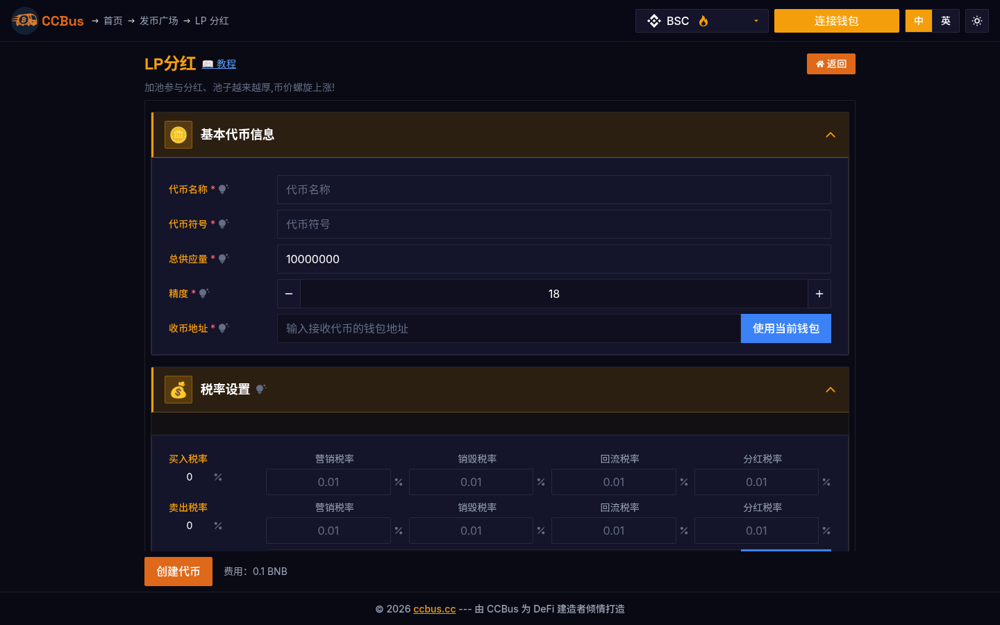
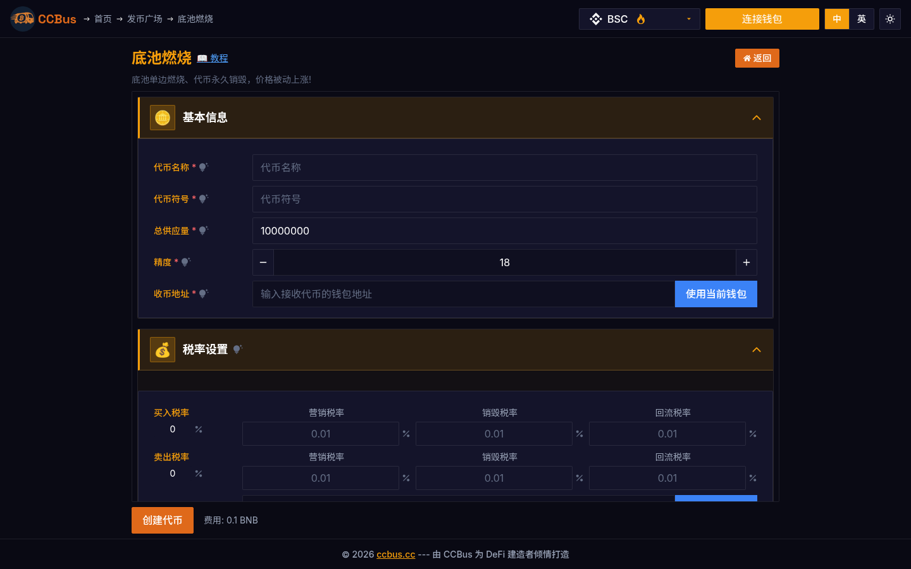
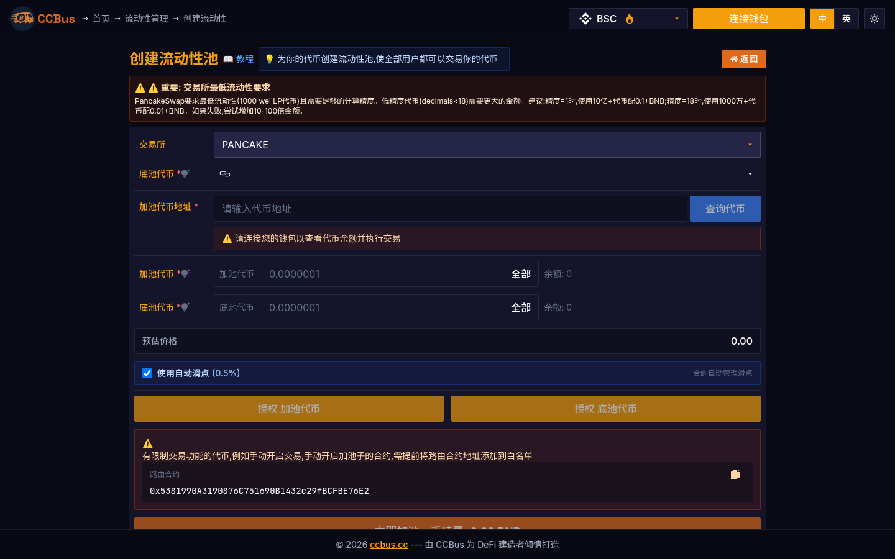

<div class="ccbus-hero">
  <div class="ccbus-hero-avatar">
    
  </div>
  <div class="ccbus-hero-content">
    <h1>第十章：DeFi - 去中心化金融</h1>
    <div class="ccbus-teacher-label">🎙️ 本章讲师:<strong>DeFi Navigator</strong> · DeFi 的"导航员" — 主业,识路无数</div>
  </div>
</div>

<div class="chapter-intro">

**学习目标**：
- 理解 DeFi 的核心概念和价值主张
- 掌握自动化做市商 (AMM) 的工作原理
- 学习借贷协议的机制和风险管理
- 了解稳定币的设计模式
- 探索 DeFi 的组合性和创新应用

**本章关键词**：DeFi、AMM、流动性池、借贷协议、稳定币、收益耕作、闪电贷、总锁定价值 (TVL)

</div>


## 10.0 2025-2026 视角:为什么这一章要重新读

DeFi 在 2026 年进入了**机构化 + 真实收益(real yield) + 意图化(intent-centric)**三轮驱动。

1. **AMM 的代际演化**:
   - **Uniswap v4(2025-Q1 主网)**:**Hooks 体系**重塑了 AMV 边界。Hook 是在 swap 生命周期(afterSwap、beforeSwap、afterAddLiquidity 等)上插入的回调,可以实现动态费率、自定义预言机、自定义曲线(如 Curve StableSwap)
   - **PancakeSwap Infinity(2024-Q4)**:在 v4 基础上提供 Infusion Hooks
   - **Curve(2025-Q2 v3)**:StableSwap 算法升级,集成 crvUSD
   - **Velodrome v2(Optimism)**:ve(3,3) 模型继续主导 L2 DEX

2. **借贷协议的模块化**:
   - **Morpho Blue(2024-Q1)**:模块化借贷层,任何人都可以创建借贷市场
   - **Aave v4(2025-Q3 计划)**:模块化 + 跨链 + GHO 稳定币
   - **Euler v2(2024)**:模块化借贷,支持任意抵押因子
   - **Spark Protocol**:MakerDAO 旗下的 Sky 生态借贷协议

3. **稳定币 DEX 的专业化**:
   - **Curve**:仍是稳定币 DEX 之王
   - **Fluid**:Compound + Aave 风格的借贷 + DEX 组合
   - **Pendle(2024-Q4 v3)**:YT/PT 拆解,利率衍生品代币化
   - **Ethena USDe**:Delta-neutral 合成美元,TVL 50 亿

4. **意图式 DEX(占 2026 DEX 流量 40%+)**:
   - **UniswapX**:荷兰拍,MEV 保护
   - **1inch Fusion**:求解器网络
   - **CoW Swap**:批量结算 + Coincidence of Wants
   - **0x Protocol v2**:从聚合器升级为意图引擎
   - **Across**:意图 + 跨链的混合方案

5. **真实收益的来源**:
   - **基础收益**:链上资产的供需利率(如 Aave USDC 存款 5%)
   - **RWA 收益**:代币化美债(Ondo OUSG 5%+)
   - **LRT 收益**:EigenLayer restaking 收益(基础 + AVS 奖励)
   - **MEV 收益**:求解器抓到的 MEV
   - **2026 趋势**:协议收入正在流向真实用户,而非纯通胀奖励

6. **LRT 与 DeFi 的耦合**:
   - 用户在 Aave 存 stETH,被自动复利 restaking 收益
   - 抵押 LRT(如 eETH、ezETH)借出稳定币,做空 ETH 风险
   - **EigenLayer 衍生 DeFi 协议**:Pendle + EigenLayer 创造 PT-stETH 等固定收益产品

### 🖥️ 真实案例:CCBus 的 DeFi 工具矩阵

CCBus 的 DeFi 工具集几乎是本章内容的可视化目录:

- **流动性池代币(LP Reflection)**:持币者自动获得 LP 手续费分红。
- **底池燃烧(LP Burn)**:把 LP 代币发给 0xdead,永久锁仓增加稀缺性。
- **LP 挖矿(LP Mine)**:持 LP 代币挖项目自身代币。
- **流动性控制台(liquidity console)**:管理多个 DEX 上的 LP 头寸。
- **流动性修复(liquidity fix)**:在 V2/V3 迁移后调整价格区间。
- **池子分析器(pool analysor)**:用真实链上数据评估池子健康度。







*图 10-1/2/3:CCBus 的 LP 工具集——分红、燃烧、加池控制——完整地体现了 **Uniswap V2/V3 的 LP 经济学**。这三种工具覆盖了 DeFi 流动性管理的 90% 真实场景。*

## 10.1 什么是 DeFi？

### DeFi 核心概念

**DeFi** (Decentralized Finance，去中心化金融) 是基于区块链的金融服务，无需传统金融中介（如银行、券商）。

**传统金融 vs DeFi**：

<div style="background: rgba(52, 81, 178, 0.06); padding: 1.5em; border-radius: 4px; margin: 2em 0;">
<svg class="svg-10-0" viewBox="0 0 900 500" xmlns="http://www.w3.org/2000/svg" style="width: 100%; max-width: 1000px; display: block; margin: 0 auto;">
<defs>
<style>
.svg-10-0 .defi-title { font-family: arial, sans-serif; font-size: 16px; fill: #1f2937; font-weight: bold; }
.svg-10-0 .defi-subtitle { font-family: arial, sans-serif; font-size: 13px; fill: #1f2937; font-weight: bold; }
.svg-10-0 .defi-text { font-family: arial, sans-serif; font-size: 11px; fill: #1f2937; }
.svg-10-0 .defi-small { font-family: arial, sans-serif; font-size: 9px; fill: #b0a090; }
.svg-10-0 .defi-tradfi { fill: rgba(220, 53, 69, 0.2); stroke: #dc3545; stroke-width: 2; }
.svg-10-0 .defi-box { fill: rgba(92, 184, 92, 0.10); stroke: #5cb85c; stroke-width: 2; }
</style>
</defs>
<text x="450" y="25" text-anchor="middle" class="defi-title">传统金融 (TradFi) vs DeFi 对比</text>
<text x="450" y="45" text-anchor="middle" class="defi-small">从中心化到去中心化的金融范式转变</text>
<rect x="50" y="70" width="380" height="400" class="defi-tradfi" rx="8"/>
<text x="240" y="95" text-anchor="middle" class="defi-subtitle">传统金融 (TradFi)</text>
<text x="60" y="120" class="defi-text" font-weight="bold">🔸 特点：</text>
<text x="70" y="138" class="defi-text">• 中心化机构：银行、券商、交易所</text>
<text x="70" y="154" class="defi-text">• 需要KYC/AML身份验证</text>
<text x="70" y="170" class="defi-text">• 营业时间限制（如9:00-17:00）</text>
<text x="70" y="186" class="defi-text">• 跨境转账慢且昂贵</text>
<text x="70" y="202" class="defi-text">• 高门槛（最低存款要求）</text>
<text x="60" y="227" class="defi-text" font-weight="bold">🔸 优势：</text>
<text x="70" y="245" class="defi-text">✅ 受监管，用户保护</text>
<text x="70" y="261" class="defi-text">✅ 存款保险（如FDIC）</text>
<text x="70" y="277" class="defi-text">✅ 客服支持</text>
<text x="70" y="293" class="defi-text">✅ 法币入口</text>
<text x="60" y="318" class="defi-text" font-weight="bold">🔸 劣势：</text>
<text x="70" y="336" class="defi-text" fill="#dc3545">❌ 单点故障（银行倒闭）</text>
<text x="70" y="352" class="defi-text" fill="#dc3545">❌ 审查风险（冻结账户）</text>
<text x="70" y="368" class="defi-text" fill="#dc3545">❌ 不透明的运作方式</text>
<text x="70" y="384" class="defi-text" fill="#dc3545">❌ 高手续费（3-5%）</text>
<text x="70" y="400" class="defi-text" fill="#dc3545">❌ 排除无银行账户人群</text>
<text x="70" y="430" class="defi-small">例：银行存款利率 0.5%，贷款利率 8%</text>
<text x="70" y="450" class="defi-small">跨境汇款费用 $25-50，需 3-5 天</text>
<rect x="470" y="70" width="380" height="400" class="defi-box" rx="8"/>
<text x="660" y="95" text-anchor="middle" class="defi-subtitle">DeFi (去中心化金融)</text>
<text x="480" y="120" class="defi-text" font-weight="bold">🔸 特点：</text>
<text x="490" y="138" class="defi-text">• 去中心化协议：智能合约</text>
<text x="490" y="154" class="defi-text">• 无需许可：钱包即可使用</text>
<text x="490" y="170" class="defi-text">• 24/7 全球运作</text>
<text x="490" y="186" class="defi-text">• 即时全球转账</text>
<text x="490" y="202" class="defi-text">• 低门槛（$1 起）</text>
<text x="480" y="227" class="defi-text" font-weight="bold">🔸 优势：</text>
<text x="490" y="245" class="defi-text" fill="#5cb85c">✅ 非托管（用户控制资产）</text>
<text x="490" y="261" class="defi-text" fill="#5cb85c">✅ 抗审查</text>
<text x="490" y="277" class="defi-text" fill="#5cb85c">✅ 透明（代码开源）</text>
<text x="490" y="293" class="defi-text" fill="#5cb85c">✅ 低手续费（~0.3%）</text>
<text x="490" y="309" class="defi-text" fill="#5cb85c">✅ 可组合性（金融乐高）</text>
<text x="480" y="334" class="defi-text" font-weight="bold">🔸 劣势：</text>
<text x="490" y="352" class="defi-text">⚠️  智能合约风险（漏洞）</text>
<text x="490" y="368" class="defi-text">⚠️  私钥丢失无法找回</text>
<text x="490" y="384" class="defi-text">⚠️  高波动性</text>
<text x="490" y="400" class="defi-text">⚠️  监管不确定性</text>
<text x="490" y="430" class="defi-small">例：Aave 存款 APY 3-15%，借款 5-20%</text>
<text x="490" y="450" class="defi-small">跨链桥转账费用 $1-5，需 10-30 分钟</text>
</svg>
</div>

### DeFi 生态全景 (2025年数据)

**市场规模**：
- **总锁定价值 (TVL)**：$100B+ (2024年底数据)
- **用户数量**：700万+ 独立地址
- **协议数量**：3000+ DeFi 协议

**主要赛道**：
1. **DEX (去中心化交易所)**：Uniswap, Curve, Balancer - TVL $30B+
2. **借贷协议**：Aave, Compound, MakerDAO - TVL $25B+
3. **衍生品**：dYdX, GMX, Synthetix - 日交易量 $2B+
4. **稳定币**：USDT, USDC, DAI - 市值 $150B+
5. **收益聚合器**：Yearn Finance, Beefy - TVL $2B+

---

## 10.2 自动化做市商 (AMM)

### AMM 原理：恒定乘积公式

**Uniswap V2** 使用恒定乘积做市商模型：

$$
x \times y = k
$$

其中：
- $x$ 和 $y$ 是流动性池中两种代币的数量
- $k$ 是常数（恒定乘积）

<div style="background: rgba(52, 81, 178, 0.06); padding: 1.5em; border-radius: 4px; margin: 2em 0;">
<svg class="svg-10-1" viewBox="0 0 850 550" xmlns="http://www.w3.org/2000/svg" style="width: 100%; max-width: 950px; display: block; margin: 0 auto;">
<defs>
<style>
.svg-10-1 .amm-title { font-family: arial, sans-serif; font-size: 16px; fill: #1f2937; font-weight: bold; }
.svg-10-1 .amm-text { font-family: arial, sans-serif; font-size: 11px; fill: #1f2937; }
.svg-10-1 .amm-small { font-family: arial, sans-serif; font-size: 9px; fill: #b0a090; }
.svg-10-1 .amm-pool { fill: rgba(52, 81, 178, 0.10); stroke: #4c9be8; stroke-width: 2; }
.svg-10-1 .amm-swap { fill: rgba(223, 105, 25, 0.08); stroke: #df6919; stroke-width: 2; }
.svg-10-1 .amm-curve { stroke: #5cb85c; stroke-width: 3; fill: none; }
.svg-10-1 .amm-point { fill: #df6919; }
.svg-10-1 .amm-arrow { stroke: #1f2937; stroke-width: 2; fill: none; marker-end: url(#arrowAMM); }
</style>
<marker id="arrowAMM" markerWidth="10" markerHeight="10" refX="9" refY="3" orient="auto" markerUnits="strokeWidth">
<path d="M0,0 L0,6 L9,3 z" fill="#1f2937"/>
</marker>
</defs>
<text x="425" y="25" text-anchor="middle" class="amm-title">AMM 恒定乘积做市商工作原理</text>
<text x="425" y="45" text-anchor="middle" class="amm-small">x × y = k 公式保证流动性永不枯竭</text>
<rect x="50" y="70" width="350" height="200" class="amm-pool" rx="8"/>
<text x="225" y="95" text-anchor="middle" class="amm-text" font-weight="bold">流动性池 (Liquidity Pool)</text>
<text x="60" y="120" class="amm-text">初始状态：</text>
<text x="70" y="140" class="amm-text">• ETH 储备量：x = 100 ETH</text>
<text x="70" y="156" class="amm-text">• USDC 储备量：y = 200,000 USDC</text>
<text x="70" y="172" class="amm-text">• 恒定乘积：k = 100 × 200,000</text>
<text x="70" y="188" class="amm-text">  k = 20,000,000</text>
<text x="60" y="213" class="amm-text">当前价格：</text>
<text x="70" y="233" class="amm-text">1 ETH = 200,000/100 = 2,000 USDC</text>
<text x="70" y="253" class="amm-small">价格 = y / x</text>
<rect x="450" y="70" width="350" height="200" class="amm-swap" rx="8"/>
<text x="625" y="95" text-anchor="middle" class="amm-text" font-weight="bold">交易示例：买入 10 ETH</text>
<text x="460" y="120" class="amm-text">用户输入：20,000 USDC</text>
<text x="460" y="145" class="amm-text">计算流程：</text>
<text x="470" y="163" class="amm-text">1️⃣ 新 USDC 储备：y' = 200,000 + 20,000</text>
<text x="485" y="178" class="amm-text">y' = 220,000 USDC</text>
<text x="470" y="196" class="amm-text">2️⃣ 根据 x' × y' = k 计算新 ETH 储备：</text>
<text x="485" y="211" class="amm-text">x' = k / y' = 20,000,000 / 220,000</text>
<text x="485" y="226" class="amm-text">x' = 90.91 ETH</text>
<text x="470" y="244" class="amm-text">3️⃣ 用户获得 ETH：</text>
<text x="485" y="259" class="amm-text">Δx = 100 - 90.91 = 9.09 ETH</text>
<line x1="225" y1="270" x2="625" y2="85" class="amm-arrow"/>
<rect x="50" y="290" width="750" height="240" fill="rgba(92, 184, 92, 0.07)" stroke="#5cb85c" stroke-width="2" stroke-dasharray="5,5" rx="8"/>
<text x="425" y="315" text-anchor="middle" class="amm-text" font-weight="bold">恒定乘积曲线可视化</text>
<line x1="70" y1="500" x2="770" y2="500" stroke="#4c9be8" stroke-width="2" fill="none"/>
<text x="770" y="520" text-anchor="end" class="amm-small">ETH (x)</text>
<line x1="70" y1="500" x2="70" y2="330" stroke="#4c9be8" stroke-width="2" fill="none"/>
<text x="50" y="340" class="amm-small">USDC (y)</text>
<path d="M 80,340 Q 200,360 350,400 Q 500,440 700,490" class="amm-curve"/>
<circle cx="350" cy="400" r="6" class="amm-point"/>
<text x="360" y="395" class="amm-text" fill="#df6919">初始点 (100, 200k)</text>
<circle cx="420" cy="425" r="6" class="amm-point"/>
<text x="430" y="420" class="amm-text" fill="#df6919">交易后 (90.91, 220k)</text>
<text x="80" y="515" class="amm-small">0</text>
<text x="345" y="515" class="amm-small">100</text>
<text x="50" y="405" class="amm-small">200k</text>
<text x="50" y="430" class="amm-small">220k</text>
<rect x="460" y="330" width="330" height="90" fill="rgba(223, 105, 25, 0.08)" stroke="#df6919" stroke-width="1" rx="4"/>
<text x="625" y="350" text-anchor="middle" class="amm-text" font-weight="bold">价格滑点</text>
<text x="470" y="370" class="amm-text">• 预期价格：2,000 USDC/ETH</text>
<text x="470" y="386" class="amm-text">• 实际价格：20,000 / 9.09 = 2,200 USDC/ETH</text>
<text x="470" y="402" class="amm-text">• 滑点：(2,200 - 2,000) / 2,000 = 10%</text>
<text x="470" y="415" class="amm-small">大额交易导致高滑点！</text>
</svg>
</div>

### AMM 关键概念

**1. 流动性提供者 (LP)**：
```javascript
// 添加流动性示例（Uniswap V2）
function addLiquidity(
    address tokenA,
    address tokenB,
    uint amountADesired,
    uint amountBDesired
) external returns (uint amountA, uint amountB, uint liquidity);

// LP 获得份额代币 (LP tokens)
// LP tokens 代表池子中的所有权比例
```

**2. 交易手续费**：
- Uniswap V2/V3: 0.3% (部分池 0.05% 或 1%)
- Curve: 0.04% (稳定币池，低滑点)
- 手续费分配给 LP，作为提供流动性的奖励

**3. 无常损失 (Impermanent Loss)**：

当代币价格变化时，LP 的资产价值可能低于单纯持有。

$$
\text{IL} = \frac{2\sqrt{P_1/P_0}}{1 + P_1/P_0} - 1
$$

其中 $P_1/P_0$ 是价格比率变化。

**示例**：
- 初始：提供 1 ETH + 2000 USDC (价格 1 ETH = 2000 USDC)
- 后来：ETH 涨到 4000 USDC
- 池子重新平衡：0.707 ETH + 2828 USDC
- 总价值：$5656
- 如果只持有：1 ETH + 2000 USDC = $6000
- 无常损失：5.7%

---

## 10.3 借贷协议

### Aave / Compound 工作原理

**超额抵押借贷**：用户必须抵押价值高于借款的资产。

<div style="background: rgba(52, 81, 178, 0.06); padding: 1.5em; border-radius: 4px; margin: 2em 0;">
<svg class="svg-10-2" viewBox="0 0 850 600" xmlns="http://www.w3.org/2000/svg" style="width: 100%; max-width: 950px; display: block; margin: 0 auto;">
<defs>
<style>
.svg-10-2 .lend-title { font-family: arial, sans-serif; font-size: 16px; fill: #1f2937; font-weight: bold; }
.svg-10-2 .lend-subtitle { font-family: arial, sans-serif; font-size: 13px; fill: #1f2937; font-weight: bold; }
.svg-10-2 .lend-text { font-family: arial, sans-serif; font-size: 11px; fill: #1f2937; }
.svg-10-2 .lend-small { font-family: arial, sans-serif; font-size: 9px; fill: #b0a090; }
.svg-10-2 .lend-step { fill: rgba(52, 81, 178, 0.10); stroke: #4c9be8; stroke-width: 2; }
.svg-10-2 .lend-risk { fill: rgba(220, 53, 69, 0.2); stroke: #dc3545; stroke-width: 2; }
.svg-10-2 .lend-arrow { stroke: #1f2937; stroke-width: 2; fill: none; marker-end: url(#arrowLend); }
</style>
<marker id="arrowLend" markerWidth="10" markerHeight="10" refX="9" refY="3" orient="auto" markerUnits="strokeWidth">
<path d="M0,0 L0,6 L9,3 z" fill="#1f2937"/>
</marker>
</defs>
<text x="425" y="25" text-anchor="middle" class="lend-title">DeFi 借贷协议工作流程 (Aave / Compound)</text>
<text x="425" y="45" text-anchor="middle" class="lend-small">超额抵押模式 - 以 ETH 抵押借 USDC 为例</text>
<rect x="50" y="70" width="220" height="120" class="lend-step" rx="8"/>
<text x="160" y="95" text-anchor="middle" class="lend-subtitle">1️⃣ 存入抵押品</text>
<text x="60" y="120" class="lend-text">用户 Alice：</text>
<text x="70" y="138" class="lend-text">• 存入 10 ETH</text>
<text x="70" y="154" class="lend-text">• ETH 价格：$2,000</text>
<text x="70" y="170" class="lend-text">• 抵押品价值：$20,000</text>
<text x="70" y="185" class="lend-small">获得 aETH (计息代币)</text>
<line x1="270" y1="130" x2="330" y2="130" class="lend-arrow"/>
<rect x="330" y="70" width="220" height="120" class="lend-step" rx="8"/>
<text x="440" y="95" text-anchor="middle" class="lend-subtitle">2️⃣ 借款</text>
<text x="340" y="120" class="lend-text">计算借款能力：</text>
<text x="350" y="138" class="lend-text">• LTV (贷款价值比)：75%</text>
<text x="350" y="154" class="lend-text">• 最大借款：$20k × 75%</text>
<text x="350" y="170" class="lend-text">  = $15,000 USDC</text>
<text x="350" y="185" class="lend-small">实际借出 $12,000 USDC</text>
<line x1="550" y1="130" x2="610" y2="130" class="lend-arrow"/>
<rect x="610" y="70" width="190" height="120" class="lend-step" rx="8"/>
<text x="705" y="95" text-anchor="middle" class="lend-subtitle">3️⃣ 使用资金</text>
<text x="620" y="120" class="lend-text">Alice 可以：</text>
<text x="630" y="138" class="lend-text">• 用于交易</text>
<text x="630" y="154" class="lend-text">• 再投资</text>
<text x="630" y="170" class="lend-text">• 杠杆操作</text>
<text x="630" y="185" class="lend-small">支付借款利息</text>
<rect x="50" y="210" width="750" height="140" fill="rgba(223, 105, 25, 0.06)" stroke="#df6919" stroke-width="2" stroke-dasharray="5,5" rx="8"/>
<text x="425" y="235" text-anchor="middle" class="lend-subtitle">健康因子 (Health Factor) 监控</text>
<text x="60" y="260" class="lend-text">健康因子 = (抵押品价值 × 清算阈值) / 借款价值</text>
<text x="60" y="285" class="lend-text">初始状态：</text>
<text x="70" y="303" class="lend-text">Health Factor = ($20,000 × 0.80) / $12,000 = 1.33 ✅</text>
<text x="450" y="285" class="lend-text">ETH 跌到 $1,600：</text>
<text x="460" y="303" class="lend-text">Health Factor = ($16,000 × 0.80) / $12,000 = 1.07 ⚠️</text>
<text x="60" y="328" class="lend-text" fill="#5cb85c">✅ HF > 1：安全</text>
<text x="300" y="328" class="lend-text" fill="#df6919">⚠️  HF ≈ 1：接近清算</text>
<text x="540" y="328" class="lend-text" fill="#dc3545">❌ HF < 1：触发清算</text>
<rect x="50" y="370" width="360" height="210" class="lend-step" rx="8"/>
<text x="230" y="395" text-anchor="middle" class="lend-subtitle">4️⃣ 还款与取回</text>
<text x="60" y="420" class="lend-text">正常情况：</text>
<text x="70" y="438" class="lend-text">1. Alice 归还 $12,000 USDC + 利息</text>
<text x="70" y="454" class="lend-text">2. 取回 10 ETH 抵押品</text>
<text x="70" y="470" class="lend-text">3. 赎回 aETH，获得存款利息</text>
<text x="60" y="495" class="lend-text">利息示例 (2025年典型APY)：</text>
<text x="70" y="513" class="lend-text">• 存款利息：3% APY</text>
<text x="70" y="529" class="lend-text">• 借款利息：5% APY</text>
<text x="70" y="545" class="lend-text">• 净成本：2% APY</text>
<text x="70" y="565" class="lend-small">利率根据资金利用率动态调整</text>
<rect x="440" y="370" width="360" height="210" class="lend-risk" rx="8"/>
<text x="620" y="395" text-anchor="middle" class="lend-subtitle">5️⃣ 清算机制</text>
<text x="450" y="420" class="lend-text">触发条件：Health Factor < 1</text>
<text x="450" y="445" class="lend-text">清算流程：</text>
<text x="460" y="463" class="lend-text">1. 清算人偿还部分债务</text>
<text x="460" y="479" class="lend-text">2. 获得折扣价抵押品（如 95 折）</text>
<text x="460" y="495" class="lend-text">3. 用户损失抵押品</text>
<text x="450" y="520" class="lend-text">清算惩罚：</text>
<text x="460" y="538" class="lend-text">• Aave：5-10% 清算罚金</text>
<text x="460" y="554" class="lend-text">• Compound：8% 清算罚金</text>
<text x="460" y="570" class="lend-small">避免清算：及时补充抵押品或还款</text>
</svg>
</div>

### 利率模型

**动态利率**根据资金利用率调整：

$$
\begin{aligned}
&\text{资金利用率 (U)} = \frac{\text{总借款}}{\text{总存款}} \\
\\
&\text{借款利率} = \begin{cases}
R_0 + \frac{U}{U_{optimal}} \times R_{slope1} & \text{if } U \leq U_{optimal} \\
R_0 + R_{slope1} + \frac{U - U_{optimal}}{1 - U_{optimal}} \times R_{slope2} & \text{if } U > U_{optimal}
\end{cases}
\end{aligned}
$$

**典型参数**（稳定币池）：
- $U_{optimal} = 0.9$ (90% 最优利用率)
- $R_0 = 0\%$ (基础利率)
- $R_{slope1} = 4\%$
- $R_{slope2} = 75\%$ (高利用率惩罚)

---

## 10.4 稳定币设计模式

### 三种主流稳定币模式

<div style="background: rgba(52, 81, 178, 0.06); padding: 1.5em; border-radius: 4px; margin: 2em 0;">
<svg class="svg-10-3" viewBox="0 0 900 550" xmlns="http://www.w3.org/2000/svg" style="width: 100%; max-width: 1000px; display: block; margin: 0 auto;">
<defs>
<style>
.svg-10-3 .stable-title { font-family: arial, sans-serif; font-size: 16px; fill: #1f2937; font-weight: bold; }
.svg-10-3 .stable-subtitle { font-family: arial, sans-serif; font-size: 13px; fill: #1f2937; font-weight: bold; }
.svg-10-3 .stable-text { font-family: arial, sans-serif; font-size: 10px; fill: #1f2937; }
.svg-10-3 .stable-small { font-family: arial, sans-serif; font-size: 8px; fill: #b0a090; }
.svg-10-3 .stable-fiat { fill: rgba(52, 81, 178, 0.10); stroke: #4c9be8; stroke-width: 2; }
.svg-10-3 .stable-crypto { fill: rgba(223, 105, 25, 0.08); stroke: #df6919; stroke-width: 2; }
.svg-10-3 .stable-algo { fill: rgba(92, 184, 92, 0.10); stroke: #5cb85c; stroke-width: 2; }
</style>
</defs>
<text x="450" y="25" text-anchor="middle" class="stable-title">稳定币设计模式对比</text>
<text x="450" y="45" text-anchor="middle" class="stable-small">三种主流稳定币机制与代表项目</text>
<rect x="50" y="70" width="250" height="450" class="stable-fiat" rx="8"/>
<text x="175" y="95" text-anchor="middle" class="stable-subtitle">1️⃣ 法币抵押型</text>
<text x="175" y="115" text-anchor="middle" class="stable-small">Fiat-Collateralized</text>
<text x="60" y="140" class="stable-text" font-weight="bold">机制：</text>
<text x="70" y="158" class="stable-text">• 1:1 法币储备</text>
<text x="70" y="173" class="stable-text">• 中心化托管</text>
<text x="70" y="188" class="stable-text">• 定期审计</text>
<text x="60" y="213" class="stable-text" font-weight="bold">代表项目：</text>
<text x="70" y="231" class="stable-text">• USDT (Tether)</text>
<text x="70" y="246" class="stable-text">• USDC (Circle)</text>
<text x="70" y="261" class="stable-text">• BUSD (Binance)</text>
<text x="60" y="286" class="stable-text" font-weight="bold">市值 (2025)：</text>
<text x="70" y="304" class="stable-text">USDT: $100B</text>
<text x="70" y="319" class="stable-text">USDC: $35B</text>
<text x="60" y="344" class="stable-text" font-weight="bold">优势：</text>
<text x="70" y="362" class="stable-text" fill="#5cb85c">✅ 稳定性最高</text>
<text x="70" y="377" class="stable-text" fill="#5cb85c">✅ 简单易懂</text>
<text x="70" y="392" class="stable-text" fill="#5cb85c">✅ 流动性好</text>
<text x="60" y="417" class="stable-text" font-weight="bold">劣势：</text>
<text x="70" y="435" class="stable-text" fill="#dc3545">❌ 中心化风险</text>
<text x="70" y="450" class="stable-text" fill="#dc3545">❌ 需要信任</text>
<text x="70" y="465" class="stable-text" fill="#dc3545">❌ 监管风险</text>
<text x="70" y="495" class="stable-small">托管银行持有美元，1:1 铸造代币</text>
<rect x="325" y="70" width="250" height="450" class="stable-crypto" rx="8"/>
<text x="450" y="95" text-anchor="middle" class="stable-subtitle">2️⃣ 加密货币抵押型</text>
<text x="450" y="115" text-anchor="middle" class="stable-small">Crypto-Collateralized</text>
<text x="335" y="140" class="stable-text" font-weight="bold">机制：</text>
<text x="345" y="158" class="stable-text">• 超额抵押 (>150%)</text>
<text x="345" y="173" class="stable-text">• 智能合约托管</text>
<text x="345" y="188" class="stable-text">• 自动清算</text>
<text x="335" y="213" class="stable-text" font-weight="bold">代表项目：</text>
<text x="345" y="231" class="stable-text">• DAI (MakerDAO)</text>
<text x="345" y="246" class="stable-text">• sUSD (Synthetix)</text>
<text x="345" y="261" class="stable-text">• LUSD (Liquity)</text>
<text x="335" y="286" class="stable-text" font-weight="bold">抵押率：</text>
<text x="345" y="304" class="stable-text">DAI: 150-175%</text>
<text x="345" y="319" class="stable-text">LUSD: 110%</text>
<text x="335" y="344" class="stable-text" font-weight="bold">优势：</text>
<text x="345" y="362" class="stable-text" fill="#5cb85c">✅ 去中心化</text>
<text x="345" y="377" class="stable-text" fill="#5cb85c">✅ 透明</text>
<text x="345" y="392" class="stable-text" fill="#5cb85c">✅ 抗审查</text>
<text x="335" y="417" class="stable-text" font-weight="bold">劣势：</text>
<text x="345" y="435" class="stable-text" fill="#dc3545">❌ 资本效率低</text>
<text x="345" y="450" class="stable-text" fill="#dc3545">❌ 清算风险</text>
<text x="345" y="465" class="stable-text" fill="#dc3545">❌ 价格波动时承压</text>
<text x="345" y="495" class="stable-small">例：抵押 $150 ETH 生成 $100 DAI</text>
<rect x="600" y="70" width="250" height="450" class="stable-algo" rx="8"/>
<text x="725" y="95" text-anchor="middle" class="stable-subtitle">3️⃣ 算法稳定币</text>
<text x="725" y="115" text-anchor="middle" class="stable-small">Algorithmic</text>
<text x="610" y="140" class="stable-text" font-weight="bold">机制：</text>
<text x="620" y="158" class="stable-text">• 算法调控供应</text>
<text x="620" y="173" class="stable-text">• 无抵押或部分抵押</text>
<text x="620" y="188" class="stable-text">• 铸币税分红</text>
<text x="610" y="213" class="stable-text" font-weight="bold">代表项目：</text>
<text x="620" y="231" class="stable-text">• FRAX (部分抵押)</text>
<text x="620" y="246" class="stable-text">• crvUSD (LLAMMA)</text>
<text x="620" y="261" class="stable-text" fill="#dc3545">• UST (已失败)</text>
<text x="610" y="286" class="stable-text" font-weight="bold">调节机制：</text>
<text x="620" y="304" class="stable-text">价格 > $1：增发</text>
<text x="620" y="319" class="stable-text">价格 < $1：回购销毁</text>
<text x="610" y="344" class="stable-text" font-weight="bold">优势：</text>
<text x="620" y="362" class="stable-text" fill="#5cb85c">✅ 资本效率高</text>
<text x="620" y="377" class="stable-text" fill="#5cb85c">✅ 可扩展性强</text>
<text x="620" y="392" class="stable-text" fill="#5cb85c">✅ 去中心化</text>
<text x="610" y="417" class="stable-text" font-weight="bold">劣势：</text>
<text x="620" y="435" class="stable-text" fill="#dc3545">❌ 死亡螺旋风险</text>
<text x="620" y="450" class="stable-text" fill="#dc3545">❌ 复杂性高</text>
<text x="620" y="465" class="stable-text" fill="#dc3545">❌ 信任不足</text>
<text x="620" y="495" class="stable-small">UST 崩盘教训：需要强大的锚定机制</text>
<rect x="50" y="530" width="800" height="15" fill="rgba(52, 81, 178, 0.15)" stroke="#4c9be8" stroke-width="1" rx="4"/>
<text x="60" y="542" class="stable-text">💡 趋势：混合模式（如 FRAX）结合法币储备 + 算法调控，平衡稳定性与资本效率</text>
</svg>
</div>

### DAI 稳定币机制

**MakerDAO** 的 DAI 工作流程：

1. **开启 Vault (CDP)**：
   ```javascript
   // 抵押 ETH 生成 DAI
   vault.deposit(10 ether); // 抵押 10 ETH
   vault.generate(5000 * 10**18); // 生成 5000 DAI
   // 抵押率：(10 ETH × $2000) / $5000 = 400%
   ```

2. **稳定费 (Stability Fee)**：年化利率，如 3.5%

3. **清算**：
   - 清算比率：150% (ETH Vault)
   - 清算罚金：13%
   - 拍卖抵押品偿还债务

---

## 10.5 DeFi 创新应用

### 闪电贷 (Flash Loan)

**无抵押贷款**，但必须在同一笔交易内归还。

```javascript
// Aave 闪电贷示例
contract FlashLoanArbitrage {
    function executeFlashLoan(uint256 amount) external {
        // 1. 借出资金
        lendingPool.flashLoan(
            address(this),
            DAI,
            amount,
            params
        );
    }

    // 2. 回调函数 - 必须在此归还
    function executeOperation(
        address asset,
        uint256 amount,
        uint256 premium, // 手续费 0.09%
        address initiator,
        bytes calldata params
    ) external returns (bool) {
        // 3. 套利逻辑
        // 例：在 Uniswap 买入，Sushiswap 卖出

        // 4. 归还贷款 + 手续费
        uint256 amountOwed = amount + premium;
        IERC20(asset).approve(msg.sender, amountOwed);

        return true; // 如果无法归还，整个交易回滚
    }
}
```

**应用场景**：
- **套利**：利用不同 DEX 价差
- **清算**：无本金清算抵押不足的头寸
- **债务再融资**：从高息协议转到低息协议

### 收益聚合器

**Yearn Finance** 自动寻找最高收益策略：

```
用户存入 USDC
    ↓
Yearn 自动分配到多个协议：
    - 40% → Aave (3% APY)
    - 30% → Compound (4% APY)
    - 30% → Curve (5% APY + CRV 奖励)
    ↓
自动复利，优化 Gas 费
    ↓
用户获得 yvUSD 份额代币
```

### 流动性挖矿 (Liquidity Mining)

**激励用户提供流动性**：

| 协议 | 奖励代币 | APY | 风险 |
|------|---------|-----|------|
| Curve | CRV | 5-20% | 低（稳定币） |
| Uniswap V3 | 手续费 | 10-50% | 中（无常损失） |
| GMX | esGMX | 15-30% | 高（杠杆风险） |

---


### Uniswap v4 Hooks:把 AMM 变成"可编程流动性格子"

Uniswap v4(2025-Q1 主网)最大的创新不是 gas 节省(虽然确实省了 99%——从 180k gas 降到 5k gas),而是 **Hooks 体系**。

**Hooks 是什么?**

Hooks 是在 swap / 添加流动性 / 移除流动性的生命周期**关键时点**上执行的回调函数,允许开发者:
- 动态调整费率(根据市场波动率)
- 插入自定义预言机(TWAP、Chainlink、内部 oracle)
- 集成限价单、TWAMM(时间加权平均做市)、自定义曲线
- 添加 MEV 捕获与返还机制
- 实现链上订单簿(部分)

**8 个 Hook 触发点**:

| Hook 名 | 触发时机 | 典型用法 |
|---|---|---|
| `beforeInitialize` / `afterInitialize` | 池子创建前后 | 初始化参数、注册 |
| `beforeModifyPosition` / `afterModifyPosition` | 添加/移除流动性前后 | 限制 LP 范围、费用分发 |
| `beforeSwap` / `afterSwap` | swap 前后 | 动态费率、限价、TWAMM |
| `beforeDonate` / `afterDonate` | 捐赠前后 | 协议费再投资 |

**生产级 Hook 项目(2025-2026)**:

| 项目 | Hook 类型 | 描述 |
|---|---|---|
| **Arrakis Finance** | 管理 Hook | 集中管理流动性,优化 LP 收益 |
| **Swaap Finance** | Oracle Hook | 自适应预言机,减少套利损失 |
| **Ambient Finance** | 全能 Hook | 把 AMM + 借贷 + TWAMM 合三为一 |
| **Panoptic** | 期权 Hook | 把 LP 头寸转为期权 |
| **Maverick** | 集中流动性 + Boosted Position | 动态流动性集中 |
| **Kromatika** | TWAMM + 限价单 | 集成到 Uniswap v4 |
| **Wildcat Protocol** | 借贷 Hook | LP 头寸自动借贷 |

**Hooks 写代码示例(Solidity 0.8.25+,transient storage 优化)**:

```solidity
// 一个简单的动态费率 hook
contract DynamicFeeHook is BaseHook {
    using SafeERC20 for IERC20;

    // 用 transient storage 避免重入和跨交易状态泄漏
    uint256 private transient _lastSwapTimestamp;
    uint256 private transient _swapCount;

    function getHookPermissions() public pure override returns (Hooks.Permissions memory) {
        return Hooks.Permissions({
            beforeInitialize: false,
            afterInitialize: false,
            beforeModifyPosition: false,
            afterModifyPosition: true,  // 收取协议费
            beforeSwap: true,            // 动态费率
            afterSwap: false,
            beforeDonate: false,
            afterDonate: false
        });
    }

    function beforeSwap(address, PoolKey calldata, SwapParams calldata params, bytes calldata)
        external override returns (bytes4, BeforeSwapDelta, uint24)
    {
        _swapCount++;
        _lastSwapTimestamp = block.timestamp;

        // 根据 swap 频次动态调整费率
        uint24 baseFee = 3000; // 0.3%
        if (_swapCount > 100) {
            baseFee = 10000; // 1% — 高频时段提高费率
        }

        return (this.beforeSwap.selector, BeforeSwapDeltaLibrary.ZERO_DELTA, baseFee);
    }
}
```

**Hooks 的经济意义**:v4 让 Uniswap 从"通用 AMM"变成"流动性格子",任何团队可以基于 v4 构建自己的 DEX 而无需部署新合约。这是 2025-2026 年 DeFi 协议层创新的核心模式。

<div class="ccbus-teacher-credits">
  <div class="ccbus-teacher-credits-avatar">
    
  </div>
  <div class="ccbus-teacher-credits-body">
    本章讲师:<strong>DeFi Navigator</strong> — DeFi 的"导航员" — 主业,识路无数<br />
    <span style="font-size: 0.85em; color: var(--vp-c-text-3);">📚 下一章 [第十一章：NFT 与数字资产] 将由另一位 CCBus 讲师带你继续。</span>
  </div>
</div>

<div class="chapter-footer">


## 本章总结

本章深入探讨了 DeFi 的核心机制和创新应用：

**核心要点**：
- **DeFi vs TradFi**：去中心化、无需许可、透明、可组合，但有智能合约风险
- **AMM**：恒定乘积公式 $x \times y = k$，价格滑点与流动性成反比
- **借贷协议**：超额抵押模式，健康因子监控，动态利率模型
- **稳定币**：法币抵押（USDT/USDC）、加密货币抵押（DAI）、算法型（FRAX）
- **创新应用**：闪电贷无抵押套利、收益聚合器自动优化、流动性挖矿激励

**市场数据 (2025)**：
- TVL: $100B+
- DEX 日交易量: $5B+
- 借贷协议 TVL: $25B+
- 稳定币市值: $150B+

**风险提示**：
- 智能合约漏洞（如 2022年 Ronin Bridge $625M 被盗）
- 无常损失（价格波动导致 LP 损失）
- 清算风险（抵押品价值下降）
- 监管不确定性

**学习资源**：
- [Uniswap V2 Whitepaper](https://uniswap.org/whitepaper.pdf)
- [Aave Documentation](https://docs.aave.com/)
- [MakerDAO DAI Stability](https://makerdao.com/whitepaper/)
- [DeFi Llama](https://defillama.com/) - TVL 数据追踪

**下一章预告**：
第十一章将探讨 **NFT 与数字资产**，包括 NFT 标准、市场、创新应用等。

</div>
