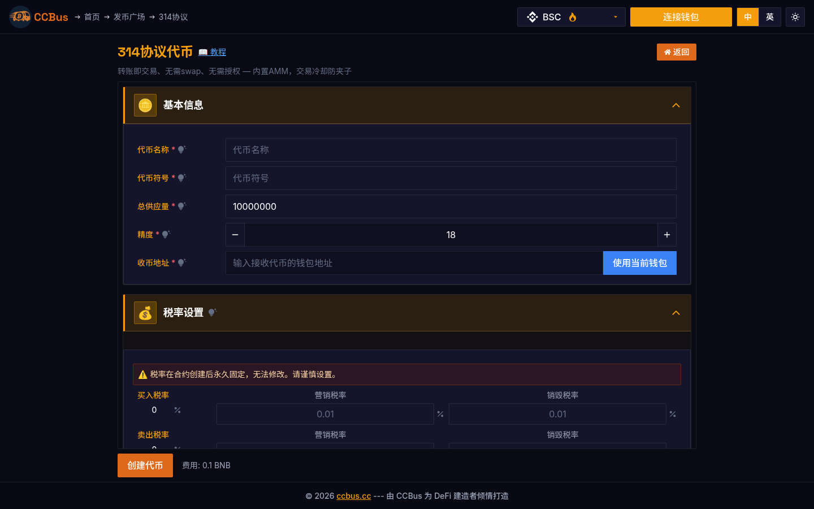
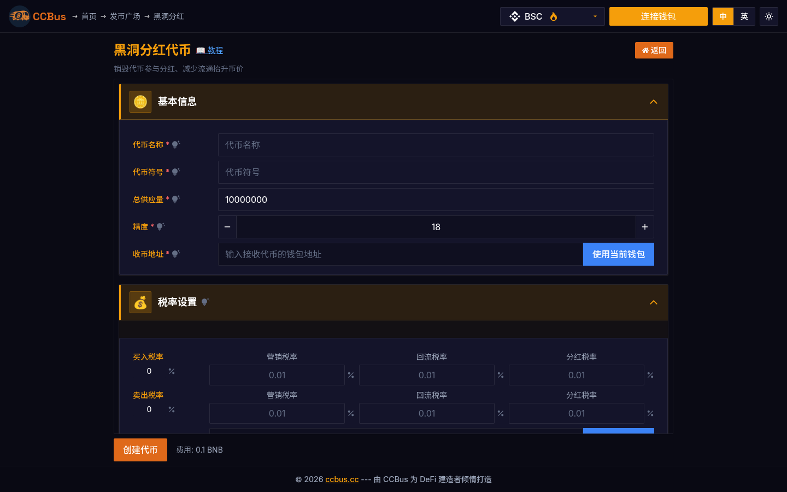

# 第十二章：治理与 DAO

<div class="chapter-intro">

**学习目标**：
- 理解 DAO 的核心概念和组织形式
- 掌握链上治理机制和投票系统
- 学习代币经济学和激励设计
- 了解多签钱包和治理安全
- 探索 DAO 工具栈和最佳实践

**关键词**：DAO、链上治理、投票机制、代币经济学、多签钱包、Governor、Snapshot

</div>


## 12.0 2025-2026 视角:为什么这一章要重新读

治理(governance)与 DAO 在 2026 年走出了"投票 + 多签"的简单模型,进入了**链下委托(off-chain delegation via Snapshot v2)、链上可执行提案(Safe Module)、Optimistic governance(类似 Optimism 的 Citizens' House)、SubDAO 嵌套、AI 治理代理(ai16z DAO、Virtuals Protocol)**的新阶段。本章讲清现代 DAO 的基础设施和实战模式。

### 🖥️ 真实案例:CCBus 的协议级治理(314 协议 + Blackhole)

CCBus 的两个独特合约模板完美体现了现代协议治理思想:

- **314 协议(Protocol 314)**:把持币分红、推荐奖励、链上回购三者合一的复合协议,通过链上参数自动调整,无需人工投票。
- **黑洞分红(Blackhole)**:把项目方的代币转入黑洞地址,通过减少流通量实现通缩。
- **多功能代币(Multi-Function)**:在一个合约内同时配置税率、白名单、推荐人,并支持治理参数的可升级。





*图 12-1/2:CCBus 314 协议与黑洞分红。这两个模板展示了 **协议级自治**——通过智能合约的预置参数,实现"代码即治理"(code-is-law)的现代 DAO 实践。*

## 12.1 什么是 DAO？

### DAO 的定义

DAO (Decentralized Autonomous Organization，去中心化自治组织) 是一种基于智能合约的组织形式，通过代码和社区共识进行决策和运营。

<div style="background: rgba(32, 55, 76, 0.5); padding: 1.5em; border-radius: 8px; margin: 2em 0;">
<svg xmlns="http://www.w3.org/2000/svg" viewBox="0 0 900 500">
<defs>
<style>
.dao-title { font: bold 24px sans-serif; fill: #4c9be8; }
.dao-subtitle { font: bold 16px sans-serif; fill: #f0e6d2; }
.dao-label { font: 13px sans-serif; fill: #f0e6d2; }
.dao-box-trad { fill: rgba(217, 83, 79, 0.15); stroke: #d9534f; stroke-width: 2; }
.dao-box-dao { fill: rgba(92, 184, 92, 0.15); stroke: #5cb85c; stroke-width: 2; }
.dao-arrow { stroke: #4c9be8; stroke-width: 2; fill: none; }
.dao-check { fill: #5cb85c; }
.dao-cross { fill: #d9534f; }
</style>
</defs>
<text x="450" y="35" class="dao-title" text-anchor="middle">传统组织 vs DAO</text>
<rect x="50" y="70" width="380" height="400" class="dao-box-trad" rx="8"/>
<text x="240" y="105" class="dao-subtitle" text-anchor="middle">🏢 传统组织 (Traditional Org)</text>
<text x="70" y="145" class="dao-label" font-weight="bold">治理结构：</text>
<text x="70" y="170" class="dao-label">• 等级制 (Hierarchical)</text>
<text x="70" y="190" class="dao-label">• CEO/董事会决策</text>
<text x="70" y="210" class="dao-label">• 股东投票 (年度)</text>
<text x="70" y="245" class="dao-label" font-weight="bold">透明度：</text>
<line x1="75" y1="260" x2="85" y2="270" class="dao-cross" stroke-width="2"/>
<line x1="85" y1="260" x2="75" y2="270" class="dao-cross" stroke-width="2"/>
<text x="95" y="270" class="dao-label">财务不公开</text>
<line x1="75" y1="285" x2="85" y2="295" class="dao-cross" stroke-width="2"/>
<line x1="85" y1="285" x2="75" y2="295" class="dao-cross" stroke-width="2"/>
<text x="95" y="295" class="dao-label">决策过程不透明</text>
<text x="70" y="330" class="dao-label" font-weight="bold">执行方式：</text>
<text x="70" y="355" class="dao-label">• 人工执行</text>
<text x="70" y="375" class="dao-label">• 可能被操纵</text>
<text x="70" y="395" class="dao-label">• 需要信任中介</text>
<text x="70" y="430" class="dao-label" font-weight="bold">准入门槛：</text>
<line x1="75" y1="445" x2="85" y2="455" class="dao-cross" stroke-width="2"/>
<line x1="85" y1="445" x2="75" y2="455" class="dao-cross" stroke-width="2"/>
<text x="95" y="455" class="dao-label">高 (需要许可、KYC)</text>
<rect x="470" y="70" width="380" height="400" class="dao-box-dao" rx="8"/>
<text x="660" y="105" class="dao-subtitle" text-anchor="middle">🌐 DAO (去中心化组织)</text>
<text x="490" y="145" class="dao-label" font-weight="bold">治理结构：</text>
<text x="490" y="170" class="dao-label">• 扁平化 (Flat)</text>
<text x="490" y="190" class="dao-label">• 社区投票决策</text>
<text x="490" y="210" class="dao-label">• 持续提案 (24/7)</text>
<text x="490" y="245" class="dao-label" font-weight="bold">透明度：</text>
<circle cx="500" cy="265" r="5" class="dao-check"/>
<text x="515" y="270" class="dao-label">所有交易链上公开</text>
<circle cx="500" cy="290" r="5" class="dao-check"/>
<text x="515" y="295" class="dao-label">智能合约代码开源</text>
<circle cx="500" cy="315" r="5" class="dao-check"/>
<text x="515" y="320" class="dao-label">投票结果实时可见</text>
<text x="490" y="355" class="dao-label" font-weight="bold">执行方式：</text>
<text x="490" y="380" class="dao-label">• 智能合约自动执行</text>
<text x="490" y="400" class="dao-label">• 不可篡改</text>
<text x="490" y="420" class="dao-label">• 无需信任 (Trustless)</text>
<text x="490" y="455" class="dao-label" font-weight="bold">准入门槛：</text>
<circle cx="500" cy="465" r="5" class="dao-check"/>
<text x="515" y="470" class="dao-label">低 (持有代币即可)</text>
</svg>
</div>

### DAO 的发展历史

| 年份 | 事件 | 意义 |
|------|------|------|
| 2016 | The DAO 黑客事件 | $60M 被盗，导致以太坊硬分叉 (ETH/ETC) |
| 2018 | MakerDAO 成立 | 第一个成功的 DeFi DAO，管理 DAI 稳定币 |
| 2020 | Compound 发币 | 开启 DeFi Summer，治理代币成为标配 |
| 2021 | Constitution DAO | 众筹 $47M 竞拍美国宪法副本 (失败但证明潜力) |
| 2023 | ARB Airdrop | Arbitrum DAO 空投 $10B 代币，最大规模治理代币分发 |
| 2025 | DAO 工具成熟 | Snapshot、Tally、Safe 等工具广泛采用 |

### DAO 的类型

1. **协议 DAO** (Protocol DAO): Uniswap, Aave, Compound - 管理 DeFi 协议
2. **投资 DAO** (Investment DAO): The LAO, MetaCartel Ventures - 集体投资决策
3. **收藏 DAO** (Collector DAO): PleasrDAO, Flamingo DAO - 购买 NFT/艺术品
4. **社交 DAO** (Social DAO): Friends with Benefits (FWB) - 社区成员协作
5. **服务 DAO** (Service DAO): RaidGuild, LexDAO - 提供专业服务
6. **媒体 DAO** (Media DAO): BanklessDAO - 内容创作和分发

## 12.2 链上治理机制

### Governor 合约：OpenZeppelin 标准

<div style="background: rgba(32, 55, 76, 0.5); padding: 1.5em; border-radius: 8px; margin: 2em 0;">
<svg xmlns="http://www.w3.org/2000/svg" viewBox="0 0 900 600">
<defs>
<style>
.gov-title { font: bold 24px sans-serif; fill: #4c9be8; }
.gov-step { font: bold 16px sans-serif; fill: #f0e6d2; }
.gov-label { font: 13px sans-serif; fill: #f0e6d2; }
.gov-box { fill: rgba(76, 156, 232, 0.1); stroke: #4c9be8; stroke-width: 2; }
.gov-active { fill: rgba(92, 184, 92, 0.2); stroke: #5cb85c; stroke-width: 3; }
.gov-arrow { stroke: #df6919; stroke-width: 3; fill: none; marker-end: url(#gov-arrow); }
.gov-time { font: 11px sans-serif; fill: #f0ad4e; font-style: italic; }
</style>
<marker id="gov-arrow" markerWidth="12" markerHeight="12" refX="10" refY="3" orient="auto" markerUnits="strokeWidth">
<path d="M0,0 L0,6 L9,3 z" fill="#df6919"/>
</marker>
</defs>
<text x="450" y="35" class="gov-title" text-anchor="middle">链上治理流程 (Governor 合约)</text>
<g id="step1">
<rect x="50" y="80" width="160" height="100" class="gov-box" rx="8"/>
<text x="130" y="110" class="gov-step" text-anchor="middle">1. 提案创建</text>
<text x="70" y="140" class="gov-label">(Propose)</text>
<text x="70" y="160" class="gov-label">• 需要最低代币量</text>
<text x="70" y="175" class="gov-label">  (如 100,000 UNI)</text>
</g>
<path d="M 220 130 L 260 130" class="gov-arrow"/>
<g id="step2">
<rect x="270" y="80" width="160" height="100" class="gov-box" rx="8"/>
<text x="350" y="110" class="gov-step" text-anchor="middle">2. 投票延迟</text>
<text x="290" y="140" class="gov-label">(Voting Delay)</text>
<text x="290" y="160" class="gov-label">⏰ 1-2 天</text>
<text x="290" y="175" class="gov-time">防止闪电贷攻击</text>
</g>
<path d="M 440 130 L 480 130" class="gov-arrow"/>
<g id="step3">
<rect x="490" y="80" width="160" height="100" class="gov-active" rx="8"/>
<text x="570" y="110" class="gov-step" text-anchor="middle">3. 投票期</text>
<text x="510" y="140" class="gov-label">(Voting Period)</text>
<text x="510" y="160" class="gov-label">⏰ 3-7 天</text>
<text x="510" y="175" class="gov-label">🗳️ For / Against / Abstain</text>
</g>
<path d="M 690 130 L 730 130" class="gov-arrow"/>
<g id="step4">
<rect x="740" y="80" width="110" height="100" class="gov-box" rx="8"/>
<text x="795" y="110" class="gov-step" text-anchor="middle" font-size="14">4. 结果</text>
<text x="760" y="140" class="gov-label">(Tally)</text>
<text x="760" y="160" class="gov-label">✅ 达到</text>
<text x="760" y="175" class="gov-label">   法定人数</text>
</g>
<path d="M 795 190 L 795 230" class="gov-arrow"/>
<g id="step5">
<rect x="690" y="240" width="210" height="100" class="gov-box" rx="8"/>
<text x="795" y="270" class="gov-step" text-anchor="middle">5. 时间锁</text>
<text x="710" y="300" class="gov-label">(Timelock)</text>
<text x="710" y="320" class="gov-label">⏰ 2 天等待期</text>
<text x="710" y="335" class="gov-time">允许用户退出 (如果不同意)</text>
</g>
<path d="M 680 290 L 640 290" class="gov-arrow"/>
<g id="step6">
<rect x="430" y="240" width="200" height="100" class="gov-active" rx="8"/>
<text x="530" y="270" class="gov-step" text-anchor="middle">6. 执行</text>
<text x="450" y="300" class="gov-label">(Execute)</text>
<text x="450" y="320" class="gov-label">🤖 智能合约自动执行</text>
</g>
<g id="failure-path">
<text x="50" y="270" class="gov-label" fill="#d9534f" font-weight="bold">❌ 提案未通过：</text>
<text x="50" y="295" class="gov-label">• 未达法定人数 (Quorum)</text>
<text x="50" y="315" class="gov-label">• 反对票 > 赞成票</text>
<text x="50" y="335" class="gov-label">→ 提案失败，不执行</text>
</g>
<g id="parameters">
<rect x="50" y="380" width="800" height="190" class="gov-box" rx="8" opacity="0.3"/>
<text x="450" y="415" class="gov-step" text-anchor="middle">关键治理参数 (Governance Parameters)</text>
<text x="70" y="450" class="gov-label" font-weight="bold">1. 提案门槛 (Proposal Threshold):</text>
<text x="90" y="470" class="gov-label">• Uniswap: 2.5M UNI (总供应量的 0.25%)</text>
<text x="90" y="490" class="gov-label">• Compound: 100,000 COMP (1%)</text>
<text x="470" y="450" class="gov-label" font-weight="bold">2. 法定人数 (Quorum):</text>
<text x="490" y="470" class="gov-label">• Uniswap: 40M UNI (4%)</text>
<text x="490" y="490" class="gov-label">• Aave: 320,000 AAVE (动态调整)</text>
<text x="70" y="525" class="gov-label" font-weight="bold">3. 投票权重 (Voting Power):</text>
<text x="90" y="545" class="gov-label">• 1 代币 = 1 票 (Token-weighted)</text>
<text x="470" y="525" class="gov-label" font-weight="bold">4. 委托 (Delegation):</text>
<text x="490" y="545" class="gov-label">• 可将投票权委托给专业人士</text>
</g>
</svg>
</div>

### Governor 合约实现

```solidity
// SPDX-License-Identifier: MIT
pragma solidity ^0.8.20;

import "@openzeppelin/contracts/governance/Governor.sol";
import "@openzeppelin/contracts/governance/extensions/GovernorSettings.sol";
import "@openzeppelin/contracts/governance/extensions/GovernorCountingSimple.sol";
import "@openzeppelin/contracts/governance/extensions/GovernorVotes.sol";
import "@openzeppelin/contracts/governance/extensions/GovernorVotesQuorumFraction.sol";
import "@openzeppelin/contracts/governance/extensions/GovernorTimelockControl.sol";

contract MyGovernor is
    Governor,
    GovernorSettings,
    GovernorCountingSimple,
    GovernorVotes,
    GovernorVotesQuorumFraction,
    GovernorTimelockControl
{
    constructor(
        IVotes _token,
        TimelockController _timelock
    )
        Governor("MyGovernor")
        GovernorSettings(
            7200,    /* 投票延迟: 1 天 (假设 12s/block) */
            50400,   /* 投票期: 7 天 */
            100e18   /* 提案门槛: 100 代币 */
        )
        GovernorVotes(_token)
        GovernorVotesQuorumFraction(4)  /* 法定人数: 4% */
        GovernorTimelockControl(_timelock)
    {}

    // 创建提案
    function propose(
        address[] memory targets,
        uint256[] memory values,
        bytes[] memory calldatas,
        string memory description
    ) public override(Governor) returns (uint256) {
        return super.propose(targets, values, calldatas, description);
    }

    // 投票: 0 = Against, 1 = For, 2 = Abstain
    function castVote(uint256 proposalId, uint8 support)
        public
        override(Governor)
        returns (uint256)
    {
        return super.castVote(proposalId, support);
    }

    // 执行提案
    function execute(
        address[] memory targets,
        uint256[] memory values,
        bytes[] memory calldatas,
        bytes32 descriptionHash
    ) public payable override(Governor) returns (uint256) {
        return super.execute(targets, values, calldatas, descriptionHash);
    }

    // 以下为必需的覆盖函数
    function votingDelay() public view override(Governor, GovernorSettings) returns (uint256) {
        return super.votingDelay();
    }

    function votingPeriod() public view override(Governor, GovernorSettings) returns (uint256) {
        return super.votingPeriod();
    }

    function quorum(uint256 blockNumber)
        public
        view
        override(Governor, GovernorVotesQuorumFraction)
        returns (uint256)
    {
        return super.quorum(blockNumber);
    }

    function proposalThreshold()
        public
        view
        override(Governor, GovernorSettings)
        returns (uint256)
    {
        return super.proposalThreshold();
    }

    function state(uint256 proposalId)
        public
        view
        override(Governor, GovernorTimelockControl)
        returns (ProposalState)
    {
        return super.state(proposalId);
    }

    function _execute(
        uint256 proposalId,
        address[] memory targets,
        uint256[] memory values,
        bytes[] memory calldatas,
        bytes32 descriptionHash
    ) internal override(Governor, GovernorTimelockControl) {
        super._execute(proposalId, targets, values, calldatas, descriptionHash);
    }

    function _cancel(
        address[] memory targets,
        uint256[] memory values,
        bytes[] memory calldatas,
        bytes32 descriptionHash
    ) internal override(Governor, GovernorTimelockControl) returns (uint256) {
        return super._cancel(targets, values, calldatas, descriptionHash);
    }

    function _executor()
        internal
        view
        override(Governor, GovernorTimelockControl)
        returns (address)
    {
        return super._executor();
    }
}
```

### 治理代币：ERC-20Votes

```solidity
pragma solidity ^0.8.20;

import "@openzeppelin/contracts/token/ERC20/ERC20.sol";
import "@openzeppelin/contracts/token/ERC20/extensions/ERC20Permit.sol";
import "@openzeppelin/contracts/token/ERC20/extensions/ERC20Votes.sol";

contract GovernanceToken is ERC20, ERC20Permit, ERC20Votes {
    constructor() ERC20("MyToken", "MTK") ERC20Permit("MyToken") {
        _mint(msg.sender, 10_000_000 * 10**18);  // 1000万代币
    }

    // 委托投票权
    // 用户可以将投票权委托给其他地址 (如专业投票者)
    function delegate(address delegatee) public override {
        super.delegate(delegatee);
    }

    // 查询某地址在特定区块的投票权
    function getPastVotes(address account, uint256 blockNumber)
        public
        view
        override
        returns (uint256)
    {
        return super.getPastVotes(account, blockNumber);
    }

    // 必需的覆盖函数
    function _update(address from, address to, uint256 amount)
        internal
        override(ERC20, ERC20Votes)
    {
        super._update(from, to, amount);
    }

    function nonces(address owner)
        public
        view
        override(ERC20Permit, Nonces)
        returns (uint256)
    {
        return super.nonces(owner);
    }
}
```

## 12.3 链下治理：Snapshot

Snapshot 是一个链下投票平台，具有以下优势：
- **零 Gas 费用**：投票签名链下存储
- **灵活投票策略**：支持多种代币权重计算
- **快速部署**：无需部署智能合约

<div style="background: rgba(32, 55, 76, 0.5); padding: 1.5em; border-radius: 8px; margin: 2em 0;">
<svg xmlns="http://www.w3.org/2000/svg" viewBox="0 0 850 450">
<defs>
<style>
.snap-title { font: bold 24px sans-serif; fill: #4c9be8; }
.snap-subtitle { font: bold 16px sans-serif; fill: #f0e6d2; }
.snap-label { font: 13px sans-serif; fill: #f0e6d2; }
.snap-box-on { fill: rgba(76, 156, 232, 0.15); stroke: #4c9be8; stroke-width: 2; }
.snap-box-off { fill: rgba(223, 105, 25, 0.15); stroke: #df6919; stroke-width: 2; }
.snap-check { fill: #5cb85c; }
.snap-cross { fill: #d9534f; }
</style>
</defs>
<text x="425" y="35" class="snap-title" text-anchor="middle">链上治理 vs 链下治理 (Snapshot)</text>
<rect x="50" y="70" width="350" height="350" class="snap-box-on" rx="8"/>
<text x="225" y="105" class="snap-subtitle" text-anchor="middle">⛓️ 链上治理 (On-Chain)</text>
<text x="70" y="140" class="snap-label" font-weight="bold">优点：</text>
<circle cx="80" cy="160" r="5" class="snap-check"/>
<text x="95" y="165" class="snap-label">自动执行 (Trustless)</text>
<circle cx="80" cy="185" r="5" class="snap-check"/>
<text x="95" y="190" class="snap-label">不可篡改</text>
<circle cx="80" cy="210" r="5" class="snap-check"/>
<text x="95" y="215" class="snap-label">完全去中心化</text>
<text x="70" y="250" class="snap-label" font-weight="bold">缺点：</text>
<line x1="75" y1="265" x2="85" y2="275" class="snap-cross" stroke-width="2"/>
<line x1="85" y1="265" x2="75" y2="275" class="snap-cross" stroke-width="2"/>
<text x="95" y="275" class="snap-label">高 Gas 费 ($50-500/投票)</text>
<line x1="75" y1="290" x2="85" y2="300" class="snap-cross" stroke-width="2"/>
<line x1="85" y1="290" x2="75" y2="300" class="snap-cross" stroke-width="2"/>
<text x="95" y="300" class="snap-label">投票率低 (通常 &lt; 10%)</text>
<line x1="75" y1="315" x2="85" y2="325" class="snap-cross" stroke-width="2"/>
<line x1="85" y1="315" x2="75" y2="325" class="snap-cross" stroke-width="2"/>
<text x="95" y="325" class="snap-label">部署复杂</text>
<text x="70" y="360" class="snap-label" font-weight="bold" fill="#4c9be8">适用场景：</text>
<text x="70" y="380" class="snap-label">• 高价值决策 (如协议升级)</text>
<text x="70" y="400" class="snap-label">• 需要强制执行的提案</text>
<rect x="450" y="70" width="350" height="350" class="snap-box-off" rx="8"/>
<text x="625" y="105" class="snap-subtitle" text-anchor="middle">📸 链下治理 (Snapshot)</text>
<text x="470" y="140" class="snap-label" font-weight="bold">优点：</text>
<circle cx="480" cy="160" r="5" class="snap-check"/>
<text x="495" y="165" class="snap-label">零 Gas 费 (签名投票)</text>
<circle cx="480" cy="185" r="5" class="snap-check"/>
<text x="495" y="190" class="snap-label">高投票率 (20-40%)</text>
<circle cx="480" cy="210" r="5" class="snap-check"/>
<text x="495" y="215" class="snap-label">快速部署 (无需合约)</text>
<circle cx="480" cy="235" r="5" class="snap-check"/>
<text x="495" y="240" class="snap-label">灵活投票策略</text>
<text x="470" y="275" class="snap-label" font-weight="bold">缺点：</text>
<line x1="475" y1="290" x2="485" y2="300" class="snap-cross" stroke-width="2"/>
<line x1="485" y1="290" x2="475" y2="300" class="snap-cross" stroke-width="2"/>
<text x="495" y="300" class="snap-label">不自动执行 (需人工)</text>
<line x1="475" y1="315" x2="485" y2="325" class="snap-cross" stroke-width="2"/>
<line x1="485" y1="315" x2="475" y2="325" class="snap-cross" stroke-width="2"/>
<text x="495" y="325" class="snap-label">依赖中心化服务器</text>
<text x="470" y="360" class="snap-label" font-weight="bold" fill="#df6919">适用场景：</text>
<text x="470" y="380" class="snap-label">• 温度检测 (Sentiment Check)</text>
<text x="470" y="400" class="snap-label">• 非关键性决策 (如品牌设计)</text>
</svg>
</div>

### Snapshot 投票策略示例

```javascript
// Snapshot 投票策略配置 (snapshot.org)
{
  "symbol": "UNI",
  "name": "Uniswap",
  "network": "1",  // Ethereum Mainnet
  "strategies": [
    {
      "name": "erc20-balance-of",
      "params": {
        "address": "0x1f9840a85d5aF5bf1D1762F925BDADdC4201F984",
        "symbol": "UNI",
        "decimals": 18
      }
    },
    {
      "name": "delegation",  // 支持委托
      "params": {
        "symbol": "UNI (delegated)",
        "strategies": [
          {
            "name": "erc20-balance-of",
            "params": {
              "address": "0x1f9840a85d5aF5bf1D1762F925BDADdC4201F984"
            }
          }
        ]
      }
    }
  ],
  "voting": {
    "delay": 86400,      // 1 天延迟
    "period": 604800,    // 7 天投票期
    "type": "single-choice",  // 单选
    "quorum": 40000000   // 法定人数: 4000万 UNI
  }
}
```

## 12.4 代币经济学与激励设计

<div style="background: rgba(32, 55, 76, 0.5); padding: 1.5em; border-radius: 8px; margin: 2em 0;">
<svg xmlns="http://www.w3.org/2000/svg" viewBox="0 0 900 550">
<defs>
<style>
.token-title { font: bold 24px sans-serif; fill: #4c9be8; }
.token-cat { font: bold 16px sans-serif; fill: #f0e6d2; }
.token-label { font: 13px sans-serif; fill: #f0e6d2; }
.token-slice { stroke: #20374c; stroke-width: 2; }
.token-legend { font: 14px sans-serif; fill: #f0e6d2; }
</style>
</defs>
<text x="450" y="35" class="token-title" text-anchor="middle">代币分配模型 (Tokenomics)</text>
<g id="pie-chart">
<circle cx="250" cy="280" r="150" fill="none" stroke="#4c9be8" stroke-width="2"/>
<path d="M 250 130 A 150 150 0 0 1 358.3 208.3 L 250 280 Z" class="token-slice" fill="rgba(76, 156, 232, 0.3)"/>
<text x="290" y="200" class="token-cat">25%</text>
<text x="280" y="220" class="token-label">社区</text>
<path d="M 358.3 208.3 A 150 150 0 0 1 358.3 351.7 L 250 280 Z" class="token-slice" fill="rgba(92, 184, 92, 0.3)"/>
<text x="340" y="290" class="token-cat">20%</text>
<text x="330" y="310" class="token-label">团队</text>
<path d="M 358.3 351.7 A 150 150 0 0 1 250 430 L 250 280 Z" class="token-slice" fill="rgba(223, 105, 25, 0.3)"/>
<text x="290" y="380" class="token-cat">15%</text>
<text x="280" y="400" class="token-label">投资人</text>
<path d="M 250 430 A 150 150 0 0 1 141.7 351.7 L 250 280 Z" class="token-slice" fill="rgba(147, 112, 219, 0.3)"/>
<text x="170" y="380" class="token-cat">10%</text>
<text x="160" y="400" class="token-label">生态</text>
<path d="M 141.7 351.7 A 150 150 0 0 1 141.7 208.3 L 250 280 Z" class="token-slice" fill="rgba(240, 173, 78, 0.3)"/>
<text x="120" y="290" class="token-cat">15%</text>
<text x="110" y="310" class="token-label">流动性</text>
<path d="M 141.7 208.3 A 150 150 0 0 1 250 130 L 250 280 Z" class="token-slice" fill="rgba(217, 83, 79, 0.3)"/>
<text x="170" y="200" class="token-cat">15%</text>
<text x="160" y="220" class="token-label">财库</text>
</g>
<g id="vesting-schedule">
<rect x="480" y="70" width="380" height="460" fill="rgba(32, 55, 76, 0.5)" stroke="#4c9be8" stroke-width="2" rx="8"/>
<text x="670" y="105" class="token-cat" text-anchor="middle">释放时间表 (Vesting Schedule)</text>
<rect x="500" y="130" width="340" height="60" fill="rgba(76, 156, 232, 0.15)" stroke="#4c9be8" stroke-width="2" rx="4"/>
<text x="510" y="155" class="token-label" font-weight="bold">社区 (25%):</text>
<text x="510" y="175" class="token-label">• 立即释放 50% (空投/流动性挖矿)</text>
<text x="510" y="190" class="token-label">• 剩余 50% 线性释放 (4 年)</text>
<rect x="500" y="210" width="340" height="60" fill="rgba(92, 184, 92, 0.15)" stroke="#5cb85c" stroke-width="2" rx="4"/>
<text x="510" y="235" class="token-label" font-weight="bold">团队 (20%):</text>
<text x="510" y="255" class="token-label">• 1 年锁定 (Cliff)</text>
<text x="510" y="270" class="token-label">• 然后 3 年线性释放</text>
<rect x="500" y="290" width="340" height="60" fill="rgba(223, 105, 25, 0.15)" stroke="#df6919" stroke-width="2" rx="4"/>
<text x="510" y="315" class="token-label" font-weight="bold">投资人 (15%):</text>
<text x="510" y="335" class="token-label">• 6 个月锁定</text>
<text x="510" y="350" class="token-label">• 然后 2 年线性释放</text>
<rect x="500" y="370" width="340" height="75" fill="rgba(217, 83, 79, 0.15)" stroke="#d9534f" stroke-width="2" rx="4"/>
<text x="510" y="395" class="token-label" font-weight="bold">财库 (15%):</text>
<text x="510" y="415" class="token-label">• DAO 多签控制</text>
<text x="510" y="430" class="token-label">• 用于生态激励、合作伙伴</text>
<text x="510" y="445" class="token-label">• 需治理投票批准使用</text>
<text x="670" y="480" class="token-label" text-anchor="middle" font-weight="bold" fill="#f0ad4e">总供应量: 10 亿代币</text>
<text x="670" y="505" class="token-label" text-anchor="middle" fill="#f0ad4e">通胀率: 每年 2% (用于质押奖励)</text>
</g>
</svg>
</div>

### 代币价值捕获机制

| 机制 | 说明 | 示例 |
|------|------|------|
| **治理权** | 代币持有者可投票决策 | UNI, AAVE, COMP |
| **协议收入分红** | 协议收入分配给质押者 | GMX (30% 手续费), veCRV |
| **回购销毁** | 用协议收入回购并销毁代币 | MKR, BNB |
| **质押奖励** | 质押代币获得通胀奖励 | ETH 2.0 (4-5% APR) |
| **ve 模型** | 锁定越久投票权越高 | Curve (veCRV), Balancer (veBAL) |

### ve (Vote-Escrowed) 代币经济学

Curve 的 veCRV 模型：

```solidity
// 简化版 ve 模型
pragma solidity ^0.8.20;

contract VotingEscrow {
    struct LockedBalance {
        uint256 amount;      // 锁定的代币数量
        uint256 unlockTime;  // 解锁时间
    }

    mapping(address => LockedBalance) public locked;

    uint256 constant MAX_LOCK_TIME = 4 * 365 days;  // 最长 4 年

    // 锁定代币获得 veCRV
    function createLock(uint256 amount, uint256 lockDuration) external {
        require(lockDuration <= MAX_LOCK_TIME, "Lock too long");

        locked[msg.sender] = LockedBalance({
            amount: amount,
            unlockTime: block.timestamp + lockDuration
        });

        // 转入代币
        // token.transferFrom(msg.sender, address(this), amount);
    }

    // 计算投票权 (线性衰减)
    function balanceOf(address user) public view returns (uint256) {
        LockedBalance memory userLock = locked[user];

        if (block.timestamp >= userLock.unlockTime) {
            return 0;  // 已解锁，无投票权
        }

        // 投票权 = 锁定数量 × 剩余时间 / 最长锁定时间
        uint256 remainingTime = userLock.unlockTime - block.timestamp;
        return userLock.amount * remainingTime / MAX_LOCK_TIME;
    }

    // 提前解锁 (罚金)
    function earlyUnlock() external {
        LockedBalance memory userLock = locked[msg.sender];

        // 罚金 50%
        uint256 penalty = userLock.amount / 2;
        uint256 amountToReturn = userLock.amount - penalty;

        delete locked[msg.sender];

        // 返还代币
        // token.transfer(msg.sender, amountToReturn);
        // token.transfer(treasury, penalty);  // 罚金进入财库
    }
}
```

## 12.5 多签钱包与治理安全

### Gnosis Safe：行业标准

<div style="background: rgba(32, 55, 76, 0.5); padding: 1.5em; border-radius: 8px; margin: 2em 0;">
<svg xmlns="http://www.w3.org/2000/svg" viewBox="0 0 900 500">
<defs>
<style>
.safe-title { font: bold 24px sans-serif; fill: #4c9be8; }
.safe-step { font: bold 16px sans-serif; fill: #f0e6d2; }
.safe-label { font: 13px sans-serif; fill: #f0e6d2; }
.safe-box { fill: rgba(76, 156, 232, 0.1); stroke: #4c9be8; stroke-width: 2; }
.safe-signer { fill: rgba(92, 184, 92, 0.2); stroke: #5cb85c; stroke-width: 2; }
.safe-arrow { stroke: #df6919; stroke-width: 2; fill: none; marker-end: url(#safe-arrow); }
</style>
<marker id="safe-arrow" markerWidth="10" markerHeight="10" refX="9" refY="3" orient="auto" markerUnits="strokeWidth">
<path d="M0,0 L0,6 L9,3 z" fill="#df6919"/>
</marker>
</defs>
<text x="450" y="35" class="safe-title" text-anchor="middle">多签钱包工作流程 (Gnosis Safe)</text>
<g id="signers">
<text x="450" y="75" class="safe-step" text-anchor="middle">👥 签名者 (Signers)</text>
<circle cx="300" cy="120" r="35" class="safe-signer"/>
<text x="300" y="130" class="safe-label" text-anchor="middle" font-weight="bold">Alice</text>
<circle cx="450" cy="120" r="35" class="safe-signer"/>
<text x="450" y="130" class="safe-label" text-anchor="middle" font-weight="bold">Bob</text>
<circle cx="600" cy="120" r="35" class="safe-signer"/>
<text x="600" y="130" class="safe-label" text-anchor="middle" font-weight="bold">Charlie</text>
<text x="450" y="180" class="safe-label" text-anchor="middle" font-style="italic">3-of-5 多签 (需要 3 个签名)</text>
</g>
<path d="M 450 190 L 450 220" class="safe-arrow"/>
<g id="step1">
<rect x="250" y="230" width="400" height="70" class="safe-box" rx="8"/>
<text x="450" y="260" class="safe-step" text-anchor="middle">Step 1: Alice 创建交易</text>
<text x="270" y="285" class="safe-label">提议: 从财库转账 100 ETH 到开发团队</text>
</g>
<path d="M 450 310 L 450 340" class="safe-arrow"/>
<g id="step2">
<rect x="250" y="350" width="400" height="70" class="safe-box" rx="8"/>
<text x="450" y="380" class="safe-step" text-anchor="middle">Step 2: Bob & Charlie 签名</text>
<text x="270" y="405" class="safe-label">✅ Alice (1/3) → ✅ Bob (2/3) → ✅ Charlie (3/3)</text>
</g>
<path d="M 450 430 L 450 460" class="safe-arrow"/>
<g id="step3">
<rect x="250" y="470" width="400" height="20" class="safe-box" rx="8" fill="rgba(92, 184, 92, 0.3)"/>
<text x="450" y="487" class="safe-step" text-anchor="middle" font-size="14">✅ 交易执行</text>
</g>
<g id="info">
<rect x="50" y="230" width="180" height="190" class="safe-box" rx="8" opacity="0.5"/>
<text x="140" y="260" class="safe-label" text-anchor="middle" font-weight="bold">常见配置</text>
<text x="70" y="285" class="safe-label">2-of-3: 小团队</text>
<text x="70" y="305" class="safe-label">3-of-5: 中型项目</text>
<text x="70" y="325" class="safe-label">5-of-9: 大型 DAO</text>
<text x="70" y="360" class="safe-label" font-weight="bold">优势:</text>
<text x="70" y="380" class="safe-label">• 防止单点故障</text>
<text x="70" y="400" class="safe-label">• 透明审计</text>
</g>
<g id="security">
<rect x="670" y="230" width="180" height="190" class="safe-box" rx="8" opacity="0.5"/>
<text x="760" y="260" class="safe-label" text-anchor="middle" font-weight="bold" fill="#d9534f">⚠️ 安全风险</text>
<text x="690" y="285" class="safe-label">共谋攻击</text>
<text x="690" y="300" class="safe-label" font-size="11">→ 需要可信签名者</text>
<text x="690" y="330" class="safe-label">密钥丢失</text>
<text x="690" y="345" class="safe-label" font-size="11">→ 备份恢复方案</text>
<text x="690" y="375" class="safe-label">延迟攻击</text>
<text x="690" y="390" class="safe-label" font-size="11">→ 设置交易过期时间</text>
</g>
</svg>
</div>

### Safe 多签合约简化版

```solidity
pragma solidity ^0.8.20;

contract MultiSigWallet {
    address[] public owners;
    uint256 public required;  // 需要的签名数

    struct Transaction {
        address to;
        uint256 value;
        bytes data;
        bool executed;
        uint256 confirmations;
    }

    Transaction[] public transactions;
    mapping(uint256 => mapping(address => bool)) public confirmations;

    modifier onlyOwner() {
        bool isOwner = false;
        for (uint i = 0; i < owners.length; i++) {
            if (owners[i] == msg.sender) {
                isOwner = true;
                break;
            }
        }
        require(isOwner, "Not owner");
        _;
    }

    constructor(address[] memory _owners, uint256 _required) {
        require(_owners.length >= _required, "Invalid required");
        require(_required > 0, "Required must be > 0");

        owners = _owners;
        required = _required;
    }

    // 提交交易
    function submitTransaction(address to, uint256 value, bytes memory data)
        public
        onlyOwner
        returns (uint256)
    {
        uint256 txId = transactions.length;

        transactions.push(Transaction({
            to: to,
            value: value,
            data: data,
            executed: false,
            confirmations: 0
        }));

        return txId;
    }

    // 确认交易
    function confirmTransaction(uint256 txId) public onlyOwner {
        require(!confirmations[txId][msg.sender], "Already confirmed");

        confirmations[txId][msg.sender] = true;
        transactions[txId].confirmations++;

        // 自动执行
        if (transactions[txId].confirmations >= required) {
            executeTransaction(txId);
        }
    }

    // 执行交易
    function executeTransaction(uint256 txId) public {
        Transaction storage txn = transactions[txId];

        require(!txn.executed, "Already executed");
        require(txn.confirmations >= required, "Not enough confirmations");

        txn.executed = true;

        (bool success,) = txn.to.call{value: txn.value}(txn.data);
        require(success, "Transaction failed");
    }

    // 撤销确认
    function revokeConfirmation(uint256 txId) public onlyOwner {
        require(confirmations[txId][msg.sender], "Not confirmed");
        require(!transactions[txId].executed, "Already executed");

        confirmations[txId][msg.sender] = false;
        transactions[txId].confirmations--;
    }

    receive() external payable {}
}
```

## 12.6 DAO 工具栈

<div style="background: rgba(32, 55, 76, 0.5); padding: 1.5em; border-radius: 8px; margin: 2em 0;">
<svg xmlns="http://www.w3.org/2000/svg" viewBox="0 0 900 650">
<defs>
<style>
.tool-title { font: bold 24px sans-serif; fill: #4c9be8; }
.tool-cat { font: bold 16px sans-serif; fill: #f0e6d2; }
.tool-label { font: 13px sans-serif; fill: #f0e6d2; }
.tool-box-gov { fill: rgba(76, 156, 232, 0.15); stroke: #4c9be8; stroke-width: 2; }
.tool-box-comm { fill: rgba(92, 184, 92, 0.15); stroke: #5cb85c; stroke-width: 2; }
.tool-box-pay { fill: rgba(223, 105, 25, 0.15); stroke: #df6919; stroke-width: 2; }
.tool-box-ops { fill: rgba(147, 112, 219, 0.15); stroke: #9370db; stroke-width: 2; }
</style>
</defs>
<text x="450" y="35" class="tool-title" text-anchor="middle">DAO 工具生态系统</text>
<g id="governance-tools">
<rect x="50" y="70" width="380" height="130" class="tool-box-gov" rx="8"/>
<text x="240" y="100" class="tool-cat" text-anchor="middle">🗳️ 治理工具</text>
<text x="70" y="130" class="tool-label" font-weight="bold">Snapshot:</text>
<text x="160" y="130" class="tool-label">链下投票 (零 Gas)</text>
<text x="70" y="150" class="tool-label" font-weight="bold">Tally:</text>
<text x="160" y="150" class="tool-label">链上治理仪表板</text>
<text x="70" y="170" class="tool-label" font-weight="bold">Boardroom:</text>
<text x="160" y="170" class="tool-label">治理聚合器</text>
<text x="70" y="190" class="tool-label" font-weight="bold">Governor (OZ):</text>
<text x="160" y="190" class="tool-label">智能合约标准</text>
</g>
<g id="treasury-tools">
<rect x="470" y="70" width="380" height="130" class="tool-box-pay" rx="8"/>
<text x="660" y="100" class="tool-cat" text-anchor="middle">💰 财库管理</text>
<text x="490" y="130" class="tool-label" font-weight="bold">Gnosis Safe:</text>
<text x="590" y="130" class="tool-label">多签钱包</text>
<text x="490" y="150" class="tool-label" font-weight="bold">Llama:</text>
<text x="590" y="150" class="tool-label">财库分析 & 策略</text>
<text x="490" y="170" class="tool-label" font-weight="bold">Parcel:</text>
<text x="590" y="170" class="tool-label">批量支付</text>
<text x="490" y="190" class="tool-label" font-weight="bold">Hedgey:</text>
<text x="590" y="190" class="tool-label">代币释放管理</text>
</g>
<g id="comm-tools">
<rect x="50" y="230" width="380" height="150" class="tool-box-comm" rx="8"/>
<text x="240" y="260" class="tool-cat" text-anchor="middle">💬 协作 & 沟通</text>
<text x="70" y="290" class="tool-label" font-weight="bold">Discord:</text>
<text x="160" y="290" class="tool-label">社区讨论 (Collabland 验证)</text>
<text x="70" y="310" class="tool-label" font-weight="bold">Commonwealth:</text>
<text x="160" y="310" class="tool-label">论坛 & 提案讨论</text>
<text x="70" y="330" class="tool-label" font-weight="bold">Discourse:</text>
<text x="160" y="330" class="tool-label">长篇讨论平台</text>
<text x="70" y="350" class="tool-label" font-weight="bold">Notion:</text>
<text x="160" y="350" class="tool-label">知识库 & 文档</text>
<text x="70" y="370" class="tool-label" font-weight="bold">Coordinape:</text>
<text x="160" y="370" class="tool-label">贡献者奖励分配</text>
</g>
<g id="ops-tools">
<rect x="470" y="230" width="380" height="150" class="tool-box-ops" rx="8"/>
<text x="660" y="260" class="tool-cat" text-anchor="middle">⚙️ 运营工具</text>
<text x="490" y="290" class="tool-label" font-weight="bold">Dework:</text>
<text x="590" y="290" class="tool-label">任务管理 & 赏金</text>
<text x="490" y="310" class="tool-label" font-weight="bold">Sourcecred:</text>
<text x="590" y="310" class="tool-label">贡献度量化</text>
<text x="490" y="330" class="tool-label" font-weight="bold">Utopia Labs:</text>
<text x="590" y="330" class="tool-label">支付自动化</text>
<text x="490" y="350" class="tool-label" font-weight="bold">Collab.Land:</text>
<text x="590" y="350" class="tool-label">代币门控 (Token Gating)</text>
<text x="490" y="370" class="tool-label" font-weight="bold">Guild.xyz:</text>
<text x="590" y="370" class="tool-label">角色管理</text>
</g>
<g id="case-study">
<rect x="50" y="410" width="800" height="220" class="tool-box-gov" rx="8" opacity="0.3"/>
<text x="450" y="445" class="tool-cat" text-anchor="middle">📊 案例: Uniswap DAO 工具栈</text>
<text x="70" y="480" class="tool-label" font-weight="bold">治理:</text>
<text x="70" y="500" class="tool-label">• 链上: Governor 合约 (Ethereum) + Timelock</text>
<text x="70" y="520" class="tool-label">• 链下: Snapshot (温度检测) + Tally (数据展示)</text>
<text x="70" y="555" class="tool-label" font-weight="bold">财库:</text>
<text x="70" y="575" class="tool-label">• Gnosis Safe (多签钱包，5-of-9)</text>
<text x="70" y="595" class="tool-label">• Llama (财库分析，$4B+ TVL)</text>
<text x="470" y="480" class="tool-label" font-weight="bold">沟通:</text>
<text x="470" y="500" class="tool-label">• Discord (100,000+ 成员)</text>
<text x="470" y="520" class="tool-label">• Discourse 论坛 (提案讨论)</text>
<text x="470" y="555" class="tool-label" font-weight="bold">运营:</text>
<text x="470" y="575" class="tool-label">• Grants 计划 (资助生态项目)</text>
<text x="470" y="595" class="tool-label">• 委托制度 (Delegation 给专业投票者)</text>
</g>
</svg>
</div>

### 真实 DAO 统计数据 (2025)

| DAO | 财库价值 | 代币持有者 | 投票率 | 治理方式 |
|-----|----------|----------|--------|----------|
| Uniswap | $4.2B | 400,000+ | 8-12% | Governor + Snapshot |
| Arbitrum | $3.5B | 1,200,000+ | 15-20% | Governor (ARB) |
| Optimism | $2.8B | 800,000+ | 18-25% | Optimism Collective |
| MakerDAO | $1.5B | 120,000+ | 25-35% | Governor + MKR |
| Compound | $800M | 250,000+ | 10-15% | Governor Bravo |

<div class="chapter-footer">

## 本章小结

本章全面介绍了 DAO 的治理机制和实践：

1. **DAO 本质**：去中心化、透明、自动执行的组织形式
2. **链上治理**：Governor 合约标准，提案-投票-执行流程
3. **链下治理**：Snapshot 零 Gas 投票，灵活策略
4. **代币经济学**：分配模型、释放时间表、价值捕获机制 (ve 模型)
5. **多签钱包**：Gnosis Safe，防止单点故障
6. **DAO 工具栈**：治理 (Snapshot/Tally)、财库 (Safe/Llama)、协作 (Discord/Commonwealth)、运营 (Dework)

**关键要点**：
- DAO 不是银弹，需要平衡去中心化和效率
- 投票率低是普遍问题 (< 15%)，委托机制可缓解
- 代币经济学设计至关重要：激励一致性、长期主义
- 多签钱包是财库安全的基础，但需防止共谋攻击
- 混合治理 (链上 + 链下) 是当前最佳实践

## 参考资料

- **OpenZeppelin Governor**: https://docs.openzeppelin.com/contracts/governance
- **Snapshot**: https://snapshot.org/ (链下投票平台)
- **Gnosis Safe**: https://safe.global/
- **Tally**: https://www.tally.xyz/ (治理仪表板)
- **Curve veCRV**: https://curve.readthedocs.io/dao-vecrv.html
- **DeepDAO**: https://deepdao.io/ (DAO 数据统计)
- **a16z Crypto Governance**: https://a16zcrypto.com/dao-governance/

## 下一章预告

第十三章《区块链平台对比》将介绍：
- Ethereum vs BNB Chain vs Polygon
- Layer 1 vs Layer 2 选择
- EVM 兼容链 vs 非 EVM 链
- 性能、安全性、去中心化三角困境
- 多链生态和跨链互操作

让我们继续探索多链宇宙的格局！

</div>
