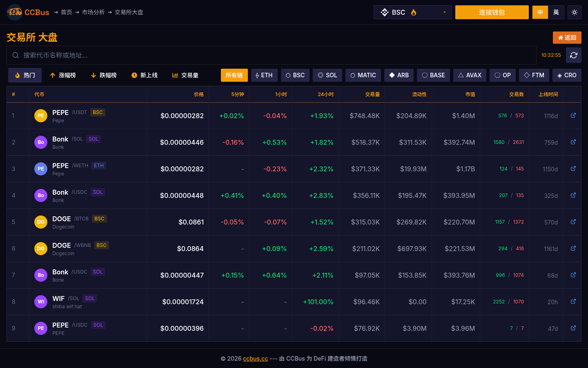

<div class="ccbus-hero">
  <div class="ccbus-hero-avatar">
    
  </div>
  <div class="ccbus-hero-content">
    <h1>第十三章：区块链平台对比</h1>
    <div class="ccbus-teacher-label">🎙️ 本章讲师:<strong>Rookie Rider</strong> · 平台对比的"小乘客" — 用新人的视角问你该坐哪趟</div>
  </div>
</div>

<div class="chapter-intro">

**学习目标**：
- 理解主流区块链平台的技术特点
- 掌握 Layer 1 vs Layer 2 的选择标准
- 了解 EVM 兼容链 vs 非 EVM 链的差异
- 探索区块链不可能三角困境
- 学习多链生态和跨链互操作

**关键词**：Ethereum、BNB Chain、Polygon、Solana、Avalanche、EVM、不可能三角、多链

</div>


## 13.0 2025-2026 视角:为什么这一章要重新读

2026 年的公链格局已经定型。本章用 2026 真实数据更新你的公链对比表。

1. **按 TVL 排名(2026-Q1 数据)**:
   1. **Ethereum + L2**:$58B(占 60%+)
   2. **BNB Chain**:$8B
   3. **Solana**:$7B
   4. **Base**:$5B
   5. **Arbitrum**:$4B
   6. **Bitcoin(Babylon/质押)**:$3.5B
   7. **Sui**:$1.8B
   8. **Aptos**:$1.2B
   9. **Berachain**:$1.0B
   10. **Monad(2025-Q4 上线,快速)**:$0.6B
   11. **Hyperliquid L1**:$0.4B
   12. **Ton**:$0.3B(虽然用户量巨大但 TVL 低)

2. **按用户活跃度排名(月活 MAU,2026)**:
   - **BNB Chain**:50M+(meme + 零售)
   - **Solana**:15M+(高频交易)
   - **Ton**:80M+(Telegram 入口)
   - **Base**:10M+(Coinbase 导流)
   - **Ethereum**:5M+(机构 + DeFi)

3. **按 TPS 排名(实测)**:
   - **Solana**:3000-5000 TPS
   - **Sui / Aptos**:10万+ TPS(并行执行)
   - **Monad**:1万 TPS(乐观并行)
   - **Ethereum L1**:30-100 TPS
   - **OP Rollup**:100-500 TPS
   - **ZK Rollup**:1000+ TPS

4. **新公链(2025-2026 上线)**:
   - **Monad**(2025-Q4):MonadBFT + 乐观并行,1 万 TPS,evm 兼容
   - **Berachain**(2025-Q1):Proof of Liquidity,Tri-Token 模型(原生 + 验证者 + 稳定币)
   - **Story Protocol**(2025-Q2):IP 链,Story + Proof of Creativity
   - **Initia**(2025-Q3):Cosmos + OP Stack 混合
   - **Hyperliquid L1**(2024-Q4):自建链,HyperBFT,无 gas

5. **新叙事的"应用链"**:
   - **dYdX v4**:永续合约专用链
   - **Hyperliquid**:L1 永续合约
   - **Apex Protocol**:Monad 上的永续合约
   - **Drift Protocol**:Solana 上的永续合约
   - **2026 真实数据**:永续合约日交易量 1000 亿+

## 13.1 区块链不可能三角

### 经典三难困境 (Blockchain Trilemma)

由 Ethereum 创始人 Vitalik Buterin 提出，指出区块链系统很难同时实现三个目标：

<div style="background: rgba(52, 81, 178, 0.06); padding: 1.5em; border-radius: 4px; margin: 2em 0;">
<svg class="svg-13-0" xmlns="http://www.w3.org/2000/svg" viewBox="0 0 800 650">
<defs>
<style>
.svg-13-0 .tri-title { font: bold 24px sans-serif; fill: #4c9be8; }
.svg-13-0 .tri-label { font: 16px sans-serif; fill: #1f2937; font-weight: bold; }
.svg-13-0 .tri-desc { font: 13px sans-serif; fill: #1f2937; }
.svg-13-0 .tri-triangle { fill: none; stroke: #4c9be8; stroke-width: 3; }
.svg-13-0 .tri-circle { fill: rgba(52, 81, 178, 0.10); stroke: #4c9be8; stroke-width: 2; }
.svg-13-0 .tri-line { stroke: #df6919; stroke-width: 2; stroke-dasharray: 5,5; }
</style>
</defs>
<text x="400" y="35" class="tri-title" text-anchor="middle">区块链不可能三角 (Trilemma)</text>
<polygon points="400,100 200,500 600,500" class="tri-triangle"/>
<g id="decentralization">
<circle cx="400" cy="100" r="80" class="tri-circle"/>
<text x="400" y="95" class="tri-label" text-anchor="middle">去中心化</text>
<text x="400" y="115" class="tri-label" text-anchor="middle" font-size="14">(Decentralization)</text>
<text x="250" y="70" class="tri-desc">• 节点数量多</text>
<text x="250" y="90" class="tri-desc">• 抗审查</text>
<text x="480" y="70" class="tri-desc">• 无单点故障</text>
<text x="480" y="90" class="tri-desc">• 社区治理</text>
</g>
<g id="security">
<circle cx="200" cy="500" r="80" class="tri-circle"/>
<text x="200" y="495" class="tri-label" text-anchor="middle">安全性</text>
<text x="200" y="515" class="tri-label" text-anchor="middle" font-size="14">(Security)</text>
<text x="50" y="540" class="tri-desc">• 攻击成本高</text>
<text x="50" y="560" class="tri-desc">• 经济安全</text>
<text x="50" y="580" class="tri-desc">• 不可篡改</text>
</g>
<g id="scalability">
<circle cx="600" cy="500" r="80" class="tri-circle"/>
<text x="600" y="495" class="tri-label" text-anchor="middle">可扩展性</text>
<text x="600" y="515" class="tri-label" text-anchor="middle" font-size="14">(Scalability)</text>
<text x="650" y="540" class="tri-desc">• 高 TPS</text>
<text x="650" y="560" class="tri-desc">• 低延迟</text>
<text x="650" y="580" class="tri-desc">• 低手续费</text>
</g>
<g id="tradeoffs">
<line x1="300" y1="300" x2="200" y2="420" class="tri-line"/>
<text x="220" y="350" class="tri-desc" fill="#df6919">Bitcoin/Ethereum:</text>
<text x="220" y="370" class="tri-desc" fill="#df6919">去中心化 + 安全性</text>
<text x="220" y="390" class="tri-desc" fill="#df6919">✗ 低 TPS (~15)</text>
<line x1="500" y1="300" x2="600" y2="420" class="tri-line"/>
<text x="500" y="350" class="tri-desc" fill="#df6919">BNB Chain/Solana:</text>
<text x="500" y="370" class="tri-desc" fill="#df6919">可扩展性 + 安全性</text>
<text x="500" y="390" class="tri-desc" fill="#df6919">✗ 较中心化 (21-1000节点)</text>
<line x1="400" y1="200" x2="400" y2="300" class="tri-line"/>
<text x="350" y="260" class="tri-desc" fill="#df6919">理论链:</text>
<text x="350" y="280" class="tri-desc" fill="#df6919">三者兼顾</text>
<text x="350" y="300" class="tri-desc" fill="#df6919">✗ 不存在</text>
</g>
<text x="400" y="635" class="tri-desc" text-anchor="middle" font-weight="bold" fill="#f0ad4e">解决方案: Layer 2 (在 L1 安全性基础上提升扩展性)</text>
</svg>
</div>

### 各链的权衡选择

| 区块链 | 去中心化 | 安全性 | 可扩展性 | 策略 |
|--------|----------|--------|----------|------|
| Bitcoin | ⭐⭐⭐⭐⭐ | ⭐⭐⭐⭐⭐ | ⭐ | 牺牲扩展性，保证去中心化和安全 |
| Ethereum | ⭐⭐⭐⭐⭐ | ⭐⭐⭐⭐⭐ | ⭐⭐ | 通过 L2 提升扩展性 |
| BNB Chain | ⭐⭐ | ⭐⭐⭐⭐ | ⭐⭐⭐⭐ | 21 验证节点，提升性能 |
| Solana | ⭐⭐⭐ | ⭐⭐⭐⭐ | ⭐⭐⭐⭐⭐ | 1000+ 验证节点，PoH 创新 |
| Avalanche | ⭐⭐⭐⭐ | ⭐⭐⭐⭐ | ⭐⭐⭐⭐ | 子网架构，平衡三者 |

## 13.2 Layer 1 主流平台对比

<div style="background: rgba(52, 81, 178, 0.06); padding: 1.5em; border-radius: 4px; margin: 2em 0;">
<svg class="svg-13-1" xmlns="http://www.w3.org/2000/svg" viewBox="0 0 1000 700">
<defs>
<style>
.svg-13-1 .l1-title { font: bold 24px sans-serif; fill: #4c9be8; }
.svg-13-1 .l1-chain { font: bold 18px sans-serif; fill: #1f2937; }
.svg-13-1 .l1-label { font: 12px sans-serif; fill: #1f2937; }
.svg-13-1 .l1-box-eth { fill: rgba(52, 81, 178, 0.07); stroke: #4c9be8; stroke-width: 2; }
.svg-13-1 .l1-box-bnb { fill: rgba(240, 173, 78, 0.15); stroke: #f0ad4e; stroke-width: 2; }
.svg-13-1 .l1-box-sol { fill: rgba(147, 112, 219, 0.15); stroke: #9370db; stroke-width: 2; }
.svg-13-1 .l1-box-avax { fill: rgba(217, 83, 79, 0.15); stroke: #d9534f; stroke-width: 2; }
.svg-13-1 .l1-check { fill: #5cb85c; }
.svg-13-1 .l1-cross { fill: #d9534f; }
</style>
</defs>
<text x="500" y="35" class="l1-title" text-anchor="middle">Layer 1 平台对比 (2025)</text>
<g id="ethereum">
<rect x="30" y="70" width="220" height="280" class="l1-box-eth" rx="8"/>
<text x="140" y="100" class="l1-chain" text-anchor="middle">Ethereum</text>
<text x="50" y="130" class="l1-label" font-weight="bold">共识: PoS (The Merge)</text>
<text x="50" y="150" class="l1-label">TPS: ~15 (L1)</text>
<text x="50" y="165" class="l1-label">手续费: $5-50</text>
<text x="50" y="180" class="l1-label">出块时间: 12s</text>
<text x="50" y="195" class="l1-label">验证节点: 1,000,000+</text>
<text x="50" y="220" class="l1-label" font-weight="bold">优势:</text>
<circle cx="60" cy="235" r="4" class="l1-check"/>
<text x="70" y="239" class="l1-label">最强大的开发生态</text>
<circle cx="60" cy="252" r="4" class="l1-check"/>
<text x="70" y="256" class="l1-label">最多 DApp (3000+)</text>
<circle cx="60" cy="269" r="4" class="l1-check"/>
<text x="70" y="273" class="l1-label">最高 TVL ($60B+)</text>
<text x="50" y="298" class="l1-label" font-weight="bold">劣势:</text>
<line x1="55" y1="308" x2="63" y2="316" class="l1-cross" stroke-width="1.5"/>
<line x1="63" y1="308" x2="55" y2="316" class="l1-cross" stroke-width="1.5"/>
<text x="70" y="316" class="l1-label">L1 性能低</text>
<line x1="55" y1="325" x2="63" y2="333" class="l1-cross" stroke-width="1.5"/>
<line x1="63" y1="325" x2="55" y2="333" class="l1-cross" stroke-width="1.5"/>
<text x="70" y="333" class="l1-label">Gas 费高</text>
</g>
<g id="bnb">
<rect x="280" y="70" width="220" height="280" class="l1-box-bnb" rx="8"/>
<text x="390" y="100" class="l1-chain" text-anchor="middle">BNB Chain</text>
<text x="300" y="130" class="l1-label" font-weight="bold">共识: PoSA</text>
<text x="300" y="150" class="l1-label">TPS: ~2000</text>
<text x="300" y="165" class="l1-label">手续费: $0.05-0.5</text>
<text x="300" y="180" class="l1-label">出块时间: 3s</text>
<text x="300" y="195" class="l1-label">验证节点: 21 (活跃)</text>
<text x="300" y="220" class="l1-label" font-weight="bold">优势:</text>
<circle cx="310" cy="235" r="4" class="l1-check"/>
<text x="320" y="239" class="l1-label">高性能低成本</text>
<circle cx="310" cy="252" r="4" class="l1-check"/>
<text x="320" y="256" class="l1-label">EVM 兼容</text>
<circle cx="310" cy="269" r="4" class="l1-check"/>
<text x="320" y="273" class="l1-label">Binance 生态支持</text>
<text x="300" y="298" class="l1-label" font-weight="bold">劣势:</text>
<line x1="305" y1="308" x2="313" y2="316" class="l1-cross" stroke-width="1.5"/>
<line x1="313" y1="308" x2="305" y2="316" class="l1-cross" stroke-width="1.5"/>
<text x="320" y="316" class="l1-label">较中心化 (21节点)</text>
<line x1="305" y1="325" x2="313" y2="333" class="l1-cross" stroke-width="1.5"/>
<line x1="313" y1="325" x2="305" y2="333" class="l1-cross" stroke-width="1.5"/>
<text x="320" y="333" class="l1-label">安全事件 (2022桥被盗)</text>
</g>
<g id="solana">
<rect x="530" y="70" width="220" height="280" class="l1-box-sol" rx="8"/>
<text x="640" y="100" class="l1-chain" text-anchor="middle">Solana</text>
<text x="550" y="130" class="l1-label" font-weight="bold">共识: PoH + PoS</text>
<text x="550" y="150" class="l1-label">TPS: ~3000 (理论65k)</text>
<text x="550" y="165" class="l1-label">手续费: $0.0001-0.001</text>
<text x="550" y="180" class="l1-label">出块时间: 400ms</text>
<text x="550" y="195" class="l1-label">验证节点: 2000+</text>
<text x="550" y="220" class="l1-label" font-weight="bold">优势:</text>
<circle cx="560" cy="235" r="4" class="l1-check"/>
<text x="570" y="239" class="l1-label">极高性能</text>
<circle cx="560" cy="252" r="4" class="l1-check"/>
<text x="570" y="256" class="l1-label">超低手续费</text>
<circle cx="560" cy="269" r="4" class="l1-check"/>
<text x="570" y="273" class="l1-label">创新架构 (PoH)</text>
<text x="550" y="298" class="l1-label" font-weight="bold">劣势:</text>
<line x1="555" y1="308" x2="563" y2="316" class="l1-cross" stroke-width="1.5"/>
<line x1="563" y1="308" x2="555" y2="316" class="l1-cross" stroke-width="1.5"/>
<text x="570" y="316" class="l1-label">多次宕机 (2022-2023)</text>
<line x1="555" y1="325" x2="563" y2="333" class="l1-cross" stroke-width="1.5"/>
<line x1="563" y1="325" x2="555" y2="333" class="l1-cross" stroke-width="1.5"/>
<text x="570" y="333" class="l1-label">非 EVM (Rust)</text>
</g>
<g id="avalanche">
<rect x="780" y="70" width="200" height="280" class="l1-box-avax" rx="8"/>
<text x="880" y="100" class="l1-chain" text-anchor="middle">Avalanche</text>
<text x="800" y="130" class="l1-label" font-weight="bold">共识: Avalanche</text>
<text x="800" y="150" class="l1-label">TPS: ~4500</text>
<text x="800" y="165" class="l1-label">手续费: $0.5-2</text>
<text x="800" y="180" class="l1-label">出块时间: 2s</text>
<text x="800" y="195" class="l1-label">验证节点: 1400+</text>
<text x="800" y="220" class="l1-label" font-weight="bold">优势:</text>
<circle cx="810" cy="235" r="4" class="l1-check"/>
<text x="820" y="239" class="l1-label">子网架构</text>
<circle cx="810" cy="252" r="4" class="l1-check"/>
<text x="820" y="256" class="l1-label">EVM 兼容</text>
<circle cx="810" cy="269" r="4" class="l1-check"/>
<text x="820" y="273" class="l1-label">快速确认</text>
<text x="800" y="298" class="l1-label" font-weight="bold">劣势:</text>
<line x1="805" y1="308" x2="813" y2="316" class="l1-cross" stroke-width="1.5"/>
<line x1="813" y1="308" x2="805" y2="316" class="l1-cross" stroke-width="1.5"/>
<text x="820" y="316" class="l1-label">生态较小</text>
</g>
<g id="comparison">
<rect x="30" y="380" width="950" height="290" class="l1-box-eth" rx="8" opacity="0.3"/>
<text x="500" y="415" class="l1-chain" text-anchor="middle">详细性能对比 (2025 数据)</text>
<text x="50" y="450" class="l1-label" font-weight="bold">市值排名:</text>
<text x="50" y="470" class="l1-label">1. Ethereum: ~$300B</text>
<text x="50" y="485" class="l1-label">2. BNB: ~$50B</text>
<text x="50" y="500" class="l1-label">3. Solana: ~$40B</text>
<text x="50" y="515" class="l1-label">4. Avalanche: ~$8B</text>
<text x="300" y="450" class="l1-label" font-weight="bold">TVL 排名:</text>
<text x="300" y="470" class="l1-label">1. Ethereum: $60B+</text>
<text x="300" y="485" class="l1-label">2. BNB Chain: $5B</text>
<text x="300" y="500" class="l1-label">3. Solana: $4B</text>
<text x="300" y="515" class="l1-label">4. Avalanche: $1.5B</text>
<text x="550" y="450" class="l1-label" font-weight="bold">日活用户 (DApps):</text>
<text x="550" y="470" class="l1-label">1. Solana: ~500k</text>
<text x="550" y="485" class="l1-label">2. BNB Chain: ~400k</text>
<text x="550" y="500" class="l1-label">3. Ethereum: ~350k</text>
<text x="550" y="515" class="l1-label">4. Avalanche: ~50k</text>
<text x="50" y="550" class="l1-label" font-weight="bold">编程语言:</text>
<text x="50" y="570" class="l1-label">• Ethereum: Solidity, Vyper</text>
<text x="50" y="585" class="l1-label">• BNB Chain: Solidity (EVM)</text>
<text x="50" y="600" class="l1-label">• Solana: Rust, C</text>
<text x="50" y="615" class="l1-label">• Avalanche: Solidity (C-Chain)</text>
<text x="400" y="550" class="l1-label" font-weight="bold">适用场景:</text>
<text x="400" y="570" class="l1-label">• Ethereum: 高价值 DeFi、企业应用</text>
<text x="400" y="585" class="l1-label">• BNB Chain: 低成本 DApp、GameFi</text>
<text x="400" y="600" class="l1-label">• Solana: 高频交易、DEX、NFT</text>
<text x="400" y="615" class="l1-label">• Avalanche: 企业子网、DeFi</text>
</g>
</svg>
</div>

## 13.3 EVM 兼容链 vs 非 EVM 链

### EVM 生态的优势

<div style="background: rgba(52, 81, 178, 0.06); padding: 1.5em; border-radius: 4px; margin: 2em 0;">
<svg class="svg-13-2" xmlns="http://www.w3.org/2000/svg" viewBox="0 0 900 550">
<defs>
<style>
.svg-13-2 .evm-title { font: bold 24px sans-serif; fill: #4c9be8; }
.svg-13-2 .evm-subtitle { font: bold 16px sans-serif; fill: #1f2937; }
.svg-13-2 .evm-label { font: 13px sans-serif; fill: #1f2937; }
.svg-13-2 .evm-box-evm { fill: rgba(92, 184, 92, 0.07); stroke: #5cb85c; stroke-width: 2; }
.svg-13-2 .evm-box-non { fill: rgba(147, 112, 219, 0.15); stroke: #9370db; stroke-width: 2; }
.svg-13-2 .evm-check { fill: #5cb85c; }
.svg-13-2 .evm-cross { fill: #d9534f; }
</style>
</defs>
<text x="450" y="35" class="evm-title" text-anchor="middle">EVM 兼容链 vs 非 EVM 链</text>
<rect x="50" y="70" width="380" height="450" class="evm-box-evm" rx="8"/>
<text x="240" y="105" class="evm-subtitle" text-anchor="middle">🟢 EVM 兼容链</text>
<text x="70" y="140" class="evm-label" font-weight="bold">代表项目:</text>
<text x="70" y="160" class="evm-label">• Ethereum (原生)</text>
<text x="70" y="175" class="evm-label">• BNB Chain (PoSA)</text>
<text x="70" y="190" class="evm-label">• Polygon (PoS)</text>
<text x="70" y="205" class="evm-label">• Avalanche C-Chain</text>
<text x="70" y="220" class="evm-label">• Arbitrum, Optimism (L2)</text>
<text x="70" y="255" class="evm-label" font-weight="bold">优势:</text>
<circle cx="80" cy="275" r="5" class="evm-check"/>
<text x="95" y="280" class="evm-label">开发者熟悉 (Solidity)</text>
<circle cx="80" cy="295" r="5" class="evm-check"/>
<text x="95" y="300" class="evm-label">工具链成熟 (Hardhat, Foundry)</text>
<circle cx="80" cy="315" r="5" class="evm-check"/>
<text x="95" y="320" class="evm-label">合约可跨链部署</text>
<circle cx="80" cy="335" r="5" class="evm-check"/>
<text x="95" y="340" class="evm-label">钱包兼容 (MetaMask)</text>
<circle cx="80" cy="355" r="5" class="evm-check"/>
<text x="95" y="360" class="evm-label">生态互通 (流动性共享)</text>
<text x="70" y="390" class="evm-label" font-weight="bold">劣势:</text>
<line x1="75" y1="405" x2="85" y2="415" class="evm-cross" stroke-width="2"/>
<line x1="85" y1="405" x2="75" y2="415" class="evm-cross" stroke-width="2"/>
<text x="95" y="415" class="evm-label">性能受限 (EVM 单线程)</text>
<line x1="75" y1="430" x2="85" y2="440" class="evm-cross" stroke-width="2"/>
<line x1="85" y1="430" x2="75" y2="440" class="evm-cross" stroke-width="2"/>
<text x="95" y="440" class="evm-label">Gas 模型复杂</text>
<line x1="75" y1="455" x2="85" y2="465" class="evm-cross" stroke-width="2"/>
<line x1="85" y1="455" x2="75" y2="465" class="evm-cross" stroke-width="2"/>
<text x="95" y="465" class="evm-label">难以创新 (受 EVM 约束)</text>
<text x="70" y="495" class="evm-label" font-weight="bold" fill="#5cb85c">市场份额: ~80%</text>
<rect x="470" y="70" width="380" height="450" class="evm-box-non" rx="8"/>
<text x="660" y="105" class="evm-subtitle" text-anchor="middle">🟣 非 EVM 链</text>
<text x="490" y="140" class="evm-label" font-weight="bold">代表项目:</text>
<text x="490" y="160" class="evm-label">• Solana (Rust, Sealevel VM)</text>
<text x="490" y="175" class="evm-label">• Aptos/Sui (Move VM)</text>
<text x="490" y="190" class="evm-label">• Cosmos (CosmWasm)</text>
<text x="490" y="205" class="evm-label">• Polkadot (WASM)</text>
<text x="490" y="220" class="evm-label">• Near (WASM)</text>
<text x="490" y="255" class="evm-label" font-weight="bold">优势:</text>
<circle cx="500" cy="275" r="5" class="evm-check"/>
<text x="515" y="280" class="evm-label">性能优化空间大</text>
<circle cx="500" cy="295" r="5" class="evm-check"/>
<text x="515" y="300" class="evm-label">并行执行 (Solana Sealevel)</text>
<circle cx="500" cy="315" r="5" class="evm-check"/>
<text x="515" y="320" class="evm-label">新特性 (Move 的安全性)</text>
<circle cx="500" cy="335" r="5" class="evm-check"/>
<text x="515" y="340" class="evm-label">更灵活的架构</text>
<text x="490" y="370" class="evm-label" font-weight="bold">劣势:</text>
<line x1="495" y1="385" x2="505" y2="395" class="evm-cross" stroke-width="2"/>
<line x1="505" y1="385" x2="495" y2="395" class="evm-cross" stroke-width="2"/>
<text x="515" y="395" class="evm-label">学习曲线陡峭 (新语言)</text>
<line x1="495" y1="410" x2="505" y2="420" class="evm-cross" stroke-width="2"/>
<line x1="505" y1="410" x2="495" y2="420" class="evm-cross" stroke-width="2"/>
<text x="515" y="420" class="evm-label">工具链不成熟</text>
<line x1="495" y1="435" x2="505" y2="445" class="evm-cross" stroke-width="2"/>
<line x1="505" y1="435" x2="495" y2="445" class="evm-cross" stroke-width="2"/>
<text x="515" y="445" class="evm-label">开发者社区小</text>
<line x1="495" y1="460" x2="505" y2="470" class="evm-cross" stroke-width="2"/>
<line x1="505" y1="460" x2="495" y2="470" class="evm-cross" stroke-width="2"/>
<text x="515" y="470" class="evm-label">生态孤立 (难以跨链)</text>
<text x="490" y="500" class="evm-label" font-weight="bold" fill="#9370db">市场份额: ~20%</text>
</svg>
</div>

### Solana 的并行执行模型

```rust
// Solana 并行交易示例 (Sealevel Runtime)
// 与 EVM 不同，Solana 可以并行处理多笔交易

// 交易 1: Alice 转账给 Bob
Transaction {
    accounts: [Alice (writable), Bob (writable)],
    instructions: [Transfer { from: Alice, to: Bob, amount: 100 }]
}

// 交易 2: Charlie 转账给 Dave (并行执行)
Transaction {
    accounts: [Charlie (writable), Dave (writable)],
    instructions: [Transfer { from: Charlie, to: Dave, amount: 50 }]
}

// Solana 检测到两笔交易没有账户冲突，可以并行处理
// EVM 必须串行执行所有交易，即使无冲突
```

## 13.4 Layer 2 解决方案

### L2 生态全景

<div style="background: rgba(52, 81, 178, 0.06); padding: 1.5em; border-radius: 4px; margin: 2em 0;">
<svg class="svg-13-3" xmlns="http://www.w3.org/2000/svg" viewBox="0 0 950 600">
<defs>
<style>
.svg-13-3 .l2-title { font: bold 24px sans-serif; fill: #4c9be8; }
.svg-13-3 .l2-cat { font: bold 16px sans-serif; fill: #1f2937; }
.svg-13-3 .l2-label { font: 12px sans-serif; fill: #1f2937; }
.svg-13-3 .l2-box-op { fill: rgba(223, 105, 25, 0.06); stroke: #df6919; stroke-width: 2; }
.svg-13-3 .l2-box-zk { fill: rgba(92, 184, 92, 0.07); stroke: #5cb85c; stroke-width: 2; }
.svg-13-3 .l2-box-other { fill: rgba(147, 112, 219, 0.15); stroke: #9370db; stroke-width: 2; }
</style>
</defs>
<text x="475" y="35" class="l2-title" text-anchor="middle">Layer 2 生态全景 (2025)</text>
<g id="optimistic">
<rect x="50" y="70" width="280" height="240" class="l2-box-op" rx="8"/>
<text x="190" y="105" class="l2-cat" text-anchor="middle">🟧 Optimistic Rollup</text>
<text x="70" y="135" class="l2-label" font-weight="bold">代表项目:</text>
<rect x="70" y="145" width="240" height="60" fill="rgba(52, 81, 178, 0.05)" rx="4"/>
<text x="80" y="165" class="l2-label" font-weight="bold">Arbitrum One</text>
<text x="80" y="180" class="l2-label">TVL: $15B | TPS: ~40,000</text>
<text x="80" y="195" class="l2-label">技术: Optimistic + AnyTrust</text>
<rect x="70" y="215" width="240" height="60" fill="rgba(52, 81, 178, 0.05)" rx="4"/>
<text x="80" y="235" class="l2-label" font-weight="bold">Optimism (OP Stack)</text>
<text x="80" y="250" class="l2-label">TVL: $8B | TPS: ~2,000</text>
<text x="80" y="265" class="l2-label">超链: Base, opBNB, Zora</text>
<text x="70" y="295" class="l2-label" font-weight="bold">特点:</text>
<text x="70" y="310" class="l2-label">• 7 天挑战期</text>
</g>
<g id="zk-rollup">
<rect x="360" y="70" width="280" height="240" class="l2-box-zk" rx="8"/>
<text x="500" y="105" class="l2-cat" text-anchor="middle">🟩 ZK Rollup</text>
<text x="380" y="135" class="l2-label" font-weight="bold">代表项目:</text>
<rect x="380" y="145" width="240" height="40" fill="rgba(52, 81, 178, 0.05)" rx="4"/>
<text x="390" y="165" class="l2-label" font-weight="bold">zkSync Era</text>
<text x="390" y="180" class="l2-label">TVL: $500M | Type 4 zkEVM</text>
<rect x="380" y="195" width="240" height="40" fill="rgba(52, 81, 178, 0.05)" rx="4"/>
<text x="390" y="215" class="l2-label" font-weight="bold">StarkNet</text>
<text x="390" y="230" class="l2-label">TVL: $1.2B | Cairo VM</text>
<rect x="380" y="245" width="240" height="40" fill="rgba(52, 81, 178, 0.05)" rx="4"/>
<text x="390" y="265" class="l2-label" font-weight="bold">Polygon zkEVM</text>
<text x="390" y="280" class="l2-label">TVL: $100M | Type 3 zkEVM</text>
<text x="380" y="300" class="l2-label" font-weight="bold">特点: 即时确认</text>
</g>
<g id="sidechain">
<rect x="670" y="70" width="250" height="240" class="l2-box-other" rx="8"/>
<text x="795" y="105" class="l2-cat" text-anchor="middle">🟪 侧链 & 其他</text>
<text x="690" y="135" class="l2-label" font-weight="bold">Polygon PoS</text>
<text x="690" y="150" class="l2-label">TVL: $1.2B</text>
<text x="690" y="165" class="l2-label">TPS: ~7,000</text>
<text x="690" y="190" class="l2-label" font-weight="bold">Gnosis Chain</text>
<text x="690" y="205" class="l2-label">TVL: $150M</text>
<text x="690" y="230" class="l2-label" font-weight="bold">Validium</text>
<text x="690" y="245" class="l2-label">• StarkEx (dYdX)</text>
<text x="690" y="260" class="l2-label">• Immutable X</text>
<text x="690" y="285" class="l2-label" font-size="11">数据不在以太坊</text>
</g>
<g id="comparison-table">
<rect x="50" y="340" width="870" height="230" class="l2-box-op" rx="8" opacity="0.3"/>
<text x="485" y="375" class="l2-cat" text-anchor="middle">技术对比</text>
<text x="70" y="410" class="l2-label" font-weight="bold">安全性:</text>
<text x="70" y="430" class="l2-label">Rollup (继承 L1) > Validium > 侧链</text>
<text x="70" y="465" class="l2-label" font-weight="bold">提现速度:</text>
<text x="70" y="485" class="l2-label">ZK Rollup (分钟) > Optimistic (7天) > 侧链 (即时)</text>
<text x="70" y="520" class="l2-label" font-weight="bold">Gas 成本 (对比 L1):</text>
<text x="70" y="540" class="l2-label">Optimistic: 降低 10-100x | ZK: 降低 50-500x</text>
<text x="500" y="410" class="l2-label" font-weight="bold">EVM 兼容性:</text>
<text x="500" y="430" class="l2-label">Optimistic: 100% | zkEVM: 95-99%</text>
<text x="500" y="465" class="l2-label" font-weight="bold">代表应用:</text>
<text x="500" y="485" class="l2-label">• Arbitrum: Uniswap, GMX, Radiant</text>
<text x="500" y="505" class="l2-label">• Optimism: Velodrome, Synthetix</text>
<text x="500" y="525" class="l2-label">• zkSync: SyncSwap, Mute</text>
<text x="500" y="545" class="l2-label">• StarkNet: Ekubo, AVNU</text>
</g>
</svg>
</div>

## 13.5 新兴公链

### 高性能 Alt-L1

<div style="background: rgba(52, 81, 178, 0.06); padding: 1.5em; border-radius: 4px; margin: 2em 0;">
<svg class="svg-13-4" xmlns="http://www.w3.org/2000/svg" viewBox="0 0 900 550">
<defs>
<style>
.svg-13-4 .alt-title { font: bold 24px sans-serif; fill: #4c9be8; }
.svg-13-4 .alt-chain { font: bold 16px sans-serif; fill: #1f2937; }
.svg-13-4 .alt-label { font: 12px sans-serif; fill: #1f2937; }
.svg-13-4 .alt-box { fill: rgba(52, 81, 178, 0.05); stroke: #4c9be8; stroke-width: 2; }
</style>
</defs>
<text x="450" y="35" class="alt-title" text-anchor="middle">新兴高性能公链 (2024-2025)</text>
<g id="aptos">
<rect x="50" y="70" width="260" height="140" class="alt-box" rx="8"/>
<text x="180" y="100" class="alt-chain" text-anchor="middle">Aptos</text>
<text x="70" y="125" class="alt-label">• 共识: AptosBFT (并行)</text>
<text x="70" y="142" class="alt-label">• 语言: Move (安全导向)</text>
<text x="70" y="159" class="alt-label">• TPS: ~10,000 (理论160k)</text>
<text x="70" y="176" class="alt-label">• TVL: $600M</text>
<text x="70" y="193" class="alt-label">• 特点: 原 Meta Diem 团队</text>
</g>
<g id="sui">
<rect x="330" y="70" width="260" height="140" class="alt-box" rx="8"/>
<text x="460" y="100" class="alt-chain" text-anchor="middle">Sui</text>
<text x="350" y="125" class="alt-label">• 共识: Narwhal & Bullshark</text>
<text x="350" y="142" class="alt-label">• 语言: Move (对象模型)</text>
<text x="350" y="159" class="alt-label">• TPS: ~5,000 (理论297k)</text>
<text x="350" y="176" class="alt-label">• TVL: $800M</text>
<text x="350" y="193" class="alt-label">• 特点: 原 Meta Novi 团队</text>
</g>
<g id="sei">
<rect x="610" y="70" width="260" height="140" class="alt-box" rx="8"/>
<text x="740" y="100" class="alt-chain" text-anchor="middle">Sei</text>
<text x="630" y="125" class="alt-label">• 共识: Tendermint (优化)</text>
<text x="630" y="142" class="alt-label">• 语言: Rust (CosmWasm)</text>
<text x="630" y="159" class="alt-label">• TPS: ~12,500</text>
<text x="630" y="176" class="alt-label">• 特点: 专为交易优化</text>
<text x="630" y="193" class="alt-label">• 并行订单簿</text>
</g>
<g id="berachain">
<rect x="50" y="230" width="260" height="140" class="alt-box" rx="8"/>
<text x="180" y="260" class="alt-chain" text-anchor="middle">Berachain</text>
<text x="70" y="285" class="alt-label">• 共识: PoL (Proof of Liquidity)</text>
<text x="70" y="302" class="alt-label">• 语言: Solidity (EVM)</text>
<text x="70" y="319" class="alt-label">• 特点: 三代币模型</text>
<text x="70" y="336" class="alt-label">  (BERA, BGT, HONEY)</text>
<text x="70" y="353" class="alt-label">• 状态: 测试网 (2025 主网)</text>
</g>
<g id="monad">
<rect x="330" y="230" width="260" height="140" class="alt-box" rx="8"/>
<text x="460" y="260" class="alt-chain" text-anchor="middle">Monad</text>
<text x="350" y="285" class="alt-label">• 共识: MonadBFT</text>
<text x="350" y="302" class="alt-label">• 语言: Solidity (EVM 兼容)</text>
<text x="350" y="319" class="alt-label">• TPS: 理论 10,000+</text>
<text x="350" y="336" class="alt-label">• 特点: 并行 EVM</text>
<text x="350" y="353" class="alt-label">• 状态: 测试网 (2025 主网)</text>
</g>
<g id="celestia">
<rect x="610" y="230" width="260" height="140" class="alt-box" rx="8"/>
<text x="740" y="260" class="alt-chain" text-anchor="middle">Celestia</text>
<text x="630" y="285" class="alt-label">• 类型: 模块化区块链</text>
<text x="630" y="302" class="alt-label">• 功能: 数据可用性层</text>
<text x="630" y="319" class="alt-label">• 特点: 与执行层解耦</text>
<text x="630" y="336" class="alt-label">• Rollup 可使用 Celestia DA</text>
<text x="630" y="353" class="alt-label">• TVL: $150M</text>
</g>
<g id="trend">
<rect x="50" y="400" width="820" height="130" class="alt-box" rx="8" opacity="0.5"/>
<text x="460" y="435" class="alt-chain" text-anchor="middle">🔥 2025 趋势</text>
<text x="70" y="465" class="alt-label">1. <tspan font-weight="bold">并行执行</tspan>: Solana, Aptos, Sui, Monad 都在探索并行交易处理</text>
<text x="70" y="485" class="alt-label">2. <tspan font-weight="bold">模块化架构</tspan>: Celestia 引领的 DA 层分离，降低 Rollup 成本</text>
<text x="70" y="505" class="alt-label">3. <tspan font-weight="bold">Move 语言</tspan>: Aptos/Sui 证明 Move 在安全性上的优势</text>
<text x="70" y="525" class="alt-label">4. <tspan font-weight="bold">EVM 优化</tspan>: Monad, Berachain 尝试在保持兼容性的同时提升性能</text>
</g>
</svg>
</div>


### 13.7 2026 公链格局速览

**TPS 实测排名(2026-Q1)**:

| 链 | TPS(实测) | 最终性 | 共识 |
|---|---|---|---|
| Solana | 3000-5000 | 12.8s | PoH + Tower BFT |
| Sui | 100,000+ | 2-3s | Mysticeti + Narwhal |
| Aptos | 160,000+ | 0.9s | Block-STM + AptosBFT |
| Monad | 10,000 | 1s | MonadBFT + 乐观并行 |
| Berachain | 5,000 | 2-4s | PoL(Proof of Liquidity) |
| Sei V2 | 12,500 | 1s | Twin-turbo + 并行 EVM |
| Polygon zkEVM | 2000 | 1-2h(最终) / 2s(soft) | zkEVM + PolygonZkEVMConsensus |
| Linea | 3000 | 1-2h | LineaConsensus + zk |
| Hyperliquid L1 | 200,000 | 0.2s | HyperBFT + Hyperliquid consensus |

**TVL 排名(2026-Q1)**:

| 链 | TVL | 占比 |
|---|---|---|
| Ethereum + L2 | $58B | 60% |
| BNB Chain | $8B | 8.3% |
| Solana | $7B | 7.3% |
| Base | $5B | 5.2% |
| Arbitrum | $4B | 4.2% |
| Bitcoin L2(Babylon) | $3.5B | 3.6% |
| Sui | $1.8B | 1.9% |
| Aptos | $1.2B | 1.2% |
| Berachain | $1.0B | 1.0% |
| Hyperliquid L1 | $0.4B | 0.4% |

**MAU(月活用户)排名(2026)**:

| 链 | MAU | 主要用户来源 |
|---|---|---|
| Ton | 80M+ | Telegram 14 亿用户的入口 |
| BNB Chain | 50M+ | meme + 零售 + BSC DEX |
| Solana | 15M+ | 高频交易 + meme + 支付 |
| Base | 10M+ | Coinbase 导流 + Farcaster 集成 |
| Bitcoin | 8M+ | 持币 + Ordinals |
| Ethereum | 5M+ | 机构 + DeFi |

**2026 格局判断**:
- **Ethereum + L2**:仍是最大生态,但增长趋缓
- **Solana**:单链性能王者,高频交易首选
- **BNB Chain**:零售 + meme 流量入口
- **Base**:Coinbase + Farcaster 的法币 + 社交入口
- **Ton**:Telegram 入口,2026 增长最快
- **新公链(Monad, Berachain, Sui, Aptos)**:各自切入细分场景

**2026 链间桥接**:

- **L1 <-> L1**:LayerZero、Wormhole、Chainlink CCIP
- **L1 <-> L2**:官方桥 + Across
- **L2 <-> L2**:Across(deBridge DLN, Squid)
- **EVM <-> 非 EVM**:LayerZero V2 OFT, Wormhole NTT

**2026 工具链排名**:

| 工具 | 用户量 | 评分 |
|---|---|---|
| MetaMask | 30M+ | ⭐⭐⭐⭐ |
| Rabby | 5M+ | ⭐⭐⭐⭐⭐ |
| OKX Wallet | 10M+ | ⭐⭐⭐⭐ |
| Phantom | 5M+ (Solana) | ⭐⭐⭐⭐ |
| Backpack | 1M+ (multi-chain) | ⭐⭐⭐⭐ |
| Safe (Gnosis Safe) | 5M+ | ⭐⭐⭐⭐⭐ |




*图: CCBus 多链市场对比(2026 实时数据)*

## 13.6 如何选择区块链平台？

### 决策树

<div style="background: rgba(52, 81, 178, 0.06); padding: 1.5em; border-radius: 4px; margin: 2em 0;">
<svg class="svg-13-5" xmlns="http://www.w3.org/2000/svg" viewBox="0 0 900 700">
<defs>
<style>
.svg-13-5 .dec-title { font: bold 24px sans-serif; fill: #4c9be8; }
.svg-13-5 .dec-question { font: bold 14px sans-serif; fill: #1f2937; }
.svg-13-5 .dec-answer { font: 13px sans-serif; fill: #1f2937; }
.svg-13-5 .dec-result { font: bold 15px sans-serif; fill: #5cb85c; }
.svg-13-5 .dec-box-q { fill: rgba(52, 81, 178, 0.10); stroke: #4c9be8; stroke-width: 2; }
.svg-13-5 .dec-box-a { fill: rgba(92, 184, 92, 0.10); stroke: #5cb85c; stroke-width: 2; }
.svg-13-5 .dec-arrow { stroke: #df6919; stroke-width: 2; fill: none; marker-end: url(#dec-arrow); }
</style>
<marker id="dec-arrow" markerWidth="10" markerHeight="10" refX="9" refY="3" orient="auto" markerUnits="strokeWidth">
<path d="M0,0 L0,6 L9,3 z" fill="#df6919"/>
</marker>
</defs>
<text x="450" y="35" class="dec-title" text-anchor="middle">区块链平台选择决策树</text>
<g id="q1">
<rect x="300" y="60" width="300" height="60" class="dec-box-q" rx="8"/>
<text x="450" y="85" class="dec-question" text-anchor="middle">需要最高安全性和</text>
<text x="450" y="105" class="dec-question" text-anchor="middle">去中心化吗？</text>
</g>
<path d="M 350 130 L 250 170" class="dec-arrow"/>
<text x="280" y="155" class="dec-answer" fill="#5cb85c">是</text>
<g id="ethereum">
<rect x="100" y="180" width="200" height="70" class="dec-box-a" rx="8"/>
<text x="200" y="210" class="dec-result" text-anchor="middle">Ethereum L1</text>
<text x="200" y="230" class="dec-answer" text-anchor="middle">+ Arbitrum/Optimism</text>
<text x="200" y="245" class="dec-answer" text-anchor="middle">(扩展性)</text>
</g>
<path d="M 550 130 L 650 170" class="dec-arrow"/>
<text x="610" y="155" class="dec-answer" fill="#d9534f">否</text>
<g id="q2">
<rect x="500" y="180" width="300" height="60" class="dec-box-q" rx="8"/>
<text x="650" y="205" class="dec-question" text-anchor="middle">需要 EVM 兼容吗？</text>
<text x="650" y="225" class="dec-question" text-anchor="middle">(Solidity 开发)</text>
</g>
<path d="M 600 250 L 500 290" class="dec-arrow"/>
<text x="530" y="275" class="dec-answer" fill="#5cb85c">是</text>
<g id="q3-evm">
<rect x="300" y="300" width="300" height="60" class="dec-box-q" rx="8"/>
<text x="450" y="325" class="dec-question" text-anchor="middle">对手续费敏感吗？</text>
</g>
<path d="M 400 370 L 300 410" class="dec-arrow"/>
<text x="330" y="395" class="dec-answer" fill="#5cb85c">是</text>
<g id="bnb">
<rect x="150" y="420" width="200" height="50" class="dec-box-a" rx="8"/>
<text x="250" y="445" class="dec-result" text-anchor="middle">BNB Chain</text>
<text x="250" y="460" class="dec-answer" text-anchor="middle">($0.05-0.5/tx)</text>
</g>
<path d="M 500 370 L 600 410" class="dec-arrow"/>
<text x="560" y="395" class="dec-answer" fill="#d9534f">否</text>
<g id="avax">
<rect x="500" y="420" width="200" height="50" class="dec-box-a" rx="8"/>
<text x="600" y="445" class="dec-result" text-anchor="middle">Avalanche</text>
<text x="600" y="460" class="dec-answer" text-anchor="middle">(子网 + 性能)</text>
</g>
<path d="M 700 250 L 800 290" class="dec-arrow"/>
<text x="760" y="275" class="dec-answer" fill="#d9534f">否</text>
<g id="q4-non-evm">
<rect x="650" y="300" width="230" height="60" class="dec-box-q" rx="8"/>
<text x="765" y="325" class="dec-question" text-anchor="middle">需要极致性能吗？</text>
</g>
<path d="M 730 370 L 680 410" class="dec-arrow"/>
<text x="690" y="395" class="dec-answer" fill="#5cb85c">是</text>
<g id="solana">
<rect x="550" y="520" width="180" height="70" class="dec-box-a" rx="8"/>
<text x="640" y="550" class="dec-result" text-anchor="middle">Solana</text>
<text x="640" y="570" class="dec-answer" text-anchor="middle">(3000 TPS,</text>
<text x="640" y="585" class="dec-answer" text-anchor="middle">$0.0001/tx)</text>
</g>
<path d="M 800 370 L 850 520" class="dec-arrow"/>
<text x="835" y="445" class="dec-answer" fill="#d9534f">否</text>
<g id="move">
<rect x="750" y="530" width="130" height="50" class="dec-box-a" rx="8"/>
<text x="815" y="555" class="dec-result" text-anchor="middle">Aptos/Sui</text>
<text x="815" y="570" class="dec-answer" text-anchor="middle">(Move 安全)</text>
</g>
<g id="special">
<rect x="50" y="600" width="820" height="80" class="dec-box-q" rx="8" opacity="0.5"/>
<text x="460" y="630" class="dec-question" text-anchor="middle">特殊场景推荐</text>
<text x="70" y="655" class="dec-answer">• <tspan font-weight="bold">GameFi/NFT 高频</tspan>: Immutable X (StarkEx), Ronin</text>
<text x="70" y="675" class="dec-answer">• <tspan font-weight="bold">企业应用</tspan>: Avalanche Subnet, Polygon Supernet</text>
<text x="500" y="655" class="dec-answer">• <tspan font-weight="bold">社交应用</tspan>: Lens Protocol (Polygon), Farcaster</text>
<text x="500" y="675" class="dec-answer">• <tspan font-weight="bold">DEX/DeFi</tspan>: Ethereum L2 (流动性最深)</text>
</g>
</svg>
</div>

### 实际案例分析

| 应用 | 选择的链 | 原因 |
|------|----------|------|
| Uniswap | Ethereum + L2 | 流动性最深，用户信任 |
| PancakeSwap | BNB Chain | 低手续费，Binance 用户 |
| Jupiter | Solana | 高频交易，极低延迟 |
| Axie Infinity | Ronin (侧链) | 游戏专用，低成本 |
| GMX | Arbitrum | L2 成本优势 + 安全性 |
| dYdX v4 | Cosmos (自建链) | 完全控制，订单簿专用 |

## 13.7 多链未来

### 跨链互操作性

2025 年的区块链格局不再是"单链为王"，而是**多链共存、互联互通**：

1. **桥接方案**: LayerZero, Wormhole, Axelar 实现资产跨链
2. **聚合器**: 1inch, Li.Fi 聚合多链流动性
3. **链抽象**: Account Abstraction (ERC-4337) 让用户无感知切换链
4. **意图中心架构**: Anoma, SUAVE 让用户表达意图，协议自动选择最优链执行

<div style="background: rgba(52, 81, 178, 0.06); padding: 1.5em; border-radius: 4px; margin: 2em 0;">
<svg class="svg-13-6" xmlns="http://www.w3.org/2000/svg" viewBox="0 0 800 450">
<defs>
<style>
.svg-13-6 .multi-title { font: bold 24px sans-serif; fill: #4c9be8; }
.svg-13-6 .multi-label { font: 13px sans-serif; fill: #1f2937; }
.svg-13-6 .multi-chain { font: bold 14px sans-serif; fill: #1f2937; }
.svg-13-6 .multi-circle { fill: rgba(52, 81, 178, 0.10); stroke: #4c9be8; stroke-width: 2; }
.svg-13-6 .multi-line { stroke: #5cb85c; stroke-width: 2; stroke-dasharray: 3,3; }
</style>
</defs>
<text x="400" y="35" class="multi-title" text-anchor="middle">多链互联生态 (2025)</text>
<circle cx="400" cy="225" r="60" class="multi-circle"/>
<text x="400" y="220" class="multi-chain" text-anchor="middle">跨链</text>
<text x="400" y="240" class="multi-chain" text-anchor="middle">协议层</text>
<circle cx="200" cy="120" r="50" class="multi-circle"/>
<text x="200" y="125" class="multi-chain" text-anchor="middle">Ethereum</text>
<line x1="230" y1="150" x2="360" y2="200" class="multi-line"/>
<circle cx="600" cy="120" r="50" class="multi-circle"/>
<text x="600" y="125" class="multi-chain" text-anchor="middle">BNB Chain</text>
<line x1="570" y1="150" x2="440" y2="200" class="multi-line"/>
<circle cx="150" cy="330" r="50" class="multi-circle"/>
<text x="150" y="335" class="multi-chain" text-anchor="middle">Solana</text>
<line x1="190" y1="310" x2="350" y2="250" class="multi-line"/>
<circle cx="650" cy="330" r="50" class="multi-circle"/>
<text x="650" y="335" class="multi-chain" text-anchor="middle">Avalanche</text>
<line x1="610" y1="310" x2="450" y2="250" class="multi-line"/>
<circle cx="400" cy="400" r="50" class="multi-circle"/>
<text x="400" y="405" class="multi-chain" text-anchor="middle">Arbitrum</text>
<line x1="400" y1="350" x2="400" y2="285" class="multi-line"/>
<text x="400" y="60" class="multi-label" text-anchor="middle" font-weight="bold">LayerZero, Wormhole, Axelar</text>
<text x="100" y="420" class="multi-label">资产桥接</text>
<text x="650" y="420" class="multi-label">消息传递</text>
<text x="50" y="225" class="multi-label">流动性聚合</text>
<text x="670" y="225" class="multi-label">用户体验统一</text>
</svg>
</div>

<div class="ccbus-teacher-credits">
  <div class="ccbus-teacher-credits-avatar">
    
  </div>
  <div class="ccbus-teacher-credits-body">
    本章讲师:<strong>Rookie Rider</strong> — 平台对比的"小乘客" — 用新人的视角问你该坐哪趟<br />
    <span style="font-size: 0.85em; color: var(--vp-c-text-3);">📚 下一章 [第十四章：企业区块链] 将由另一位 CCBus 讲师带你继续。</span>
  </div>
</div>

<div class="chapter-footer">

## 本章小结

本章全面对比了主流区块链平台的技术特点：

1. **不可能三角**: 去中心化、安全性、可扩展性难以兼得，各链有不同权衡
2. **Layer 1 平台**: Ethereum (最强生态), BNB Chain (低成本), Solana (高性能), Avalanche (子网)
3. **EVM vs 非 EVM**: EVM 兼容链占 80% 市场，享受生态红利；非 EVM 链性能更优但学习成本高
4. **Layer 2**: Optimistic Rollup (Arbitrum, Optimism) vs ZK Rollup (zkSync, StarkNet)
5. **新兴公链**: Aptos/Sui (Move), Sei (交易优化), Monad/Berachain (并行 EVM), Celestia (模块化)
6. **选择标准**: 安全性优先 → Ethereum；成本优先 → BNB Chain；性能优先 → Solana
7. **多链未来**: 跨链协议、链抽象、意图中心架构让多链互联互通

**关键要点**：
- 没有"最好"的区块链，只有最适合特定场景的链
- Ethereum 在安全性和生态上仍领先，L2 弥补性能短板
- 高性能 Alt-L1 (Solana, Aptos) 在特定场景 (高频交易) 有优势
- 2025 年趋势: 并行执行、模块化架构、EVM 优化、多链互操作

## 参考资料

- **L2Beat**: https://l2beat.com/ (L2 数据统计)
- **DeFi Llama**: https://defillama.com/ (多链 TVL 数据)
- **Solana Docs**: https://docs.solana.com/
- **Avalanche Subnets**: https://docs.avax.network/subnets
- **Vitalik's Rollup Guide**: https://vitalik.eth.limo/general/2021/01/05/rollup.html
- **Blockchain Trilemma**: https://vitalik.eth.limo/general/2021/04/07/sharding.html

## 下一章预告

第十四章《企业区块链》将介绍：
- 联盟链 vs 公链的选择
- Hyperledger Fabric 架构
- R3 Corda 在金融领域的应用
- 企业以太坊 (Enterprise Ethereum)
- 区块链在供应链、溯源、存证中的实践

让我们探索区块链在企业场景的落地应用！

</div>
