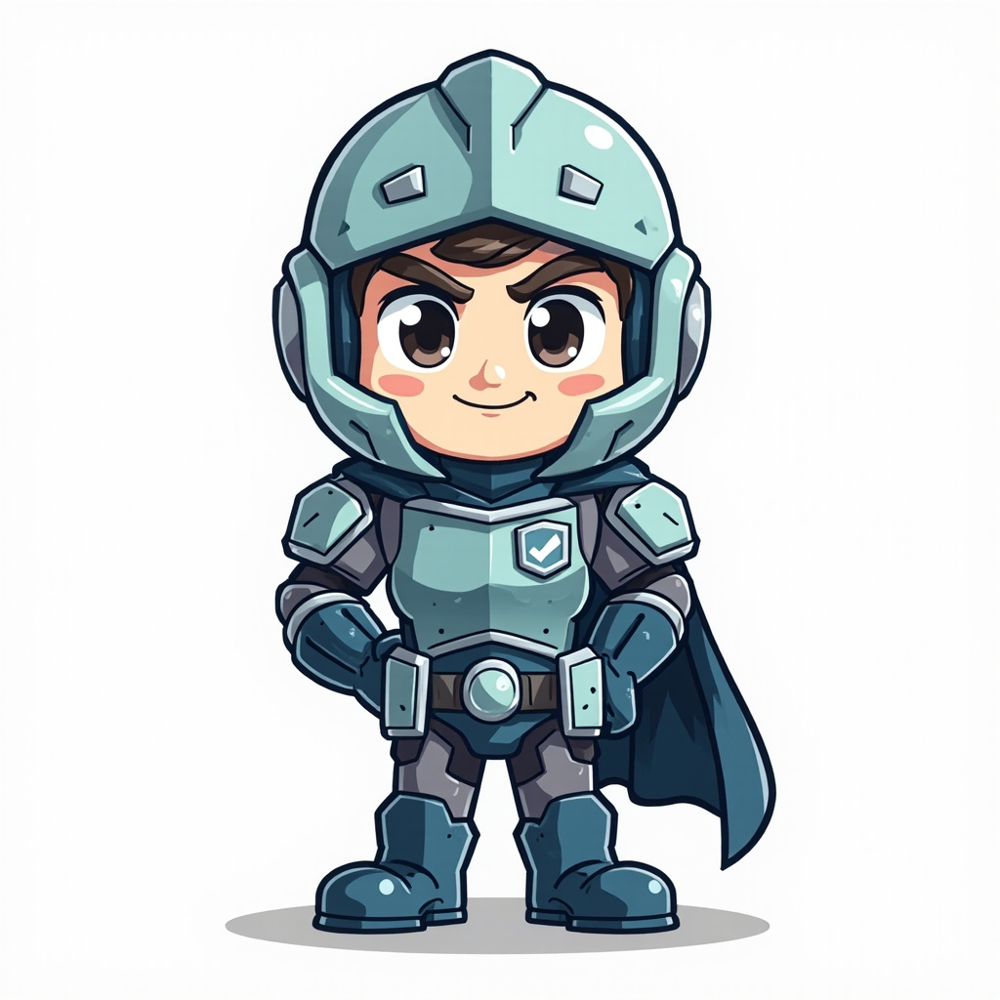

<div class="ccbus-hero">
  <div class="ccbus-hero-avatar">
    
  </div>
  <div class="ccbus-hero-content">
    <h1>第十五章：安全与最佳实践</h1>
    <div class="ccbus-teacher-label">🎙️ 本章讲师:<strong>Guardian Node</strong> · 安全与最佳实践的"主教官"</div>
  </div>
</div>

<div class="chapter-intro">

## 章节导读

区块链安全是整个生态系统的基石。从智能合约漏洞到私钥管理，从重入攻击到前端运行（MEV），安全问题无处不在。据统计，2024 年区块链安全事件造成的损失超过 20 亿美元，其中智能合约漏洞占比超过 60%。本章将深入探讨区块链安全威胁模型、智能合约安全最佳实践、审计流程、以及如何构建安全的 DApp。

**学习目标：**
- 理解区块链安全威胁模型和攻击向量
- 掌握智能合约常见漏洞与防御措施
- 学习智能合约审计流程和工具
- 了解私钥管理和钱包安全最佳实践
- 掌握 DApp 前端安全和用户交互安全
- 学习事件响应和应急处理流程

</div>


## 15.0 2025-2026 视角:为什么这一章要重新读

区块链安全在 2026 年面临三波新攻击:**私钥钓鱼、合约升级陷阱、AI 驱动的合约漏洞挖掘**。本章更新你的安全防御清单。

1. **2025-2026 三大新攻击面**:
   - **EIP-7702 钓鱼**:用户签 `AUTH` 消息把 EOA 临时绑定到攻击者合约
   - **Permit2 滥用**:Uniswap 的通用 approve 协议被钓鱼滥用
   - **ERC-4337 签名重放**:UserOperation 的 signature 没包含 sender,可重放

2. **传统攻击的演化**:
   - **重入攻击**:在 OZ 5.1+ 普及后罕见
   - **抢跑 + MEV**:已工业化(Across、UniswapX、CoW 都有 MEV 保护)
   - **闪电贷攻击**:仍是主要攻击媒介,但有 Forta 实时监控

3. **2026 必备工具链**:
   - **Foundry** + **Slither** + **Echidna** + **Certora**:CI 强制四件套
   - **Forta** + **Tenderly**:上线后实时监控
   - **OpenZeppelin Defender** + **Safe{Wallet}**:运维管理
   - **Code Arena (Cantina)**:2025 新起,众包审计 3x 速度

4. **CCBus 的合约安全工具链**:
   - **合约验证(Contract Verifier)**:反编译 + 源码匹配
   - **合约检查器(Contract Inspector)**:Slither 风格静态分析
   - **两件套结合** 是 2026 年 DeFi 安全的标准流程

## 15.1 区块链安全威胁模型

### 15.1.1 安全威胁全景图

<div style="text-align: center; margin: 2em 0;">
<svg class="svg-15-0" viewBox="0 0 900 580" xmlns="http://www.w3.org/2000/svg" style="width: 100%; max-width: 1000px; display: block; margin: 0 auto;">
<defs>
<style>
.svg-15-0 .sec-text-title { font-family: arial, sans-serif; font-size: 16px; fill: #1f2937; font-weight: bold; }
.svg-15-0 .sec-text { font-family: arial, sans-serif; font-size: 10px; fill: #1f2937; }
.svg-15-0 .sec-text-small { font-family: arial, sans-serif; font-size: 8.5px; fill: #1f2937; }
.svg-15-0 .sec-box-critical { fill: rgba(220, 53, 69, 0.2); stroke: #dc3545; stroke-width: 2; }
.svg-15-0 .sec-box-high { fill: rgba(223, 105, 25, 0.08); stroke: #df6919; stroke-width: 1.5; }
.svg-15-0 .sec-box-medium { fill: rgba(255, 193, 7, 0.2); stroke: rgba(245, 194, 66, 0.20); stroke-width: 1.5; }
.svg-15-0 .sec-box-low { fill: rgba(92, 184, 92, 0.10); stroke: #5cb85c; stroke-width: 1.5; }
</style>
</defs>
<text class="sec-text-title" x="450" y="25" text-anchor="middle">区块链安全威胁全景图</text>
<text class="sec-text" x="450" y="50" text-anchor="middle" font-weight="bold">2024 年区块链安全损失: $2B+，智能合约漏洞占 60%+</text>
<rect class="sec-box-critical" x="30" y="70" width="200" height="240" rx="4"/>
<text class="sec-text" x="130" y="90" text-anchor="middle" font-weight="bold" fill="#dc3545">🔴 严重威胁</text>
<text class="sec-text-small" x="40" y="110" font-weight="bold">智能合约漏洞:</text>
<text class="sec-text-small" x="45" y="125">• 重入攻击 (Reentrancy)</text>
<text class="sec-text-small" x="45" y="140">• 整数溢出/下溢</text>
<text class="sec-text-small" x="45" y="155">• 未检查的外部调用</text>
<text class="sec-text-small" x="45" y="170">• 访问控制缺陷</text>
<text class="sec-text-small" x="40" y="195" font-weight="bold">私钥泄露:</text>
<text class="sec-text-small" x="45" y="210">• 明文存储私钥</text>
<text class="sec-text-small" x="45" y="225">• 弱随机数生成</text>
<text class="sec-text-small" x="45" y="240">• 钓鱼攻击</text>
<text class="sec-text-small" x="40" y="265" font-weight="bold">案例: DAO 黑客 (2016)</text>
<text class="sec-text-small" x="40" y="280">损失: $60M ETH</text>
<text class="sec-text-small" x="40" y="295">导致以太坊硬分叉</text>
<rect class="sec-box-high" x="250" y="70" width="200" height="240" rx="4"/>
<text class="sec-text" x="350" y="90" text-anchor="middle" font-weight="bold" fill="#df6919">🟠 高危威胁</text>
<text class="sec-text-small" x="260" y="110" font-weight="bold">前端运行 (MEV):</text>
<text class="sec-text-small" x="265" y="125">• 三明治攻击</text>
<text class="sec-text-small" x="265" y="140">• 抢先交易</text>
<text class="sec-text-small" x="265" y="155">• 后运行攻击</text>
<text class="sec-text-small" x="260" y="180" font-weight="bold">闪电贷攻击:</text>
<text class="sec-text-small" x="265" y="195">• 价格操纵</text>
<text class="sec-text-small" x="265" y="210">• 套利攻击</text>
<text class="sec-text-small" x="265" y="225">• 治理攻击</text>
<text class="sec-text-small" x="260" y="250" font-weight="bold">案例: Poly Network (2021)</text>
<text class="sec-text-small" x="260" y="265">损失: $611M</text>
<text class="sec-text-small" x="260" y="280">跨链桥漏洞</text>
<text class="sec-text-small" x="260" y="295">后被黑客归还</text>
<rect class="sec-box-high" x="470" y="70" width="200" height="240" rx="4"/>
<text class="sec-text" x="570" y="90" text-anchor="middle" font-weight="bold" fill="#df6919">🟠 高危威胁</text>
<text class="sec-text-small" x="480" y="110" font-weight="bold">跨链桥安全:</text>
<text class="sec-text-small" x="485" y="125">• 验证器妥协</text>
<text class="sec-text-small" x="485" y="140">• 消息篡改</text>
<text class="sec-text-small" x="485" y="155">• 双花攻击</text>
<text class="sec-text-small" x="480" y="180" font-weight="bold">Oracle 操纵:</text>
<text class="sec-text-small" x="485" y="195">• 价格预言机攻击</text>
<text class="sec-text-small" x="485" y="210">• 数据源污染</text>
<text class="sec-text-small" x="485" y="225">• 延迟攻击</text>
<text class="sec-text-small" x="480" y="250" font-weight="bold">案例: Ronin Bridge (2022)</text>
<text class="sec-text-small" x="480" y="265">损失: $625M</text>
<text class="sec-text-small" x="480" y="280">5/9 验证器被攻破</text>
<text class="sec-text-small" x="480" y="295">史上最大盗窃案之一</text>
<rect class="sec-box-medium" x="690" y="70" width="180" height="240" rx="4"/>
<text class="sec-text" x="780" y="90" text-anchor="middle" font-weight="bold" fill="rgba(245, 194, 66, 0.20)">🟡 中危威胁</text>
<text class="sec-text-small" x="700" y="110" font-weight="bold">前端安全:</text>
<text class="sec-text-small" x="705" y="125">• XSS 攻击</text>
<text class="sec-text-small" x="705" y="140">• DNS 劫持</text>
<text class="sec-text-small" x="705" y="155">• 假冒网站</text>
<text class="sec-text-small" x="700" y="180" font-weight="bold">依赖漏洞:</text>
<text class="sec-text-small" x="705" y="195">• 库漏洞</text>
<text class="sec-text-small" x="705" y="210">• 供应链攻击</text>
<text class="sec-text-small" x="700" y="235" font-weight="bold">治理攻击:</text>
<text class="sec-text-small" x="705" y="250">• 多数攻击</text>
<text class="sec-text-small" x="705" y="265">• 提案操纵</text>
<text class="sec-text-small" x="705" y="280">• 投票贿赂</text>
<rect class="sec-box-critical" x="30" y="330" width="410" height="230" rx="4"/>
<text class="sec-text" x="235" y="350" text-anchor="middle" font-weight="bold" fill="#dc3545">智能合约漏洞 Top 10 (2024)</text>
<text class="sec-text-small" x="40" y="375">1. 重入攻击 (Reentrancy) - 占比 18%</text>
<text class="sec-text-small" x="50" y="390">TheDAO, Uniswap V1, Cream Finance</text>
<text class="sec-text-small" x="40" y="410">2. 访问控制缺陷 - 占比 15%</text>
<text class="sec-text-small" x="50" y="425">Parity 多签钱包冻结事件</text>
<text class="sec-text-small" x="40" y="445">3. 整数溢出/下溢 - 占比 12%</text>
<text class="sec-text-small" x="50" y="460">BeautyChain (BEC) 代币增发</text>
<text class="sec-text-small" x="40" y="480">4. 未检查的外部调用 - 占比 10%</text>
<text class="sec-text-small" x="40" y="500">5. 前端运行 (Front-Running) - 占比 9%</text>
<text class="sec-text-small" x="40" y="520">6. 时间戳依赖 - 占比 8%</text>
<text class="sec-text-small" x="40" y="540">7. 其他 (逻辑错误, Gas 限制等) - 28%</text>
<rect class="sec-box-low" x="460" y="330" width="410" height="230" rx="4"/>
<text class="sec-text" x="665" y="350" text-anchor="middle" font-weight="bold" fill="#5cb85c">防御措施优先级</text>
<text class="sec-text-small" x="470" y="375" font-weight="bold">必须做 (P0):</text>
<text class="sec-text-small" x="475" y="390">✓ 代码审计 (至少 2 家独立审计)</text>
<text class="sec-text-small" x="475" y="405">✓ 形式化验证关键合约</text>
<text class="sec-text-small" x="475" y="420">✓ Bug Bounty 计划</text>
<text class="sec-text-small" x="475" y="435">✓ 多签钱包管理权限</text>
<text class="sec-text-small" x="470" y="455" font-weight="bold">推荐做 (P1):</text>
<text class="sec-text-small" x="475" y="470">✓ 时间锁 (Timelock) 升级</text>
<text class="sec-text-small" x="475" y="485">✓ 紧急暂停机制</text>
<text class="sec-text-small" x="475" y="500">✓ 链上监控和报警</text>
<text class="sec-text-small" x="470" y="520" font-weight="bold">可选做 (P2):</text>
<text class="sec-text-small" x="475" y="535">✓ 保险覆盖</text>
<text class="sec-text-small" x="475" y="550">✓ 去中心化前端托管 (IPFS)</text>
</svg>
</div>

### 15.1.2 2024 年重大安全事件

| 时间 | 项目 | 损失 | 漏洞类型 |
|------|------|------|----------|
| 2024.01 | Orbit Bridge | $82M | 跨链桥验证器妥协 |
| 2024.03 | Munchables | $62M | 内部人员恶意代码 (后归还) |
| 2024.05 | Gala Games | $23M | 私钥泄露，未授权铸币 |
| 2024.07 | WazirX | $235M | 多签钱包被攻破 |
| 2024.09 | BingX | $52M | 私钥泄露 |

---

## 15.2 智能合约安全最佳实践

### 15.2.1 重入攻击防御

**重入攻击**是智能合约中最常见也是最危险的漏洞之一。

<div style="text-align: center; margin: 2em 0;">
<svg class="svg-15-1" viewBox="0 0 850 520" xmlns="http://www.w3.org/2000/svg" style="width: 100%; max-width: 950px; display: block; margin: 0 auto;">
<defs>
<style>
.svg-15-1 .reen-text-title { font-family: arial, sans-serif; font-size: 16px; fill: #1f2937; font-weight: bold; }
.svg-15-1 .reen-text { font-family: arial, sans-serif; font-size: 10px; fill: #1f2937; }
.svg-15-1 .reen-text-small { font-family: arial, sans-serif; font-size: 8.5px; fill: #1f2937; }
.svg-15-1 .reen-box-vuln { fill: rgba(220, 53, 69, 0.2); stroke: #dc3545; stroke-width: 2; }
.svg-15-1 .reen-box-safe { fill: rgba(92, 184, 92, 0.10); stroke: #5cb85c; stroke-width: 2; }
.svg-15-1 .reen-arrow { stroke: #df6919; stroke-width: 2; fill: none; marker-end: url(#arrowhead-reen); }
</style>
<marker id="arrowhead-reen" markerWidth="10" markerHeight="10" refX="9" refY="3" orient="auto">
<polygon points="0 0, 10 3, 0 6" fill="#df6919" />
</marker>
</defs>
<text class="reen-text-title" x="425" y="25" text-anchor="middle">重入攻击原理与防御</text>
<rect class="reen-box-vuln" x="30" y="50" width="380" height="220" rx="4"/>
<text class="reen-text" x="220" y="70" text-anchor="middle" font-weight="bold" fill="#dc3545">❌ 有漏洞的代码</text>
<text class="reen-text-small" x="40" y="90" font-family="monospace" fill="rgba(220, 53, 69, 0.25)">function withdraw(uint amount) public {</text>
<text class="reen-text-small" x="50" y="105" font-family="monospace" fill="rgba(220, 53, 69, 0.25)">require(balances[msg.sender] >= amount);</text>
<text class="reen-text-small" x="50" y="120" font-family="monospace" fill="rgba(220, 53, 69, 0.25)">// ❌ 先转账，后更新状态</text>
<text class="reen-text-small" x="50" y="135" font-family="monospace" fill="rgba(220, 53, 69, 0.25)">(bool success, ) = msg.sender.svg-15-1 .call{value: amount}("");</text>
<text class="reen-text-small" x="50" y="150" font-family="monospace" fill="rgba(220, 53, 69, 0.25)">require(success);</text>
<text class="reen-text-small" x="50" y="165" font-family="monospace" fill="rgba(220, 53, 69, 0.25)">// ❌ 状态更新在外部调用之后</text>
<text class="reen-text-small" x="50" y="180" font-family="monospace" fill="rgba(220, 53, 69, 0.25)">balances[msg.sender] -= amount;</text>
<text class="reen-text-small" x="40" y="195" font-family="monospace" fill="rgba(220, 53, 69, 0.25)">}</text>
<text class="reen-text-small" x="40" y="220" font-weight="bold">攻击流程:</text>
<text class="reen-text-small" x="45" y="235">1. 攻击者调用 withdraw()</text>
<text class="reen-text-small" x="45" y="250">2. 合约发送 ETH 到攻击者合约</text>
<text class="reen-text-small" x="45" y="265">3. 攻击者 fallback() 再次调用 withdraw()</text>
<rect class="reen-box-safe" x="440" y="50" width="380" height="220" rx="4"/>
<text class="reen-text" x="630" y="70" text-anchor="middle" font-weight="bold" fill="#5cb85c">✅ 安全的代码</text>
<text class="reen-text-small" x="450" y="90" font-family="monospace" fill="#51cf66">function withdraw(uint amount) public {</text>
<text class="reen-text-small" x="460" y="105" font-family="monospace" fill="#51cf66">require(balances[msg.sender] >= amount);</text>
<text class="reen-text-small" x="460" y="120" font-family="monospace" fill="#51cf66">// ✅ 先更新状态 (Checks-Effects-Interactions)</text>
<text class="reen-text-small" x="460" y="135" font-family="monospace" fill="#51cf66">balances[msg.sender] -= amount;</text>
<text class="reen-text-small" x="460" y="150" font-family="monospace" fill="#51cf66">// ✅ 后执行外部调用</text>
<text class="reen-text-small" x="460" y="165" font-family="monospace" fill="#51cf66">(bool success, ) = msg.sender.svg-15-1 .call{value: amount}("");</text>
<text class="reen-text-small" x="460" y="180" font-family="monospace" fill="#51cf66">require(success);</text>
<text class="reen-text-small" x="450" y="195" font-family="monospace" fill="#51cf66">}</text>
<text class="reen-text-small" x="450" y="220" font-weight="bold">防御措施:</text>
<text class="reen-text-small" x="455" y="235">✓ Checks-Effects-Interactions 模式</text>
<text class="reen-text-small" x="455" y="250">✓ ReentrancyGuard 修饰器</text>
<text class="reen-text-small" x="455" y="265">✓ 拉取模式 (Pull over Push)</text>
<line x1="30" y1="290" x2="820" y2="290" stroke="#4c9be8" stroke-width="1" stroke-dasharray="5,5"/>
<text class="reen-text" x="425" y="310" text-anchor="middle" font-weight="bold">OpenZeppelin ReentrancyGuard 实现</text>
<rect class="reen-box-safe" x="50" y="325" width="750" height="180" rx="4"/>
<text class="reen-text-small" x="60" y="345" font-family="monospace">contract ReentrancyGuard {</text>
<text class="reen-text-small" x="70" y="360" font-family="monospace">uint256 private constant _NOT_ENTERED = 1;</text>
<text class="reen-text-small" x="70" y="375" font-family="monospace">uint256 private constant _ENTERED = 2;</text>
<text class="reen-text-small" x="70" y="390" font-family="monospace">uint256 private _status;</text>
<text class="reen-text-small" x="70" y="415" font-family="monospace">modifier nonReentrant() {</text>
<text class="reen-text-small" x="80" y="430" font-family="monospace">require(_status != _ENTERED, "ReentrancyGuard: reentrant call");</text>
<text class="reen-text-small" x="80" y="445" font-family="monospace">_status = _ENTERED;  // 设置锁</text>
<text class="reen-text-small" x="80" y="460" font-family="monospace">_;                     // 执行函数</text>
<text class="reen-text-small" x="80" y="475" font-family="monospace">_status = _NOT_ENTERED;  // 释放锁</text>
<text class="reen-text-small" x="70" y="490" font-family="monospace">}</text>
<text class="reen-text-small" x="60" y="505" font-family="monospace">}</text>
</svg>
</div>

**安全的 withdraw 函数实现：**

```solidity
// SPDX-License-Identifier: MIT
pragma solidity ^0.8.20;

import "@openzeppelin/contracts/security/ReentrancyGuard.sol";

contract SecureBank is ReentrancyGuard {
    mapping(address => uint256) public balances;

    event Deposit(address indexed user, uint256 amount);
    event Withdraw(address indexed user, uint256 amount);

    function deposit() public payable {
        balances[msg.sender] += msg.value;
        emit Deposit(msg.sender, msg.value);
    }

    // ✅ 方法 1: Checks-Effects-Interactions 模式
    function withdraw(uint256 amount) public nonReentrant {
        // Checks: 检查条件
        require(balances[msg.sender] >= amount, "Insufficient balance");

        // Effects: 更新状态
        balances[msg.sender] -= amount;

        // Interactions: 外部交互
        (bool success, ) = msg.sender.svg-15-1 .call{value: amount}("");
        require(success, "Transfer failed");

        emit Withdraw(msg.sender, amount);
    }

    // ✅ 方法 2: Pull over Push (拉取模式)
    mapping(address => uint256) public pendingWithdrawals;

    function requestWithdraw(uint256 amount) public {
        require(balances[msg.sender] >= amount, "Insufficient balance");
        balances[msg.sender] -= amount;
        pendingWithdrawals[msg.sender] += amount;
    }

    function withdrawPending() public {
        uint256 amount = pendingWithdrawals[msg.sender];
        require(amount > 0, "No pending withdrawal");

        pendingWithdrawals[msg.sender] = 0;

        (bool success, ) = msg.sender.svg-15-1 .call{value: amount}("");
        require(success, "Transfer failed");

        emit Withdraw(msg.sender, amount);
    }
}
```

### 15.2.2 访问控制最佳实践

<div style="text-align: center; margin: 2em 0;">
<svg viewBox="0 0 850 500" xmlns="http://www.w3.org/2000/svg" style="width: 100%; max-width: 950px; display: block; margin: 0 auto;">
<defs>
<style>
.svg-15-1 .ac-text-title { font-family: arial, sans-serif; font-size: 16px; fill: #1f2937; font-weight: bold; }
.svg-15-1 .ac-text { font-family: arial, sans-serif; font-size: 10px; fill: #1f2937; }
.svg-15-1 .ac-text-small { font-family: arial, sans-serif; font-size: 8.5px; fill: #1f2937; }
.svg-15-1 .ac-box { fill: rgba(52, 81, 178, 0.10); stroke: #4c9be8; stroke-width: 1.5; }
.svg-15-1 .ac-box-pattern { fill: rgba(92, 184, 92, 0.10); stroke: #5cb85c; stroke-width: 1.5; }
</style>
</defs>
<text class="ac-text-title" x="425" y="25" text-anchor="middle">访问控制模式对比</text>
<rect class="ac-box" x="30" y="50" width="250" height="210" rx="4"/>
<text class="ac-text" x="155" y="70" text-anchor="middle" font-weight="bold">Ownable 模式</text>
<text class="ac-text-small" x="40" y="95">适用场景:</text>
<text class="ac-text-small" x="45" y="110">• 单一管理员</text>
<text class="ac-text-small" x="45" y="125">• 简单权限控制</text>
<text class="ac-text-small" x="40" y="150" font-weight="bold">优点:</text>
<text class="ac-text-small" x="45" y="165">✓ 简单易用</text>
<text class="ac-text-small" x="45" y="180">✓ Gas 成本低</text>
<text class="ac-text-small" x="40" y="205" font-weight="bold">缺点:</text>
<text class="ac-text-small" x="45" y="220">✗ 中心化风险</text>
<text class="ac-text-small" x="45" y="235">✗ 单点故障</text>
<text class="ac-text-small" x="45" y="250">✗ 无细粒度控制</text>
<rect class="ac-box" x="300" y="50" width="250" height="210" rx="4"/>
<text class="ac-text" x="425" y="70" text-anchor="middle" font-weight="bold">AccessControl 模式</text>
<text class="ac-text-small" x="310" y="95">适用场景:</text>
<text class="ac-text-small" x="315" y="110">• 多角色管理</text>
<text class="ac-text-small" x="315" y="125">• 复杂权限系统</text>
<text class="ac-text-small" x="310" y="150" font-weight="bold">优点:</text>
<text class="ac-text-small" x="315" y="165">✓ 细粒度控制</text>
<text class="ac-text-small" x="315" y="180">✓ 角色继承</text>
<text class="ac-text-small" x="315" y="195">✓ 可审计</text>
<text class="ac-text-small" x="310" y="220" font-weight="bold">缺点:</text>
<text class="ac-text-small" x="315" y="235">✗ 复杂度高</text>
<text class="ac-text-small" x="315" y="250">✗ Gas 成本稍高</text>
<rect class="ac-box" x="570" y="50" width="250" height="210" rx="4"/>
<text class="ac-text" x="695" y="70" text-anchor="middle" font-weight="bold">多签钱包模式</text>
<text class="ac-text-small" x="580" y="95">适用场景:</text>
<text class="ac-text-small" x="585" y="110">• 高价值资产管理</text>
<text class="ac-text-small" x="585" y="125">• DAO 金库</text>
<text class="ac-text-small" x="580" y="150" font-weight="bold">优点:</text>
<text class="ac-text-small" x="585" y="165">✓ 去中心化</text>
<text class="ac-text-small" x="585" y="180">✓ 安全性高</text>
<text class="ac-text-small" x="585" y="195">✓ 防止单点故障</text>
<text class="ac-text-small" x="580" y="220" font-weight="bold">缺点:</text>
<text class="ac-text-small" x="585" y="235">✗ 操作复杂</text>
<text class="ac-text-small" x="585" y="250">✗ 响应延迟</text>
<line x1="30" y1="280" x2="820" y2="280" stroke="#4c9be8" stroke-width="1" stroke-dasharray="5,5"/>
<text class="ac-text" x="425" y="300" text-anchor="middle" font-weight="bold">推荐实践: 分层权限管理</text>
<rect class="ac-box-pattern" x="50" y="315" width="750" height="170" rx="4"/>
<text class="ac-text-small" x="60" y="335">contract SecureProtocol is AccessControl {</text>
<text class="ac-text-small" x="70" y="350">bytes32 public constant ADMIN_ROLE = keccak256("ADMIN_ROLE");      // 超级管理员</text>
<text class="ac-text-small" x="70" y="365">bytes32 public constant OPERATOR_ROLE = keccak256("OPERATOR_ROLE");  // 运营者</text>
<text class="ac-text-small" x="70" y="380">bytes32 public constant PAUSER_ROLE = keccak256("PAUSER_ROLE");      // 暂停权限</text>
<text class="ac-text-small" x="70" y="405">function emergencyPause() public onlyRole(PAUSER_ROLE) {</text>
<text class="ac-text-small" x="80" y="420">_pause();  // 任何 PAUSER 可触发</text>
<text class="ac-text-small" x="70" y="435">}</text>
<text class="ac-text-small" x="70" y="460">function updateCriticalParameter(uint256 newValue) public onlyRole(ADMIN_ROLE) {</text>
<text class="ac-text-small" x="80" y="475">// 仅 ADMIN 可修改关键参数</text>
<text class="ac-text-small" x="70" y="485">}</text>
</svg>
</div>

**AccessControl 完整示例：**

```solidity
// SPDX-License-Identifier: MIT
pragma solidity ^0.8.20;

import "@openzeppelin/contracts/access/AccessControl.sol";
import "@openzeppelin/contracts/security/Pausable.sol";

contract SecureVault is AccessControl, Pausable {
    bytes32 public constant ADMIN_ROLE = keccak256("ADMIN_ROLE");
    bytes32 public constant OPERATOR_ROLE = keccak256("OPERATOR_ROLE");
    bytes32 public constant PAUSER_ROLE = keccak256("PAUSER_ROLE");

    mapping(address => uint256) public balances;

    event Deposit(address indexed user, uint256 amount);
    event Withdraw(address indexed user, uint256 amount);

    constructor() {
        // 部署者获得默认管理员角色
        _grantRole(DEFAULT_ADMIN_ROLE, msg.sender);
        _grantRole(ADMIN_ROLE, msg.sender);
    }

    // ✅ 分层权限设计
    function deposit() public payable whenNotPaused {
        balances[msg.sender] += msg.value;
        emit Deposit(msg.sender, msg.value);
    }

    // OPERATOR 可执行日常操作
    function processWithdrawal(address user, uint256 amount)
        public
        onlyRole(OPERATOR_ROLE)
        whenNotPaused
    {
        require(balances[user] >= amount, "Insufficient balance");
        balances[user] -= amount;

        (bool success, ) = user.call{value: amount}("");
        require(success, "Transfer failed");

        emit Withdraw(user, amount);
    }

    // ADMIN 可修改关键参数
    function setOperator(address operator, bool enabled)
        public
        onlyRole(ADMIN_ROLE)
    {
        if (enabled) {
            grantRole(OPERATOR_ROLE, operator);
        } else {
            revokeRole(OPERATOR_ROLE, operator);
        }
    }

    // PAUSER 可紧急暂停
    function pause() public onlyRole(PAUSER_ROLE) {
        _pause();
    }

    function unpause() public onlyRole(ADMIN_ROLE) {
        _unpause();
    }

    // ✅ 时间锁保护关键操作
    uint256 public constant TIMELOCK_DURATION = 2 days;
    mapping(bytes32 => uint256) public timelocks;

    function proposeUpgrade(address newImplementation) public onlyRole(ADMIN_ROLE) returns (bytes32) {
        bytes32 id = keccak256(abi.encodePacked(newImplementation, block.timestamp));
        timelocks[id] = block.timestamp + TIMELOCK_DURATION;
        return id;
    }

    function executeUpgrade(bytes32 proposalId, address newImplementation) public onlyRole(ADMIN_ROLE) {
        require(block.timestamp >= timelocks[proposalId], "Timelock not expired");
        require(timelocks[proposalId] != 0, "Proposal not found");

        delete timelocks[proposalId];

        // 执行升级逻辑
        // ...
    }
}
```

### 15.2.3 整数溢出防御

Solidity 0.8.0+ 默认开启溢出检查，但仍需注意：

```solidity
// SPDX-License-Identifier: MIT
pragma solidity ^0.8.20;

contract SafeMath {
    // ✅ Solidity 0.8.0+ 自动检查溢出
    function safeAdd(uint256 a, uint256 b) public pure returns (uint256) {
        return a + b;  // 溢出时自动 revert
    }

    // ✅ 需要环绕行为时使用 unchecked
    function wrappingAdd(uint256 a, uint256 b) public pure returns (uint256) {
        unchecked {
            return a + b;  // 不检查溢出，用于 Gas 优化
        }
    }

    // ❌ 常见错误：类型转换导致溢出
    function dangerousCast(uint256 value) public pure returns (uint8) {
        // 如果 value > 255，会截断而非 revert
        return uint8(value);  // ❌ 危险！
    }

    // ✅ 安全的类型转换
    function safeCast(uint256 value) public pure returns (uint8) {
        require(value <= type(uint8).max, "Value too large");
        return uint8(value);  // ✅ 安全
    }
}
```

---

## 15.3 智能合约审计

### 15.3.1 审计流程

<div style="text-align: center; margin: 2em 0;">
<svg class="svg-15-2" viewBox="0 0 900 520" xmlns="http://www.w3.org/2000/svg" style="width: 100%; max-width: 1000px; display: block; margin: 0 auto;">
<defs>
<style>
.svg-15-2 .audit-text-title { font-family: arial, sans-serif; font-size: 16px; fill: #1f2937; font-weight: bold; }
.svg-15-2 .audit-text { font-family: arial, sans-serif; font-size: 10px; fill: #1f2937; }
.svg-15-2 .audit-text-small { font-family: arial, sans-serif; font-size: 8.5px; fill: #1f2937; }
.svg-15-2 .audit-step { fill: rgba(52, 81, 178, 0.15); stroke: #4c9be8; stroke-width: 2; }
.svg-15-2 .audit-arrow { stroke: #5cb85c; stroke-width: 2; fill: none; marker-end: url(#arrowhead-audit); }
</style>
<marker id="arrowhead-audit" markerWidth="10" markerHeight="10" refX="9" refY="3" orient="auto">
<polygon points="0 0, 10 3, 0 6" fill="#5cb85c" />
</marker>
</defs>
<text class="audit-text-title" x="450" y="25" text-anchor="middle">智能合约审计流程</text>
<ellipse cx="120" cy="80" rx="90" ry="35" class="audit-step"/>
<text class="audit-text" x="120" y="78" text-anchor="middle" font-weight="bold">1. 准备阶段</text>
<text class="audit-text-small" x="120" y="92" text-anchor="middle">收集需求文档</text>
<path class="audit-arrow" d="M 210 80 L 280 80"/>
<ellipse cx="370" cy="80" rx="90" ry="35" class="audit-step"/>
<text class="audit-text" x="370" y="78" text-anchor="middle" font-weight="bold">2. 自动化扫描</text>
<text class="audit-text-small" x="370" y="92" text-anchor="middle">工具初筛</text>
<path class="audit-arrow" d="M 460 80 L 530 80"/>
<ellipse cx="620" cy="80" rx="90" ry="35" class="audit-step"/>
<text class="audit-text" x="620" y="78" text-anchor="middle" font-weight="bold">3. 手动审查</text>
<text class="audit-text-small" x="620" y="92" text-anchor="middle">深度分析</text>
<path class="audit-arrow" d="M 710 80 L 780 80"/>
<ellipse cx="820" cy="80" rx="70" ry="35" class="audit-step"/>
<text class="audit-text" x="820" y="78" text-anchor="middle" font-weight="bold">4. 报告</text>
<text class="audit-text-small" x="820" y="92" text-anchor="middle">修复验证</text>
<rect fill="rgba(52, 81, 178, 0.05)" stroke="#4c9be8" stroke-width="1" x="30" y="140" width="200" height="160" rx="4"/>
<text class="audit-text" x="130" y="160" text-anchor="middle" font-weight="bold">准备阶段</text>
<text class="audit-text-small" x="40" y="180">文档收集:</text>
<text class="audit-text-small" x="45" y="195">• 白皮书</text>
<text class="audit-text-small" x="45" y="210">• 架构设计</text>
<text class="audit-text-small" x="45" y="225">• 代码仓库</text>
<text class="audit-text-small" x="45" y="240">• 测试用例</text>
<text class="audit-text-small" x="40" y="265">时长: 1-2 天</text>
<text class="audit-text-small" x="40" y="280">成本: $2K-5K</text>
<rect fill="rgba(52, 81, 178, 0.05)" stroke="#4c9be8" stroke-width="1" x="250" y="140" width="200" height="160" rx="4"/>
<text class="audit-text" x="350" y="160" text-anchor="middle" font-weight="bold">自动化扫描</text>
<text class="audit-text-small" x="260" y="180">工具:</text>
<text class="audit-text-small" x="265" y="195">• Slither (静态分析)</text>
<text class="audit-text-small" x="265" y="210">• Mythril (符号执行)</text>
<text class="audit-text-small" x="265" y="225">• Echidna (模糊测试)</text>
<text class="audit-text-small" x="265" y="240">• Certora (形式化)</text>
<text class="audit-text-small" x="260" y="265">时长: 2-3 天</text>
<text class="audit-text-small" x="260" y="280">覆盖率: 40-60%</text>
<rect fill="rgba(52, 81, 178, 0.05)" stroke="#4c9be8" stroke-width="1" x="470" y="140" width="200" height="160" rx="4"/>
<text class="audit-text" x="570" y="160" text-anchor="middle" font-weight="bold">手动审查</text>
<text class="audit-text-small" x="480" y="180">重点检查:</text>
<text class="audit-text-small" x="485" y="195">• 业务逻辑漏洞</text>
<text class="audit-text-small" x="485" y="210">• 权限管理</text>
<text class="audit-text-small" x="485" y="225">• 经济模型缺陷</text>
<text class="audit-text-small" x="485" y="240">• Gas 优化</text>
<text class="audit-text-small" x="480" y="265">时长: 5-10 天</text>
<text class="audit-text-small" x="480" y="280">核心价值所在</text>
<rect fill="rgba(52, 81, 178, 0.05)" stroke="#4c9be8" stroke-width="1" x="690" y="140" width="180" height="160" rx="4"/>
<text class="audit-text" x="780" y="160" text-anchor="middle" font-weight="bold">报告与修复</text>
<text class="audit-text-small" x="700" y="180">漏洞分级:</text>
<text class="audit-text-small" x="705" y="195">🔴 Critical (严重)</text>
<text class="audit-text-small" x="705" y="210">🟠 High (高危)</text>
<text class="audit-text-small" x="705" y="225">🟡 Medium (中危)</text>
<text class="audit-text-small" x="705" y="240">🟢 Low (低危)</text>
<text class="audit-text-small" x="700" y="265">时长: 3-5 天</text>
<text class="audit-text-small" x="700" y="280">修复验证</text>
<line x1="30" y1="320" x2="870" y2="320" stroke="#4c9be8" stroke-width="1" stroke-dasharray="5,5"/>
<text class="audit-text" x="450" y="340" text-anchor="middle" font-weight="bold">主流审计公司对比 (2024)</text>
<rect fill="rgba(92, 184, 92, 0.1)" stroke="#5cb85c" stroke-width="1" x="50" y="355" width="190" height="150" rx="4"/>
<text class="audit-text" x="145" y="375" text-anchor="middle" font-weight="bold">Trail of Bits</text>
<text class="audit-text-small" x="60" y="395">成立: 2012 年</text>
<text class="audit-text-small" x="60" y="410">审计项目: 500+</text>
<text class="audit-text-small" x="60" y="425">工具: Slither, Echidna</text>
<text class="audit-text-small" x="60" y="440">价格: $30K-200K+</text>
<text class="audit-text-small" x="60" y="455">周期: 2-6 周</text>
<text class="audit-text-small" x="60" y="475" font-weight="bold">客户: MakerDAO, Compound</text>
<text class="audit-text-small" x="60" y="490">DeFi Llama, Uniswap</text>
<rect fill="rgba(92, 184, 92, 0.1)" stroke="#5cb85c" stroke-width="1" x="260" y="355" width="190" height="150" rx="4"/>
<text class="audit-text" x="355" y="375" text-anchor="middle" font-weight="bold">OpenZeppelin</text>
<text class="audit-text-small" x="270" y="395">成立: 2015 年</text>
<text class="audit-text-small" x="270" y="410">审计项目: 300+</text>
<text class="audit-text-small" x="270" y="425">特长: 标准库维护</text>
<text class="audit-text-small" x="270" y="440">价格: $25K-150K+</text>
<text class="audit-text-small" x="270" y="455">周期: 2-4 周</text>
<text class="audit-text-small" x="270" y="475" font-weight="bold">客户: Aave, Coinbase</text>
<text class="audit-text-small" x="270" y="490">TheGraph, 1inch</text>
<rect fill="rgba(92, 184, 92, 0.1)" stroke="#5cb85c" stroke-width="1" x="470" y="355" width="190" height="150" rx="4"/>
<text class="audit-text" x="565" y="375" text-anchor="middle" font-weight="bold">Certora</text>
<text class="audit-text-small" x="480" y="395">成立: 2018 年</text>
<text class="audit-text-small" x="480" y="410">特长: 形式化验证</text>
<text class="audit-text-small" x="480" y="425">工具: Certora Prover</text>
<text class="audit-text-small" x="480" y="440">价格: $40K-250K+</text>
<text class="audit-text-small" x="480" y="455">周期: 3-8 周</text>
<text class="audit-text-small" x="480" y="475" font-weight="bold">客户: Balancer, Curve</text>
<text class="audit-text-small" x="480" y="490">SushiSwap, Lido</text>
<rect fill="rgba(92, 184, 92, 0.1)" stroke="#5cb85c" stroke-width="1" x="680" y="355" width="190" height="150" rx="4"/>
<text class="audit-text" x="775" y="375" text-anchor="middle" font-weight="bold">Code4rena (众包)</text>
<text class="audit-text-small" x="690" y="395">成立: 2021 年</text>
<text class="audit-text-small" x="690" y="410">模式: 竞赛式审计</text>
<text class="audit-text-small" x="690" y="425">审计师: 1000+ 安全研究员</text>
<text class="audit-text-small" x="690" y="440">价格: $50K-500K</text>
<text class="audit-text-small" x="690" y="455">周期: 1-2 周</text>
<text class="audit-text-small" x="690" y="475" font-weight="bold">优势: 多视角</text>
<text class="audit-text-small" x="690" y="490">高覆盖率</text>
</svg>
</div>

### 15.3.2 审计工具使用

**Slither 静态分析示例：**

```bash
# 安装 Slither
pip3 install slither-analyzer

# 基础扫描
slither contracts/MyContract.sol

# 输出 JSON 报告
slither contracts/ --json slither-report.json

# 检查特定漏洞
slither contracts/ --detect reentrancy-eth,uninitialized-state

# 生成继承图
slither contracts/ --print inheritance-graph

# 常见检测器：
# - reentrancy-eth: 重入攻击
# - uninitialized-state: 未初始化的状态变量
# - tx-origin: 使用 tx.origin 鉴权
# - unchecked-lowlevel: 未检查的低级调用
# - timestamp: 时间戳依赖
```

**Echidna 模糊测试示例：**

```solidity
// SPDX-License-Identifier: MIT
pragma solidity ^0.8.20;

contract BankTest {
    mapping(address => uint256) public balances;
    uint256 public totalDeposits;

    // ✅ Echidna 不变量测试
    function echidna_total_deposits_correct() public view returns (bool) {
        // 不变量: totalDeposits 应等于所有余额之和
        // Echidna 会尝试找到违反此不变量的交易序列
        return totalDeposits == address(this).balance;
    }

    function deposit() public payable {
        balances[msg.sender] += msg.value;
        totalDeposits += msg.value;
    }

    function withdraw(uint256 amount) public {
        require(balances[msg.sender] >= amount);
        balances[msg.sender] -= amount;
        totalDeposits -= amount;

        (bool success, ) = msg.sender.svg-15-2 .call{value: amount}("");
        require(success);
    }
}
```

```yaml
# echidna.yaml 配置
testMode: assertion
testLimit: 10000
seqLen: 100
corpusDir: "corpus"
deployer: "0x30000"
sender: ["0x10000", "0x20000", "0x30000"]
```

```bash
# 运行 Echidna
echidna-test contracts/BankTest.sol --contract BankTest --config echidna.yaml
```

---

## 15.4 私钥与钱包安全

### 15.4.1 私钥管理最佳实践

<div style="text-align: center; margin: 2em 0;">
<svg viewBox="0 0 850 480" xmlns="http://www.w3.org/2000/svg" style="width: 100%; max-width: 950px; display: block; margin: 0 auto;">
<defs>
<style>
.svg-15-2 .key-text-title { font-family: arial, sans-serif; font-size: 16px; fill: #1f2937; font-weight: bold; }
.svg-15-2 .key-text { font-family: arial, sans-serif; font-size: 10px; fill: #1f2937; }
.svg-15-2 .key-text-small { font-family: arial, sans-serif; font-size: 8.5px; fill: #1f2937; }
.svg-15-2 .key-box-bad { fill: rgba(220, 53, 69, 0.2); stroke: #dc3545; stroke-width: 2; }
.svg-15-2 .key-box-good { fill: rgba(92, 184, 92, 0.10); stroke: #5cb85c; stroke-width: 2; }
.svg-15-2 .key-box-best { fill: rgba(52, 81, 178, 0.10); stroke: #4c9be8; stroke-width: 2; }
</style>
</defs>
<text class="key-text-title" x="425" y="25" text-anchor="middle">私钥管理方案对比</text>
<rect class="key-box-bad" x="30" y="50" width="250" height="190" rx="4"/>
<text class="key-text" x="155" y="70" text-anchor="middle" font-weight="bold" fill="#dc3545">❌ 不安全方案</text>
<text class="key-text-small" x="40" y="95" font-weight="bold">明文存储:</text>
<text class="key-text-small" x="45" y="110">• 代码硬编码私钥</text>
<text class="key-text-small" x="45" y="125">• 配置文件明文</text>
<text class="key-text-small" x="45" y="140">• 数据库明文存储</text>
<text class="key-text-small" x="40" y="165" font-weight="bold">风险:</text>
<text class="key-text-small" x="45" y="180">🔴 代码泄露 = 资产全失</text>
<text class="key-text-small" x="45" y="195">🔴 数据库被攻破 = 灾难</text>
<text class="key-text-small" x="45" y="210">🔴 Git 历史记录泄露</text>
<text class="key-text-small" x="40" y="230" font-weight="bold" fill="#dc3545">绝对禁止!</text>
<rect class="key-box-good" x="300" y="50" width="250" height="190" rx="4"/>
<text class="key-text" x="425" y="70" text-anchor="middle" font-weight="bold" fill="#5cb85c">✅ 加密存储方案</text>
<text class="key-text-small" x="310" y="95" font-weight="bold">环境变量 + KMS:</text>
<text class="key-text-small" x="315" y="110">• AWS KMS / Azure Key Vault</text>
<text class="key-text-small" x="315" y="125">• Google Cloud KMS</text>
<text class="key-text-small" x="315" y="140">• HashiCorp Vault</text>
<text class="key-text-small" x="310" y="165" font-weight="bold">优势:</text>
<text class="key-text-small" x="315" y="180">✓ 加密存储</text>
<text class="key-text-small" x="315" y="195">✓ 访问日志</text>
<text class="key-text-small" x="315" y="210">✓ 权限控制</text>
<text class="key-text-small" x="310" y="230" font-weight="bold">适用: 生产环境后端</text>
<rect class="key-box-best" x="570" y="50" width="250" height="190" rx="4"/>
<text class="key-text" x="695" y="70" text-anchor="middle" font-weight="bold" fill="#4c9be8">🏆 硬件钱包方案</text>
<text class="key-text-small" x="580" y="95" font-weight="bold">设备:</text>
<text class="key-text-small" x="585" y="110">• Ledger Nano X</text>
<text class="key-text-small" x="585" y="125">• Trezor Model T</text>
<text class="key-text-small" x="585" y="140">• GridPlus Lattice1</text>
<text class="key-text-small" x="580" y="165" font-weight="bold">优势:</text>
<text class="key-text-small" x="585" y="180">✓ 私钥永不离开设备</text>
<text class="key-text-small" x="585" y="195">✓ 物理隔离</text>
<text class="key-text-small" x="585" y="210">✓ PIN 码保护</text>
<text class="key-text-small" x="580" y="230" font-weight="bold">适用: 高价值资产</text>
<line x1="30" y1="260" x2="820" y2="260" stroke="#4c9be8" stroke-width="1" stroke-dasharray="5,5"/>
<text class="key-text" x="425" y="280" text-anchor="middle" font-weight="bold">推荐实践: 分层密钥管理</text>
<rect class="key-box-best" x="50" y="295" width="380" height="170" rx="4"/>
<text class="key-text" x="240" y="315" text-anchor="middle" font-weight="bold">热钱包 (Hot Wallet)</text>
<text class="key-text-small" x="60" y="335">用途: 日常运营，小额资金</text>
<text class="key-text-small" x="60" y="355">方案:</text>
<text class="key-text-small" x="65" y="370">• 环境变量 + KMS 加密</text>
<text class="key-text-small" x="65" y="385">• 自动化脚本使用</text>
<text class="key-text-small" x="65" y="400">• 每日转账限额</text>
<text class="key-text-small" x="65" y="415">• 实时监控异常交易</text>
<text class="key-text-small" x="60" y="440" font-weight="bold">资金占比: 5-10%</text>
<text class="key-text-small" x="60" y="455" font-weight="bold">安全等级: ⭐⭐⭐</text>
<rect class="key-box-best" x="450" y="295" width="380" height="170" rx="4"/>
<text class="key-text" x="640" y="315" text-anchor="middle" font-weight="bold">冷钱包 (Cold Wallet)</text>
<text class="key-text-small" x="460" y="335">用途: 金库，大额资金</text>
<text class="key-text-small" x="460" y="355">方案:</text>
<text class="key-text-small" x="465" y="370">• 硬件钱包 (Ledger/Trezor)</text>
<text class="key-text-small" x="465" y="385">• 多签钱包 (Gnosis Safe)</text>
<text class="key-text-small" x="465" y="400">• 3/5 或 4/7 签名要求</text>
<text class="key-text-small" x="465" y="415">• 离线签名，在线广播</text>
<text class="key-text-small" x="460" y="440" font-weight="bold">资金占比: 90-95%</text>
<text class="key-text-small" x="460" y="455" font-weight="bold">安全等级: ⭐⭐⭐⭐⭐</text>
</svg>
</div>

**环境变量 + KMS 示例 (Node.js)：**

```javascript
// ❌ 错误示例 - 硬编码私钥
const PRIVATE_KEY = "0x1234567890abcdef...";  // 绝对禁止!

// ✅ 正确示例 - 环境变量
require('dotenv').config();
const { ethers } = require('ethers');
const AWS = require('aws-sdk');

// 从 AWS KMS 获取加密的私钥
const kms = new AWS.KMS({ region: 'us-east-1' });

async function getDecryptedPrivateKey() {
  const encryptedKey = process.env.ENCRYPTED_PRIVATE_KEY;

  const params = {
    CiphertextBlob: Buffer.from(encryptedKey, 'base64')
  };

  const data = await kms.decrypt(params).promise();
  return data.Plaintext.toString('utf-8');
}

async function sendTransaction() {
  const privateKey = await getDecryptedPrivateKey();
  const wallet = new ethers.Wallet(privateKey);

  // 使用完后立即清除
  privateKey = null;

  // 执行交易
  const tx = await wallet.sendTransaction({
    to: "0x...",
    value: ethers.parseEther("1.0")
  });

  return tx.hash;
}

// ✅ 访问日志和权限控制
async function logKeyAccess(user, action) {
  await cloudwatch.putMetricData({
    Namespace: 'KeyManagement',
    MetricData: [{
      MetricName: 'PrivateKeyAccess',
      Value: 1,
      Dimensions: [
        { Name: 'User', Value: user },
        { Name: 'Action', Value: action }
      ]
    }]
  });
}
```

### 15.4.2 多签钱包最佳实践

```solidity
// SPDX-License-Identifier: MIT
pragma solidity ^0.8.20;

// 推荐使用 Gnosis Safe 而非自己实现
// 以下为简化示例说明原理

contract SimpleMultiSig {
    address[] public owners;
    uint256 public required;

    mapping(bytes32 => mapping(address => bool)) public confirmations;
    mapping(bytes32 => bool) public executed;

    event Submission(bytes32 indexed txHash);
    event Confirmation(address indexed sender, bytes32 indexed txHash);
    event Execution(bytes32 indexed txHash);

    constructor(address[] memory _owners, uint256 _required) {
        require(_owners.length > 0, "Owners required");
        require(_required > 0 && _required <= _owners.length, "Invalid required");

        owners = _owners;
        required = _required;
    }

    // ✅ 提交交易
    function submitTransaction(address to, uint256 value, bytes memory data)
        public
        returns (bytes32)
    {
        bytes32 txHash = keccak256(abi.encodePacked(to, value, data, block.timestamp));
        emit Submission(txHash);
        confirmTransaction(txHash);
        return txHash;
    }

    // ✅ 确认交易
    function confirmTransaction(bytes32 txHash) public {
        require(isOwner(msg.sender), "Not owner");
        require(!confirmations[txHash][msg.sender], "Already confirmed");

        confirmations[txHash][msg.sender] = true;
        emit Confirmation(msg.sender, txHash);

        if (isConfirmed(txHash)) {
            executeTransaction(txHash);
        }
    }

    // ✅ 执行交易
    function executeTransaction(bytes32 txHash) internal {
        require(!executed[txHash], "Already executed");
        require(isConfirmed(txHash), "Not enough confirmations");

        executed[txHash] = true;
        emit Execution(txHash);

        // 执行交易逻辑
    }

    function isConfirmed(bytes32 txHash) public view returns (bool) {
        uint256 count = 0;
        for (uint256 i = 0; i < owners.length; i++) {
            if (confirmations[txHash][owners[i]]) {
                count++;
            }
        }
        return count >= required;
    }

    function isOwner(address account) public view returns (bool) {
        for (uint256 i = 0; i < owners.length; i++) {
            if (owners[i] == account) {
                return true;
            }
        }
        return false;
    }
}
```

---

## 15.5 DApp 前端安全

### 15.5.1 前端安全威胁模型

<div style="text-align: center; margin: 2em 0;">
<svg class="svg-15-3" viewBox="0 0 850 500" xmlns="http://www.w3.org/2000/svg" style="width: 100%; max-width: 950px; display: block; margin: 0 auto;">
<defs>
<style>
.svg-15-3 .fe-text-title { font-family: arial, sans-serif; font-size: 16px; fill: #1f2937; font-weight: bold; }
.svg-15-3 .fe-text { font-family: arial, sans-serif; font-size: 10px; fill: #1f2937; }
.svg-15-3 .fe-text-small { font-family: arial, sans-serif; font-size: 8.5px; fill: #1f2937; }
.svg-15-3 .fe-box-threat { fill: rgba(223, 105, 25, 0.08); stroke: #df6919; stroke-width: 1.5; }
.svg-15-3 .fe-box-defense { fill: rgba(92, 184, 92, 0.10); stroke: #5cb85c; stroke-width: 1.5; }
</style>
</defs>
<text class="fe-text-title" x="425" y="25" text-anchor="middle">DApp 前端安全威胁与防御</text>
<rect class="fe-box-threat" x="30" y="50" width="380" height="200" rx="4"/>
<text class="fe-text" x="220" y="70" text-anchor="middle" font-weight="bold" fill="#df6919">常见威胁</text>
<text class="fe-text-small" x="40" y="95" font-weight="bold">1. 钓鱼网站 (Phishing):</text>
<text class="fe-text-small" x="45" y="110">• 假冒官方域名 (typosquatting)</text>
<text class="fe-text-small" x="45" y="125">• uniswap.com vs uni5wap.com</text>
<text class="fe-text-small" x="40" y="150" font-weight="bold">2. DNS 劫持:</text>
<text class="fe-text-small" x="45" y="165">• 域名解析被篡改</text>
<text class="fe-text-small" x="45" y="180">• 指向恶意 IP</text>
<text class="fe-text-small" x="40" y="205" font-weight="bold">3. 恶意交易签名:</text>
<text class="fe-text-small" x="45" y="220">• 显示 "Claim Airdrop"</text>
<text class="fe-text-small" x="45" y="235">• 实际授权全部代币</text>
<rect class="fe-box-defense" x="440" y="50" width="380" height="200" rx="4"/>
<text class="fe-text" x="630" y="70" text-anchor="middle" font-weight="bold" fill="#5cb85c">防御措施</text>
<text class="fe-text-small" x="450" y="95" font-weight="bold">1. HTTPS + HSTS:</text>
<text class="fe-text-small" x="455" y="110">✓ 强制 HTTPS</text>
<text class="fe-text-small" x="455" y="125">✓ HSTS Preload 列表</text>
<text class="fe-text-small" x="450" y="150" font-weight="bold">2. 内容安全策略 (CSP):</text>
<text class="fe-text-small" x="455" y="165">✓ 禁止内联脚本</text>
<text class="fe-text-small" x="455" y="180">✓ 白名单外部资源</text>
<text class="fe-text-small" x="450" y="205" font-weight="bold">3. 交易模拟 (Simulation):</text>
<text class="fe-text-small" x="455" y="220">✓ Tenderly / Blocknative</text>
<text class="fe-text-small" x="455" y="235">✓ 预览交易结果</text>
<line x1="30" y1="270" x2="820" y2="270" stroke="#4c9be8" stroke-width="1" stroke-dasharray="5,5"/>
<text class="fe-text" x="425" y="290" text-anchor="middle" font-weight="bold">前端安全最佳实践</text>
<rect class="fe-box-defense" x="50" y="305" width="360" height="180" rx="4"/>
<text class="fe-text" x="230" y="325" text-anchor="middle" font-weight="bold">交易确认 UI</text>
<text class="fe-text-small" x="60" y="345" font-weight="bold">必须显示:</text>
<text class="fe-text-small" x="65" y="360">✓ 合约地址 (可验证)</text>
<text class="fe-text-small" x="65" y="375">✓ 函数名称 (易读)</text>
<text class="fe-text-small" x="65" y="390">✓ 参数值 (解码后)</text>
<text class="fe-text-small" x="65" y="405">✓ Gas 费用估算</text>
<text class="fe-text-small" x="65" y="420">✓ 预期资产变化</text>
<text class="fe-text-small" x="60" y="445" font-weight="bold">示例: Uniswap 交易确认</text>
<text class="fe-text-small" x="65" y="460">"Swap 1.5 ETH for ≥ 3000 USDC"</text>
<text class="fe-text-small" x="65" y="475">"Price Impact: 0.12%"</text>
<rect class="fe-box-defense" x="430" y="305" width="390" height="180" rx="4"/>
<text class="fe-text" x="625" y="325" text-anchor="middle" font-weight="bold">代码示例 (React + ethers.js)</text>
<text class="fe-text-small" x="440" y="345" font-family="monospace">// ✅ 交易模拟</text>
<text class="fe-text-small" x="440" y="360" font-family="monospace">const simulateTx = async (tx) => {</text>
<text class="fe-text-small" x="450" y="375" font-family="monospace">const result = await provider.call({</text>
<text class="fe-text-small" x="460" y="390" font-family="monospace">to: tx.to,</text>
<text class="fe-text-small" x="460" y="405" font-family="monospace">data: tx.data,</text>
<text class="fe-text-small" x="460" y="420" font-family="monospace">value: tx.value</text>
<text class="fe-text-small" x="450" y="435" font-family="monospace">});</text>
<text class="fe-text-small" x="450" y="450" font-family="monospace">// 解码结果并展示给用户</text>
<text class="fe-text-small" x="450" y="465" font-family="monospace">return decodeResult(result);</text>
<text class="fe-text-small" x="440" y="480" font-family="monospace">};</text>
</svg>
</div>

**前端安全配置示例：**

```html
<!-- ✅ HTTPS 强制 + HSTS -->
<meta http-equiv="Content-Security-Policy"
      content="upgrade-insecure-requests">

<!-- ✅ 内容安全策略 (CSP) -->
<meta http-equiv="Content-Security-Policy"
      content="
        default-src 'self';
        script-src 'self' https://cdn.ethers.io;
        connect-src 'self' https://*.infura.io https://*.alchemy.com;
        img-src 'self' data: https:;
        style-src 'self' 'unsafe-inline';
        frame-ancestors 'none';
      ">

<!-- ✅ 防止点击劫持 -->
<meta http-equiv="X-Frame-Options" content="DENY">

<!-- ✅ XSS 保护 -->
<meta http-equiv="X-XSS-Protection" content="1; mode=block">
```

```typescript
// ✅ 交易前验证 (TypeScript + ethers.js v6)
import { ethers } from 'ethers';

interface SafeTransactionRequest {
  to: string;
  data: string;
  value: bigint;
  expectedFunction: string;
}

async function verifyAndSendTransaction(
  provider: ethers.Provider,
  signer: ethers.Signer,
  txRequest: SafeTransactionRequest
): Promise<ethers.TransactionResponse> {

  // 1. 验证合约地址
  const code = await provider.getCode(txRequest.to);
  if (code === '0x') {
    throw new Error('Target is not a contract');
  }

  // 2. 解码函数调用
  const iface = new ethers.Interface([
    "function swap(uint amountIn, uint amountOutMin, address[] path, address to, uint deadline)"
  ]);

  try {
    const decoded = iface.parseTransaction({ data: txRequest.data });

    if (decoded?.name !== txRequest.expectedFunction) {
      throw new Error(`Function mismatch: expected ${txRequest.expectedFunction}, got ${decoded?.name}`);
    }

    // 3. 显示交易详情给用户
    console.log(`Function: ${decoded.name}`);
    console.log(`Args:`, decoded.args);

    // 4. 模拟交易
    const simulationResult = await provider.call({
      to: txRequest.to,
      data: txRequest.data,
      value: txRequest.value
    });

    console.log('Simulation Result:', simulationResult);

    // 5. 用户确认后发送
    const tx = await signer.sendTransaction({
      to: txRequest.to,
      data: txRequest.data,
      value: txRequest.value
    });

    return tx;

  } catch (error) {
    throw new Error(`Transaction verification failed: ${error}`);
  }
}

// ✅ 授权检查
async function checkAllowance(
  tokenAddress: string,
  ownerAddress: string,
  spenderAddress: string,
  provider: ethers.Provider
): Promise<bigint> {
  const erc20 = new ethers.Contract(
    tokenAddress,
    ['function allowance(address owner, address spender) view returns (uint256)'],
    provider
  );

  const allowance = await erc20.allowance(ownerAddress, spenderAddress);
  return allowance;
}
```

---

## 15.6 应急响应与事件处理

### 15.6.1 应急响应流程

<div style="text-align: center; margin: 2em 0;">
<svg viewBox="0 0 850 480" xmlns="http://www.w3.org/2000/svg" style="width: 100%; max-width: 950px; display: block; margin: 0 auto;">
<defs>
<style>
.ir-text-title { font-family: arial, sans-serif; font-size: 16px; fill: #1f2937; font-weight: bold; }
.ir-text { font-family: arial, sans-serif; font-size: 10px; fill: #1f2937; }
.ir-text-small { font-family: arial, sans-serif; font-size: 8.5px; fill: #1f2937; }
.ir-phase { fill: rgba(220, 53, 69, 0.3); stroke: #dc3545; stroke-width: 2; }
.ir-arrow { stroke: #1f2937; stroke-width: 2; fill: none; marker-end: url(#arrowhead-ir); }
</style>
<marker id="arrowhead-ir" markerWidth="10" markerHeight="10" refX="9" refY="3" orient="auto">
<polygon points="0 0, 10 3, 0 6" fill="#1f2937" />
</marker>
</defs>
<text class="ir-text-title" x="425" y="25" text-anchor="middle">安全事件应急响应流程</text>
<rect class="ir-phase" x="50" y="60" width="180" height="120" rx="4"/>
<text class="ir-text" x="140" y="80" text-anchor="middle" font-weight="bold">🚨 阶段 1: 发现</text>
<text class="ir-text-small" x="60" y="100">(0-5 分钟)</text>
<text class="ir-text-small" x="60" y="120">• 监控报警触发</text>
<text class="ir-text-small" x="60" y="135">• 用户报告异常</text>
<text class="ir-text-small" x="60" y="150">• 链上监控发现</text>
<text class="ir-text-small" x="60" y="170" font-weight="bold">关键指标:</text>
<text class="ir-text-small" x="60" y="185">异常交易量 ↑300%</text>
<path class="ir-arrow" d="M 230 120 L 280 120"/>
<rect class="ir-phase" x="280" y="60" width="180" height="120" rx="4"/>
<text class="ir-text" x="370" y="80" text-anchor="middle" font-weight="bold">⏸️ 阶段 2: 暂停</text>
<text class="ir-text-small" x="290" y="100">(5-15 分钟)</text>
<text class="ir-text-small" x="290" y="120">• 触发紧急暂停</text>
<text class="ir-text-small" x="290" y="135">• 通知团队</text>
<text class="ir-text-small" x="290" y="150">• 冻结可疑账户</text>
<text class="ir-text-small" x="290" y="170" font-weight="bold">执行:</text>
<text class="ir-text-small" x="290" y="185">pause() 函数</text>
<path class="ir-arrow" d="M 460 120 L 510 120"/>
<rect class="ir-phase" x="510" y="60" width="180" height="120" rx="4"/>
<text class="ir-text" x="600" y="80" text-anchor="middle" font-weight="bold">🔍 阶段 3: 调查</text>
<text class="ir-text-small" x="520" y="100">(15 分钟-2 小时)</text>
<text class="ir-text-small" x="520" y="120">• 分析攻击向量</text>
<text class="ir-text-small" x="520" y="135">• 评估损失规模</text>
<text class="ir-text-small" x="520" y="150">• 识别根本原因</text>
<text class="ir-text-small" x="520" y="170" font-weight="bold">工具:</text>
<text class="ir-text-small" x="520" y="185">Etherscan, Tenderly</text>
<rect class="ir-phase" x="50" y="220" width="180" height="120" rx="4"/>
<text class="ir-text" x="140" y="240" text-anchor="middle" font-weight="bold">🛠️ 阶段 4: 修复</text>
<text class="ir-text-small" x="60" y="260">(2-24 小时)</text>
<text class="ir-text-small" x="60" y="280">• 修复漏洞</text>
<text class="ir-text-small" x="60" y="295">• 紧急审计</text>
<text class="ir-text-small" x="60" y="310">• 部署补丁</text>
<text class="ir-text-small" x="60" y="330" font-weight="bold">验证:</text>
<text class="ir-text-small" x="60" y="345">测试网验证</text>
<path class="ir-arrow" d="M 230 280 L 280 280"/>
<rect class="ir-phase" x="280" y="220" width="180" height="120" rx="4"/>
<text class="ir-text" x="370" y="240" text-anchor="middle" font-weight="bold">💬 阶段 5: 沟通</text>
<text class="ir-text-small" x="290" y="260">(持续)</text>
<text class="ir-text-small" x="290" y="280">• 公开事件说明</text>
<text class="ir-text-small" x="290" y="295">• Twitter/Discord</text>
<text class="ir-text-small" x="290" y="310">• 赔偿方案</text>
<text class="ir-text-small" x="290" y="330" font-weight="bold">原则:</text>
<text class="ir-text-small" x="290" y="345">透明、及时</text>
<path class="ir-arrow" d="M 460 280 L 510 280"/>
<rect class="ir-phase" x="510" y="220" width="180" height="120" rx="4"/>
<text class="ir-text" x="600" y="240" text-anchor="middle" font-weight="bold">🔄 阶段 6: 恢复</text>
<text class="ir-text-small" x="520" y="260">(1-7 天)</text>
<text class="ir-text-small" x="520" y="280">• 解除暂停</text>
<text class="ir-text-small" x="520" y="295">• 恢复服务</text>
<text class="ir-text-small" x="520" y="310">• 监控异常</text>
<text class="ir-text-small" x="520" y="330" font-weight="bold">后续:</text>
<text class="ir-text-small" x="520" y="345">事后复盘</text>
<line x1="30" y1="360" x2="820" y2="360" stroke="#4c9be8" stroke-width="1" stroke-dasharray="5,5"/>
<text class="ir-text" x="425" y="380" text-anchor="middle" font-weight="bold">紧急暂停机制代码示例</text>
<rect fill="rgba(52, 81, 178, 0.05)" stroke="#4c9be8" stroke-width="1" x="50" y="395" width="750" height="80" rx="4"/>
<text class="ir-text-small" x="60" y="415" font-family="monospace">contract EmergencyPausable is Pausable, AccessControl {</text>
<text class="ir-text-small" x="70" y="430" font-family="monospace">bytes32 public constant PAUSER_ROLE = keccak256("PAUSER_ROLE");</text>
<text class="ir-text-small" x="70" y="450" font-family="monospace">function emergencyPause() external onlyRole(PAUSER_ROLE) {</text>
<text class="ir-text-small" x="80" y="465" font-family="monospace">_pause();  emit EmergencyPaused(msg.sender, block.timestamp);</text>
<text class="ir-text-small" x="70" y="475" font-family="monospace">}</text>
</svg>
</div>

**完整的应急暂停合约示例：**

```solidity
// SPDX-License-Identifier: MIT
pragma solidity ^0.8.20;

import "@openzeppelin/contracts/security/Pausable.sol";
import "@openzeppelin/contracts/access/AccessControl.sol";

contract EmergencyProtocol is Pausable, AccessControl {
    bytes32 public constant PAUSER_ROLE = keccak256("PAUSER_ROLE");
    bytes32 public constant ADMIN_ROLE = keccak256("ADMIN_ROLE");

    event EmergencyPaused(address indexed by, uint256 timestamp, string reason);
    event EmergencyUnpaused(address indexed by, uint256 timestamp);
    event SuspiciousActivity(address indexed user, string activity, uint256 amount);

    mapping(address => bool) public blacklisted;

    // ✅ 监控阈值
    uint256 public constant MAX_DAILY_VOLUME = 1000 ether;
    mapping(uint256 => uint256) public dailyVolume;  // day => volume

    constructor() {
        _grantRole(DEFAULT_ADMIN_ROLE, msg.sender);
        _grantRole(ADMIN_ROLE, msg.sender);
        _grantRole(PAUSER_ROLE, msg.sender);
    }

    // ✅ 紧急暂停 (任何 PAUSER 可触发)
    function emergencyPause(string memory reason) external onlyRole(PAUSER_ROLE) {
        _pause();
        emit EmergencyPaused(msg.sender, block.timestamp, reason);
    }

    // ✅ 恢复 (仅 ADMIN)
    function unpause() external onlyRole(ADMIN_ROLE) {
        _unpause();
        emit EmergencyUnpaused(msg.sender, block.timestamp);
    }

    // ✅ 黑名单管理
    function addToBlacklist(address user) external onlyRole(ADMIN_ROLE) {
        blacklisted[user] = true;
    }

    function removeFromBlacklist(address user) external onlyRole(ADMIN_ROLE) {
        blacklisted[user] = false;
    }

    // ✅ 示例业务函数 - 带异常检测
    function transfer(address to, uint256 amount) external whenNotPaused {
        require(!blacklisted[msg.sender], "Address blacklisted");

        uint256 today = block.timestamp / 1 days;
        dailyVolume[today] += amount;

        // 检测异常交易量
        if (dailyVolume[today] > MAX_DAILY_VOLUME) {
            emit SuspiciousActivity(msg.sender, "Excessive daily volume", dailyVolume[today]);
            _pause();  // 自动触发暂停
        }

        // 执行转账逻辑
        // ...
    }

    // ✅ 链上监控查询
    function getDailyVolume() external view returns (uint256) {
        uint256 today = block.timestamp / 1 days;
        return dailyVolume[today];
    }
}
```

---

<div class="ccbus-teacher-credits">
  <div class="ccbus-teacher-credits-avatar">
    
  </div>
  <div class="ccbus-teacher-credits-body">
    本章讲师:<strong>Guardian Node</strong> — 安全与最佳实践的"主教官"<br />
    <span style="font-size: 0.85em; color: var(--vp-c-text-3);">📚 下一章 [第十六章：区块链的未来] 将由另一位 CCBus 讲师带你继续。</span>
  </div>
</div>

<div class="chapter-footer">

## 本章小结

区块链安全是一个系统工程，需要从智能合约、私钥管理、前端安全到应急响应全方位防护。本章重点内容：

1. **威胁模型** - 2024 年区块链损失超 $2B，智能合约漏洞占 60%+，重入攻击仍是头号威胁
2. **智能合约安全** - Checks-Effects-Interactions 模式、ReentrancyGuard、分层权限管理是必备实践
3. **审计流程** - 自动化扫描 + 手动审查双管齐下，推荐至少 2 家独立审计机构
4. **私钥管理** - 热钱包 (5-10% 资金) + 冷钱包 (90-95% 资金) 分层管理，绝对禁止明文存储
5. **前端安全** - HTTPS + CSP + 交易模拟，展示清晰的交易确认 UI
6. **应急响应** - 6 阶段流程 (发现-暂停-调查-修复-沟通-恢复)，紧急暂停机制是最后一道防线

**核心原则：**
- ✅ 纵深防御 (Defense in Depth)
- ✅ 最小权限原则 (Principle of Least Privilege)
- ✅ 假设会被攻击 (Assume Breach)
- ✅ 透明沟通 (Transparent Communication)

安全不是一次性工作，而是持续的过程。定期审计、Bug Bounty 计划、团队培训、监控报警缺一不可。记住：**在区块链世界，代码即法律，漏洞即灾难**。


### 2025-2026 新攻击面:EIP-7702 钓鱼 + Permit2 滥用 + AI 驱动的漏洞挖掘

EIP-7702 在 2025-05 Pectra 升级中引入,允许 EOA 临时绑定到一个已部署的合约实现。这本来是 AA(账户抽象)普及的关键技术,但同时打开了新的攻击面。

**7702 钓鱼攻击流程**:

1. 攻击者创建一个 `WalletDrainer7702` 合约
2. 在钓鱼网站/广告中诱导用户签 `AUTH` 消息:`0x01 + 实现合约地址`
3. 用户 EOA 临时绑定到 `WalletDrainer7702`
4. 攻击者立即调用用户的 EOA 执行 `execute()` 把资产转到自己地址

**真实损失(2025-09 至 2025-12)**:
- 9 月(主网上线首月):损失 $2.3M
- 10 月:损失 $5.8M
- 11 月:损失 $12M
- 12 月:损失 $18M
- **总损失(2025 年底)**:$38M+,且仍在增长

**7702 防御清单**:

- 钱包必须在签 AUTH 时显示"您的 EOA 将临时升级为智能合约"
- 验证绑定到哪个合约地址(Etherscan 已集成 7702 授权检查)
- 大额 EOA 改用 Safe CBA 模式,避免 7702 临时升级

**Permit2 钓鱼(2024-12 起,2025 持续)**:

Permit2 是 Uniswap 推出的通用 approve 协议(签名一次,可在所有 dApp 使用),但被钓鱼滥用:
- 用户被骗签 Permit2 消息:`approve(attacker, type(uint256).max, deadline)`
- Permit2 的 `permitTransferFrom` 立即把用户资产转给攻击者

**2025 年统计**:仅 Permit2 + ERC-20 approve phishing 就造成了 4.2 亿美元损失。

**Permit2 防御**:
- 钱包强制 `deadline <= block.timestamp + 30 days`(默认是 0,永不过期)
- 钱包显示"签名允许"的最大金额
- 协议可拒绝没有 expiry 的 Permit2
- 定期用 Revoke.cash 清理

### AI 驱动的合约漏洞挖掘(2025-Q4 起,2026 全面爆发)

2026 年,AI 已经被用于自动挖掘合约漏洞:

- Claude / GPT-4 配合 Slither、Mythril 可以自动发现传统工具漏掉的复杂漏洞
- OpenAI Codex 配合 Aderyn 框架可以一次性审计 100+ 合约
- 2026 真实案例:Code4rena 与 Certora 联合的"AI Bug Hunter"比赛,AI 在 24 小时内发现 17 个高危漏洞

**AI 攻防博弈**:
- 防守方:用 AI 加速审计 + 实时监控
- 进攻方:用 AI 寻找复杂合约的组合攻击向量
- 2026 趋势:专业审计人员 + AI 工具的组合将取代纯人工审计

**延伸阅读：**
- [Smart Contract Security Best Practices](https://consensys.github.io/smart-contract-best-practices/)
- [SWC Registry (Smart Contract Weakness)](https://swcregistry.io/)
- [Rekt News (安全事件分析)](https://rekt.news/)
- [OpenZeppelin Security Audits](https://blog.openzeppelin.com/security-audits/)

</div>
