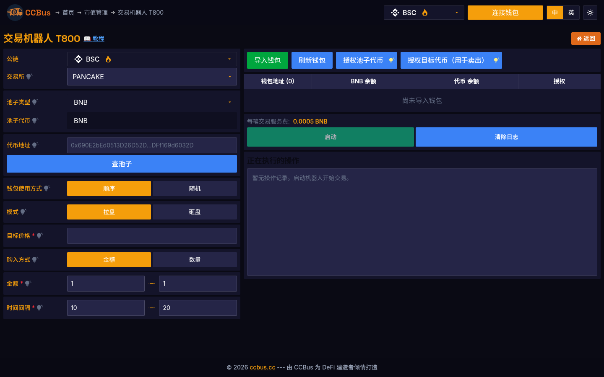

<div class="ccbus-hero">
  <div class="ccbus-hero-avatar">
    
  </div>
  <div class="ccbus-hero-content">
    <h1>第十六章：区块链的未来</h1>
    <div class="ccbus-teacher-label">🎙️ 本章讲师:<strong>Captain CCBus</strong> · 带你展望未来的"末班车司机"</div>
  </div>
</div>

## 16.0 2025-2026 视角:为什么这一章要重新读

区块链的下一个十年将由四个力量塑造:**AI 代理经济、意图与求解器、RWA 主流化、量子抗性**。本章用具体项目 + 真实数据展望 2026-2030。

1. **AI 代理经济(2024-2026 起,2026 主流化)**:
   - **ai16z DAO(2024-Q4)**:Eliza 框架,16 亿美元规模
   - **Virtuals Protocol(2024-Q4)**:AI 代理可以发起 DAO 提案
   - **Aethernet(2025-Q1)**:AI 代理成为链上选民
   - **Zerebro(2024-Q4)**:AI 自主发行代币
   - **Truth Terminal(2024-Q4)**:AI 操纵 meme 币 GOAT 市值破 13 亿
   - **2026 数据**:链上 AI 代理管理的资产 80 亿美元+
   - **2030 预测**:AI 代理管理资产将占 链上 10%+,代币由 AI 发行

2. **意图 + 求解器(2024-2026 主流化)**:
   - **UniswapX、CoW Swap、1inch Fusion**:占 DEX 流量 40%+
   - **Across、deBridge DLN、Squid**:占跨链桥流量 60%+
   - **KIP Protocol**:AI 驱动的意图
   - **2030 预测**:意图式交易占链上 80%+

3. **RWA 主流化(2024-2026 起)**:
   - **BlackRock BUIDL**:5 亿美元
   - **Ondo Finance**:10 亿美元
   - **Maple Finance**:30 亿美元
   - **2030 预测**:RWA 链上总规模 $30T(国际清算银行预测)

4. **量子抗性(2024-2026 标准化)**:
   - **NIST FIPS 203/204/205**(2024-08 发布)
   - **2030 预测**:L1 集成 PQC 签名(ML-DSA 或 SLH-DSA),BTC 升级方案仍在讨论

5. **CCBus 的 T800/T1000 交易机器人**:
   - **AI 代理驱动的做市/套利 SaaS**
   - 任何人都可以订阅,无需编程
   - 把"AI + 区块链"从 PPT 概念变成 SaaS

## 16.1 技术演进路线图

区块链技术正处于快速演进阶段。从比特币的诞生（2009年）到以太坊的智能合约革命（2015年），再到当前的模块化区块链时代（2024-2025年），每个阶段都带来了质的飞跃。

<div style="background: rgba(52, 81, 178, 0.06); padding: 1.5em; border-radius: 8px; margin: 2em 0;">
<svg class="svg-16-0" viewBox="0 0 1000 600" xmlns="http://www.w3.org/2000/svg">
<defs>
<style>
.svg-16-0 .svg-16-0 .timeline-arrow { fill: none; stroke: #4c9be8; stroke-width: 3; }
.svg-16-0 .svg-16-0 .timeline-point { fill: #4c9be8; }
.svg-16-0 .svg-16-0 .timeline-box { fill: rgba(52, 81, 178, 0.07); stroke: #4c9be8; stroke-width: 2; }
.svg-16-0 .svg-16-0 .timeline-text { fill: #1f2937; font-family: Arial, sans-serif; font-size: 13px; }
.svg-16-0 .svg-16-0 .timeline-title { fill: #4c9be8; font-family: Arial, sans-serif; font-size: 14px; font-weight: bold; }
.svg-16-0 .svg-16-0 .timeline-year { fill: #df6919; font-family: Arial, sans-serif; font-size: 16px; font-weight: bold; }
.svg-16-0 .svg-16-0 .timeline-future { stroke-dasharray: 5,5; }
</style>
</defs>
<text x="500" y="30" text-anchor="middle" class="timeline-title" font-size="18px">区块链技术演进路线图 (2009-2030)</text>
<line x1="100" y1="300" x2="900" y2="300" class="timeline-arrow"/>
<polygon points="900,300 885,295 885,305" class="timeline-point"/>
<circle cx="150" cy="300" r="6" class="timeline-point"/>
<text x="150" y="280" text-anchor="middle" class="timeline-year">2009</text>
<rect x="100" y="140" width="100" height="120" rx="5" class="timeline-box"/>
<text x="150" y="160" text-anchor="middle" class="timeline-text" font-weight="bold">比特币</text>
<text x="150" y="180" text-anchor="middle" class="timeline-text" font-size="11px">PoW 共识</text>
<text x="150" y="195" text-anchor="middle" class="timeline-text" font-size="11px">去中心化账本</text>
<text x="150" y="210" text-anchor="middle" class="timeline-text" font-size="11px">7 TPS</text>
<text x="150" y="225" text-anchor="middle" class="timeline-text" font-size="11px">能耗高</text>
<text x="150" y="240" text-anchor="middle" class="timeline-text" font-size="11px">单一货币功能</text>
<line x1="150" y1="260" x2="150" y2="294" class="timeline-arrow" stroke-width="1"/>
<circle cx="280" cy="300" r="6" class="timeline-point"/>
<text x="280" y="280" text-anchor="middle" class="timeline-year">2015</text>
<rect x="230" y="140" width="100" height="120" rx="5" class="timeline-box"/>
<text x="280" y="160" text-anchor="middle" class="timeline-text" font-weight="bold">以太坊</text>
<text x="280" y="180" text-anchor="middle" class="timeline-text" font-size="11px">智能合约</text>
<text x="280" y="195" text-anchor="middle" class="timeline-text" font-size="11px">EVM</text>
<text x="280" y="210" text-anchor="middle" class="timeline-text" font-size="11px">15 TPS</text>
<text x="280" y="225" text-anchor="middle" class="timeline-text" font-size="11px">DeFi 爆发</text>
<text x="280" y="240" text-anchor="middle" class="timeline-text" font-size="11px">NFT 兴起</text>
<line x1="280" y1="260" x2="280" y2="294" class="timeline-arrow" stroke-width="1"/>
<circle cx="410" cy="300" r="6" class="timeline-point"/>
<text x="410" y="280" text-anchor="middle" class="timeline-year">2020</text>
<rect x="360" y="140" width="100" height="120" rx="5" class="timeline-box"/>
<text x="410" y="160" text-anchor="middle" class="timeline-text" font-weight="bold">Layer 2</text>
<text x="410" y="180" text-anchor="middle" class="timeline-text" font-size="11px">Rollup 技术</text>
<text x="410" y="195" text-anchor="middle" class="timeline-text" font-size="11px">2000+ TPS</text>
<text x="410" y="210" text-anchor="middle" class="timeline-text" font-size="11px">费用降低 90%</text>
<text x="410" y="225" text-anchor="middle" class="timeline-text" font-size="11px">Optimistic</text>
<text x="410" y="240" text-anchor="middle" class="timeline-text" font-size="11px">ZK Rollup</text>
<line x1="410" y1="260" x2="410" y2="294" class="timeline-arrow" stroke-width="1"/>
<circle cx="540" cy="300" r="6" class="timeline-point"/>
<text x="540" y="280" text-anchor="middle" class="timeline-year">2023</text>
<rect x="490" y="140" width="100" height="120" rx="5" class="timeline-box"/>
<text x="540" y="160" text-anchor="middle" class="timeline-text" font-weight="bold">PoS + 模块化</text>
<text x="540" y="180" text-anchor="middle" class="timeline-text" font-size="11px">以太坊 2.0</text>
<text x="540" y="195" text-anchor="middle" class="timeline-text" font-size="11px">能耗降低 99%</text>
<text x="540" y="210" text-anchor="middle" class="timeline-text" font-size="11px">Celestia DA</text>
<text x="540" y="225" text-anchor="middle" class="timeline-text" font-size="11px">模块化架构</text>
<text x="540" y="240" text-anchor="middle" class="timeline-text" font-size="11px">数据可用性层</text>
<line x1="540" y1="260" x2="540" y2="294" class="timeline-arrow" stroke-width="1"/>
<circle cx="670" cy="300" r="6" class="timeline-point"/>
<text x="670" y="280" text-anchor="middle" class="timeline-year">2025</text>
<rect x="620" y="330" width="100" height="120" rx="5" class="timeline-box"/>
<text x="670" y="350" text-anchor="middle" class="timeline-text" font-weight="bold">ZK 主流化</text>
<text x="670" y="370" text-anchor="middle" class="timeline-text" font-size="11px">zkEVM 成熟</text>
<text x="670" y="385" text-anchor="middle" class="timeline-text" font-size="11px">10000+ TPS</text>
<text x="670" y="400" text-anchor="middle" class="timeline-text" font-size="11px">隐私保护</text>
<text x="670" y="415" text-anchor="middle" class="timeline-text" font-size="11px">链抽象</text>
<text x="670" y="430" text-anchor="middle" class="timeline-text" font-size="11px">意图为中心</text>
<line x1="670" y1="306" x2="670" y2="330" class="timeline-arrow" stroke-width="1"/>
<circle cx="800" cy="300" r="6" class="timeline-point" fill="#df6919"/>
<text x="800" y="280" text-anchor="middle" class="timeline-year" fill="#df6919">2028</text>
<rect x="750" y="330" width="100" height="120" rx="5" class="timeline-box timeline-future" stroke="#df6919"/>
<text x="800" y="350" text-anchor="middle" class="timeline-text" font-weight="bold">量子安全</text>
<text x="800" y="370" text-anchor="middle" class="timeline-text" font-size="11px">抗量子密码</text>
<text x="800" y="385" text-anchor="middle" class="timeline-text" font-size="11px">50000+ TPS</text>
<text x="800" y="400" text-anchor="middle" class="timeline-text" font-size="11px">AI + 区块链</text>
<text x="800" y="415" text-anchor="middle" class="timeline-text" font-size="11px">10亿+ 用户</text>
<text x="800" y="430" text-anchor="middle" class="timeline-text" font-size="11px">Web3 主流</text>
<line x1="800" y1="306" x2="800" y2="330" class="timeline-arrow timeline-future" stroke-width="1" stroke="#df6919"/>
<text x="900" y="320" text-anchor="end" class="timeline-text" font-size="12px" fill="#888">2030 →</text>
<rect x="50" y="480" width="200" height="80" rx="5" fill="rgba(52, 81, 178, 0.05)" stroke="#4c9be8" stroke-width="1"/>
<text x="150" y="505" text-anchor="middle" class="timeline-text" font-weight="bold">关键指标趋势</text>
<text x="60" y="525" class="timeline-text" font-size="11px">• TPS: 7 → 50,000+</text>
<text x="60" y="540" class="timeline-text" font-size="11px">• 能耗: 高 → 降低 99.9%</text>
<text x="60" y="555" class="timeline-text" font-size="11px">• 费用: $50 → $0.001</text>
<rect x="270" y="480" width="200" height="80" rx="5" fill="rgba(223, 105, 25, 0.05)" stroke="#df6919" stroke-width="1"/>
<text x="370" y="505" text-anchor="middle" class="timeline-text" font-weight="bold">技术突破</text>
<text x="280" y="525" class="timeline-text" font-size="11px">• 共识: PoW → PoS → PoL</text>
<text x="280" y="540" class="timeline-text" font-size="11px">• 扩展: 单链 → L2 → 模块化</text>
<text x="280" y="555" class="timeline-text" font-size="11px">• 隐私: 透明 → ZK → 默认隐私</text>
<rect x="490" y="480" width="200" height="80" rx="5" fill="rgba(92, 184, 92, 0.1)" stroke="#5cb85c" stroke-width="1"/>
<text x="590" y="505" text-anchor="middle" class="timeline-text" font-weight="bold">应用演进</text>
<text x="500" y="525" class="timeline-text" font-size="11px">• 货币 → DeFi → RWA</text>
<text x="500" y="540" class="timeline-text" font-size="11px">• NFT → 游戏 → 元宇宙</text>
<text x="500" y="555" class="timeline-text" font-size="11px">• DApp → AI Agent → Web3</text>
<rect x="710" y="480" width="200" height="80" rx="5" fill="rgba(217, 83, 79, 0.1)" stroke="#d9534f" stroke-width="1"/>
<text x="810" y="505" text-anchor="middle" class="timeline-text" font-weight="bold">未来方向</text>
<text x="720" y="525" class="timeline-text" font-size="11px">• 量子安全加密</text>
<text x="720" y="540" class="timeline-text" font-size="11px">• AI + 区块链深度融合</text>
<text x="720" y="555" class="timeline-text" font-size="11px">• 全球十亿级用户</text>
</svg>
</div>

### 16.1.1 第一代：比特币时代（2009-2015）

**核心特征**：
- **共识机制**：PoW（工作量证明）
- **性能**：~7 TPS
- **功能**：单一货币转账
- **能耗**：极高（年耗电量约 150 TWh，相当于阿根廷全国用电量）

**技术局限**：
- 扩展性差：区块大小限制 1MB
- 功能单一：仅支持简单脚本
- 能源浪费：PoW 挖矿需要大量算力

### 16.1.2 第二代：智能合约时代（2015-2020）

**以太坊革命**：
- **图灵完备**：支持任意复杂逻辑
- **EVM**：以太坊虚拟机成为行业标准
- **应用爆发**：DeFi、NFT、DAO

**性能瓶颈**：
- **TPS**：仅 15-30 TPS
- **费用**：Gas 费高峰期达 $50-200/笔
- **拥堵**：CryptoKitties（2017）导致网络瘫痪

### 16.1.3 第三代：Layer 2 扩展时代（2020-2023）

**Rollup 技术突破**：

```
Layer 1 (以太坊主网)
    ↓ 状态根
Layer 2 (Rollup)
    ├─ Optimistic Rollup (Arbitrum, Optimism)
    │   └─ 2000-4000 TPS，费用降低 10-100 倍
    └─ ZK Rollup (zkSync, StarkNet)
        └─ 证明时间短，安全性高
```

**关键数据（2023年）**：
- **Arbitrum TVL**：$15B+
- **Optimism TVL**：$8B+
- **费用对比**：
  - L1 Swap：$20-50
  - L2 Swap：$0.50-2

### 16.1.4 第四代：模块化区块链时代（2023-2025）

**模块化架构**：

将区块链功能解耦为四层：

1. **执行层（Execution）**：计算交易（Rollup）
2. **结算层（Settlement）**：验证证明（以太坊 L1）
3. **共识层（Consensus）**：排序交易（Tendermint）
4. **数据可用性层（DA）**：存储数据（Celestia）

**Celestia 数据可用性层**：
- **成本**：比以太坊 L1 便宜 99%
- **吞吐**：可扩展到 1GB/秒
- **灵活性**：任何链可使用

### 16.1.5 第五代：ZK 主流化时代（2025-2028）

**零知识证明技术成熟**：

当前（2025年）正在发生的变化：

1. **zkEVM 性能突破**：
   - Polygon zkEVM：兼容以太坊工具链
   - Scroll：字节码级兼容
   - Taiko：Type 1 zkEVM（完全等价）

2. **ZK 硬件加速**：
   - Cysic：专用 ZK ASIC 芯片
   - Ingonyama：GPU 加速器
   - 证明时间从分钟级降至秒级

3. **应用级 ZK**：
   - Aztec Network：隐私智能合约
   - Aleo：零知识应用平台
   - Mina Protocol：22KB 恒定大小区块链

**ZK 优势**：
- **隐私保护**：交易细节不公开
- **即时最终性**：无需 7 天挑战期
- **更高安全性**：数学证明 > 经济激励

### 16.1.6 第六代：量子安全时代（2028-2030）

**量子威胁**：

当前（2025年）量子计算进展：
- IBM Quantum：433 量子比特（2023年）
- Google Willow：105 量子比特，低错误率（2024年）
- 预计 2030 年：可破解现有公钥密码

**区块链应对方案**：

1. **抗量子密码算法**：
   - NIST 标准化（2024年）：
     - CRYSTALS-Kyber（密钥封装）
     - CRYSTALS-Dilithium（数字签名）
     - SPHINCS+（无状态签名）

2. **区块链实现**：
   - QRL (Quantum Resistant Ledger)：已上线抗量子链
   - Ethereum 升级路线：计划 2028-2030 年引入

**签名算法对比**：

| 算法 | 密钥大小 | 签名大小 | 安全性 |
|------|---------|---------|--------|
| ECDSA (当前) | 32 字节 | 64 字节 | ❌ 量子不安全 |
| Dilithium-3 | 1.9 KB | 3.3 KB | ✅ 量子安全 |
| SPHINCS+-256s | 64 字节 | 29 KB | ✅ 量子安全 |

## 16.2 扩展性突破

### 16.2.1 并行执行引擎

**Solana 并行处理**：

Solana 通过 Sealevel 运行时实现交易并行：

```rust
// Solana 交易声明依赖账户
pub struct Transaction {
    pub accounts: Vec<AccountMeta>,  // 明确声明读写账户
    pub instructions: Vec<Instruction>,
}

// 不冲突的交易可并行执行
Transaction { accounts: [Alice, Bob], ... }      // 可并行
Transaction { accounts: [Charlie, Dave], ... }   // 可并行

// 冲突的交易需串行
Transaction { accounts: [Alice, Bob], ... }      // 串行
Transaction { accounts: [Alice, Charlie], ... }  // 串行（Alice 冲突）
```

**性能数据**：
- 理论峰值：65,000 TPS
- 实际峰值：~4,000 TPS（2024年实测）

**新一代并行 EVM**：

**Monad**（预计 2025 年主网）：
- **MonadBFT**：1 秒出块，延迟 1 秒
- **延迟执行**：先排序，后并行执行
- **目标性能**：10,000 TPS（EVM 兼容）

**Sei v2**（2024 年升级）：
- **乐观并行化**：假设无冲突，冲突后回滚
- **SeiDB**：优化状态数据库
- **实测**：12,500 TPS（EVM 兼容）

### 16.2.2 数据可用性采样（DAS）

**问题**：如何让轻节点验证数据完整性，而无需下载全部数据？

**解决方案：纠删码 + 随机采样**

```
原始数据（1MB）
    ↓ 纠删码扩展（2倍）
扩展数据（2MB）= 原始（1MB）+ 冗余（1MB）
    ↓ 分块（4096 个块）
轻节点随机采样 30 个块
    ↓ 重建测试
如果能重建 → 数据可用 ✅
如果不能重建 → 数据不可用 ❌
```

**数学保证**：

采样 30 个块，恶意节点隐藏 >50% 数据的概率：

$$
P(\text{未检测}) < (0.5)^{30} < 10^{-9}
$$

**实现**：
- **Celestia**：使用 DAS，支持 1GB/秒数据
- **以太坊 Danksharding**：EIP-4844（2024年上线），完整 Danksharding 计划 2026-2027 年

### 16.2.3 Danksharding 路线图

<div style="background: rgba(52, 81, 178, 0.06); padding: 1.5em; border-radius: 8px; margin: 2em 0;">
<svg class="svg-16-1" viewBox="0 0 900 550" xmlns="http://www.w3.org/2000/svg">
<defs>
<style>
.svg-16-1 .svg-16-1 .dank-box { fill: rgba(52, 81, 178, 0.07); stroke: #4c9be8; stroke-width: 2; }
.svg-16-1 .svg-16-1 .dank-text { fill: #1f2937; font-family: Arial, sans-serif; font-size: 13px; }
.svg-16-1 .svg-16-1 .dank-title { fill: #4c9be8; font-family: Arial, sans-serif; font-size: 15px; font-weight: bold; }
.svg-16-1 .svg-16-1 .dank-arrow { fill: none; stroke: #4c9be8; stroke-width: 2; }
.svg-16-1 .svg-16-1 .dank-label { fill: #df6919; font-family: Arial, sans-serif; font-size: 12px; font-weight: bold; }
.svg-16-1 .svg-16-1 .dank-metric { fill: #5cb85c; font-family: Arial, sans-serif; font-size: 11px; }
</style>
</defs>
<text x="450" y="30" text-anchor="middle" class="dank-title" font-size="18px">以太坊 Danksharding 扩容路线图</text>
<rect x="50" y="80" width="200" height="140" rx="5" class="dank-box"/>
<text x="150" y="105" text-anchor="middle" class="dank-title">Phase 0: Calldata</text>
<text x="150" y="125" text-anchor="middle" class="dank-label">(2023 年前)</text>
<text x="60" y="145" class="dank-text" font-size="12px">• Rollup 数据存储在 calldata</text>
<text x="60" y="160" class="dank-text" font-size="12px">• 成本：~$0.50-2/笔</text>
<text x="60" y="175" class="dank-text" font-size="12px">• 每区块 ~100KB 数据</text>
<text x="60" y="190" class="dank-text" font-size="12px">• 永久存储</text>
<text x="60" y="205" class="dank-metric">吞吐: ~100 TPS (所有 L2)</text>
<line x1="250" y1="150" x2="290" y2="150" class="dank-arrow"/>
<polygon points="290,150 280,145 280,155" fill="#4c9be8"/>
<rect x="310" y="80" width="200" height="160" rx="5" class="dank-box" stroke="#5cb85c"/>
<text x="410" y="105" text-anchor="middle" class="dank-title">Phase 1: EIP-4844</text>
<text x="410" y="125" text-anchor="middle" class="dank-label">(2024 年已上线 ✅)</text>
<text x="320" y="145" class="dank-text" font-size="12px">• Blob 临时存储（18天）</text>
<text x="320" y="160" class="dank-text" font-size="12px">• 成本降低 10 倍</text>
<text x="320" y="175" class="dank-text" font-size="12px">• 每区块 3 个 blob</text>
<text x="320" y="190" class="dank-text" font-size="12px">• 每 blob 128KB</text>
<text x="320" y="205" class="dank-text" font-size="12px">• KZG 承诺验证</text>
<text x="320" y="220" class="dank-metric">吞吐: ~1,000 TPS (所有 L2)</text>
<line x1="510" y1="160" x2="550" y2="160" class="dank-arrow"/>
<polygon points="550,160 540,155 540,165" fill="#4c9be8"/>
<rect x="570" y="80" width="200" height="160" rx="5" class="dank-box" stroke="#df6919"/>
<text x="670" y="105" text-anchor="middle" class="dank-title">Phase 2: Full Danksharding</text>
<text x="670" y="125" text-anchor="middle" class="dank-label">(2026-2027 年目标)</text>
<text x="580" y="145" class="dank-text" font-size="12px">• 64 个 blob/区块</text>
<text x="580" y="160" class="dank-text" font-size="12px">• ~8MB 数据/区块</text>
<text x="580" y="175" class="dank-text" font-size="12px">• 数据可用性采样 (DAS)</text>
<text x="580" y="190" class="dank-text" font-size="12px">• 轻节点友好</text>
<text x="580" y="205" class="dank-text" font-size="12px">• 成本再降 10-100 倍</text>
<text x="580" y="220" class="dank-metric">吞吐: ~100,000 TPS (所有 L2)</text>
<rect x="50" y="280" width="250" height="100" rx="5" fill="rgba(92, 184, 92, 0.1)" stroke="#5cb85c" stroke-width="2"/>
<text x="175" y="305" text-anchor="middle" class="dank-title">EIP-4844 技术细节</text>
<text x="60" y="325" class="dank-text" font-size="11px">• Blob 大小: 128 KB (4096 字段元素)</text>
<text x="60" y="340" class="dank-text" font-size="11px">• 验证方式: KZG 多项式承诺</text>
<text x="60" y="355" class="dank-text" font-size="11px">• 目标 Gas: 393,216 (3 blob)</text>
<text x="60" y="370" class="dank-text" font-size="11px">• 最大 Gas: 786,432 (6 blob 突发)</text>
<rect x="320" y="280" width="250" height="100" rx="5" fill="rgba(223, 105, 25, 0.05)" stroke="#df6919" stroke-width="2"/>
<text x="445" y="305" text-anchor="middle" class="dank-title">成本对比 (L2 转账)</text>
<text x="330" y="325" class="dank-text" font-size="11px">• Calldata 时代: $0.50-2</text>
<text x="330" y="340" class="dank-text" font-size="11px">• EIP-4844 后: $0.05-0.20</text>
<text x="330" y="355" class="dank-text" font-size="11px">• Full Danksharding: $0.001-0.01</text>
<text x="330" y="370" class="dank-text" font-weight="bold">降低 100-1000 倍 🎯</text>
<rect x="590" y="280" width="250" height="100" rx="5" fill="rgba(52, 81, 178, 0.05)" stroke="#4c9be8" stroke-width="2"/>
<text x="715" y="305" text-anchor="middle" class="dank-title">数据可用性采样 (DAS)</text>
<text x="600" y="325" class="dank-text" font-size="11px">• 轻节点随机采样数据块</text>
<text x="600" y="340" class="dank-text" font-size="11px">• 2D 纠删码扩展</text>
<text x="600" y="355" class="dank-text" font-size="11px">• 高概率保证数据完整性</text>
<text x="600" y="370" class="dank-text" font-size="11px">• 无需下载全部 8MB 数据</text>
<rect x="50" y="410" width="800" height="110" rx="5" fill="rgba(217, 83, 79, 0.1)" stroke="#d9534f" stroke-width="2"/>
<text x="450" y="435" text-anchor="middle" class="dank-title">吞吐量计算</text>
<text x="60" y="460" class="dank-text" font-size="12px">Phase 0 (Calldata): 100KB/区块 ÷ 12秒 × (1区块/100笔) ≈ <tspan class="dank-metric">100 TPS</tspan></text>
<text x="60" y="480" class="dank-text" font-size="12px">Phase 1 (EIP-4844): 384KB/区块 (3 blob) ÷ 12秒 × (1区块/100笔) ≈ <tspan class="dank-metric">1,000 TPS</tspan></text>
<text x="60" y="500" class="dank-text" font-size="12px">Phase 2 (Full Danksharding): 8MB/区块 (64 blob) ÷ 12秒 × (1区块/100笔) ≈ <tspan class="dank-metric">100,000 TPS</tspan></text>
</svg>
</div>

**EIP-4844 实际效果（2024年数据）**：

| Rollup | EIP-4844 前 | EIP-4844 后 | 降幅 |
|--------|------------|------------|------|
| Arbitrum | $0.80 | $0.08 | -90% |
| Optimism | $0.60 | $0.06 | -90% |
| Base | $0.50 | $0.04 | -92% |
| zkSync Era | $0.40 | $0.05 | -87.5% |

### 16.2.4 未来扩展性目标

**2030 年愿景**：

| 指标 | 2024 年 | 2030 年目标 | 提升倍数 |
|------|---------|-----------|---------|
| L1 TPS (以太坊) | 30 | 100 | 3x |
| L2 总吞吐 | ~1,000 | 100,000+ | 100x |
| 单笔成本 | $0.05-0.20 | $0.001 | 50-200x |
| 确认时间 | 12 秒 (L1) | 1 秒 (L2) | 12x |

## 16.3 AI + 区块链融合

### 16.3.1 当前融合案例

<div style="background: rgba(52, 81, 178, 0.06); padding: 1.5em; border-radius: 8px; margin: 2em 0;">
<svg class="svg-16-2" viewBox="0 0 1000 650" xmlns="http://www.w3.org/2000/svg">
<defs>
<style>
.svg-16-2 .svg-16-2 .ai-box { fill: rgba(52, 81, 178, 0.07); stroke: #4c9be8; stroke-width: 2; }
.svg-16-2 .svg-16-2 .ai-text { fill: #1f2937; font-family: Arial, sans-serif; font-size: 12px; }
.svg-16-2 .svg-16-2 .ai-title { fill: #4c9be8; font-family: Arial, sans-serif; font-size: 14px; font-weight: bold; }
.svg-16-2 .svg-16-2 .ai-arrow { fill: none; stroke: #4c9be8; stroke-width: 2; }
.svg-16-2 .svg-16-2 .ai-center { fill: rgba(223, 105, 25, 0.08); stroke: #df6919; stroke-width: 3; }
.svg-16-2 .svg-16-2 .ai-label { fill: #df6919; font-family: Arial, sans-serif; font-size: 11px; font-weight: bold; }
</style>
</defs>
<text x="500" y="30" text-anchor="middle" class="ai-title" font-size="18px">AI + 区块链融合生态全景图</text>
<ellipse cx="500" cy="325" rx="120" ry="80" class="ai-center"/>
<text x="500" y="315" text-anchor="middle" class="ai-title" font-size="16px">AI + 区块链</text>
<text x="500" y="335" text-anchor="middle" class="ai-text" font-weight="bold">核心融合</text>
<rect x="50" y="50" width="200" height="130" rx="5" class="ai-box"/>
<text x="150" y="75" text-anchor="middle" class="ai-title">1. 去中心化 AI 计算</text>
<text x="60" y="100" class="ai-text" font-size="11px">• Akash Network</text>
<text x="70" y="115" class="ai-text" font-size="10px">GPU 租赁市场，比 AWS 便宜 85%</text>
<text x="60" y="130" class="ai-text" font-size="11px">• Render Network</text>
<text x="70" y="145" class="ai-text" font-size="10px">渲染算力共享，10万+ GPU</text>
<text x="60" y="160" class="ai-text" font-size="11px">• io.net</text>
<text x="70" y="175" class="ai-text" font-size="10px">聚合闲置 GPU，AI 训练</text>
<line x1="250" y1="115" x2="390" y2="280" class="ai-arrow"/>
<polygon points="390,280 383,272 395,272" fill="#4c9be8"/>
<rect x="300" y="50" width="200" height="130" rx="5" class="ai-box"/>
<text x="400" y="75" text-anchor="middle" class="ai-title">2. AI Agent on-chain</text>
<text x="310" y="100" class="ai-text" font-size="11px">• Fetch.ai</text>
<text x="320" y="115" class="ai-text" font-size="10px">自主经济代理 (AEA)</text>
<text x="310" y="130" class="ai-text" font-size="11px">• SingularityNET</text>
<text x="320" y="145" class="ai-text" font-size="10px">AI 服务市场</text>
<text x="310" y="160" class="ai-text" font-size="11px">• Autonolas</text>
<text x="320" y="175" class="ai-text" font-size="10px">协作 AI Agent 框架</text>
<line x1="450" y1="180" x2="500" y2="250" class="ai-arrow"/>
<polygon points="500,250 493,242 505,244" fill="#4c9be8"/>
<rect x="550" y="50" width="200" height="130" rx="5" class="ai-box"/>
<text x="650" y="75" text-anchor="middle" class="ai-title">3. AI 模型 NFT 化</text>
<text x="560" y="100" class="ai-text" font-size="11px">• Bittensor</text>
<text x="570" y="115" class="ai-text" font-size="10px">去中心化 ML 网络</text>
<text x="560" y="130" class="ai-text" font-size="11px">• Gensyn</text>
<text x="570" y="145" class="ai-text" font-size="10px">ML 模型训练验证</text>
<text x="560" y="160" class="ai-text" font-size="11px">• Sahara AI</text>
<text x="570" y="175" class="ai-text" font-size="10px">AI 资产链上交易</text>
<line x1="600" y1="180" x2="560" y2="280" class="ai-arrow"/>
<polygon points="560,280 565,272 553,273" fill="#4c9be8"/>
<rect x="800" y="50" width="180" height="130" rx="5" class="ai-box"/>
<text x="890" y="75" text-anchor="middle" class="ai-title">4. zkML</text>
<text x="810" y="100" class="ai-text" font-size="11px">• Modulus Labs</text>
<text x="820" y="115" class="ai-text" font-size="10px">链上 AI 推理</text>
<text x="810" y="130" class="ai-text" font-size="11px">• EZKL</text>
<text x="820" y="145" class="ai-text" font-size="10px">ZK + ML 工具库</text>
<text x="810" y="160" class="ai-text" font-size="11px">• Giza</text>
<text x="820" y="175" class="ai-text" font-size="10px">可验证 AI 推理</text>
<line x1="800" y1="115" x2="620" y2="300" class="ai-arrow"/>
<polygon points="620,300 627,292 617,293" fill="#4c9be8"/>
<rect x="50" y="470" width="200" height="130" rx="5" class="ai-box"/>
<text x="150" y="495" text-anchor="middle" class="ai-title">5. 数据标注市场</text>
<text x="60" y="520" class="ai-text" font-size="11px">• Ocean Protocol</text>
<text x="70" y="535" class="ai-text" font-size="10px">数据资产代币化</text>
<text x="60" y="550" class="ai-text" font-size="11px">• Streamr</text>
<text x="70" y="565" class="ai-text" font-size="10px">实时数据流市场</text>
<text x="60" y="580" class="ai-text" font-size="11px">• Aleph.im</text>
<text x="70" y="595" class="ai-text" font-size="10px">去中心化存储 + 计算</text>
<line x1="250" y1="535" x2="390" y2="370" class="ai-arrow"/>
<polygon points="390,370 383,378 395,377" fill="#4c9be8"/>
<rect x="300" y="470" width="200" height="130" rx="5" class="ai-box"/>
<text x="400" y="495" text-anchor="middle" class="ai-title">6. AI 治理 DAO</text>
<text x="310" y="520" class="ai-text" font-size="11px">• AI Arena</text>
<text x="320" y="535" class="ai-text" font-size="10px">AI 模型竞技场</text>
<text x="310" y="550" class="ai-text" font-size="11px">• Vana</text>
<text x="320" y="565" class="ai-text" font-size="10px">用户数据主权</text>
<text x="310" y="580" class="ai-text" font-size="11px">• OpenGradient</text>
<text x="320" y="595" class="ai-text" font-size="10px">AI 模型协作训练</text>
<line x1="440" y1="470" x2="500" y2="405" class="ai-arrow"/>
<polygon points="500,405 493,413 505,411" fill="#4c9be8"/>
<rect x="550" y="470" width="200" height="130" rx="5" class="ai-box"/>
<text x="650" y="495" text-anchor="middle" class="ai-title">7. AI 预言机</text>
<text x="560" y="520" class="ai-text" font-size="11px">• Chainlink Functions</text>
<text x="570" y="535" class="ai-text" font-size="10px">链下 AI 计算接入</text>
<text x="560" y="550" class="ai-text" font-size="11px">• Oraichain</text>
<text x="570" y="565" class="ai-text" font-size="10px">AI-powered 预言机</text>
<text x="560" y="580" class="ai-text" font-size="11px">• DIA</text>
<text x="570" y="595" class="ai-text" font-size="10px">AI 数据聚合</text>
<line x1="600" y1="470" x2="560" y2="380" class="ai-arrow"/>
<polygon points="560,380 565,388 553,386" fill="#4c9be8"/>
<rect x="800" y="470" width="180" height="130" rx="5" class="ai-box"/>
<text x="890" y="495" text-anchor="middle" class="ai-title">8. 隐私 AI</text>
<text x="810" y="520" class="ai-text" font-size="11px">• Flock.io</text>
<text x="820" y="535" class="ai-text" font-size="10px">联邦学习 + 区块链</text>
<text x="810" y="550" class="ai-text" font-size="11px">• Super Protocol</text>
<text x="820" y="565" class="ai-text" font-size="10px">TEE + 隐私计算</text>
<text x="810" y="580" class="ai-text" font-size="11px">• Nillion</text>
<text x="820" y="595" class="ai-text" font-size="10px">盲计算网络</text>
<line x1="800" y1="535" x2="620" y2="350" class="ai-arrow"/>
<polygon points="620,350 627,358 617,356" fill="#4c9be8"/>
</svg>
</div>

### 16.3.2 Bittensor：去中心化机器学习网络

**架构**：

```
Bittensor 子网架构：

Subnet 1: 文本生成
   ├─ Miner 1: GPT-4 级模型
   ├─ Miner 2: LLaMA 微调
   └─ Validator: 评估响应质量 → TAO 奖励

Subnet 2: 图像生成
   ├─ Miner 1: Stable Diffusion XL
   ├─ Miner 2: Midjourney 替代
   └─ Validator: 美学评分 → TAO 奖励

Subnet 18: 数据清洗
   └─ 专门的数据预处理模型
```

**激励机制**：

1. **矿工**：提供 AI 推理服务
2. **验证者**：评估模型质量
3. **TAO 代币**：根据贡献分配

**数据（2025年）**：
- **子网数量**：32+
- **TAO 市值**：$2B+
- **日活跃矿工**：~10,000

### 16.3.3 zkML：零知识机器学习

**问题**：如何证明 AI 推理正确，而不泄露模型参数？

**解决方案**：将 ML 模型转换为 ZK 电路

**EZKL 示例**：

```python
# 1. 训练模型（传统方式）

## 16.4 RWA（真实世界资产）代币化

### 16.4.1 市场规模

<div style="background: rgba(52, 81, 178, 0.06); padding: 1.5em; border-radius: 8px; margin: 2em 0;">
<svg class="svg-16-3" viewBox="0 0 900 500" xmlns="http://www.w3.org/2000/svg">
<defs>
<style>
.svg-16-3 .svg-16-3 .rwa-bar { fill: rgba(52, 81, 178, 0.15); stroke: #4c9be8; stroke-width: 2; }
.svg-16-3 .svg-16-3 .rwa-bar-future { fill: rgba(223, 105, 25, 0.12); stroke: #df6919; stroke-width: 2; }
.svg-16-3 .svg-16-3 .rwa-text { fill: #1f2937; font-family: Arial, sans-serif; font-size: 12px; }
.svg-16-3 .svg-16-3 .rwa-title { fill: #4c9be8; font-family: Arial, sans-serif; font-size: 15px; font-weight: bold; }
.svg-16-3 .svg-16-3 .rwa-label { fill: #df6919; font-family: Arial, sans-serif; font-size: 13px; font-weight: bold; }
.svg-16-3 .svg-16-3 .rwa-axis { stroke: #666; stroke-width: 1; }
</style>
</defs>
<text x="450" y="30" text-anchor="middle" class="rwa-title" font-size="18px">RWA 代币化市场规模预测 (2024-2030)</text>
<line x1="100" y1="420" x2="850" y2="420" class="rwa-axis"/>
<line x1="100" y1="80" x2="100" y2="420" class="rwa-axis"/>
<text x="50" y="85" class="rwa-text">$16T</text>
<line x1="95" y1="80" x2="105" y2="80" class="rwa-axis"/>
<text x="50" y="155" class="rwa-text">$14T</text>
<line x1="95" y1="150" x2="105" y2="150" class="rwa-axis"/>
<text x="50" y="225" class="rwa-text">$12T</text>
<line x1="95" y1="220" x2="105" y2="220" class="rwa-axis"/>
<text x="50" y="295" class="rwa-text">$10T</text>
<line x1="95" y1="290" x2="105" y2="290" class="rwa-axis"/>
<text x="50" y="365" class="rwa-text">$5T</text>
<line x1="95" y1="360" x2="105" y2="360" class="rwa-axis"/>
<text x="65" y="435" class="rwa-text">$0</text>
<rect x="140" y="413" width="80" height="7" class="rwa-bar"/>
<text x="180" y="455" text-anchor="middle" class="rwa-text">2024</text>
<text x="180" y="405" text-anchor="middle" class="rwa-text" font-weight="bold">$0.12T</text>
<rect x="250" y="405" width="80" height="15" class="rwa-bar"/>
<text x="290" y="455" text-anchor="middle" class="rwa-text">2025</text>
<text x="290" y="395" text-anchor="middle" class="rwa-text" font-weight="bold">$0.30T</text>
<rect x="360" y="390" width="80" height="30" class="rwa-bar-future"/>
<text x="400" y="455" text-anchor="middle" class="rwa-text">2026</text>
<text x="400" y="380" text-anchor="middle" class="rwa-label">$0.70T</text>
<rect x="470" y="360" width="80" height="60" class="rwa-bar-future"/>
<text x="510" y="455" text-anchor="middle" class="rwa-text">2027</text>
<text x="510" y="350" text-anchor="middle" class="rwa-label">$1.5T</text>
<rect x="580" y="310" width="80" height="110" class="rwa-bar-future"/>
<text x="620" y="455" text-anchor="middle" class="rwa-text">2028</text>
<text x="620" y="300" text-anchor="middle" class="rwa-label">$3.0T</text>
<rect x="690" y="220" width="80" height="200" class="rwa-bar-future"/>
<text x="730" y="455" text-anchor="middle" class="rwa-text">2029</text>
<text x="730" y="210" text-anchor="middle" class="rwa-label">$7.0T</text>
<rect x="800" y="90" width="50" height="330" class="rwa-bar-future"/>
<text x="825" y="465" text-anchor="middle" class="rwa-text">2030</text>
<text x="825" y="80" text-anchor="middle" class="rwa-label">$16T</text>
<rect x="120" y="70" width="730" height="1" fill="none" stroke="#df6919" stroke-width="2" stroke-dasharray="5,5"/>
<text x="860" y="75" class="rwa-label" font-size="11px">目标</text>
<rect x="100" y="480" width="750" height="10" rx="2" fill="rgba(92, 184, 92, 0.10)" stroke="#5cb85c" stroke-width="1"/>
<text x="475" y="505" text-anchor="middle" class="rwa-text" font-size="11px">年复合增长率 (CAGR): <tspan font-weight="bold" fill="#5cb85c">125%</tspan></text>
</svg>
</div>

**波士顿咨询 (BCG) 预测**：
- **2030 年**：代币化资产达 **$16 万亿**
- 占全球 GDP 的 ~10%

### 16.4.2 RWA 分类

**1. 美国国债代币化**

**Ondo Finance OUSG**：
- **底层资产**：短期美国国债 ETF（如 SHV）
- **收益**：~5% 年化（2024年数据）
- **TVL**：$500M+

**智能合约示例**：

```solidity
// SPDX-License-Identifier: MIT
pragma solidity ^0.8.20;

import "@openzeppelin/contracts/token/ERC20/ERC20.sol";
import "@openzeppelin/contracts/access/AccessControl.sol";

contract OUSG is ERC20, AccessControl {
    bytes32 public constant MINTER_ROLE = keccak256("MINTER_ROLE");
    bytes32 public constant KYC_ROLE = keccak256("KYC_ROLE");

    mapping(address => bool) public kycApproved;  // KYC 白名单

    constructor() ERC20("Ondo Short-Term US Government Bond", "OUSG") {
        _grantRole(DEFAULT_ADMIN_ROLE, msg.sender);
        _grantRole(MINTER_ROLE, msg.sender);
        _grantRole(KYC_ROLE, msg.sender);
    }

    // KYC 限制
    modifier onlyKYC(address account) {
        require(kycApproved[account], "KYC required");
        _;
    }

    function approveKYC(address account) external onlyRole(KYC_ROLE) {
        kycApproved[account] = true;
    }

    // 铸造：用户质押 USDC，获得 OUSG
    function mint(address to, uint256 amount) external onlyRole(MINTER_ROLE) onlyKYC(to) {
        _mint(to, amount);
    }

    // 赎回：销毁 OUSG，返还 USDC + 利息
    function redeem(uint256 amount) external onlyKYC(msg.sender) {
        _burn(msg.sender, amount);
        // 触发链下赎回流程（需要 T+1 结算）
        emit RedeemRequested(msg.sender, amount);
    }

    // 限制只有 KYC 用户可转账
    function _beforeTokenTransfer(address from, address to, uint256 amount) internal override onlyKYC(to) {
        super._beforeTokenTransfer(from, to, amount);
    }

    event RedeemRequested(address indexed user, uint256 amount);
}
```

**优势**：
- **链上流动性**：传统国债需要 T+2 结算，代币化即时交易
- **可组合性**：可作为 DeFi 抵押品
- **门槛降低**：最低 $100（传统国债通常 $1000 起）

**2. 房地产代币化**

**RealT**（美国房产代币化平台）：

| 项目 | 地址 | 代币价格 | 年化租金收益 |
|------|------|---------|------------|
| 9943 Marlowe St, Detroit | 底特律 | $50/token | 10.2% |
| 15753 Hartwell St, Detroit | 底特律 | $60/token | 9.8% |
| 总计 | - | - | ~400 处房产 |

**运作流程**：

```
1. RealT 购买房产 ($100,000)
    ↓
2. 发行 ERC-20 代币 (1000 tokens × $100)
    ↓
3. 用户购买代币（最低 1 token = $100）
    ↓
4. 租金收入每周自动分配（USDC）
    ↓
5. 代币可在 Uniswap 等 DEX 交易
```

**智能合约（简化）**：

```solidity
contract RealEstateToken is ERC20 {
    address public propertyAddress;  // 对应房产地址
    uint256 public totalRent;         // 累计租金

    // 分配租金
    function distributeRent() external onlyOwner {
        uint256 rentPerToken = totalRent / totalSupply();
        // 遍历持有者，按持仓比例分配
        // （实际使用 Merkle Tree 或快照优化 gas）
    }
}
```

**3. 碳信用代币化**

**Toucan Protocol** + **KlimaDAO**：

- **碳信用上链**：1 BCT (Base Carbon Tonne) = 1 吨 CO₂ 抵消
- **流动性池**：Uniswap BCT/USDC
- **应用**：企业购买 BCT 抵消碳排放

**4. 艺术品 / 收藏品**

**Masterworks**（传统 Web2）：
- 购买名画（如毕加索），分割为股份

**链上方案**：
- **Particle**：NFT 碎片化（Fractional NFT）
- **NFTX**：NFT 指数基金

### 16.4.3 监管与合规

**关键挑战**：

1. **证券法合规**：
   - 美国：需符合 SEC Regulation D/S
   - 欧盟：MiCA 法规（2024年生效）

2. **KYC/AML**：
   - 链上身份验证
   - 可撤销的代币（监管要求）

**示例：可撤销代币（ERC-1404）**

```solidity
interface ERC1404 {
    // 检查转账是否允许（返回错误码）
    function detectTransferRestriction(address from, address to, uint256 amount) external view returns (uint8);

    // 错误码对应的消息
    function messageForTransferRestriction(uint8 restrictionCode) external view returns (string memory);
}

contract RestrictedToken is ERC20, ERC1404 {
    uint8 public constant SUCCESS = 0;
    uint8 public constant NOT_WHITELISTED = 1;

    mapping(address => bool) public whitelist;

    function detectTransferRestriction(address from, address to, uint256) external view returns (uint8) {
        if (!whitelist[to]) {
            return NOT_WHITELISTED;
        }
        return SUCCESS;
    }

    function messageForTransferRestriction(uint8 code) external pure returns (string memory) {
        if (code == NOT_WHITELISTED) {
            return "Recipient not whitelisted";
        }
        return "Success";
    }

    function _beforeTokenTransfer(address from, address to, uint256 amount) internal override {
        uint8 code = this.detectTransferRestriction(from, to, amount);
        require(code == SUCCESS, messageForTransferRestriction(code));
        super._beforeTokenTransfer(from, to, amount);
    }
}
```

### 16.4.4 未来展望

**2030 年 RWA 生态**：

- **传统金融资产全面上链**：
  - 股票、债券、基金
  - 养老金、保险

- **消费级 RWA**：
  - 汽车代币化（特斯拉碎片化拥有）
  - 奢侈品（爱马仕包包 NFT + 实物托管）

- **新型资产**：
  - 知识产权（专利、版权）收益代币化
  - 个人时间代币化（如名人时间 NFT）

## 16.5 监管演进

### 16.5.1 全球监管格局（2025年）

<div style="background: rgba(52, 81, 178, 0.06); padding: 1.5em; border-radius: 8px; margin: 2em 0;">
<svg class="svg-16-4" viewBox="0 0 1000 700" xmlns="http://www.w3.org/2000/svg">
<defs>
<style>
.svg-16-4 .svg-16-4 .reg-box { fill: rgba(52, 81, 178, 0.07); stroke: #4c9be8; stroke-width: 2; }
.svg-16-4 .svg-16-4 .reg-text { fill: #1f2937; font-family: Arial, sans-serif; font-size: 11px; }
.svg-16-4 .svg-16-4 .reg-title { fill: #4c9be8; font-family: Arial, sans-serif; font-size: 13px; font-weight: bold; }
.svg-16-4 .svg-16-4 .reg-friendly { fill: rgba(92, 184, 92, 0.07); stroke: #5cb85c; stroke-width: 2; }
.svg-16-4 .svg-16-4 .reg-neutral { fill: rgba(255, 193, 7, 0.15); stroke: rgba(245, 194, 66, 0.20); stroke-width: 2; }
.svg-16-4 .svg-16-4 .reg-strict { fill: rgba(217, 83, 79, 0.15); stroke: #d9534f; stroke-width: 2; }
.svg-16-4 .svg-16-4 .reg-label { font-family: Arial, sans-serif; font-size: 12px; font-weight: bold; }
</style>
</defs>
<text x="500" y="30" text-anchor="middle" class="reg-title" font-size="18px">全球区块链监管格局对比 (2025)</text>
<rect x="50" y="60" width="280" height="180" rx="5" class="reg-friendly"/>
<text x="190" y="85" text-anchor="middle" class="reg-label" fill="#5cb85c">✅ 友好监管</text>
<text x="60" y="110" class="reg-title">瑞士 🇨🇭</text>
<text x="70" y="130" class="reg-text">• 加密谷 (Crypto Valley) 生态</text>
<text x="70" y="145" class="reg-text">• FINMA 牌照体系成熟</text>
<text x="70" y="160" class="reg-text">• 支持加密银行 (SEBA, Sygnum)</text>
<text x="70" y="175" class="reg-text">• 允许 DAO 注册为协会</text>
<text x="60" y="200" class="reg-title">新加坡 🇸🇬</text>
<text x="70" y="220" class="reg-text">• MAS 支付服务法案 (PSA)</text>
<text x="70" y="235" class="reg-text">• Project Guardian (机构 DeFi 试点)</text>
<rect x="360" y="60" width="280" height="180" rx="5" class="reg-friendly"/>
<text x="60" y="265" class="reg-title">阿联酋 🇦🇪</text>
<text x="70" y="285" class="reg-text">• 迪拜 VARA 虚拟资产监管局</text>
<text x="70" y="300" class="reg-text">• 币安等交易所总部</text>
<text x="70" y="315" class="reg-text">• 零所得税</text>
<text x="370" y="85" text-anchor="middle" class="reg-label" fill="#5cb85c">✅ 友好监管</text>
<text x="370" y="110" class="reg-title">香港 🇭🇰</text>
<text x="380" y="130" class="reg-text">• 2024 年开放散户交易</text>
<text x="380" y="145" class="reg-text">• SFC 虚拟资产交易平台牌照</text>
<text x="380" y="160" class="reg-text">• HashKey, OSL 合规交易所</text>
<text x="370" y="185" class="reg-title">日本 🇯🇵</text>
<text x="380" y="205" class="reg-text">• 最早监管框架 (2017)</text>
<text x="380" y="220" class="reg-text">• FSA 严格审查，保护投资者</text>
<rect x="670" y="60" width="280" height="180" rx="5" class="reg-friendly"/>
<text x="810" y="85" text-anchor="middle" class="reg-label" fill="#5cb85c">✅ 友好监管</text>
<text x="680" y="110" class="reg-title">欧盟 🇪🇺</text>
<text x="690" y="130" class="reg-text">• MiCA 法规 (2024 生效)</text>
<text x="690" y="145" class="reg-text">• 统一 27 国监管标准</text>
<text x="690" y="160" class="reg-text">• 稳定币储备金要求</text>
<text x="690" y="175" class="reg-text">• DeFi 暂不监管</text>
<text x="680" y="200" class="reg-title">英国 🇬🇧</text>
<text x="690" y="220" class="reg-text">• FCA 监管，2024 年新法案</text>
<text x="690" y="235" class="reg-text">• 支持稳定币作为支付工具</text>
<rect x="50" y="270" width="280" height="180" rx="5" class="reg-neutral"/>
<text x="190" y="295" text-anchor="middle" class="reg-label" fill="rgba(245, 194, 66, 0.20)">⚠️ 中性 / 观望</text>
<text x="60" y="320" class="reg-title">美国 🇺🇸</text>
<text x="70" y="340" class="reg-text">• SEC vs CFTC 监管权之争</text>
<text x="70" y="355" class="reg-text">• SEC: 大部分代币是证券</text>
<text x="70" y="370" class="reg-text">• CFTC: BTC/ETH 是商品</text>
<text x="70" y="385" class="reg-text">• 现货 BTC ETF 通过 (2024)</text>
<text x="70" y="400" class="reg-text">• 州级差异大 (怀俄明友好)</text>
<text x="60" y="425" class="reg-title">印度 🇮🇳</text>
<text x="70" y="445" class="reg-text">• 30% 加密收益税 + 1% TDS</text>
<rect x="360" y="270" width="280" height="180" rx="5" class="reg-neutral"/>
<text x="500" y="295" text-anchor="middle" class="reg-label" fill="rgba(245, 194, 66, 0.20)">⚠️ 中性 / 观望</text>
<text x="370" y="320" class="reg-title">韩国 🇰🇷</text>
<text x="380" y="340" class="reg-text">• 实名制交易</text>
<text x="380" y="355" class="reg-text">• FSC 监管</text>
<text x="370" y="380" class="reg-title">巴西 🇧🇷</text>
<text x="380" y="400" class="reg-text">• 2024 年新监管法生效</text>
<text x="380" y="415" class="reg-text">• 允许加密货币作为支付</text>
<text x="370" y="440" class="reg-title">澳大利亚 🇦🇺</text>
<text x="380" y="460" class="reg-text">• ASIC 监管，牌照要求</text>
<rect x="670" y="270" width="280" height="180" rx="5" class="reg-strict"/>
<text x="810" y="295" text-anchor="middle" class="reg-label" fill="#d9534f">🚫 严格 / 禁止</text>
<text x="680" y="320" class="reg-title">中国 🇨🇳</text>
<text x="690" y="340" class="reg-text">• 2021 年全面禁止加密交易</text>
<text x="690" y="355" class="reg-text">• 禁止挖矿</text>
<text x="690" y="370" class="reg-text">• 推进数字人民币 (CBDC)</text>
<text x="680" y="395" class="reg-title">俄罗斯 🇷🇺</text>
<text x="690" y="415" class="reg-text">• 禁止加密支付</text>
<text x="690" y="430" class="reg-text">• 允许挖矿（能源丰富）</text>
<rect x="50" y="480" width="900" height="190" rx="5" fill="rgba(223, 105, 25, 0.05)" stroke="#df6919" stroke-width="2"/>
<text x="500" y="510" text-anchor="middle" class="reg-title" font-size="15px">关键监管议题 (2025-2030)</text>
<text x="70" y="540" class="reg-text" font-size="12px"><tspan font-weight="bold">1. 稳定币监管</tspan></text>
<text x="80" y="557" class="reg-text">• 欧盟 MiCA: 要求 1:1 储备金，每日赎回权</text>
<text x="80" y="572" class="reg-text">• 美国: 拟议法案要求银行级审计</text>
<text x="370" y="540" class="reg-text" font-size="12px"><tspan font-weight="bold">2. DeFi 监管</tspan></text>
<text x="380" y="557" class="reg-text">• 争议: 智能合约是否需要牌照？</text>
<text x="380" y="572" class="reg-text">• 前端屏蔽 vs 完全去中心化</text>
<text x="670" y="540" class="reg-text" font-size="12px"><tspan font-weight="bold">3. NFT 监管</tspan></text>
<text x="680" y="557" class="reg-text">• 是否为证券？（Howey Test）</text>
<text x="680" y="572" class="reg-text">• 版权、洗钱问题</text>
<text x="70" y="600" class="reg-text" font-size="12px"><tspan font-weight="bold">4. 跨境支付</tspan></text>
<text x="80" y="617" class="reg-text">• FATF Travel Rule: 转账需附带身份信息</text>
<text x="80" y="632" class="reg-text">• 与传统 SWIFT 竞争</text>
<text x="370" y="600" class="reg-text" font-size="12px"><tspan font-weight="bold">5. CBDC 与加密共存</tspan></text>
<text x="380" y="617" class="reg-text">• 130+ 国家研究 CBDC</text>
<text x="380" y="632" class="reg-text">• 中国数字人民币、欧洲数字欧元</text>
<text x="670" y="600" class="reg-text" font-size="12px"><tspan font-weight="bold">6. 税收</tspan></text>
<text x="680" y="617" class="reg-text">• 美国: 资本利得税</text>
<text x="680" y="632" class="reg-text">• 印度: 30% + 1% TDS</text>
<text x="680" y="647" class="reg-text">• 葡萄牙: 免税（吸引移民）</text>
</svg>
</div>

### 16.5.2 MiCA 法规详解

**欧盟 MiCA (Markets in Crypto-Assets Regulation)**，2024年6月生效：

**适用范围**：
- ✅ 加密资产发行方（ICO）
- ✅ 加密资产服务提供商（CASP）：交易所、托管
- ✅ 稳定币发行方
- ❌ DeFi 协议（暂时豁免）
- ❌ NFT（非同质化代币，除非可拆分）

**稳定币要求**：

| 类型 | 定义 | 储备金要求 | 发行上限 |
|------|------|-----------|---------|
| E-Money Token (EMT) | 锚定单一法币 | 100% 欧元存款 | 无限制 |
| Asset-Referenced Token (ART) | 锚定一篮子资产 | 100% 储备 + 3% 自有资金 | €2亿/天交易量 |

**USDT/USDC 影响**：
- 需要在欧盟获得 EMT 牌照
- 2024年底前合规，否则下架

### 16.5.3 美国监管博弈

**SEC vs CFTC**：

**SEC (证券交易委员会)** 观点：
- 大部分代币通过 **Howey Test** 为证券：
  1. 投资金钱 ✅
  2. 投资于共同事业 ✅
  3. 期待利润 ✅
  4. 利润来自他人努力 ✅

**CFTC (商品期货交易委员会)** 观点：
- BTC、ETH 是**商品**（Commodity）
- 有权监管加密货币衍生品

**案例**：
- **SEC 诉 Ripple (XRP)**：
  - 2020年起诉，认为 XRP 是未注册证券
  - 2023年部分胜诉：机构销售违法，散户交易合法
- **SEC 诉 Coinbase**：
  - 2023年起诉，认为多个上币为证券
  - 案件进行中

**BTC 现货 ETF（2024年1月通过）**：

| ETF 名称 | 管理方 | 费率 | 首月流入 |
|---------|--------|------|---------|
| IBIT | BlackRock | 0.25% | $10B |
| FBTC | Fidelity | 0.25% | $8B |
| GBTC | Grayscale | 1.50% | -$5B (流出) |

**影响**：
- 传统金融资金进入加密市场
- BTC 价格 2024年创新高 $73K

### 16.5.4 CBDC 与加密货币共存

**央行数字货币（CBDC）进展**：

| 国家 | 状态 | 特点 |
|------|------|------|
| 🇨🇳 中国 (数字人民币) | **已推广** | 2.6亿钱包，$250B+ 交易 |
| 🇪🇺 欧洲 (数字欧元) | **试点中** | 预计 2028 年推出 |
| 🇺🇸 美国 (数字美元) | **研究中** | 联储谨慎，国会分歧大 |
| 🇳🇬 尼日利亚 (eNaira) | **已推出** | 2021年上线，采用率低 |
| 🇧🇸 巴哈马 (Sand Dollar) | **已推出** | 全球首个（2020）|

**CBDC vs 加密货币**：

| 特性 | CBDC | 加密货币 |
|------|------|---------|
| 发行方 | 中央银行 | 去中心化 / 公司 |
| 隐私性 | 低（可追踪） | 高（假名） |
| 波动性 | 无（锚定法币）| 高 |
| 可编程性 | 有限 | 强（智能合约）|
| 跨境支付 | 需央行合作 | 无许可 |

**未来趋势**：
- **双层体系共存**：
  - CBDC 用于日常支付、税收
  - 加密货币用于 DeFi、跨境、投资

## 16.6 Web3 大规模采用

### 16.6.1 采用障碍

**当前（2025年）用户痛点**：

1. **钱包管理复杂**：
   - 助记词丢失 = 资产永久丢失
   - 多链需要多个钱包

2. **Gas 费不确定**：
   - 用户需要持有 ETH 才能交易
   - 费用波动大

3. **交互门槛高**：
   - 需要理解 Gas、Nonce、Slippage
   - 一次错误操作 = 资金损失

4. **跨链摩擦**：
   - 资产在不同链上分散
   - 跨链桥复杂、有风险

### 16.6.2 解决方案：账户抽象 (AA)

**ERC-4337 账户抽象**（2023年上线）：

**传统 EOA vs 智能合约账户**：

| 特性 | EOA (外部账户) | 智能合约账户 (AA) |
|------|---------------|------------------|
| 私钥管理 | 必须妥善保管 | 可社交恢复 |
| Gas 支付 | 必须持有 ETH | 可代付（Paymaster）|
| 批量交易 | 需逐笔签名 | 一次签名多笔交易 |
| 自定义逻辑 | 不支持 | 支持（限额、白名单）|

**社交恢复示例**：

```solidity
// 使用 Safe{Wallet} 的社交恢复模块
contract SocialRecoveryModule {
    mapping(address => address[]) public guardians;  // 监护人
    uint256 public threshold;  // 恢复阈值（如 2/3）

    // 设置监护人
    function setupRecovery(address[] memory _guardians, uint256 _threshold) external {
        guardians[msg.sender] = _guardians;
        threshold = _threshold;
    }

    // 发起恢复请求
    function initiateRecovery(address oldOwner, address newOwner) external {
        // 需要 threshold 个监护人签名
        // 通过后，将钱包所有权转移到 newOwner
    }
}
```

**应用案例**：
- **Argent 钱包**：支持社交恢复（通过邮箱 + 监护人）
- **Safe{Wallet}**（原 Gnosis Safe）：多签 + 模块化

**Paymaster（Gas 代付）**：

```solidity
// ERC-4337 Paymaster
contract SponsorPaymaster {
    // 为用户代付 Gas
    function validatePaymasterUserOp(
        UserOperation calldata userOp,
        bytes32 userOpHash,
        uint256 maxCost
    ) external returns (bytes memory context) {
        // 检查用户是否符合代付条件（如持有项目 NFT）
        require(hasProjectNFT(userOp.sender), "Not eligible");

        // 项目方支付 Gas
        return abi.encode(userOp.sender);
    }
}
```

**效果**：
- 用户无需持有 ETH，即可使用 DApp
- 项目方可补贴用户 Gas（获客成本）

### 16.6.3 链抽象 (Chain Abstraction)

**问题**：用户不应该关心资产在哪条链上。

**解决方案**：

**NEAR Chain Signatures**：
- 用户在 NEAR 签名，可控制任意链上的账户
- 一个 NEAR 账户 = 多链账户

**Particle Network**：
- **统一余额**：自动聚合多链资产
- **统一 Gas**：用任意代币支付 Gas

**示例**：

```
用户操作: 在 Polygon 上购买 NFT

传统流程:
1. 检查 Polygon 钱包余额
2. 如果不足，从 Ethereum 跨链
3. 使用跨链桥（等待 10 分钟）
4. 支付跨链手续费
5. 最后才能购买 NFT

链抽象流程:
1. 用户点击"购买"
2. 后台自动从最优链（如 Arbitrum）借款
3. 完成 Polygon 交易
4. 最后统一结算
→ 用户无感知，1 次点击完成
```

### 16.6.4 意图为中心架构 (Intent-Centric)

**传统**：用户需要指定**如何执行**交易
**意图**：用户只需表达**想要什么结果**

**案例：Uniswap X**

```
传统 Swap:
用户: "在 Uniswap V3 USDC/ETH 池，以 1800 USDC 价格买入 1 ETH"
↓
用户需要:
- 选择 DEX
- 选择池子
- 设置滑点
- 支付 Gas

意图 Swap (Uniswap X):
用户: "我要用 1800 USDC 换 1 ETH"
↓
Solver (求解器) 竞争执行:
- Solver A: 从 Uniswap 路由，Gas $2, 得到 1.002 ETH
- Solver B: 从聚合多个 DEX，Gas $3, 得到 1.005 ETH ✅ (胜出)
↓
用户获得最优结果
```

**优势**：
- 用户无需理解 DeFi 复杂性
- 专业 Solver 优化执行
- MEV 收益返还给用户

### 16.6.5 大规模采用时间线

<div style="background: rgba(52, 81, 178, 0.06); padding: 1.5em; border-radius: 8px; margin: 2em 0;">
<svg class="svg-16-5" viewBox="0 0 900 450" xmlns="http://www.w3.org/2000/svg">
<defs>
<style>
.svg-16-5 .svg-16-5 .adopt-line { fill: none; stroke: #4c9be8; stroke-width: 3; }
.svg-16-5 .svg-16-5 .adopt-point { fill: #4c9be8; }
.svg-16-5 .svg-16-5 .adopt-text { fill: #1f2937; font-family: Arial, sans-serif; font-size: 11px; }
.svg-16-5 .svg-16-5 .adopt-title { fill: #4c9be8; font-family: Arial, sans-serif; font-size: 14px; font-weight: bold; }
.svg-16-5 .svg-16-5 .adopt-label { fill: #df6919; font-family: Arial, sans-serif; font-size: 12px; font-weight: bold; }
.svg-16-5 .svg-16-5 .adopt-axis { stroke: #666; stroke-width: 1; }
</style>
</defs>
<text x="450" y="30" text-anchor="middle" class="adopt-title" font-size="18px">Web3 用户增长预测 (2020-2030)</text>
<line x1="100" y1="380" x2="850" y2="380" class="adopt-axis"/>
<line x1="100" y1="80" x2="100" y2="380" class="adopt-axis"/>
<text x="50" y="85" class="adopt-text">10B</text>
<line x1="95" y1="80" x2="105" y2="80" class="adopt-axis"/>
<text x="50" y="155" class="adopt-text">5B</text>
<line x1="95" y1="150" x2="105" y2="150" class="adopt-axis"/>
<text x="50" y="225" class="adopt-text">1B</text>
<line x1="95" y1="220" x2="105" y2="220" class="adopt-axis"/>
<text x="40" y="295" class="adopt-text">500M</text>
<line x1="95" y1="290" x2="105" y2="290" class="adopt-axis"/>
<text x="40" y="365" class="adopt-text">100M</text>
<line x1="95" y1="360" x2="105" y2="360" class="adopt-axis"/>
<polyline points="150,370 250,360 350,340 450,300 550,240 650,160 750,100 830,85" class="adopt-line"/>
<circle cx="150" cy="370" r="5" class="adopt-point"/>
<text x="150" y="405" text-anchor="middle" class="adopt-text">2020</text>
<text x="150" y="365" text-anchor="middle" class="adopt-label">~100M</text>
<circle cx="250" cy="360" r="5" class="adopt-point"/>
<text x="250" y="405" text-anchor="middle" class="adopt-text">2022</text>
<text x="250" y="350" text-anchor="middle" class="adopt-label">~150M</text>
<circle cx="350" cy="340" r="5" class="adopt-point"/>
<text x="350" y="405" text-anchor="middle" class="adopt-text">2024</text>
<text x="350" y="330" text-anchor="middle" class="adopt-label">~250M</text>
<circle cx="450" cy="300" r="6" class="adopt-point" fill="#5cb85c"/>
<text x="450" y="405" text-anchor="middle" class="adopt-text" font-weight="bold">2025</text>
<text x="450" y="290" text-anchor="middle" class="adopt-label" fill="#5cb85c">~400M</text>
<rect x="380" y="250" width="140" height="35" rx="3" fill="rgba(92, 184, 92, 0.1)" stroke="#5cb85c" stroke-width="1"/>
<text x="450" y="268" text-anchor="middle" class="adopt-text" font-size="10px">← 账户抽象普及</text>
<text x="450" y="280" text-anchor="middle" class="adopt-text" font-size="10px">ERC-4337 应用</text>
<circle cx="550" cy="240" r="5" class="adopt-point"/>
<text x="550" y="405" text-anchor="middle" class="adopt-text">2026</text>
<text x="550" y="230" text-anchor="middle" class="adopt-label">~700M</text>
<rect x="490" y="190" width="120" height="35" rx="3" fill="rgba(52, 81, 178, 0.05)" stroke="#4c9be8" stroke-width="1"/>
<text x="550" y="208" text-anchor="middle" class="adopt-text" font-size="10px">链抽象成熟 →</text>
<text x="550" y="220" text-anchor="middle" class="adopt-text" font-size="10px">跨链无感</text>
<circle cx="650" cy="160" r="5" class="adopt-point"/>
<text x="650" y="405" text-anchor="middle" class="adopt-text">2028</text>
<text x="650" y="150" text-anchor="middle" class="adopt-label">~2B</text>
<rect x="590" y="110" width="120" height="35" rx="3" fill="rgba(223, 105, 25, 0.05)" stroke="#df6919" stroke-width="1"/>
<text x="650" y="128" text-anchor="middle" class="adopt-text" font-size="10px">← 杀手级应用</text>
<text x="650" y="140" text-anchor="middle" class="adopt-text" font-size="10px">Web3 游戏爆发</text>
<circle cx="750" cy="100" r="5" class="adopt-point"/>
<text x="750" y="405" text-anchor="middle" class="adopt-text">2029</text>
<text x="750" y="90" text-anchor="middle" class="adopt-label">~4B</text>
<circle cx="830" cy="85" r="6" class="adopt-point" fill="#df6919"/>
<text x="830" y="415" text-anchor="middle" class="adopt-text" font-weight="bold">2030</text>
<text x="830" y="75" text-anchor="middle" class="adopt-label" fill="#df6919">~5B</text>
<rect x="770" y="35" width="120" height="35" rx="3" fill="rgba(217, 83, 79, 0.1)" stroke="#d9534f" stroke-width="1"/>
<text x="830" y="53" text-anchor="middle" class="adopt-text" font-size="10px">主流采用 →</text>
<text x="830" y="65" text-anchor="middle" class="adopt-text" font-size="10px">50% 互联网用户</text>
<line x1="100" y1="220" x2="850" y2="220" stroke="#5cb85c" stroke-width="1" stroke-dasharray="5,5"/>
<text x="860" y="225" class="adopt-text" fill="#5cb85c" font-size="10px">1B 用户里程碑</text>
</svg>
</div>

**关键里程碑**：

- **2025年**：400M 用户（账户抽象开始普及）
- **2026年**：700M 用户（链抽象成熟）
- **2028年**：2B 用户（突破 10 亿，Web3 游戏爆发）
- **2030年**：5B 用户（互联网用户的 50%）


### 16.8 区块链的 2030 预测:四个力量 + 一条主线

**预测的四个力量**:

**1. AI 代理经济(2024 起步 → 2030 主流)**

- 2024:概念验证
- 2025:第一批 1 亿美元规模项目
- 2026-Q1:链上 AI 代理管理 $8B+ 资产
- 2027-2028:链上 AI 代理管理 $500B+ 资产
- 2030:AI 代理管理 10%+ 链上资产,$5T+ AUM
- **关键里程碑**:AI 代理获得"有限链上人格"(可做特定行为,不能有完整投票权)

**2. 意图与求解器(2024 主流化 → 2030 主导)**

- 2024:占 DEX 流量 5%
- 2025:占 DEX 流量 20%
- 2026:占 DEX 流量 40%+,占跨链桥流量 60%+
- 2028:占链上总流量 70%+
- 2030:占链上总流量 90%+
- **关键里程碑**:ERC-7683 统一所有意图标准,求解器网络完全去中心化

**3. RWA 主流化(2024 起 → 2030 万亿级)**

- 2024:$15B
- 2025:$25B
- 2026:$30B+
- 2027-2028:$1T
- 2030:$30T(国际清算银行 BIS 预测)
- **关键里程碑**:RWA 收益率全面跑赢 DeFi,机构资金大规模流入

**4. 量子抗性(2024 标准化 → 2030 部署)**

- 2024:NIST FIPS 203/204/205 发布
- 2025-2026:Litecoin 等小链试点
- 2027-2028:以太坊 EIP 路线图决定
- 2030:L1 集成 PQC 签名(ML-DSA / SLH-DSA)
- **关键里程碑**:BTC 完成 PQC 升级(社区讨论中,可能 2029-2031)

**一条主线**:**链上抽象 + 链下结算 + AI 决策**

到 2030 年,区块链的最终形态可能是:
- **链上**:用户表达意图 + AI 代理执行 + 关键结果记录
- **链下**:大部分计算(交易撮合、做市、定价)由 AI 代理在链下完成
- **结算**:链上只做最终结算 + 关键状态变更

**类比**:这就像今天互联网的"用户层 + 数据层 + 网络层"。区块链也会演化为类似的分层:
- **用户层**:钱包、dApp、社交 UI
- **意图层**:AI 代理 + 求解器
- **执行层**:并行 EVM、SVM、MoveVM
- **结算层**:L1 共识 + ZK 证明
- **DA 层**:Celestia、EigenDA、Blob

**展望 2030 后的两个最可能路径**:

**路径 A:Web3 大众化(乐观路径)**
- 链上抽象到极致:用户不感知"区块链",只感知"AI 助理"
- AI 代理代币化自己、DAO 自己、合规自己
- 链下 KYC 自动,链上身份自动
- $50T 链上经济(包含 RWA、crypto、stablecoin)

**路径 B:Web3 监管收紧(悲观路径)**
- 主要经济体全面监管,链上活动需要 KYC
- 链上隐私项目受限
- 链下计算(AI 决策)需要合规
- 链上规模仍在,但创新受抑制
- $20T 链上经济

**最大不确定性**:
- 监管(美国 SEC vs 欧盟 MiCA vs 新加坡/瑞士/香港/阿联酋 友好态度)
- 量子计算的进展(是否在 2030 前能破解 ECDSA)
- 用户体验(链上抽象能否做到 Web2 简单)
- AI 代理法律地位(是否承认 AI 代理为"合规参与者")




*图: CCBus T800 交易机器人(AI 代理 + 区块链的未来)*

## 16.7 本章小结

区块链技术正处于从"早期采用者"向"主流采用"过渡的关键阶段。

**技术演进方向**：
1. **扩展性**：从 15 TPS → 100,000+ TPS（通过 L2、模块化、并行执行）
2. **易用性**：账户抽象、链抽象、意图为中心
3. **安全性**：量子安全算法、形式化验证
4. **隐私性**：ZK 技术主流化

**应用突破**：
1. **AI + 区块链**：去中心化计算、AI Agent 经济
2. **RWA**：$16 万亿市场（2030年）
3. **DeFi 2.0**：机构级产品、合规框架
4. **Web3 游戏**：真正所有权、Play-to-Earn

**监管演进**：
- 从"全面禁止 vs 完全放任" → "明确监管框架"
- 稳定币、DeFi、NFT 逐步纳入监管
- CBDC 与加密货币共存

**大规模采用**：
- **2025年**：技术成熟（账户抽象、链抽象）
- **2028年**：用户突破 10 亿
- **2030年**：互联网用户的 50% 使用 Web3

**未来展望**：

区块链不是替代互联网，而是互联网的**价值层**。就像 HTTP 协议定义了信息传输，区块链定义了价值传输。

下一个十年，我们将看到：
- 数十亿人拥有自主身份和数据主权
- AI Agent 在链上自主交易
- 现实世界资产全面上链
- Web3 成为日常生活的一部分

**这不是终点，而是新的起点。**

---

<div class="ccbus-teacher-credits">
  <div class="ccbus-teacher-credits-avatar">
    
  </div>
  <div class="ccbus-teacher-credits-body">
    本章讲师:<strong>Captain CCBus</strong> — 带你展望未来的"末班车司机"<br />
    <span style="font-size: 0.85em; color: var(--vp-c-text-3);">📚 下一章 [课程总结] 将由另一位 CCBus 讲师带你继续。</span>
  </div>
</div>

<div class="chapter-footer">
<p style="text-align: center; font-size: 0.9em; color: #888;">
🎓 恭喜完成《CCBook：加密货币基础知识》全部章节！
</p>
<p style="text-align: center; margin-top: 1em;">
📖 <a href="/zh/">返回目录</a> |
💬 <a href="https://github.com/ccbus-lab/ccbus-lab.github.io/discussions">加入讨论</a> |
🌟 <a href="https://github.com/ccbus-lab/ccbus-lab.github.io">Star on GitHub</a>
</p>
</div>
