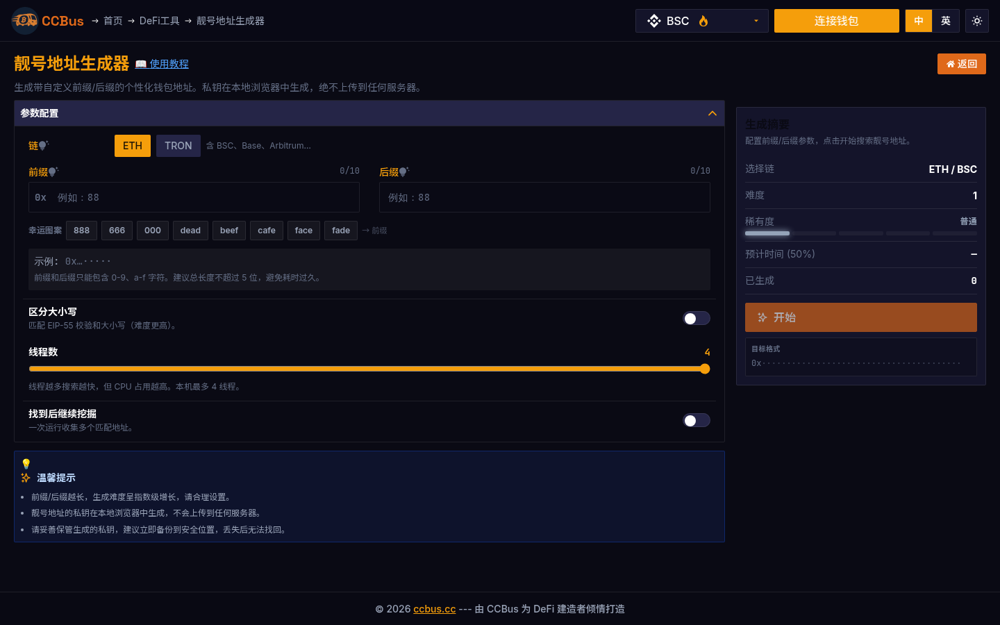
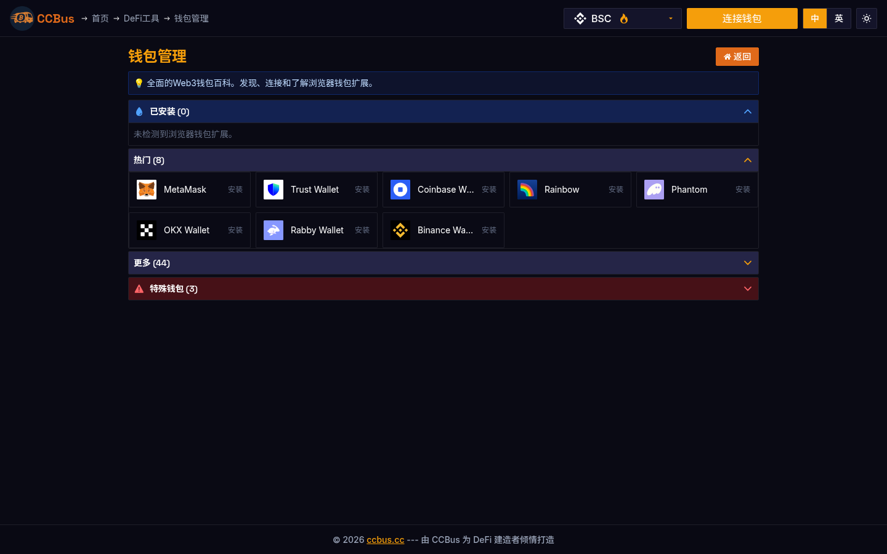

<div class="ccbus-hero">
  <div class="ccbus-hero-avatar">
    
  </div>
  <div class="ccbus-hero-content">
    <h1>第二章：密码学基础</h1>
    <div class="ccbus-teacher-label">🎙️ 本章讲师:<strong>Satoshi Driver</strong> · 密码学的"老司机" — 路线熟,你安全</div>
  </div>
</div>

<div class="chapter-intro">

密码学是区块链技术的基石。本章将深入探讨支撑区块链安全性的核心密码学概念，包括哈希函数、公钥密码学、数字签名等关键技术。

**本章目标：**
- 理解密码学在区块链中的核心作用
- 掌握哈希函数的特性和应用
- 学习公钥/私钥加密机制
- 了解数字签名的工作原理
- 探索 Merkle 树等高级密码学结构

</div>


## 2.0 2025-2026 视角:为什么这一章要重新读

密码学栈是 2026 年区块链技术栈里**变化最剧烈**的领域之一。古典密码学(SHA-2、ECDSA、Keccak256)仍是 L1 的事实标准,但**前沿密码学已经从"理论可行"演变为"生产就绪"**:

1. **零知识证明(ZK)的工业级成熟**:
   - **证明时间**:Plonky2(2022)首次把 STARK 证明压到 100 毫秒级;**Plonky3(2024-09) + SP1(2024)** 把通用 zkVM 证明压到亚秒级
   - **递归证明**:Plonky3 证明可以再被 Plonky3 验证(递归),实现 O(1) 复杂度的链上验证
   - **后量子签名**:NIST FIPS 204 (ML-DSA / Dilithium) 与 FIPS 205 (SLH-DSA / SPHINCS+) 已于 2024-08 正式发布,2026 年起各大 L1 开始集成 PQC 签名
   - **专用 zkEVM**:Polygon zkEVM、zkSync Era、Linea、Scroll、Starknet 的 zkEVM 字节码已可承载 Uniswap、Aave、Compound 等复杂 dApp

2. **BLS 签名聚合的杀手级应用**:
   - 以太坊 Beacon Chain 用 BLS12-381 聚合 100 万验证者签名,每 epoch (~6.4 分钟) 只需验证一个聚合签名
   - EigenLayer 的 AVS(Actively Validated Services) 同样依赖 BLS 聚合,2026 年 EigenLayer TVL 突破 200 亿美元
   - 新趋势:**BLS + ZK 混合** —— 求解器生成 ZK 证明,签名者用 BLS 聚合,大幅降低跨链桥成本

3. **MPC 钱包从"机构专属"到"零售可用"**:
   - **Fireblocks** 服务 1800+ 机构,托管资产超 10 万亿
   - **Safe** 通过 ERC-4337 + MPC 让 EOA 享有 2-of-3 多签能力
   - **Lit Protocol** 把 MPC 与跨链结合,提供 PKP(Programmable Key Pairs)
   - **Privy** 通过 Turnkey + ZeroDev 让 200+ 主流 dApp 集成免密钥 onboarding

4. **后量子(PQC)迁移路线图**:
   - 2024-2025:NIST 标准化阶段
   - 2025-2026:主流 L1(Litecoin 已经在测试 Quantum-Resistant Sig)开始集成 PQC
   - 2027-2028:以太坊 EIP 路线图可能包含 SPHINCS+/Dilithium 集成(等待社区决策)

### 🖥️ 真实案例:CCBus 工具集

CCBus 提供了完整的密码学工具可视化界面,你可以用它来体验本章所学的几个核心概念:

- **靓号地址生成器(vanity address)**:暴力搜索满足特定前缀/后缀的以太坊地址——本质上是反复用 keccak256 对私钥做哈希,直到满足条件的才保留。
- **批量钱包生成**:一次性生成 100 个 EVM 钱包,演示 ECDSA 私钥→公钥→地址的派发流程。
- **钱包管理(wallet manager)**:统一管理多个钱包的私钥加密存储(AES-256)。



*图 2-1:CCBus 的靓号地址生成器,用户输入希望匹配的前缀/后缀,系统通过多线程 ECDSA + keccak256 计算出符合条件的以太坊地址。这个过程完整地体现了**非对称加密的不可逆性**——你永远无法从目标地址反推出私钥,只能正向暴力搜索。*

## 2.1 密码学简介

**密码学**（Cryptography）是研究如何在敌对环境中安全通信的科学。在区块链中，密码学提供了以下关键功能：

### 密码学的核心目标

1. **机密性（Confidentiality）**
   - 确保信息只能被授权方读取
   - 防止未授权访问

2. **完整性（Integrity）**
   - 检测数据是否被篡改
   - 确保数据未被修改

3. **认证性（Authentication）**
   - 验证通信方的身份
   - 确认消息来源

4. **不可否认性（Non-repudiation）**
   - 发送方无法否认发送过某条消息
   - 提供行为证据

### 区块链中的密码学应用

<div style="background: rgba(52, 81, 178, 0.06); padding: 1.5em; border-radius: 4px; margin: 2em 0;">
<svg class="svg-2-0" viewBox="0 0 600 200" xmlns="http://www.w3.org/2000/svg" style="width: 100%; max-width: 700px; display: block; margin: 0 auto;">
<defs>
<style>
      .svg-2-0 .crypto-text { font-family: arial, sans-serif; font-size: 11px; fill: #1f2937; }
      .svg-2-0 .crypto-text-dark { font-family: arial, sans-serif; font-size: 11px; fill: #222; }
      .svg-2-0 .crypto-box-main { fill: rgba(52, 81, 178, 0.10); stroke: #ccc; stroke-width: 0.5; }
      .svg-2-0 .crypto-box-sub { fill: rgba(52, 81, 178, 0.10); stroke: #4c9be8; stroke-width: 0.5; }
      .svg-2-0 .crypto-arrow { fill: none; stroke: #4c9be8; stroke-width: 0.5; }
    </style>
    <marker id="crypto-arrow-1" markerWidth="6" markerHeight="6" refX="5" refY="3" orient="auto">
      <path d="M 0 0 L 6 3 L 0 6 z" fill="#4c9be8"/>
    </marker>
  </defs>
  <rect class="crypto-box-main" x="10" y="10" width="70" height="25" rx="2"/>
  <text class="crypto-text-dark" x="45" y="26" text-anchor="middle">哈希函数</text>
  <path class="crypto-arrow" d="M 80 22 L 130 22" marker-end="url(#crypto-arrow-1)"/>
  <rect class="crypto-box-sub" x="130" y="10" width="70" height="25" rx="2"/>
  <text class="crypto-text" x="165" y="26" text-anchor="middle">区块链接</text>
  <path class="crypto-arrow" d="M 80 22 L 105 22 Q 115 22 115 40 L 115 58 Q 115 68 125 68 L 130 68" marker-end="url(#crypto-arrow-1)"/>
  <rect class="crypto-box-sub" x="130" y="55" width="80" height="25" rx="2"/>
  <text class="crypto-text" x="170" y="71" text-anchor="middle">工作量证明</text>
  <path class="crypto-arrow" d="M 80 22 L 100 22 Q 115 22 115 50 Q 115 100 125 113 L 130 113" marker-end="url(#crypto-arrow-1)"/>
  <rect class="crypto-box-sub" x="130" y="100" width="70" height="25" rx="2"/>
  <text class="crypto-text" x="165" y="116" text-anchor="middle">地址生成</text>
  <rect class="crypto-box-main" x="230" y="10" width="80" height="25" rx="2"/>
  <text class="crypto-text-dark" x="270" y="26" text-anchor="middle">非对称加密</text>
  <path class="crypto-arrow" d="M 310 22 L 360 22" marker-end="url(#crypto-arrow-1)"/>
  <rect class="crypto-box-sub" x="360" y="10" width="70" height="25" rx="2"/>
  <text class="crypto-text" x="395" y="26" text-anchor="middle">账户系统</text>
  <path class="crypto-arrow" d="M 310 22 L 335 22 Q 345 22 345 40 L 345 58 Q 345 68 355 68 L 360 68" marker-end="url(#crypto-arrow-1)"/>
  <rect class="crypto-box-sub" x="360" y="55" width="70" height="25" rx="2"/>
  <text class="crypto-text" x="395" y="71" text-anchor="middle">交易签名</text>
  <path class="crypto-arrow" d="M 310 22 L 330 22 Q 345 22 345 50 Q 345 100 355 113 L 360 113" marker-end="url(#crypto-arrow-1)"/>
  <rect class="crypto-box-sub" x="360" y="100" width="70" height="25" rx="2"/>
  <text class="crypto-text" x="395" y="116" text-anchor="middle">身份验证</text>
  <rect class="crypto-box-main" x="10" y="145" width="70" height="25" rx="2"/>
  <text class="crypto-text-dark" x="45" y="161" text-anchor="middle">数字签名</text>
  <path class="crypto-arrow" d="M 80 157 L 130 157" marker-end="url(#crypto-arrow-1)"/>
  <rect class="crypto-box-sub" x="130" y="145" width="70" height="25" rx="2"/>
  <text class="crypto-text" x="165" y="161" text-anchor="middle">交易授权</text>
  <path class="crypto-arrow" d="M 80 157 L 105 157 Q 115 157 115 165 L 115 173 Q 115 180 125 180 L 230 180" marker-end="url(#crypto-arrow-1)"/>
  <rect class="crypto-box-sub" x="230" y="168" width="70" height="25" rx="2"/>
  <text class="crypto-text" x="265" y="184" text-anchor="middle">多重签名</text>
  <path class="crypto-arrow" d="M 200 157 L 360 157" marker-end="url(#crypto-arrow-1)"/>
  <rect class="crypto-box-sub" x="360" y="145" width="80" height="25" rx="2"/>
  <text class="crypto-text" x="400" y="161" text-anchor="middle">消息认证</text>
  <rect class="crypto-box-main" x="460" y="145" width="80" height="25" rx="2"/>
  <text class="crypto-text-dark" x="500" y="161" text-anchor="middle">Merkle树</text>
  <path class="crypto-arrow" d="M 460 157 Q 450 157 450 165 L 450 55 L 487 55" marker-end="url(#crypto-arrow-1)"/>
  <rect class="crypto-box-sub" x="490" y="42" width="75" height="25" rx="2"/>
  <text class="crypto-text" x="527" y="58" text-anchor="middle">数据验证</text>
  <path class="crypto-arrow" d="M 540 157 Q 560 157 560 135 L 560 90" marker-end="url(#crypto-arrow-1)"/>
  <rect class="crypto-box-sub" x="490" y="77" width="70" height="25" rx="2"/>
  <text class="crypto-text" x="525" y="93" text-anchor="middle">轻节点</text>
  <path class="crypto-arrow" d="M 540 157 Q 565 157 565 125 L 565 23" marker-end="url(#crypto-arrow-1)"/>
  <rect class="crypto-box-sub" x="490" y="10" width="75" height="25" rx="2"/>
  <text class="crypto-text" x="527" y="26" text-anchor="middle">状态证明</text>
</svg>
</div>

## 2.2 哈希函数

### 什么是哈希函数？

**哈希函数**（Hash Function）是一种将任意长度的输入数据映射为固定长度输出的单向函数。

#### 哈希函数的关键特性

1. **确定性（Deterministic）**
   - 相同输入总是产生相同输出
   - 可重现和验证

2. **快速计算（Fast Computation）**
   - 能够快速计算哈希值
   - 高效的验证过程

3. **单向性（One-way）**
   - 从哈希值无法反推原始数据
   - 抗原像攻击（Pre-image Resistance）

4. **雪崩效应（Avalanche Effect）**
   - 输入微小变化导致输出巨大变化
   - 增强安全性

5. **抗碰撞性（Collision Resistance）**
   - 极难找到两个不同输入产生相同输出
   - 防止伪造攻击

### SHA-256 算法

**SHA-256**（Secure Hash Algorithm 256-bit）是比特币使用的主要哈希算法。

#### SHA-256 特点

- 输出长度：256 位（32 字节）
- 通常表示为 64 位十六进制字符
- 计算速度快，安全性高

#### 示例

```javascript
// SHA-256 哈希示例
const crypto = require('crypto');

function sha256(data) {
    return crypto.createHash('sha256')
        .update(data)
        .digest('hex');
}

// 示例 1：普通文本
console.log(sha256('Hello, Blockchain!'));
// 输出: 7f83b1657ff1fc53b92dc18148a1d65dfc2d4b1fa3d677284addd200126d9069

// 示例 2：微小变化导致完全不同的哈希
console.log(sha256('Hello, blockchain!'));  // 注意小写 b
// 输出: 93a0f1d4f8e8e8c4... (完全不同)
```

### 哈希在区块链中的应用

#### 1. 区块链接

<div style="background: rgba(52, 81, 178, 0.06); padding: 1.5em; border-radius: 4px; margin: 2em 0;">
<svg class="svg-2-1" viewBox="0 0 350 45" xmlns="http://www.w3.org/2000/svg" style="width: 100%; max-width: 450px; display: block; margin: 0 auto;">
<defs>
<style>
      .svg-2-1 .chain-text { font-family: arial, sans-serif; font-size: 11px; fill: #1f2937; }
      .svg-2-1 .chain-text-dark { font-family: arial, sans-serif; font-size: 11px; fill: #222; }
      .svg-2-1 .chain-box1 { fill: rgba(52, 81, 178, 0.10); stroke: #ccc; stroke-width: 0.5; }
      .svg-2-1 .chain-box2 { fill: rgba(223, 105, 25, 0.08); stroke: #ccc; stroke-width: 0.5; }
      .svg-2-1 .chain-box3 { fill: rgba(245, 194, 66, 0.50); stroke: #333; stroke-width: 0.5; }
      .svg-2-1 .chain-arrow { fill: none; stroke: #4c9be8; stroke-width: 0.5; }
    </style>
    <marker id="chain-arrow" markerWidth="6" markerHeight="6" refX="5" refY="3" orient="auto">
      <path d="M 0 0 L 6 3 L 0 6 z" fill="#4c9be8"/>
    </marker>
  </defs>
  <rect class="chain-box1" x="10" y="10" width="85" height="25" rx="2"/>
  <text class="chain-text-dark" x="52" y="26" text-anchor="middle">区块 N-1</text>
  <path class="chain-arrow" d="M 95 22 L 130 22" marker-end="url(#chain-arrow)"/>
  <rect class="chain-box2" x="130" y="10" width="75" height="25" rx="2"/>
  <text class="chain-text-dark" x="167" y="26" text-anchor="middle">区块 N</text>
  <path class="chain-arrow" d="M 205 22 L 240 22" marker-end="url(#chain-arrow)"/>
  <rect class="chain-box3" x="240" y="10" width="95" height="25" rx="2"/>
  <text class="chain-text-dark" x="287" y="26" text-anchor="middle">区块 N+1</text>
</svg>
</div>

#### 2. 工作量证明（PoW）

```javascript
// 简化的 PoW 示例
function proofOfWork(blockData, difficulty) {
    let nonce = 0;
    const target = '0'.repeat(difficulty);

    while (true) {
        const hash = sha256(blockData + nonce);

        if (hash.startsWith(target)) {
            return { nonce, hash };
        }

        nonce++;
    }
}

// 查找以 4 个 0 开头的哈希
const result = proofOfWork('Block Data', 4);
console.log(`Found: ${result.hash} with nonce ${result.nonce}`);
// 输出: Found: 0000a3f2... with nonce 157392
```

#### 3. 地址生成

<div style="background: rgba(52, 81, 178, 0.06); padding: 1.5em; border-radius: 4px; margin: 2em 0;">
<svg class="svg-2-2" viewBox="0 0 480 60" xmlns="http://www.w3.org/2000/svg" style="width: 100%; max-width: 550px; display: block; margin: 0 auto;">
<defs>
<style>
      .svg-2-2 .addr-text { font-family: arial, sans-serif; font-size: 11px; fill: #1f2937; }
      .svg-2-2 .addr-text-sm { font-family: arial, sans-serif; font-size: 9px; fill: #1f2937; }
      .svg-2-2 .addr-text-dark { font-family: arial, sans-serif; font-size: 11px; fill: #222; }
      .svg-2-2 .addr-box-start { fill: rgba(52, 81, 178, 0.10); stroke: #ccc; stroke-width: 0.5; }
      .svg-2-2 .addr-box-mid { fill: rgba(223, 105, 25, 0.08); stroke: #ccc; stroke-width: 0.5; }
      .svg-2-2 .addr-box-end { fill: rgba(245, 194, 66, 0.50); stroke: #333; stroke-width: 0.5; }
      .svg-2-2 .addr-arrow { fill: none; stroke: #4c9be8; stroke-width: 0.5; }
    </style>
    <marker id="addr-arrow" markerWidth="6" markerHeight="6" refX="5" refY="3" orient="auto">
      <path d="M 0 0 L 6 3 L 0 6 z" fill="#4c9be8"/>
    </marker>
  </defs>
  <rect class="addr-box-start" x="10" y="18" width="50" height="25" rx="2"/>
  <text class="addr-text-dark" x="35" y="34" text-anchor="middle">公钥</text>
  <path class="addr-arrow" d="M 60 30 L 95 30" marker-end="url(#addr-arrow)"/>
  <rect class="addr-box-mid" x="95" y="18" width="70" height="25" rx="2"/>
  <text class="addr-text-dark" x="130" y="34" text-anchor="middle">SHA-256</text>
  <path class="addr-arrow" d="M 165 30 L 200 30" marker-end="url(#addr-arrow)"/>
  <rect class="addr-box-mid" x="200" y="10" width="70" height="40" rx="2"/>
  <text class="addr-text-dark" x="235" y="27" text-anchor="middle">RIPEMD</text>
  <text class="addr-text-dark" x="235" y="40" text-anchor="middle">-160</text>
  <path class="addr-arrow" d="M 270 30 L 305 30" marker-end="url(#addr-arrow)"/>
  <rect class="addr-box-mid" x="305" y="10" width="70" height="40" rx="2"/>
  <text class="addr-text-dark" x="340" y="27" text-anchor="middle">Base58</text>
  <text class="addr-text-dark" x="340" y="40" text-anchor="middle">Check</text>
  <path class="addr-arrow" d="M 375 30 L 410 30" marker-end="url(#addr-arrow)"/>
  <rect class="addr-box-end" x="410" y="18" width="60" height="25" rx="2"/>
  <text class="addr-text-dark" x="440" y="34" text-anchor="middle">地址</text>
</svg>
</div>

### 其他重要哈希算法

#### RIPEMD-160

- 输出：160 位（20 字节）
- 用途：比特币地址生成
- 特点：更短的输出，节省空间

#### Keccak-256

- 用于：以太坊
- 输出：256 位
- 特点：SHA-3 的变体

#### Blake2

- 用于：某些新兴区块链
- 特点：比 SHA-256 更快
- 安全性：与 SHA-3 相当

## 2.3 对称加密与非对称加密

### 对称加密（Symmetric Encryption）

使用**相同密钥**进行加密和解密。

#### 工作原理

<div style="background: rgba(52, 81, 178, 0.06); padding: 1.5em; border-radius: 4px; margin: 2em 0;">
<svg class="svg-2-3" viewBox="0 0 320 195" xmlns="http://www.w3.org/2000/svg" style="width: 100%; max-width: 400px; display: block; margin: 0 auto;">
<defs>
<style>
      .svg-2-3 .seq-text { font-family: arial, sans-serif; font-size: 11px; fill: #1f2937; }
      .svg-2-3 .seq-label { font-size: 10px; fill: #ccc; }
      .svg-2-3 .seq-box { fill: rgba(52, 81, 178, 0.05); stroke: #ccc; stroke-width: 0.5; }
      .svg-2-3 .seq-line { stroke: #999; stroke-width: 0.5; }
      .svg-2-3 .seq-arrow { fill: #4c9be8; stroke: #4c9be8; stroke-width: 0.5; }
      .svg-2-3 .seq-note { fill: #4e5d6c; stroke: #666; stroke-width: 0.5; }
    </style>
    <marker id="arrowhead-compact" markerWidth="6" markerHeight="6" refX="5" refY="3" orient="auto">
      <path d="M 0 0 L 6 3 L 0 6 z" class="seq-arrow"/>
    </marker>
  </defs>
  <rect class="seq-box" x="10" y="3" width="50" height="20" rx="2"/>
  <text class="seq-text" x="35" y="17" text-anchor="middle">发送方</text>
  <rect class="seq-box" x="260" y="3" width="50" height="20" rx="2"/>
  <text class="seq-text" x="285" y="17" text-anchor="middle">接收方</text>
  <line class="seq-line" x1="35" y1="25" x2="35" y2="175"/>
  <line class="seq-line" x1="285" y1="25" x2="285" y2="175"/>
  <rect class="seq-note" x="80" y="35" width="160" height="18" rx="2"/>
  <text class="seq-label" x="160" y="47" text-anchor="middle" fill="#1f2937">共享密钥 K</text>
  <text class="seq-label" x="35" y="73" text-anchor="middle">加密(M, K)</text>
  <path class="seq-line" d="M 35 78 Q 60 78 60 88 Q 60 98 35 98" fill="none" marker-end="url(#arrowhead-compact)"/>
  <text class="seq-label" x="160" y="118" text-anchor="middle">密文 C</text>
  <line class="seq-line" x1="35" y1="123" x2="285" y2="123" marker-end="url(#arrowhead-compact)"/>
  <text class="seq-label" x="285" y="143" text-anchor="middle">解密(C, K)</text>
  <path class="seq-line" d="M 285 148 Q 310 148 310 158 Q 310 168 285 168" fill="none" marker-end="url(#arrowhead-compact)"/>
  <rect class="seq-box" x="10" y="173" width="50" height="20" rx="2"/>
  <text class="seq-text" x="35" y="187" text-anchor="middle">发送方</text>
  <rect class="seq-box" x="260" y="173" width="50" height="20" rx="2"/>
  <text class="seq-text" x="285" y="187" text-anchor="middle">接收方</text>
</svg>
</div>

#### 常见对称加密算法

- **AES（Advanced Encryption Standard）**
  - 最广泛使用
  - 支持 128、192、256 位密钥

- **DES/3DES**
  - 较老的标准
  - 已不推荐使用

#### 优缺点

**优点：**
- ✅ 加密速度快
- ✅ 适合大量数据
- ✅ 计算资源消耗少

**缺点：**
- ❌ 密钥分发困难
- ❌ 密钥管理复杂
- ❌ 不适合公开网络

### 非对称加密（Asymmetric Encryption）

使用**一对密钥**：公钥（Public Key）和私钥（Private Key）。

#### 核心概念

<div style="background: rgba(52, 81, 178, 0.06); padding: 1.5em; border-radius: 4px; margin: 2em 0;">
<svg class="svg-2-4" viewBox="0 0 380 110" xmlns="http://www.w3.org/2000/svg" style="width: 100%; max-width: 450px; display: block; margin: 0 auto;">
<defs>
<style>
      .svg-2-4 .key-text { font-family: arial, sans-serif; font-size: 11px; fill: #1f2937; }
      .svg-2-4 .key-text-sm { font-family: arial, sans-serif; font-size: 9px; fill: #1f2937; }
      .svg-2-4 .key-text-dark { font-family: arial, sans-serif; font-size: 11px; fill: #222; }
      .svg-2-4 .key-box-gen { fill: #4c9be8; stroke: #ccc; stroke-width: 0.5; }
      .svg-2-4 .key-box-pk { fill: rgba(52, 81, 178, 0.10); stroke: #ccc; stroke-width: 0.5; }
      .svg-2-4 .key-box-sk { fill: rgba(245, 194, 66, 0.50); stroke: #333; stroke-width: 0.5; }
      .svg-2-4 .key-box-rel { fill: rgba(223, 105, 25, 0.08); stroke: #ccc; stroke-width: 0.5; }
      .svg-2-4 .key-arrow { fill: none; stroke: #4c9be8; stroke-width: 0.5; }
      .svg-2-4 .key-dash { fill: none; stroke: #999; stroke-width: 0.5; stroke-dasharray: 3,2; }
    </style>
    <marker id="key-arrow" markerWidth="6" markerHeight="6" refX="5" refY="3" orient="auto">
      <path d="M 0 0 L 6 3 L 0 6 z" fill="#4c9be8"/>
    </marker>
  </defs>
  <rect class="key-box-gen" x="10" y="40" width="90" height="30" rx="2"/>
  <text class="key-text" x="55" y="59" text-anchor="middle">密钥对生成</text>
  <path class="key-arrow" d="M 100 55 L 150 25" marker-end="url(#key-arrow)"/>
  <rect class="key-box-pk" x="150" y="10" width="100" height="30" rx="2"/>
  <text class="key-text-dark" x="200" y="29" text-anchor="middle">公钥 可公开</text>
  <path class="key-arrow" d="M 100 55 L 150 80" marker-end="url(#key-arrow)"/>
  <rect class="key-box-sk" x="150" y="65" width="90" height="30" rx="2"/>
  <text class="key-text-dark" x="195" y="84" text-anchor="middle">私钥 保密</text>
  <path class="key-dash" d="M 250 25 L 280 25 Q 290 25 290 35 L 290 45 Q 290 55 300 55 L 310 55"/>
  <rect class="key-box-rel" x="270" y="40" width="100" height="30" rx="2"/>
  <text class="key-text-dark" x="320" y="52" text-anchor="middle">数学关联</text>
  <text class="key-text-dark" x="320" y="65" text-anchor="middle">单向</text>
  <path class="key-dash" d="M 240 80 L 280 80 Q 290 80 290 70 L 290 60 Q 290 55 300 55 L 310 55"/>
</svg>
</div>

#### 加密通信流程

<div style="background: rgba(52, 81, 178, 0.06); padding: 1.5em; border-radius: 4px; margin: 2em 0;">
<svg class="svg-2-5" viewBox="0 0 280 160" xmlns="http://www.w3.org/2000/svg" style="width: 100%; max-width: 350px; display: block; margin: 0 auto;">
<defs>
<style>
      .svg-2-5 .enc-text { font-family: arial, sans-serif; font-size: 11px; fill: #1f2937; }
      .svg-2-5 .enc-label { font-size: 10px; fill: #ccc; }
      .svg-2-5 .enc-box { fill: rgba(52, 81, 178, 0.05); stroke: #ccc; stroke-width: 0.5; }
      .svg-2-5 .enc-line { stroke: #999; stroke-width: 0.5; }
      .svg-2-5 .enc-arrow { fill: #4c9be8; stroke: #4c9be8; stroke-width: 0.5; }
    </style>
    <marker id="enc-arrow" markerWidth="6" markerHeight="6" refX="5" refY="3" orient="auto">
      <path d="M 0 0 L 6 3 L 0 6 z" class="enc-arrow"/>
    </marker>
  </defs>
  <rect class="enc-box" x="10" y="3" width="50" height="20" rx="2"/>
  <text class="enc-text" x="35" y="17" text-anchor="middle">Alice</text>
  <rect class="enc-box" x="220" y="3" width="50" height="20" rx="2"/>
  <text class="enc-text" x="245" y="17" text-anchor="middle">Bob</text>
  <line class="enc-line" x1="35" y1="25" x2="35" y2="140"/>
  <line class="enc-line" x1="245" y1="25" x2="245" y2="140"/>
  <text class="enc-label" x="140" y="43" text-anchor="middle">公钥 pk_Bob</text>
  <line class="enc-arrow" x1="245" y1="48" x2="35" y2="48" marker-end="url(#enc-arrow)"/>
  <text class="enc-label" x="35" y="68" text-anchor="middle">加密(M, pk_Bob)</text>
  <path class="enc-line" d="M 35 73 Q 60 73 60 83 Q 60 93 35 93" fill="none" marker-end="url(#enc-arrow)"/>
  <text class="enc-label" x="140" y="113" text-anchor="middle">密文 C</text>
  <line class="enc-arrow" x1="35" y1="118" x2="245" y2="118" marker-end="url(#enc-arrow)"/>
  <text class="enc-label" x="245" y="133" text-anchor="middle">解密(C, sk_Bob)</text>
  <path class="enc-line" d="M 245 138 Q 270 138 270 148 Q 270 158 245 158" fill="none" marker-end="url(#enc-arrow)"/>
  <rect class="enc-box" x="10" y="138" width="50" height="20" rx="2"/>
  <text class="enc-text" x="35" y="152" text-anchor="middle">Alice</text>
  <rect class="enc-box" x="220" y="138" width="50" height="20" rx="2"/>
  <text class="enc-text" x="245" y="152" text-anchor="middle">Bob</text>
</svg>
</div>

#### 常见非对称加密算法

**1. RSA**
- 基于大数分解难题
- 密钥长度：2048-4096 位
- 用途：TLS/SSL、数字签名

```javascript
// RSA 概念示例（简化）
// 密钥生成
const { publicKey, privateKey } = generateRSAKeyPair();

// 加密
const encrypted = rsaEncrypt(message, publicKey);

// 解密
const decrypted = rsaDecrypt(encrypted, privateKey);
```

**2. ECC（椭圆曲线加密）**
- 基于椭圆曲线离散对数问题
- 密钥长度：256 位（相当于 RSA 3072 位安全性）
- 优势：更短的密钥，更高效

**区块链常用曲线：**
- **secp256k1**：比特币、以太坊使用
- **Ed25519**：Solana、Polkadot 使用
- **secp256r1**：某些企业区块链

#### ECC 工作原理

<div style="background: rgba(52, 81, 178, 0.06); padding: 1.5em; border-radius: 4px; margin: 2em 0;">
<svg class="svg-2-6" viewBox="0 0 520 60" xmlns="http://www.w3.org/2000/svg" style="width: 100%; max-width: 600px; display: block; margin: 0 auto;">
<defs>
<style>
      .svg-2-6 .ecc-text { font-family: arial, sans-serif; font-size: 10px; fill: #1f2937; }
      .svg-2-6 .ecc-text-dark { font-family: arial, sans-serif; font-size: 10px; fill: #222; }
      .svg-2-6 .ecc-box1 { fill: #4c9be8; stroke: #ccc; stroke-width: 0.5; }
      .svg-2-6 .ecc-box2 { fill: rgba(223, 105, 25, 0.08); stroke: #ccc; stroke-width: 0.5; }
      .svg-2-6 .ecc-box3 { fill: rgba(52, 81, 178, 0.10); stroke: #ccc; stroke-width: 0.5; }
      .svg-2-6 .ecc-box4 { fill: rgba(245, 194, 66, 0.50); stroke: #333; stroke-width: 0.5; }
      .svg-2-6 .ecc-arrow { fill: none; stroke: #4c9be8; stroke-width: 0.5; }
    </style>
    <marker id="ecc-arrow" markerWidth="6" markerHeight="6" refX="5" refY="3" orient="auto">
      <path d="M 0 0 L 6 3 L 0 6 z" fill="#4c9be8"/>
    </marker>
  </defs>
  <rect class="ecc-box1" x="10" y="10" width="70" height="40" rx="2"/>
  <text class="ecc-text" x="45" y="26" text-anchor="middle">椭圆曲线</text>
  <text class="ecc-text" x="45" y="40" text-anchor="middle">y²=x³+ax+b</text>
  <path class="ecc-arrow" d="M 80 30 L 110 30" marker-end="url(#ecc-arrow)"/>
  <rect class="ecc-box2" x="110" y="10" width="75" height="40" rx="2"/>
  <text class="ecc-text-dark" x="147" y="26" text-anchor="middle">secp256k1</text>
  <text class="ecc-text-dark" x="147" y="40" text-anchor="middle">y²=x³+7</text>
  <path class="ecc-arrow" d="M 185 30 L 215 30" marker-end="url(#ecc-arrow)"/>
  <rect class="ecc-box3" x="215" y="10" width="60" height="40" rx="2"/>
  <text class="ecc-text-dark" x="245" y="26" text-anchor="middle">点加法</text>
  <text class="ecc-text-dark" x="245" y="40" text-anchor="middle">P+Q=R</text>
  <path class="ecc-arrow" d="M 275 30 L 305 30" marker-end="url(#ecc-arrow)"/>
  <rect class="ecc-box4" x="305" y="10" width="70" height="40" rx="2"/>
  <text class="ecc-text-dark" x="340" y="26" text-anchor="middle">私钥</text>
  <text class="ecc-text-dark" x="340" y="40" text-anchor="middle">随机256位</text>
  <path class="ecc-arrow" d="M 375 30 L 405 30" marker-end="url(#ecc-arrow)"/>
  <rect class="ecc-box4" x="405" y="10" width="65" height="40" rx="2"/>
  <text class="ecc-text-dark" x="437" y="26" text-anchor="middle">公钥</text>
  <text class="ecc-text-dark" x="437" y="40" text-anchor="middle">pk=sk×G</text>
</svg>
</div>

#### 示例：以太坊密钥对

```javascript
// 以太坊密钥对生成示例
const { randomBytes } = require('crypto');
const secp256k1 = require('secp256k1');

// 1. 生成私钥（256 位随机数）
let privateKey;
do {
    privateKey = randomBytes(32);
} while (!secp256k1.privateKeyVerify(privateKey));

console.log('私钥:', privateKey.toString('hex'));
// 输出: 7c4e8... (64位十六进制 = 32字节 = 256位)

// 2. 从私钥派生公钥
const publicKey = secp256k1.publicKeyCreate(privateKey, false);
console.log('公钥:', publicKey.toString('hex'));
// 输出: 04b8a... (130位十六进制 = 65字节,未压缩格式)

// 3. 生成以太坊地址（公钥的 Keccak-256 哈希的后20字节）
const keccak256 = require('keccak256');
const address = keccak256(publicKey.slice(1)).slice(-20).toString('hex');
console.log('地址: 0x' + address);
// 输出: 0x742d35Cc6634C0532925a3b844Bc9e7595f0bEb0
```

### 对称 vs 非对称加密对比

| 特性 | 对称加密 | 非对称加密 |
|------|---------|----------|
| 密钥 | 单一密钥 | 公钥 + 私钥 |
| 速度 | 快 | 慢（10-1000倍） |
| 密钥分发 | 困难 | 容易 |
| 用途 | 大数据加密 | 密钥交换、签名 |
| 示例 | AES, DES | RSA, ECC |
| 区块链应用 | 钱包加密 | 交易签名 |

## 2.4 数字签名

**数字签名**是使用私钥对数据进行签名，任何人都可以用对应的公钥验证签名的真实性。

### 数字签名的作用

1. **身份认证**：证明消息确实来自私钥持有者
2. **数据完整性**：证明消息未被篡改
3. **不可否认**：签名者无法否认签过名

### 数字签名工作流程

<div style="background: rgba(52, 81, 178, 0.06); padding: 1.5em; border-radius: 4px; margin: 2em 0;">
<svg class="svg-2-7" viewBox="0 0 580 90" xmlns="http://www.w3.org/2000/svg" style="width: 100%; max-width: 650px; display: block; margin: 0 auto;">
<defs>
<style>
      .svg-2-7 .digsig-text { font-family: arial, sans-serif; font-size: 11px; fill: #1f2937; }
      .svg-2-7 .digsig-text-dark { font-family: arial, sans-serif; font-size: 11px; fill: #222; }
      .svg-2-7 .digsig-box-msg { fill: rgba(52, 81, 178, 0.10); stroke: #ccc; stroke-width: 0.5; }
      .svg-2-7 .digsig-box-hash { fill: rgba(52, 81, 178, 0.10); stroke: #4c9be8; stroke-width: 0.5; }
      .svg-2-7 .digsig-box-sign { fill: rgba(52, 81, 178, 0.10); stroke: #4c9be8; stroke-width: 0.5; }
      .svg-2-7 .digsig-box-sig { fill: rgba(245, 194, 66, 0.50); stroke: #333; stroke-width: 0.5; }
      .svg-2-7 .digsig-box-verify { fill: rgba(52, 81, 178, 0.10); stroke: #4c9be8; stroke-width: 0.5; }
      .svg-2-7 .digsig-box-valid { fill: rgba(52, 81, 178, 0.10); stroke: #ccc; stroke-width: 0.5; }
      .svg-2-7 .digsig-box-invalid { fill: rgba(220, 53, 69, 0.25); stroke: #333; stroke-width: 0.5; }
      .svg-2-7 .digsig-arrow { fill: none; stroke: #4c9be8; stroke-width: 0.5; }
      .svg-2-7 .digsig-arrow-dash { fill: none; stroke: #4c9be8; stroke-width: 0.5; stroke-dasharray: 3,2; }
    </style>
    <marker id="digsig-arrow" markerWidth="6" markerHeight="6" refX="5" refY="3" orient="auto">
      <path d="M 0 0 L 6 3 L 0 6 z" fill="#4c9be8"/>
    </marker>
  </defs>
  <rect class="digsig-box-msg" x="10" y="10" width="60" height="25" rx="2"/>
  <text class="digsig-text-dark" x="40" y="26" text-anchor="middle">消息 M</text>
  <path class="digsig-arrow" d="M 70 22 L 100 22" marker-end="url(#digsig-arrow)"/>
  <rect class="digsig-box-hash" x="100" y="10" width="50" height="25" rx="2"/>
  <text class="digsig-text" x="125" y="26" text-anchor="middle">Hash</text>
  <path class="digsig-arrow" d="M 150 22 L 180 22" marker-end="url(#digsig-arrow)"/>
  <rect class="digsig-box-sign" x="180" y="10" width="60" height="25" rx="2"/>
  <text class="digsig-text" x="210" y="26" text-anchor="middle">签名 sk</text>
  <path class="digsig-arrow" d="M 240 22 L 270 22" marker-end="url(#digsig-arrow)"/>
  <rect class="digsig-box-sig" x="270" y="10" width="60" height="25" rx="2"/>
  <text class="digsig-text-dark" x="300" y="26" text-anchor="middle">签名 σ</text>
  <path class="digsig-arrow" d="M 330 22 L 360 22" marker-end="url(#digsig-arrow)"/>
  <rect class="digsig-box-verify" x="360" y="10" width="60" height="25" rx="2"/>
  <text class="digsig-text" x="390" y="26" text-anchor="middle">验证 pk</text>
  <path class="digsig-arrow-dash" d="M 40 35 Q 40 55 225 55 Q 390 55 390 35" marker-end="url(#digsig-arrow)"/>
  <path class="digsig-arrow" d="M 390 35 L 390 55 L 450 55" marker-end="url(#digsig-arrow)"/>
  <rect class="digsig-box-valid" x="450" y="42" width="60" height="25" rx="2"/>
  <text class="digsig-text-dark" x="480" y="58" text-anchor="middle">✅ 有效</text>
  <rect class="digsig-box-invalid" x="450" y="10" width="60" height="25" rx="2"/>
  <text class="digsig-text" x="480" y="26" text-anchor="middle">❌ 无效</text>
  <path class="digsig-arrow" d="M 420 22 L 450 22" marker-end="url(#digsig-arrow)"/>
</svg>
</div>

### ECDSA（椭圆曲线数字签名算法）

比特币和以太坊使用的签名算法。

#### 签名生成

```javascript
// 以太坊交易签名示例
const secp256k1 = require('secp256k1');
const keccak256 = require('keccak256');

// 交易数据
const txData = {
    nonce: 0,
    gasPrice: '20000000000',
    gasLimit: '21000',
    to: '0x742d35Cc6634C0532925a3b844Bc9e7595f0bEb0',
    value: '1000000000000000000',  // 1 ETH
    data: '0x'
};

// 1. 序列化交易数据（RLP 编码）
const serialized = rlpEncode(txData);

// 2. 计算哈希
const txHash = keccak256(serialized);

// 3. 使用私钥签名
const { signature, recid } = secp256k1.ecdsaSign(txHash, privateKey);

// 4. 签名结果
const r = signature.slice(0, 32);
const s = signature.slice(32, 64);
const v = recid + 27;  // 以太坊的 v 值

console.log('签名 - r:', r.toString('hex'));
console.log('签名 - s:', s.toString('hex'));
console.log('签名 - v:', v);
```

#### 签名验证

```javascript
// 验证签名
function verifySignature(txHash, signature, publicKey) {
    return secp256k1.ecdsaVerify(signature, txHash, publicKey);
}

// 使用
const isValid = verifySignature(txHash, signature, publicKey);
console.log('签名有效:', isValid);  // true
```

### 比特币交易签名

<div style="background: rgba(52, 81, 178, 0.06); padding: 1.5em; border-radius: 4px; margin: 2em 0;">
<svg class="svg-2-8" viewBox="0 0 480 45" xmlns="http://www.w3.org/2000/svg" style="width: 100%; max-width: 550px; display: block; margin: 0 auto;">
<defs>
<style>
      .svg-2-8 .btc-sig-text { font-family: arial, sans-serif; font-size: 11px; fill: #1f2937; }
      .svg-2-8 .btc-sig-text-dark { font-family: arial, sans-serif; font-size: 11px; fill: #222; }
      .svg-2-8 .btc-sig-box1 { fill: rgba(52, 81, 178, 0.10); stroke: #ccc; stroke-width: 0.5; }
      .svg-2-8 .btc-sig-box2 { fill: rgba(52, 81, 178, 0.05); stroke: #ccc; stroke-width: 0.5; }
      .svg-2-8 .btc-sig-box3 { fill: rgba(223, 105, 25, 0.08); stroke: #ccc; stroke-width: 0.5; }
      .svg-2-8 .btc-sig-box4 { fill: rgba(245, 194, 66, 0.50); stroke: #333; stroke-width: 0.5; }
      .svg-2-8 .btc-sig-box5 { fill: #4c9be8; stroke: #ccc; stroke-width: 0.5; }
      .svg-2-8 .btc-sig-arrow { fill: none; stroke: #4c9be8; stroke-width: 0.5; }
    </style>
    <marker id="btc-sig-arrow" markerWidth="6" markerHeight="6" refX="5" refY="3" orient="auto">
      <path d="M 0 0 L 6 3 L 0 6 z" fill="#4c9be8"/>
    </marker>
  </defs>
  <rect class="btc-sig-box1" x="10" y="10" width="70" height="25" rx="2"/>
  <text class="btc-sig-text-dark" x="45" y="26" text-anchor="middle">构建交易</text>
  <path class="btc-sig-arrow" d="M 80 22 L 110 22" marker-end="url(#btc-sig-arrow)"/>
  <rect class="btc-sig-box2" x="110" y="10" width="60" height="25" rx="2"/>
  <text class="btc-sig-text" x="140" y="26" text-anchor="middle">序列化</text>
  <path class="btc-sig-arrow" d="M 170 22 L 200 22" marker-end="url(#btc-sig-arrow)"/>
  <rect class="btc-sig-box3" x="200" y="10" width="80" height="25" rx="2"/>
  <text class="btc-sig-text-dark" x="240" y="26" text-anchor="middle">双SHA-256</text>
  <path class="btc-sig-arrow" d="M 280 22 L 310 22" marker-end="url(#btc-sig-arrow)"/>
  <rect class="btc-sig-box4" x="310" y="10" width="75" height="25" rx="2"/>
  <text class="btc-sig-text-dark" x="347" y="26" text-anchor="middle">ECDSA签名</text>
  <path class="btc-sig-arrow" d="M 385 22 L 415 22" marker-end="url(#btc-sig-arrow)"/>
  <rect class="btc-sig-box5" x="415" y="10" width="65" height="25" rx="2"/>
  <text class="btc-sig-text" x="447" y="26" text-anchor="middle">完整交易</text>
</svg>
</div>

### 多重签名（MultiSig）

需要多个私钥共同签名才能完成交易。

#### M-of-N 多签

<div style="background: rgba(52, 81, 178, 0.06); padding: 1.5em; border-radius: 4px; margin: 2em 0;">
<svg class="svg-2-9" viewBox="0 0 470 140" xmlns="http://www.w3.org/2000/svg" style="width: 100%; max-width: 500px; display: block; margin: 0 auto;">
<defs>
<style>
      .svg-2-9 .multisig-text { font-family: arial, sans-serif; font-size: 11px; fill: #1f2937; }
      .svg-2-9 .multisig-text-sm { font-family: arial, sans-serif; font-size: 10px; fill: #1f2937; }
      .svg-2-9 .multisig-text-dark { font-family: arial, sans-serif; font-size: 11px; fill: #222; }
      .svg-2-9 .multisig-text-sm-dark { font-family: arial, sans-serif; font-size: 10px; fill: #222; }
      .svg-2-9 .multisig-box-main { fill: #4c9be8; stroke: #ccc; stroke-width: 0.5; }
      .svg-2-9 .multisig-box-user { fill: rgba(52, 81, 178, 0.10); stroke: #ccc; stroke-width: 0.5; }
      .svg-2-9 .multisig-box-tx { fill: rgba(52, 81, 178, 0.05); stroke: #ccc; stroke-width: 0.5; }
      .svg-2-9 .multisig-box-sign { fill: rgba(223, 105, 25, 0.08); stroke: #ccc; stroke-width: 0.5; }
      .svg-2-9 .multisig-box-valid { fill: rgba(245, 194, 66, 0.50); stroke: #333; stroke-width: 0.5; }
      .svg-2-9 .multisig-arrow { fill: none; stroke: #4c9be8; stroke-width: 0.5; }
    </style>
    <marker id="multisig-arrow" markerWidth="6" markerHeight="6" refX="5" refY="3" orient="auto">
      <path d="M 0 0 L 6 3 L 0 6 z" fill="#4c9be8"/>
    </marker>
  </defs>
  <rect class="multisig-box-main" x="10" y="50" width="85" height="30" rx="2"/>
  <text class="multisig-text" x="52" y="69" text-anchor="middle">2-of-3 多签</text>
  <path class="multisig-arrow" d="M 95 65 L 150 20" marker-end="url(#multisig-arrow)"/>
  <rect class="multisig-box-user" x="150" y="5" width="50" height="30" rx="2"/>
  <text class="multisig-text-dark" x="175" y="24" text-anchor="middle">Alice</text>
  <path class="multisig-arrow" d="M 95 65 L 150 65" marker-end="url(#multisig-arrow)"/>
  <rect class="multisig-box-user" x="150" y="50" width="50" height="30" rx="2"/>
  <text class="multisig-text-dark" x="175" y="69" text-anchor="middle">Bob</text>
  <path class="multisig-arrow" d="M 95 65 L 150 110" marker-end="url(#multisig-arrow)"/>
  <rect class="multisig-box-user" x="150" y="95" width="55" height="30" rx="2"/>
  <text class="multisig-text-dark" x="177" y="114" text-anchor="middle">Charlie</text>
  <rect class="multisig-box-tx" x="240" y="50" width="45" height="30" rx="2"/>
  <text class="multisig-text" x="262" y="69" text-anchor="middle">交易</text>
  <path class="multisig-arrow" d="M 285 65 L 315 65" marker-end="url(#multisig-arrow)"/>
  <rect class="multisig-box-sign" x="315" y="50" width="55" height="30" rx="2"/>
  <text class="multisig-text-sm-dark" x="342" y="69" text-anchor="middle">签名 A</text>
  <path class="multisig-arrow" d="M 370 65 L 400 65" marker-end="url(#multisig-arrow)"/>
  <rect class="multisig-box-sign" x="400" y="50" width="55" height="30" rx="2"/>
  <text class="multisig-text-sm-dark" x="427" y="69" text-anchor="middle">签名 B</text>
  <rect class="multisig-box-valid" x="320" y="100" width="70" height="30" rx="2"/>
  <text class="multisig-text-dark" x="355" y="119" text-anchor="middle">✅ 有效</text>
  <path class="multisig-arrow" d="M 427 80 Q 427 90 420 90 L 390 90 Q 380 90 370 95 Q 355 100 355 100" marker-end="url(#multisig-arrow)"/>
</svg>
</div>

#### 比特币 P2SH 多签脚本

```
# 2-of-3 多签脚本
OP_2
<公钥A> <公钥B> <公钥C>
OP_3
OP_CHECKMULTISIG
```

## 2.5 Merkle 树

**Merkle 树**（Merkle Tree），也称哈希树，是一种树形数据结构，用于高效验证大量数据的完整性。

### Merkle 树结构

<div style="background: rgba(52, 81, 178, 0.06); padding: 1.5em; border-radius: 4px; margin: 2em 0;">
<svg class="svg-2-10" viewBox="0 0 380 180" xmlns="http://www.w3.org/2000/svg" style="width: 100%; max-width: 450px; display: block; margin: 0 auto;">
<defs>
<style>
      .svg-2-10 .merkle-text { font-family: arial, sans-serif; font-size: 10px; fill: #1f2937; }
      .svg-2-10 .merkle-text-sm { font-family: arial, sans-serif; font-size: 9px; fill: #1f2937; }
      .svg-2-10 .merkle-text-dark { font-family: arial, sans-serif; font-size: 10px; fill: #222; }
      .svg-2-10 .merkle-text-sm-dark { font-family: arial, sans-serif; font-size: 9px; fill: #222; }
      .svg-2-10 .merkle-box-root { fill: rgba(245, 194, 66, 0.50); stroke: #333; stroke-width: 0.5; }
      .svg-2-10 .merkle-box-mid { fill: rgba(223, 105, 25, 0.08); stroke: #ccc; stroke-width: 0.5; }
      .svg-2-10 .merkle-box-leaf { fill: rgba(52, 81, 178, 0.10); stroke: #ccc; stroke-width: 0.5; }
      .svg-2-10 .merkle-box-tx { fill: rgba(52, 81, 178, 0.10); stroke: #4c9be8; stroke-width: 0.5; }
      .svg-2-10 .merkle-line { stroke: #4c9be8; stroke-width: 0.5; }
    </style>
</defs>
  <rect class="merkle-box-root" x="145" y="5" width="90" height="25" rx="2"/>
  <text class="merkle-text-dark" x="190" y="21" text-anchor="middle">Merkle Root</text>
  <line class="merkle-line" x1="190" y1="30" x2="100" y2="50"/>
  <line class="merkle-line" x1="190" y1="30" x2="280" y2="50"/>
  <rect class="merkle-box-mid" x="55" y="50" width="90" height="25" rx="2"/>
  <text class="merkle-text-dark" x="100" y="66" text-anchor="middle">Hash 0-1</text>
  <rect class="merkle-box-mid" x="235" y="50" width="90" height="25" rx="2"/>
  <text class="merkle-text-dark" x="280" y="66" text-anchor="middle">Hash 2-3</text>
  <line class="merkle-line" x1="100" y1="75" x2="55" y2="95"/>
  <line class="merkle-line" x1="100" y1="75" x2="145" y2="95"/>
  <line class="merkle-line" x1="280" y1="75" x2="235" y2="95"/>
  <line class="merkle-line" x1="280" y1="75" x2="325" y2="95"/>
  <rect class="merkle-box-leaf" x="10" y="95" width="60" height="25" rx="2"/>
  <text class="merkle-text-sm-dark" x="40" y="111" text-anchor="middle">Hash 0</text>
  <rect class="merkle-box-leaf" x="115" y="95" width="60" height="25" rx="2"/>
  <text class="merkle-text-sm-dark" x="145" y="111" text-anchor="middle">Hash 1</text>
  <rect class="merkle-box-leaf" x="205" y="95" width="60" height="25" rx="2"/>
  <text class="merkle-text-sm-dark" x="235" y="111" text-anchor="middle">Hash 2</text>
  <rect class="merkle-box-leaf" x="310" y="95" width="60" height="25" rx="2"/>
  <text class="merkle-text-sm-dark" x="340" y="111" text-anchor="middle">Hash 3</text>
  <line class="merkle-line" x1="40" y1="120" x2="40" y2="140"/>
  <line class="merkle-line" x1="145" y1="120" x2="145" y2="140"/>
  <line class="merkle-line" x1="235" y1="120" x2="235" y2="140"/>
  <line class="merkle-line" x1="340" y1="120" x2="340" y2="140"/>
  <rect class="merkle-box-tx" x="15" y="140" width="50" height="25" rx="2"/>
  <text class="merkle-text-sm" x="40" y="156" text-anchor="middle">Tx 0</text>
  <rect class="merkle-box-tx" x="120" y="140" width="50" height="25" rx="2"/>
  <text class="merkle-text-sm" x="145" y="156" text-anchor="middle">Tx 1</text>
  <rect class="merkle-box-tx" x="210" y="140" width="50" height="25" rx="2"/>
  <text class="merkle-text-sm" x="235" y="156" text-anchor="middle">Tx 2</text>
  <rect class="merkle-box-tx" x="315" y="140" width="50" height="25" rx="2"/>
  <text class="merkle-text-sm" x="340" y="156" text-anchor="middle">Tx 3</text>
</svg>
</div>

### 构建 Merkle 树

```javascript
// Merkle 树实现示例
const crypto = require('crypto');

class MerkleTree {
    constructor(leaves) {
        this.leaves = leaves.map(l => this.hash(l));
        this.root = this.buildTree(this.leaves);
    }

    hash(data) {
        return crypto.createHash('sha256')
            .update(data)
            .digest('hex');
    }

    buildTree(nodes) {
        if (nodes.length === 1) {
            return nodes[0];
        }

        const parents = [];

        for (let i = 0; i < nodes.length; i += 2) {
            const left = nodes[i];
            const right = nodes[i + 1] || nodes[i];  // 奇数个节点时复制最后一个

            const parent = this.hash(left + right);
            parents.push(parent);
        }

        return this.buildTree(parents);
    }

    getRoot() {
        return this.root;
    }
}

// 使用示例
const transactions = ['tx1', 'tx2', 'tx3', 'tx4'];
const tree = new MerkleTree(transactions);
console.log('Merkle Root:', tree.getRoot());
```

### Merkle 证明（Merkle Proof）

轻量级验证，无需下载全部数据。

<div style="background: rgba(52, 81, 178, 0.06); padding: 1.5em; border-radius: 4px; margin: 2em 0;">
<svg class="svg-2-11" viewBox="0 0 550 100" xmlns="http://www.w3.org/2000/svg" style="width: 100%; max-width: 600px; display: block; margin: 0 auto;">
<defs>
<style>
      .svg-2-11 .merkle-proof-text { font-family: arial, sans-serif; font-size: 10px; fill: #1f2937; }
      .svg-2-11 .merkle-proof-text-sm { font-family: arial, sans-serif; font-size: 9px; fill: #1f2937; }
      .svg-2-11 .merkle-proof-text-dark { font-family: arial, sans-serif; font-size: 10px; fill: #222; }
      .svg-2-11 .merkle-proof-text-sm-dark { font-family: arial, sans-serif; font-size: 9px; fill: #222; }
      .svg-2-11 .merkle-proof-box-proof { fill: rgba(223, 105, 25, 0.08); stroke: #ccc; stroke-width: 0.5; }
      .svg-2-11 .merkle-proof-box-proc { fill: rgba(52, 81, 178, 0.10); stroke: #4c9be8; stroke-width: 0.5; }
      .svg-2-11 .merkle-proof-box-cmp { fill: #4c9be8; stroke: #ccc; stroke-width: 0.5; }
      .svg-2-11 .merkle-proof-box-valid { fill: rgba(52, 81, 178, 0.10); stroke: #ccc; stroke-width: 0.5; }
      .svg-2-11 .merkle-proof-box-invalid { fill: rgba(220, 53, 69, 0.25); stroke: #333; stroke-width: 0.5; }
      .svg-2-11 .merkle-proof-arrow { fill: none; stroke: #4c9be8; stroke-width: 0.5; }
    </style>
    <marker id="merkle-proof-arrow" markerWidth="6" markerHeight="6" refX="5" refY="3" orient="auto">
      <path d="M 0 0 L 6 3 L 0 6 z" fill="#4c9be8"/>
    </marker>
  </defs>
  <rect class="merkle-proof-box-proof" x="10" y="10" width="60" height="25" rx="2"/>
  <text class="merkle-proof-text-dark" x="40" y="26" text-anchor="middle">Hash 3</text>
  <path class="merkle-proof-arrow" d="M 70 22 L 100 47" marker-end="url(#merkle-proof-arrow)"/>
  <rect class="merkle-proof-box-proof" x="10" y="47" width="70" height="25" rx="2"/>
  <text class="merkle-proof-text-dark" x="45" y="63" text-anchor="middle">Hash 0-1</text>
  <path class="merkle-proof-arrow" d="M 80 59 L 100 59" marker-end="url(#merkle-proof-arrow)"/>
  <rect class="merkle-proof-box-proc" x="100" y="47" width="75" height="25" rx="2"/>
  <text class="merkle-proof-text" x="137" y="63" text-anchor="middle">Hash Tx 2</text>
  <path class="merkle-proof-arrow" d="M 175 59 L 205 59" marker-end="url(#merkle-proof-arrow)"/>
  <rect class="merkle-proof-box-proc" x="205" y="47" width="75" height="25" rx="2"/>
  <text class="merkle-proof-text" x="242" y="63" text-anchor="middle">Hash 2-3</text>
  <path class="merkle-proof-arrow" d="M 280 59 L 310 59" marker-end="url(#merkle-proof-arrow)"/>
  <rect class="merkle-proof-box-proc" x="310" y="47" width="70" height="25" rx="2"/>
  <text class="merkle-proof-text-sm" x="345" y="63" text-anchor="middle">计算Root</text>
  <path class="merkle-proof-arrow" d="M 380 59 L 410 59" marker-end="url(#merkle-proof-arrow)"/>
  <rect class="merkle-proof-box-cmp" x="410" y="47" width="50" height="25" rx="2"/>
  <text class="merkle-proof-text" x="435" y="63" text-anchor="middle">比较</text>
  <path class="merkle-proof-arrow" d="M 435 47 L 435 30 L 460 30 L 470 30" marker-end="url(#merkle-proof-arrow)"/>
  <rect class="merkle-proof-box-valid" x="470" y="10" width="75" height="25" rx="2"/>
  <text class="merkle-proof-text-sm-dark" x="508" y="26" text-anchor="middle">✅ 存在</text>
  <path class="merkle-proof-arrow" d="M 435 72 L 435 85 L 440 85" marker-end="url(#merkle-proof-arrow)"/>
  <rect class="merkle-proof-box-invalid" x="440" y="72" width="95" height="25" rx="2"/>
  <text class="merkle-proof-text-sm" x="487" y="88" text-anchor="middle">❌ 不存在</text>
</svg>
</div>

### Merkle 证明代码实现

```javascript
class MerkleTree {
    // ... 前面的代码 ...

    // 生成 Merkle 证明
    getProof(leaf) {
        let index = this.leaves.indexOf(this.hash(leaf));
        if (index === -1) return null;

        const proof = [];
        let nodes = this.leaves;

        while (nodes.length > 1) {
            const parents = [];

            for (let i = 0; i < nodes.length; i += 2) {
                const left = nodes[i];
                const right = nodes[i + 1] || nodes[i];

                if (i === index || i === index - 1) {
                    // 记录兄弟节点
                    const sibling = (i === index) ? right : left;
                    const position = (i === index) ? 'right' : 'left';
                    proof.push({ hash: sibling, position });
                    index = Math.floor(index / 2);
                }

                parents.push(this.hash(left + right));
            }

            nodes = parents;
        }

        return proof;
    }

    // 验证 Merkle 证明
    verifyProof(leaf, proof, root) {
        let hash = this.hash(leaf);

        for (const { hash: siblingHash, position } of proof) {
            if (position === 'left') {
                hash = this.hash(siblingHash + hash);
            } else {
                hash = this.hash(hash + siblingHash);
            }
        }

        return hash === root;
    }
}

// 使用示例
const tree = new MerkleTree(['tx1', 'tx2', 'tx3', 'tx4']);
const proof = tree.getProof('tx2');
const isValid = tree.verifyProof('tx2', proof, tree.getRoot());

console.log('Merkle Proof:', proof);
console.log('验证结果:', isValid);  // true
```

### Merkle 树的应用

#### 1. 比特币区块结构

<div style="background: rgba(52, 81, 178, 0.06); padding: 1.5em; border-radius: 4px; margin: 2em 0;">
<svg class="svg-2-12" viewBox="0 0 550 100" xmlns="http://www.w3.org/2000/svg" style="width: 100%; max-width: 600px; display: block; margin: 0 auto;">
<defs>
<style>
      .svg-2-12 .btc-block-text { font-family: arial, sans-serif; font-size: 10px; fill: #1f2937; }
      .svg-2-12 .btc-block-text-sm { font-family: arial, sans-serif; font-size: 9px; fill: #1f2937; }
      .svg-2-12 .btc-block-text-dark { font-family: arial, sans-serif; font-size: 10px; fill: #222; }
      .svg-2-12 .btc-block-text-sm-dark { font-family: arial, sans-serif; font-size: 9px; fill: #222; }
      .svg-2-12 .btc-block-box-std { fill: rgba(223, 105, 25, 0.08); stroke: #ccc; stroke-width: 0.5; }
      .svg-2-12 .btc-block-box-mr { fill: rgba(245, 194, 66, 0.50); stroke: #333; stroke-width: 0.5; }
      .svg-2-12 .btc-block-box-tx { fill: rgba(52, 81, 178, 0.10); stroke: #ccc; stroke-width: 0.5; }
      .svg-2-12 .btc-block-arrow { fill: none; stroke: #4c9be8; stroke-width: 0.5; }
      .svg-2-12 .btc-block-dash { fill: none; stroke: #999; stroke-width: 0.5; stroke-dasharray: 3,2; }
    </style>
    <marker id="btc-block-arrow" markerWidth="6" markerHeight="6" refX="5" refY="3" orient="auto">
      <path d="M 0 0 L 6 3 L 0 6 z" fill="#4c9be8"/>
    </marker>
  </defs>
  <rect class="btc-block-box-std" x="10" y="10" width="60" height="25" rx="2"/>
  <text class="btc-block-text-dark" x="40" y="26" text-anchor="middle">Version</text>
  <path class="btc-block-arrow" d="M 70 22 L 95 22" marker-end="url(#btc-block-arrow)"/>
  <rect class="btc-block-box-std" x="95" y="10" width="90" height="25" rx="2"/>
  <text class="btc-block-text-sm-dark" x="140" y="26" text-anchor="middle">Previous Hash</text>
  <path class="btc-block-arrow" d="M 185 22 L 210 22" marker-end="url(#btc-block-arrow)"/>
  <rect class="btc-block-box-mr" x="210" y="10" width="80" height="25" rx="2"/>
  <text class="btc-block-text-sm-dark" x="250" y="26" text-anchor="middle">Merkle Root</text>
  <path class="btc-block-arrow" d="M 290 22 L 315 22" marker-end="url(#btc-block-arrow)"/>
  <rect class="btc-block-box-std" x="315" y="10" width="75" height="25" rx="2"/>
  <text class="btc-block-text-sm-dark" x="352" y="26" text-anchor="middle">Timestamp</text>
  <path class="btc-block-arrow" d="M 390 22 L 415 22" marker-end="url(#btc-block-arrow)"/>
  <rect class="btc-block-box-std" x="415" y="10" width="60" height="25" rx="2"/>
  <text class="btc-block-text-sm-dark" x="445" y="26" text-anchor="middle">Difficulty</text>
  <path class="btc-block-arrow" d="M 445 35 L 445 50 L 485 50" marker-end="url(#btc-block-arrow)"/>
  <rect class="btc-block-box-std" x="485" y="37" width="50" height="25" rx="2"/>
  <text class="btc-block-text-dark" x="510" y="53" text-anchor="middle">Nonce</text>
  <path class="btc-block-dash" d="M 250 35 L 250 70"/>
  <rect class="btc-block-box-tx" x="200" y="70" width="100" height="25" rx="2"/>
  <text class="btc-block-text-sm-dark" x="250" y="86" text-anchor="middle">Transactions</text>
</svg>
</div>

#### 2. SPV 轻节点

**SPV（Simplified Payment Verification）** 节点只需下载区块头，不需要下载全部交易。

<div style="background: rgba(52, 81, 178, 0.06); padding: 1.5em; border-radius: 4px; margin: 2em 0;">
<svg class="svg-2-13" viewBox="0 0 320 100" xmlns="http://www.w3.org/2000/svg" style="width: 100%; max-width: 400px; display: block; margin: 0 auto;">
<defs>
<style>
      .svg-2-13 .spv-text { font-family: arial, sans-serif; font-size: 10px; fill: #1f2937; }
      .svg-2-13 .spv-text-sm { font-family: arial, sans-serif; font-size: 9px; fill: #1f2937; }
      .svg-2-13 .spv-text-dark { font-family: arial, sans-serif; font-size: 10px; fill: #222; }
      .svg-2-13 .spv-text-sm-dark { font-family: arial, sans-serif; font-size: 9px; fill: #222; }
      .svg-2-13 .spv-box-full { fill: rgba(223, 105, 25, 0.08); stroke: #ccc; stroke-width: 0.5; }
      .svg-2-13 .spv-box-full-verify { fill: #4c9be8; stroke: #ccc; stroke-width: 0.5; }
      .svg-2-13 .spv-box-light { fill: rgba(52, 81, 178, 0.10); stroke: #ccc; stroke-width: 0.5; }
      .svg-2-13 .spv-box-light-verify { fill: rgba(245, 194, 66, 0.50); stroke: #333; stroke-width: 0.5; }
      .svg-2-13 .spv-arrow { fill: none; stroke: #4c9be8; stroke-width: 0.5; }
    </style>
    <marker id="spv-arrow" markerWidth="6" markerHeight="6" refX="5" refY="3" orient="auto">
      <path d="M 0 0 L 6 3 L 0 6 z" fill="#4c9be8"/>
    </marker>
  </defs>
  <rect class="spv-box-full" x="10" y="10" width="70" height="40" rx="2"/>
  <text class="spv-text-dark" x="45" y="26" text-anchor="middle">全节点</text>
  <text class="spv-text-sm-dark" x="45" y="40" text-anchor="middle">~500GB</text>
  <path class="spv-arrow" d="M 80 30 L 120 30" marker-end="url(#spv-arrow)"/>
  <rect class="spv-box-full-verify" x="120" y="10" width="70" height="40" rx="2"/>
  <text class="spv-text" x="155" y="34" text-anchor="middle">完全验证</text>
  <rect class="spv-box-light" x="10" y="60" width="70" height="40" rx="2"/>
  <text class="spv-text-dark" x="45" y="76" text-anchor="middle">轻节点</text>
  <text class="spv-text-sm-dark" x="45" y="90" text-anchor="middle">~100MB</text>
  <path class="spv-arrow" d="M 80 80 L 120 80" marker-end="url(#spv-arrow)"/>
  <rect class="spv-box-light-verify" x="120" y="60" width="90" height="40" rx="2"/>
  <text class="spv-text-dark" x="165" y="84" text-anchor="middle">Merkle证明</text>
</svg>
</div>

#### 3. 状态树（State Tree）

以太坊使用 **Merkle Patricia Trie** 存储账户状态。

<div style="background: rgba(52, 81, 178, 0.06); padding: 1.5em; border-radius: 4px; margin: 2em 0;">
<svg class="svg-2-14" viewBox="0 0 360 70" xmlns="http://www.w3.org/2000/svg" style="width: 100%; max-width: 450px; display: block; margin: 0 auto;">
<defs>
<style>
      .svg-2-14 .state-tree-text { font-family: arial, sans-serif; font-size: 10px; fill: #1f2937; }
      .svg-2-14 .state-tree-text-sm { font-family: arial, sans-serif; font-size: 9px; fill: #1f2937; }
      .svg-2-14 .state-tree-text-dark { font-family: arial, sans-serif; font-size: 10px; fill: #222; }
      .svg-2-14 .state-tree-text-sm-dark { font-family: arial, sans-serif; font-size: 9px; fill: #222; }
      .svg-2-14 .state-tree-box1 { fill: rgba(52, 81, 178, 0.10); stroke: #ccc; stroke-width: 0.5; }
      .svg-2-14 .state-tree-box2 { fill: rgba(223, 105, 25, 0.08); stroke: #ccc; stroke-width: 0.5; }
      .svg-2-14 .state-tree-box3 { fill: rgba(245, 194, 66, 0.50); stroke: #333; stroke-width: 0.5; }
    </style>
</defs>
  <rect class="state-tree-box1" x="10" y="10" width="80" height="40" rx="2"/>
  <text class="state-tree-text-dark" x="50" y="26" text-anchor="middle">状态树</text>
  <text class="state-tree-text-sm-dark" x="50" y="40" text-anchor="middle">账户状态</text>
  <rect class="state-tree-box2" x="140" y="10" width="80" height="40" rx="2"/>
  <text class="state-tree-text-dark" x="180" y="26" text-anchor="middle">交易树</text>
  <text class="state-tree-text-sm-dark" x="180" y="40" text-anchor="middle">交易数据</text>
  <rect class="state-tree-box3" x="270" y="10" width="80" height="40" rx="2"/>
  <text class="state-tree-text-dark" x="310" y="26" text-anchor="middle">收据树</text>
  <text class="state-tree-text-sm-dark" x="310" y="40" text-anchor="middle">交易收据</text>
</svg>
</div>


### 2.7 后量子密码学(PQC):区块链必须在 2030 前迁移



*图: CCBus 钱包管理 — 私钥加密存储(AES-256 + MPC 兼容)*


量子计算机在 2030 年代将具备破解现有公钥密码学的能力。NIST 在 2024-08 正式发布了三个 PQC 标准:

**NIST FIPS 203/204/205(2024-08 发布)**:

| 标准 | 算法名 | 类型 | 用途 | 公钥大小 | 签名大小 |
|---|---|---|---|---|---|
| **FIPS 203** | ML-KEM (Kyber) | 密钥封装 | 加密 | 800B | — |
| **FIPS 204** | ML-DSA (Dilithium) | 格密码签名 | 通用签名 | 1.3KB | 2.4KB |
| **FIPS 205** | SLH-DSA (SPHINCS+) | 哈希签名 | 长期签名 | 32B | 8KB |

**为什么区块链需要 PQC?**
- 当前 ECDSA(secp256k1,比特币/以太坊)的 256 位私钥在量子计算机面前约等于 8 位密码
- Shor 算法可在多项式时间内破解 ECDSA
- 一旦量子计算机达到 4000+ qubit,所有现有钱包私钥面临风险
- **Grover 算法**让 SHA-256 安全性从 128 位降到 85 位

**区块链 PQC 迁移路线图**:
- **2024-08**:NIST 标准化发布
- **2025-2026**:Litecoin 启用 Quantum-Resistant Sig 试点、Algorand 测试 state proof
- **2026-2028**:以太坊 EIP 路线图(待定),可能包括 PQC 集成
- **2028-2030**:BTC 升级讨论(2025-Q1 Bitcoin Core 0.21 已加入 PQC 讨论)
- **2030+**:全行业 PQC 化(预测)

**PQC 对区块链的挑战**:
- **签名大小激增**:ECDSA 签名 64 字节,ML-DSA 签名 2.4KB(38 倍)
- **验证成本上升**:PQC 签名验证比 ECDSA 慢 10-100 倍
- **存储膨胀**:每笔交易占 2.4KB,链上 1 亿笔交易 = 240GB
- **向后兼容**:现有地址如何迁移?(可能需要 PQC + 现有双签过渡期)

**PQC 与 ZK 结合**:
- 一些 L1 正在探索"ZK 友好" + "PQC 友好"的双重签名方案
- 例如 **Falcon** 签名(基于 NTRU 格)比 Dilithium 更小
- **2026 真实项目**:Zcash Halo2 计划集成 PQC,QRL 链已完全 PQC

**对开发者的建议**:
- 新合约优先考虑使用 ML-DSA(Dilithium)签名
- 升级路径:`ECDSA.verify → MLDSA.verify` 双签过渡
- 监控 NIST 后续标准(NIST 已开始第二轮 PQC 标准化,2026 会有更多算法)
- 关注 **NIST 候选:FAEST、MAYO、SLH-DSA-SHAKE** 等

## 2.6 高级密码学概念

### 零知识证明（Zero-Knowledge Proof）

**零知识证明**允许证明者向验证者证明某个陈述是真的，而不透露任何额外信息。

#### 经典例子：阿里巴巴洞穴

<div style="background: rgba(52, 81, 178, 0.06); padding: 1.5em; border-radius: 4px; margin: 2em 0;">
<svg class="svg-2-15" viewBox="0 0 480 100" xmlns="http://www.w3.org/2000/svg" style="width: 100%; max-width: 550px; display: block; margin: 0 auto;">
<defs>
<style>
      .svg-2-15 .zkp-cave-text { font-family: arial, sans-serif; font-size: 10px; fill: #1f2937; }
      .svg-2-15 .zkp-cave-text-sm { font-family: arial, sans-serif; font-size: 9px; fill: #1f2937; }
      .svg-2-15 .zkp-cave-text-dark { font-family: arial, sans-serif; font-size: 10px; fill: #222; }
      .svg-2-15 .zkp-cave-text-sm-dark { font-family: arial, sans-serif; font-size: 9px; fill: #222; }
      .svg-2-15 .zkp-cave-box1 { fill: rgba(52, 81, 178, 0.10); stroke: #ccc; stroke-width: 0.5; }
      .svg-2-15 .zkp-cave-box2 { fill: rgba(223, 105, 25, 0.08); stroke: #ccc; stroke-width: 0.5; }
      .svg-2-15 .zkp-cave-box3 { fill: rgba(52, 81, 178, 0.10); stroke: #4c9be8; stroke-width: 0.5; }
      .svg-2-15 .zkp-cave-box-know { fill: rgba(245, 194, 66, 0.50); stroke: #333; stroke-width: 0.5; }
      .svg-2-15 .zkp-cave-box-unkn { fill: rgba(220, 53, 69, 0.25); stroke: #333; stroke-width: 0.5; }
      .svg-2-15 .zkp-cave-arrow { fill: none; stroke: #4c9be8; stroke-width: 0.5; }
    </style>
    <marker id="zkp-cave-arrow" markerWidth="6" markerHeight="6" refX="5" refY="3" orient="auto">
      <path d="M 0 0 L 6 3 L 0 6 z" fill="#4c9be8"/>
    </marker>
  </defs>
  <rect class="zkp-cave-box1" x="10" y="37" width="90" height="25" rx="2"/>
  <text class="zkp-cave-text-sm-dark" x="55" y="53" text-anchor="middle">Alice随机进入</text>
  <path class="zkp-cave-arrow" d="M 100 49 L 130 49" marker-end="url(#zkp-cave-arrow)"/>
  <rect class="zkp-cave-box2" x="130" y="37" width="90" height="25" rx="2"/>
  <text class="zkp-cave-text-sm-dark" x="175" y="53" text-anchor="middle">Bob随机要求</text>
  <path class="zkp-cave-arrow" d="M 220 49 L 250 49" marker-end="url(#zkp-cave-arrow)"/>
  <rect class="zkp-cave-box3" x="250" y="30" width="110" height="40" rx="2"/>
  <text class="zkp-cave-text-sm" x="305" y="46" text-anchor="middle">Alice从指定</text>
  <text class="zkp-cave-text-sm" x="305" y="60" text-anchor="middle">边出来</text>
  <path class="zkp-cave-arrow" d="M 360 50 L 390 25" marker-end="url(#zkp-cave-arrow)"/>
  <rect class="zkp-cave-box-know" x="390" y="5" width="80" height="40" rx="2"/>
  <text class="zkp-cave-text-sm-dark" x="430" y="21" text-anchor="middle">知道密码</text>
  <text class="zkp-cave-text-sm-dark" x="430" y="35" text-anchor="middle">100%成功</text>
  <path class="zkp-cave-arrow" d="M 360 50 L 390 75" marker-end="url(#zkp-cave-arrow)"/>
  <rect class="zkp-cave-box-unkn" x="390" y="55" width="80" height="40" rx="2"/>
  <text class="zkp-cave-text-sm" x="430" y="71" text-anchor="middle">不知道</text>
  <text class="zkp-cave-text-sm" x="430" y="85" text-anchor="middle">概率1/2^N</text>
</svg>
</div>

#### zk-SNARKs

**zk-SNARKs**（Zero-Knowledge Succinct Non-Interactive Argument of Knowledge）

**应用：**
- **Zcash**：隐私交易
- **Tornado Cash**：以太坊混币
- **zkSync**：Layer 2 扩容

<div style="background: rgba(52, 81, 178, 0.06); padding: 1.5em; border-radius: 4px; margin: 2em 0;">
<svg class="svg-2-16" viewBox="0 0 420 110" xmlns="http://www.w3.org/2000/svg" style="width: 100%; max-width: 500px; display: block; margin: 0 auto;">
<defs>
<style>
      .svg-2-16 .zksnark-text { font-family: arial, sans-serif; font-size: 10px; fill: #1f2937; }
      .svg-2-16 .zksnark-text-sm { font-family: arial, sans-serif; font-size: 9px; fill: #1f2937; }
      .svg-2-16 .zksnark-text-dark { font-family: arial, sans-serif; font-size: 10px; fill: #222; }
      .svg-2-16 .zksnark-text-sm-dark { font-family: arial, sans-serif; font-size: 9px; fill: #222; }
      .svg-2-16 .zksnark-box-feat { fill: rgba(52, 81, 178, 0.10); stroke: #ccc; stroke-width: 0.5; }
      .svg-2-16 .zksnark-box-proc { fill: rgba(52, 81, 178, 0.10); stroke: #4c9be8; stroke-width: 0.5; }
      .svg-2-16 .zksnark-box-verify { fill: rgba(245, 194, 66, 0.50); stroke: #333; stroke-width: 0.5; }
      .svg-2-16 .zksnark-arrow { fill: none; stroke: #4c9be8; stroke-width: 0.5; }
    </style>
    <marker id="zksnark-arrow" markerWidth="6" markerHeight="6" refX="5" refY="3" orient="auto">
      <path d="M 0 0 L 6 3 L 0 6 z" fill="#4c9be8"/>
    </marker>
  </defs>
  <rect class="zksnark-box-feat" x="10" y="10" width="70" height="40" rx="2"/>
  <text class="zksnark-text-dark" x="45" y="26" text-anchor="middle">简洁</text>
  <text class="zksnark-text-sm-dark" x="45" y="40" text-anchor="middle">~200字节</text>
  <path class="zksnark-arrow" d="M 80 30 L 140 55" marker-end="url(#zksnark-arrow)"/>
  <rect class="zksnark-box-feat" x="10" y="60" width="70" height="40" rx="2"/>
  <text class="zksnark-text-dark" x="45" y="84" text-anchor="middle">非交互</text>
  <path class="zksnark-arrow" d="M 80 80 L 140 65" marker-end="url(#zksnark-arrow)"/>
  <rect class="zksnark-box-proc" x="140" y="40" width="70" height="40" rx="2"/>
  <text class="zksnark-text" x="175" y="64" text-anchor="middle">Setup</text>
  <path class="zksnark-arrow" d="M 210 60 L 240 60" marker-end="url(#zksnark-arrow)"/>
  <rect class="zksnark-box-proc" x="240" y="40" width="70" height="40" rx="2"/>
  <text class="zksnark-text" x="275" y="64" text-anchor="middle">Prove</text>
  <path class="zksnark-arrow" d="M 310 60 L 340 60" marker-end="url(#zksnark-arrow)"/>
  <rect class="zksnark-box-verify" x="340" y="40" width="70" height="40" rx="2"/>
  <text class="zksnark-text-dark" x="375" y="64" text-anchor="middle">Verify</text>
</svg>
</div>

### 同态加密（Homomorphic Encryption）

**同态加密**允许对密文直接进行计算，解密后得到对明文计算的结果。

<div style="background: rgba(52, 81, 178, 0.06); padding: 1.5em; border-radius: 4px; margin: 2em 0;">
<svg class="svg-2-17" viewBox="0 0 420 80" xmlns="http://www.w3.org/2000/svg" style="width: 100%; max-width: 500px; display: block; margin: 0 auto;">
<defs>
<style>
      .svg-2-17 .homo-text { font-family: arial, sans-serif; font-size: 10px; fill: #1f2937; }
      .svg-2-17 .homo-text-sm { font-family: arial, sans-serif; font-size: 9px; fill: #1f2937; }
      .svg-2-17 .homo-text-dark { font-family: arial, sans-serif; font-size: 10px; fill: #222; }
      .svg-2-17 .homo-text-sm-dark { font-family: arial, sans-serif; font-size: 9px; fill: #222; }
      .svg-2-17 .homo-box-trad { fill: rgba(220, 53, 69, 0.25); stroke: #333; stroke-width: 0.5; }
      .svg-2-17 .homo-box-homo { fill: rgba(52, 81, 178, 0.10); stroke: #ccc; stroke-width: 0.5; }
      .svg-2-17 .homo-box-app { fill: rgba(223, 105, 25, 0.08); stroke: #ccc; stroke-width: 0.5; }
      .svg-2-17 .homo-arrow { fill: none; stroke: #4c9be8; stroke-width: 0.5; }
    </style>
    <marker id="homo-arrow" markerWidth="6" markerHeight="6" refX="5" refY="3" orient="auto">
      <path d="M 0 0 L 6 3 L 0 6 z" fill="#4c9be8"/>
    </marker>
  </defs>
  <rect class="homo-box-trad" x="10" y="20" width="140" height="40" rx="2"/>
  <text class="homo-text-sm" x="80" y="36" text-anchor="middle">传统:</text>
  <text class="homo-text-sm" x="80" y="50" text-anchor="middle">E(a)+E(b)≠E(a+b)</text>
  <path class="homo-arrow" d="M 150 40 L 180 40" marker-end="url(#homo-arrow)"/>
  <rect class="homo-box-homo" x="180" y="20" width="140" height="40" rx="2"/>
  <text class="homo-text-sm-dark" x="250" y="36" text-anchor="middle">同态:</text>
  <text class="homo-text-sm-dark" x="250" y="50" text-anchor="middle">E(a)⊕E(b)=E(a+b)</text>
  <path class="homo-arrow" d="M 320 40 L 350 40" marker-end="url(#homo-arrow)"/>
  <rect class="homo-box-app" x="350" y="20" width="70" height="40" rx="2"/>
  <text class="homo-text-dark" x="385" y="44" text-anchor="middle">隐私计算</text>
</svg>
</div>

### 门限签名（Threshold Signature）

多方共同持有私钥的分片，需要 t-of-n 个分片才能生成有效签名。

<div style="background: rgba(52, 81, 178, 0.06); padding: 1.5em; border-radius: 4px; margin: 2em 0;">
<svg class="svg-2-18" viewBox="0 0 380 160" xmlns="http://www.w3.org/2000/svg" style="width: 100%; max-width: 450px; display: block; margin: 0 auto;">
<defs>
<style>
      .svg-2-18 .thresh-text { font-family: arial, sans-serif; font-size: 10px; fill: #1f2937; }
      .svg-2-18 .thresh-text-sm { font-family: arial, sans-serif; font-size: 9px; fill: #1f2937; }
      .svg-2-18 .thresh-text-dark { font-family: arial, sans-serif; font-size: 10px; fill: #222; }
      .svg-2-18 .thresh-text-sm-dark { font-family: arial, sans-serif; font-size: 9px; fill: #222; }
      .svg-2-18 .thresh-box-shard { fill: rgba(52, 81, 178, 0.10); stroke: #ccc; stroke-width: 0.5; }
      .svg-2-18 .thresh-box-success { fill: rgba(245, 194, 66, 0.50); stroke: #333; stroke-width: 0.5; }
      .svg-2-18 .thresh-box-fail { fill: rgba(220, 53, 69, 0.25); stroke: #333; stroke-width: 0.5; }
      .svg-2-18 .thresh-arrow { fill: none; stroke: #4c9be8; stroke-width: 0.5; }
    </style>
    <marker id="thresh-arrow" markerWidth="6" markerHeight="6" refX="5" refY="3" orient="auto">
      <path d="M 0 0 L 6 3 L 0 6 z" fill="#4c9be8"/>
    </marker>
  </defs>
  <rect class="thresh-box-shard" x="10" y="10" width="60" height="25" rx="2"/>
  <text class="thresh-text-dark" x="40" y="26" text-anchor="middle">分片1</text>
  <path class="thresh-arrow" d="M 70 22 L 130 37" marker-end="url(#thresh-arrow)"/>
  <rect class="thresh-box-shard" x="10" y="45" width="60" height="25" rx="2"/>
  <text class="thresh-text-dark" x="40" y="61" text-anchor="middle">分片2</text>
  <path class="thresh-arrow" d="M 70 57 L 130 57" marker-end="url(#thresh-arrow)"/>
  <rect class="thresh-box-shard" x="10" y="80" width="60" height="25" rx="2"/>
  <text class="thresh-text-dark" x="40" y="96" text-anchor="middle">分片3</text>
  <path class="thresh-arrow" d="M 70 92 L 130 77" marker-end="url(#thresh-arrow)"/>
  <rect class="thresh-box-success" x="130" y="40" width="80" height="40" rx="2"/>
  <text class="thresh-text-dark" x="170" y="56" text-anchor="middle">任意3个</text>
  <text class="thresh-text-dark" x="170" y="70" text-anchor="middle">合成签名</text>
  <rect class="thresh-box-shard" x="10" y="115" width="60" height="25" rx="2"/>
  <text class="thresh-text-dark" x="40" y="131" text-anchor="middle">分片4</text>
  <path class="thresh-arrow" d="M 70 127 L 130 117" marker-end="url(#thresh-arrow)"/>
  <rect class="thresh-box-shard" x="10" y="150" width="60" height="25" rx="2"/>
  <text class="thresh-text-dark" x="40" y="166" text-anchor="middle">分片5</text>
  <path class="thresh-arrow" d="M 70 162 L 130 137" marker-end="url(#thresh-arrow)"/>
  <rect class="thresh-box-fail" x="130" y="100" width="80" height="40" rx="2"/>
  <text class="thresh-text-sm" x="170" y="116" text-anchor="middle">≤2个</text>
  <text class="thresh-text-sm" x="170" y="130" text-anchor="middle">无法签名</text>
</svg>
</div>

## 本章小结

<div class="ccbus-teacher-credits">
  <div class="ccbus-teacher-credits-avatar">
    
  </div>
  <div class="ccbus-teacher-credits-body">
    本章讲师:<strong>Satoshi Driver</strong> — 密码学的"老司机" — 路线熟,你安全<br />
    <span style="font-size: 0.85em; color: var(--vp-c-text-3);">📚 下一章 [第三章：加密货币基础] 将由另一位 CCBus 讲师带你继续。</span>
  </div>
</div>

<div class="chapter-footer">

密码学是区块链安全的基石。本章我们学习了：

1. **哈希函数**：单向、确定性、抗碰撞的核心安全组件
2. **非对称加密**：公钥/私钥体系，账户系统的基础
3. **数字签名**：交易授权和身份验证的关键技术
4. **Merkle 树**：高效数据验证，支持轻节点和 SPV
5. **高级概念**：零知识证明、同态加密等前沿技术

这些密码学技术共同构建了区块链的信任基础，使得去中心化系统能够在无需中心化权威的情况下安全运行。

**下一章预告：**
在第三章中，我们将学习加密货币基础，了解比特币、以太坊等主流加密货币的运作机制，以及如何安全地获取和存储加密货币。

</div>

**导航：**
- **上一章：** [第一章：区块链基础](/zh/chapter-1)
- **下一章：** [第三章：加密货币基础](/zh/chapter-3)
- **返回目录：** [CCBook 目录](/zh/)
