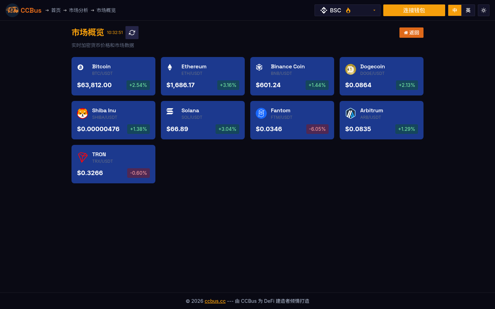

  

    
  

  

    <h1>第四章：共识机制</h1>
    
🎙️ 本章讲师:<strong>Captain CCBus</strong> · 共识机制的"调度主管"

  

  
<strong>本章导读</strong>

  
共识机制是区块链的核心,它确保分布式网络中的所有节点对账本状态达成一致。本章将深入探讨主流共识机制的工作原理、优缺点及其在不同区块链系统中的应用。

  
<strong>学习目标：</strong>

  <ul>
    <li>理解共识机制的本质和重要性</li>
    <li>掌握PoW、PoS、DPoS等主流共识算法</li>
    <li>了解拜占庭容错问题及其解决方案</li>
    <li>比较不同共识机制的性能与安全性</li>
    <li>认识共识机制的发展趋势</li>
  </ul>

## 4.0 2025-2026 视角:为什么这一章要重新读

共识机制在 2025-2026 年已经从"PoW vs PoS 二元辩论"演化为**多极共存 + 共享安全 + 模块化共识**的复杂格局。本章你需要重读的核心变化:

1. **PoS 主导 L1,PoW 退守 BTC + 部分新链**:
   - **以太坊**(PoS 2022 至今)TVL 占加密总市场 58%;信标链持有 1.05 亿 ETH
   - **BNB Chain**(PoSA = PoS + Authority)日交易量 600 万+
   - **Solana**(PoH + PoS + Tower BFT)TPS 实测 3000+
   - **比特币**(PoW)虽未升级共识,但通过 Babylon、BitVM 等 L2 间接融入 PoS 经济

2. **Restaking + 共享安全的崛起**:
   - **EigenLayer**(2023-06 主网)TVL 突破 200 亿美元;通过 restaking ETH 保护其他 AVS(Actively Validated Services)
   - **Symbiotic**(2024-09) 跨链 restaking 协议
   - **Karak**(2024-Q3) 与 Mantle、DSRV 集成
   - **EigenLayer AVS 生态**:跨链桥(LayerZero AVS)、数据可用性(EigenDA)、预言机(Chainlink CRE)、AI 推理(0G Labs)

3. **DAG 共识与并行执行的新进展**:
   - **Aptos、Sui、Movement** 用 Block-STM 实现的并行执行引擎,TPS 16 万+
   - **Monad**(2025-10 即将上线)用 MonadBFT + 乐观并行,TPS 1 万
   - **Sei V2**(2024-Q4)并行化 EVM 链

4. **基于质押经济的新攻击向量**:
   - **Long-range attack**(长程攻击):PoS 链历史上可通过重写历史来恢复密钥
   - **Sandwich on validator selection**:验证者选择算法的可预测性被利用
   - **MEV-Boost / 中心化 MEV 中继**:Flashbots 的 mev-boost 占据以太坊 90% 区块

5. **共识机制的不可能三角在 2026 年部分被打破**:
   - **去中心化 × 安全性 × 可扩展性** 的传统不可能三角,在 DA 层分离后,每个维度可以独立扩展
   - **Celestia + DA 层** 让执行层可以独立追求高 TPS,DA 层用 PoS 提供安全性
   - **EigenLayer + AVS** 让复用安全性变得像"租赁云服务"一样简单

### 🖥️ 真实案例:CCBus 多链支持背后的共识

CCBus 同时支持 BNB Chain(PoSA)、Solana(PoH+PoS)、Base(Op-Stack/OP Stack)、Arbitrum(AnyTrust)等十余条链,这意味着用户每一次发币、添加流动性、跨链桥的操作,都涉及到不同共识机制的差异。下图是 CCBus 的市场概览,可以看到它聚合了多条链的实时数据。

*图 4-1:CCBus 市场概览。这是 PoS 链 + OP Stack + zkEVM + Solana 多种共识共存的实际场景——一个前端同时订阅十几条链的最终性(finality)和重组(reorg)事件。*

## 4.1 什么是共识机制？

**共识机制**（Consensus Mechanism）是分布式系统中多个节点就某个提案或状态达成一致意见的过程和算法。在区块链网络中,共识机制解决了如何在没有中央权威的情况下,让所有节点对交易顺序和区块链状态达成共识。

### 共识机制的核心目标

<svg class="svg-4-0" viewBox="0 0 700 400" xmlns="http://www.w3.org/2000/svg" style="width: 100%; max-width: 800px; display: block; margin: 0 auto;">
<defs>

    <marker id="cons-arrow-1" markerWidth="6" markerHeight="6" refX="6" refY="3" orient="auto">
      <polygon points="0 0, 6 3, 0 6" fill="#df6919"/>
    </marker>
  </defs>
  <text class="cons-text-title" x="350" y="25" text-anchor="middle">共识机制的四大核心目标</text>
  <circle class="cons-circle-center" cx="350" cy="200" r="50"/>
  <text class="cons-text" x="350" y="195" text-anchor="middle" font-weight="bold">共识机制</text>
  <text class="cons-text-small" x="350" y="210" text-anchor="middle">Consensus</text>
  <circle class="cons-circle-goal" cx="150" cy="100" r="60"/>
  <text class="cons-text" x="150" y="90" text-anchor="middle" font-weight="bold">一致性</text>
  <text class="cons-text-small" x="150" y="105" text-anchor="middle">Consistency</text>
  <text class="cons-text-small" x="150" y="125" text-anchor="middle">所有诚实节点</text>
  <text class="cons-text-small" x="150" y="138" text-anchor="middle">对状态达成一致</text>
  <line class="cons-line" x1="200" y1="130" x2="310" y2="170" marker-end="url(#cons-arrow-1)"/>
  <circle class="cons-circle-goal" cx="550" cy="100" r="60"/>
  <text class="cons-text" x="550" y="90" text-anchor="middle" font-weight="bold">容错性</text>
  <text class="cons-text-small" x="550" y="105" text-anchor="middle">Fault Tolerance</text>
  <text class="cons-text-small" x="550" y="125" text-anchor="middle">抵御恶意节点</text>
  <text class="cons-text-small" x="550" y="138" text-anchor="middle">和网络故障</text>
  <line class="cons-line" x1="500" y1="130" x2="390" y2="170" marker-end="url(#cons-arrow-1)"/>
  <circle class="cons-circle-goal" cx="150" cy="300" r="60"/>
  <text class="cons-text" x="150" y="290" text-anchor="middle" font-weight="bold">活性</text>
  <text class="cons-text-small" x="150" y="305" text-anchor="middle">Liveness</text>
  <text class="cons-text-small" x="150" y="325" text-anchor="middle">系统持续产生</text>
  <text class="cons-text-small" x="150" y="338" text-anchor="middle">新区块</text>
  <line class="cons-line" x1="200" y1="270" x2="310" y2="230" marker-end="url(#cons-arrow-1)"/>
  <circle class="cons-circle-goal" cx="550" cy="300" r="60"/>
  <text class="cons-text" x="550" y="290" text-anchor="middle" font-weight="bold">最终性</text>
  <text class="cons-text-small" x="550" y="305" text-anchor="middle">Finality</text>
  <text class="cons-text-small" x="550" y="325" text-anchor="middle">已确认交易</text>
  <text class="cons-text-small" x="550" y="338" text-anchor="middle">不可撤销</text>
  <line class="cons-line" x1="500" y1="270" x2="390" y2="230" marker-end="url(#cons-arrow-1)"/>
  <text class="cons-text-small" x="350" y="380" text-anchor="middle" font-style="italic">平衡这四个目标是设计共识机制的关键挑战</text>
</svg>

### 拜占庭将军问题

共识机制需要解决的核心问题是**拜占庭将军问题**（Byzantine Generals Problem）,这是一个经典的分布式系统难题。

#### 问题描述

假设拜占庭帝国的将军们围攻一座城市,他们需要协调一致决定是进攻还是撤退。但是:

- 将军们分散各处,只能通过信使传递消息
- 部分将军可能是叛徒,会发送虚假信息
- 所有忠诚的将军必须达成一致决策
- 少数叛徒不能影响忠诚将军的一致性

<svg viewBox="0 0 700 350" xmlns="http://www.w3.org/2000/svg" style="width: 100%; max-width: 800px; display: block; margin: 0 auto;">
  <defs>
    
</defs>
  <text class="byz-text-title" x="350" y="25" text-anchor="middle">拜占庭将军问题示意图</text>
  <rect class="byz-rect-city" x="280" y="140" width="140" height="80" rx="4"/>
  <text class="byz-text" x="350" y="170" text-anchor="middle" font-weight="bold">🏰 城市</text>
  <text class="byz-text-small" x="350" y="185" text-anchor="middle">需要协调进攻</text>
  <circle class="byz-circle-loyal" cx="350" cy="60" r="25"/>
  <text class="byz-text" x="350" y="63" text-anchor="middle">将军A</text>
  <text class="byz-text-small" x="350" y="75" text-anchor="middle">(指挥官)</text>
  <circle class="byz-circle-loyal" cx="150" cy="180" r="25"/>
  <text class="byz-text" x="150" y="183" text-anchor="middle">将军B</text>
  <text class="byz-text-small" x="150" y="195" text-anchor="middle">(忠诚)</text>
  <circle class="byz-circle-traitor" cx="150" cy="280" r="25"/>
  <text class="byz-text" x="150" y="283" text-anchor="middle">将军C</text>
  <text class="byz-text-small" x="150" y="295" text-anchor="middle">(叛徒)</text>
  <circle class="byz-circle-loyal" cx="550" cy="180" r="25"/>
  <text class="byz-text" x="550" y="183" text-anchor="middle">将军D</text>
  <text class="byz-text-small" x="550" y="195" text-anchor="middle">(忠诚)</text>
  <circle class="byz-circle-loyal" cx="550" cy="280" r="25"/>
  <text class="byz-text" x="550" y="283" text-anchor="middle">将军E</text>
  <text class="byz-text-small" x="550" y="295" text-anchor="middle">(忠诚)</text>
  <line class="byz-line-true" x1="350" y1="85" x2="170" y2="160"/>
  <text class="byz-text-small" x="250" y="115" fill="#5cb85c">进攻</text>
  <line class="byz-line-true" x1="350" y1="85" x2="530" y2="160"/>
  <text class="byz-text-small" x="450" y="115" fill="#5cb85c">进攻</text>
  <line class="byz-line-false" x1="350" y1="85" x2="530" y2="260"/>
  <text class="byz-text-small" x="450" y="165" fill="#d9534f">撤退</text>
  <line class="byz-line-false" x1="150" y1="255" x2="150" y2="205"/>
  <text class="byz-text-small" x="120" y="230" fill="#d9534f">撤退</text>
  <line class="byz-line-false" x1="175" y1="275" x2="525" y2="275"/>
  <text class="byz-text-small" x="350" y="270" fill="#d9534f">进攻</text>
  <text class="byz-text" x="50" y="330" fill="#5cb85c">✓ 忠诚将军 (3人)</text>
  <text class="byz-text" x="250" y="330" fill="#d9534f">✗ 叛徒将军 (1人)</text>
  <text class="byz-text-small" x="350" y="345" text-anchor="middle" font-style="italic">叛徒发送矛盾信息,试图破坏共识</text>
</svg>

#### 区块链中的拜占庭问题

在区块链网络中,这个问题体现为:

- **节点** = 将军
- **恶意节点** = 叛徒
- **交易顺序/区块** = 决策内容
- **共识机制** = 协调算法

### 共识机制的分类

根据不同维度,共识机制可以分为多种类型:

| 分类维度 | 类型 | 代表机制 |
|---------|------|----------|
| **资源依赖** | 计算资源 | PoW |
| | 权益资源 | PoS, DPoS |
| | 存储资源 | PoC, PoST |
| **容错类型** | 崩溃容错 (CFT) | Paxos, Raft |
| | 拜占庭容错 (BFT) | PBFT, Tendermint |
| **参与方式** | 无需许可 | PoW, PoS |
| | 需要许可 | PBFT, Raft |
| **选择机制** | 竞争选择 | PoW |
| | 投票选择 | DPoS, PBFT |
| | 随机选择 | PoS (Algorand) |

## 4.2 工作量证明 (PoW)

**工作量证明**（Proof of Work, PoW）是最早也是最成熟的共识机制,由比特币首次应用。它通过要求节点完成一定量的计算工作来获得记账权。

### PoW 工作原理

<svg class="svg-4-1" viewBox="0 0 700 450" xmlns="http://www.w3.org/2000/svg" style="width: 100%; max-width: 800px; display: block; margin: 0 auto;">
<defs>

    <marker id="pow-arrow" markerWidth="6" markerHeight="6" refX="6" refY="3" orient="auto">
      <polygon points="0 0, 6 3, 0 6" fill="#4c9be8"/>
    </marker>
  </defs>
  <text class="pow-text-title" x="350" y="25" text-anchor="middle">PoW 挖矿流程</text>
  <rect class="pow-rect-step" x="250" y="50" width="200" height="40" rx="4"/>
  <text class="pow-text" x="350" y="65" text-anchor="middle" font-weight="bold">1. 收集待确认交易</text>
  <text class="pow-text-small" x="350" y="80" text-anchor="middle">从交易池选择交易组成区块</text>
  <line class="pow-line" x1="350" y1="90" x2="350" y2="110" marker-end="url(#pow-arrow)"/>
  <rect class="pow-rect-step" x="250" y="110" width="200" height="40" rx="4"/>
  <text class="pow-text" x="350" y="125" text-anchor="middle" font-weight="bold">2. 构造区块头</text>
  <text class="pow-text-small" x="350" y="140" text-anchor="middle">包含: 前区块哈希 + Merkle根 + 时间戳</text>
  <line class="pow-line" x1="350" y1="150" x2="350" y2="170" marker-end="url(#pow-arrow)"/>
  <rect class="pow-rect-step" x="250" y="170" width="200" height="50" rx="4"/>
  <text class="pow-text" x="350" y="185" text-anchor="middle" font-weight="bold">3. 尝试不同 Nonce 值</text>
  <text class="pow-text-small" x="350" y="200" text-anchor="middle">Nonce = 0, 1, 2, 3, ...</text>
  <text class="pow-text-small" x="350" y="213" text-anchor="middle">计算: Hash = SHA256(区块头)</text>
  <line class="pow-line" x1="350" y1="220" x2="350" y2="240" marker-end="url(#pow-arrow)"/>
  <rect class="pow-rect-step" x="220" y="240" width="260" height="50" rx="4"/>
  <text class="pow-text" x="350" y="255" text-anchor="middle" font-weight="bold">4. 检查哈希值是否满足难度目标</text>
  <text class="pow-text-small" x="350" y="270" text-anchor="middle">Hash &lt; Target ?</text>
  <text class="pow-text-small" x="350" y="283" text-anchor="middle">(前导零个数 ≥ 难度要求)</text>
  <line class="pow-line" x1="220" y1="265" x2="120" y2="265"/>
  <line class="pow-line" x1="120" y1="265" x2="120" y2="195"/>
  <line class="pow-line" x1="120" y1="195" x2="250" y2="195" marker-end="url(#pow-arrow)"/>
  <text class="pow-text-small" x="150" y="230" fill="#d9534f">否: 更换Nonce</text>
  <line class="pow-line" x1="350" y1="290" x2="350" y2="310" marker-end="url(#pow-arrow)"/>
  <text class="pow-text-small" x="390" y="302" fill="#5cb85c">是</text>
  <rect class="pow-rect-success" x="250" y="310" width="200" height="40" rx="4"/>
  <text class="pow-text" x="350" y="325" text-anchor="middle" font-weight="bold">5. 找到有效解!</text>
  <text class="pow-text-small" x="350" y="340" text-anchor="middle">广播区块到网络</text>
  <line class="pow-line" x1="350" y1="350" x2="350" y2="370" marker-end="url(#pow-arrow)"/>
  <rect class="pow-rect-success" x="250" y="370" width="200" height="50" rx="4"/>
  <text class="pow-text" x="350" y="385" text-anchor="middle" font-weight="bold">6. 其他节点验证</text>
  <text class="pow-text-small" x="350" y="400" text-anchor="middle">验证通过 → 添加到主链</text>
  <text class="pow-text-small" x="350" y="413" text-anchor="middle">矿工获得区块奖励 + 交易费</text>
  <rect class="pow-rect-fail" x="520" y="170" width="150" height="50" rx="4"/>
  <text class="pow-text" x="595" y="185" text-anchor="middle" fill="#d9534f" font-weight="bold">竞争失败</text>
  <text class="pow-text-small" x="595" y="200" text-anchor="middle">其他矿工先找到解</text>
  <text class="pow-text-small" x="595" y="213" text-anchor="middle">→ 放弃当前区块</text>
  <line class="pow-line" x1="450" y1="195" x2="520" y2="195" marker-end="url(#pow-arrow)"/>
  <text class="pow-text-small" x="350" y="442" text-anchor="middle" font-style="italic">平均每10分钟产生一个新区块 (比特币)</text>
</svg>

### PoW 的数学原理

挖矿过程就是寻找一个 Nonce 值,使得:

$$
\text{SHA256}(\text{SHA256}(\text{BlockHeader})) < \text{Target}
$$

其中:
- **Target** (目标值): 由难度值决定,前导零越多难度越大
- **Nonce**: 随机数,范围 $0$ 到 $2^{32} - 1$
- **难度调整**: 每2016个区块调整一次,保持平均10分钟出块

#### 难度计算

$$
\text{Difficulty} = \frac{\text{Max Target}}{\text{Current Target}}
$$

$$
\text{New Difficulty} = \text{Old Difficulty} \times \frac{20160 \text{ minutes}}{\text{Actual Time}}
$$

### PoW 的优缺点

#### 优点

1. **安全性高**
   - 51%攻击成本极高
   - 已被比特币验证13年以上

2. **完全去中心化**
   - 任何人都可以参与挖矿
   - 无需许可

3. **激励机制明确**
   - 区块奖励 + 交易费
   - 经济博弈理论保证诚实行为

#### 缺点

1. **能源消耗巨大**
   - 比特币年耗电量超过阿根廷全国
   - 环境影响显著

2. **交易确认慢**
   - 比特币: ~10分钟/区块
   - 需要多个确认才能保证最终性

3. **算力中心化风险**
   - 矿池集中度高
   - ASIC 矿机导致普通用户无法参与

4. **吞吐量低**
   - 比特币: ~7 TPS
   - 以太坊 (PoW): ~15 TPS

### PoW 的变种

| 变种 | 代表币种 | 特点 |
|-----|---------|------|
| **SHA-256** | Bitcoin | 最经典,ASIC友好 |
| **Ethash** | Ethereum 1.0 | 内存困难,抗ASIC |
| **Equihash** | Zcash | 内存困难 |
| **Scrypt** | Litecoin | 抗ASIC (早期) |
| **RandomX** | Monero | CPU友好,抗ASIC |

## 4.3 权益证明 (PoS)

**权益证明**（Proof of Stake, PoS）通过持有代币数量和时间来获得记账权,而不是通过计算能力竞争。

### PoS 核心概念

在 PoS 系统中:
- **验证者** (Validator): 质押代币的节点
- **质押** (Staking): 锁定一定数量代币作为保证金
- **惩罚** (Slashing): 恶意行为会被没收质押金

<svg viewBox="0 0 700 400" xmlns="http://www.w3.org/2000/svg" style="width: 100%; max-width: 800px; display: block; margin: 0 auto;">
  <defs>
    
    <marker id="pos-arrow" markerWidth="6" markerHeight="6" refX="6" refY="3" orient="auto">
      <polygon points="0 0, 6 3, 0 6" fill="#4c9be8"/>
    </marker>
  </defs>
  <text class="pos-text-title" x="350" y="25" text-anchor="middle">PoS 验证者选择流程</text>
  <rect class="pos-rect-step" x="50" y="60" width="120" height="50" rx="4"/>
  <text class="pos-text" x="110" y="75" text-anchor="middle" font-weight="bold">验证者池</text>
  <text class="pos-text-small" x="110" y="90" text-anchor="middle">质押32 ETH</text>
  <text class="pos-text-small" x="110" y="102" text-anchor="middle">验证者1-1000</text>
  <rect class="pos-rect-validator" x="50" y="140" width="120" height="35" rx="4"/>
  <text class="pos-text-small" x="110" y="155" text-anchor="middle">验证者 #42</text>
  <text class="pos-text-small" x="110" y="168" text-anchor="middle">质押: 32 ETH</text>
  <rect class="pos-rect-validator" x="50" y="185" width="120" height="35" rx="4"/>
  <text class="pos-text-small" x="110" y="200" text-anchor="middle">验证者 #137</text>
  <text class="pos-text-small" x="110" y="213" text-anchor="middle">质押: 64 ETH</text>
  <rect class="pos-rect-validator" x="50" y="230" width="120" height="35" rx="4"/>
  <text class="pos-text-small" x="110" y="245" text-anchor="middle">验证者 #891</text>
  <text class="pos-text-small" x="110" y="258" text-anchor="middle">质押: 32 ETH</text>
  <circle class="pos-circle" cx="300" cy="150" r="70"/>
  <text class="pos-text" x="300" y="140" text-anchor="middle" font-weight="bold">随机选择算法</text>
  <text class="pos-text-small" x="300" y="155" text-anchor="middle">基于:</text>
  <text class="pos-text-small" x="300" y="168" text-anchor="middle">• 质押金额</text>
  <text class="pos-text-small" x="300" y="181" text-anchor="middle">• 质押时间</text>
  <line class="pos-line" x1="170" y1="90" x2="230" y2="130" marker-end="url(#pos-arrow)"/>
  <line class="pos-line" x1="370" y1="150" x2="480" y2="150" marker-end="url(#pos-arrow)"/>
  <rect class="pos-rect-step" x="480" y="120" width="180" height="60" rx="4"/>
  <text class="pos-text" x="570" y="140" text-anchor="middle" font-weight="bold">被选中的验证者</text>
  <text class="pos-text-small" x="570" y="155" text-anchor="middle">创建新区块</text>
  <text class="pos-text-small" x="570" y="168" text-anchor="middle">打包交易</text>
  <line class="pos-line" x1="570" y1="180" x2="570" y2="220" marker-end="url(#pos-arrow)"/>
  <rect class="pos-rect-step" x="480" y="220" width="180" height="60" rx="4"/>
  <text class="pos-text" x="570" y="240" text-anchor="middle" font-weight="bold">其他验证者验证</text>
  <text class="pos-text-small" x="570" y="255" text-anchor="middle">验证区块有效性</text>
  <text class="pos-text-small" x="570" y="268" text-anchor="middle">2/3 多数通过 → 确认</text>
  <line class="pos-line" x1="570" y1="280" x2="570" y2="310" marker-end="url(#pos-arrow)"/>
  <rect class="pos-rect-step" x="480" y="310" width="180" height="50" rx="4"/>
  <text class="pos-text" x="570" y="330" text-anchor="middle" font-weight="bold">获得奖励</text>
  <text class="pos-text-small" x="570" y="345" text-anchor="middle">区块奖励 + 交易费</text>
  <rect class="pos-rect-step" x="50" y="310" width="120" height="50" rx="4"/>
  <text class="pos-text" x="110" y="325" text-anchor="middle" font-weight="bold" fill="#d9534f">恶意行为</text>
  <text class="pos-text-small" x="110" y="340" text-anchor="middle">双重签名</text>
  <text class="pos-text-small" x="110" y="353" text-anchor="middle">离线不参与</text>
  <line class="pos-line" x1="170" y1="335" x2="280" y2="335" marker-end="url(#pos-arrow)" stroke="#d9534f"/>
  <rect class="pos-rect-step" x="280" y="310" width="120" height="50" rx="4"/>
  <text class="pos-text" x="340" y="330" text-anchor="middle" font-weight="bold" fill="#d9534f">Slashing 惩罚</text>
  <text class="pos-text-small" x="340" y="345" text-anchor="middle">扣除质押金</text>
  <text class="pos-text-small" x="340" y="358" text-anchor="middle">强制退出</text>
  <text class="pos-text-small" x="350" y="390" text-anchor="middle" font-style="italic">经济激励确保验证者诚实行为</text>
</svg>

### PoS 的变种

#### 1. 纯 PoS (Pure PoS)
- **代表**: Algorand
- **特点**: 完全基于权益,VRF 随机选择
- **优势**: 即时最终性

#### 2. BFT-PoS (拜占庭容错 PoS)
- **代表**: Ethereum 2.0 (Casper FFG), Cosmos (Tendermint)
- **特点**: 结合 PoS 和 BFT 共识
- **优势**: 更强的最终性保证

#### 3. LPoS (Liquid PoS)
- **代表**: Tezos
- **特点**: 支持委托,但委托人保留投票权
- **优势**: 更灵活的参与方式

### 以太坊 2.0 的 PoS

以太坊于2022年9月完成 "The Merge",从 PoW 切换到 PoS。

#### 关键参数

- **最小质押**: 32 ETH
- **验证者数量**: 理论上无上限
- **出块时间**: 12秒
- **Epoch**: 32个 Slot (6.4分钟)
- **Finality**: 2个 Epoch (~12.8分钟)

#### 奖励机制

$$
\text{Base Reward} = \frac{\text{Effective Balance} \times \text{Base Reward Factor}}{\sqrt{\text{Total Active Balance}}}
$$

### PoS vs PoW 对比

| 特性 | PoW | PoS |
|-----|-----|-----|
| **资源消耗** | 极高 (电力) | 极低 |
| **硬件要求** | 专用矿机 | 普通服务器 |
| **准入门槛** | 高 (设备投资) | 中 (质押代币) |
| **51%攻击成本** | 算力成本 | 代币成本 (更高) |
| **出块时间** | 较慢 (~10分钟) | 快 (~12秒) |
| **最终性** | 概率最终性 | 确定性最终性 |
| **去中心化** | 矿池集中 | 理论上更分散 |
| **环保性** | ❌ | ✅ |

## 4.4 委托权益证明 (DPoS)

**委托权益证明**（Delegated Proof of Stake, DPoS）是 PoS 的优化版本,通过投票选举少数代表节点来产生区块。

### DPoS 工作流程

<svg viewBox="0 0 700 380" xmlns="http://www.w3.org/2000/svg" style="width: 100%; max-width: 800px; display: block; margin: 0 auto;">
  <defs>
    
    <marker id="dpos-arrow" markerWidth="6" markerHeight="6" refX="6" refY="3" orient="auto">
      <polygon points="0 0, 6 3, 0 6" fill="#df6919"/>
    </marker>
  </defs>
  <text class="dpos-text-title" x="350" y="25" text-anchor="middle">DPoS 投票与出块机制</text>
  <text class="dpos-text" x="350" y="50" text-anchor="middle" font-weight="bold">1. 代币持有者投票</text>
  <circle class="dpos-circle-holder" cx="100" cy="100" r="25"/>
  <text class="dpos-text-small" x="100" y="100" text-anchor="middle">持有者A</text>
  <text class="dpos-text-small" x="100" y="112" text-anchor="middle">1000 EOS</text>
  <circle class="dpos-circle-holder" cx="200" cy="100" r="25"/>
  <text class="dpos-text-small" x="200" y="100" text-anchor="middle">持有者B</text>
  <text class="dpos-text-small" x="200" y="112" text-anchor="middle">5000 EOS</text>
  <circle class="dpos-circle-holder" cx="300" cy="100" r="25"/>
  <text class="dpos-text-small" x="300" y="100" text-anchor="middle">持有者C</text>
  <text class="dpos-text-small" x="300" y="112" text-anchor="middle">2000 EOS</text>
  <circle class="dpos-circle-holder" cx="400" cy="100" r="25"/>
  <text class="dpos-text-small" x="400" y="100" text-anchor="middle">持有者D</text>
  <text class="dpos-text-small" x="400" y="112" text-anchor="middle">500 EOS</text>
  <circle class="dpos-circle-holder" cx="500" cy="100" r="25"/>
  <text class="dpos-text-small" x="500" y="100" text-anchor="middle">持有者E</text>
  <text class="dpos-text-small" x="500" y="112" text-anchor="middle">3000 EOS</text>
  <circle class="dpos-circle-holder" cx="600" cy="100" r="25"/>
  <text class="dpos-text-small" x="600" y="100" text-anchor="middle">...</text>
  <text class="dpos-text-small" x="600" y="112" text-anchor="middle">更多持有者</text>
  <text class="dpos-text-small" x="150" y="140">🗳️ 投票</text>
  <line class="dpos-line" x1="100" y1="125" x2="150" y2="180" marker-end="url(#dpos-arrow)"/>
  <line class="dpos-line" x1="200" y1="125" x2="250" y2="180" marker-end="url(#dpos-arrow)"/>
  <line class="dpos-line" x1="300" y1="125" x2="350" y2="180" marker-end="url(#dpos-arrow)"/>
  <line class="dpos-line" x1="400" y1="125" x2="450" y2="180" marker-end="url(#dpos-arrow)"/>
  <line class="dpos-line" x1="500" y1="125" x2="550" y2="180" marker-end="url(#dpos-arrow)"/>
  <text class="dpos-text" x="350" y="175" text-anchor="middle" font-weight="bold">2. 选出21个超级节点 (见证人)</text>
  <rect class="dpos-rect-witness" x="80" y="200" width="80" height="35" rx="3"/>
  <text class="dpos-text-small" x="120" y="215" text-anchor="middle">见证人 #1</text>
  <text class="dpos-text-small" x="120" y="228" text-anchor="middle">得票: 50万</text>
  <rect class="dpos-rect-witness" x="180" y="200" width="80" height="35" rx="3"/>
  <text class="dpos-text-small" x="220" y="215" text-anchor="middle">见证人 #2</text>
  <text class="dpos-text-small" x="220" y="228" text-anchor="middle">得票: 48万</text>
  <rect class="dpos-rect-witness" x="280" y="200" width="80" height="35" rx="3"/>
  <text class="dpos-text-small" x="320" y="215" text-anchor="middle">见证人 #3</text>
  <text class="dpos-text-small" x="320" y="228" text-anchor="middle">得票: 45万</text>
  <rect class="dpos-rect-witness" x="380" y="200" width="80" height="35" rx="3"/>
  <text class="dpos-text-small" x="420" y="215" text-anchor="middle">...</text>
  <text class="dpos-text-small" x="420" y="228" text-anchor="middle">...</text>
  <rect class="dpos-rect-witness" x="480" y="200" width="80" height="35" rx="3"/>
  <text class="dpos-text-small" x="520" y="215" text-anchor="middle">见证人 #21</text>
  <text class="dpos-text-small" x="520" y="228" text-anchor="middle">得票: 30万</text>
  <text class="dpos-text" x="350" y="260" text-anchor="middle" font-weight="bold">3. 轮流出块 (每0.5秒)</text>
  <rect class="dpos-rect-witness" x="140" y="280" width="100" height="30" rx="3"/>
  <text class="dpos-text-small" x="190" y="298" text-anchor="middle">区块 #1000: 见证人 #1</text>
  <rect class="dpos-rect-witness" x="260" y="280" width="100" height="30" rx="3"/>
  <text class="dpos-text-small" x="310" y="298" text-anchor="middle">区块 #1001: 见证人 #2</text>
  <rect class="dpos-rect-witness" x="380" y="280" width="100" height="30" rx="3"/>
  <text class="dpos-text-small" x="430" y="298" text-anchor="middle">区块 #1002: 见证人 #3</text>
  <text class="dpos-text-small" x="350" y="330" text-anchor="middle">每轮21个见证人各产生1个区块 → 循环往复</text>
  <text class="dpos-text" x="50" y="360" font-weight="bold">✅ 优势:</text>
  <text class="dpos-text-small" x="50" y="373">高性能 (EOS: 4000 TPS)</text>
  <text class="dpos-text" x="350" y="360" font-weight="bold">⚠️ 挑战:</text>
  <text class="dpos-text-small" x="350" y="373">中心化风险 (仅21个节点)</text>
</svg>

### DPoS 的特点

#### 优点
1. **高性能**: EOS可达4000+ TPS
2. **快速确认**: 亚秒级出块
3. **能源高效**: 仅21个节点运行
4. **灵活治理**: 可投票更换见证人

#### 缺点
1. **中心化**: 仅21个超级节点
2. **投票操纵**: 大户可能控制选举
3. **卡特尔风险**: 见证人可能串通
4. **活性依赖**: 需要2/3+1见证人在线

### DPoS 代表项目

| 项目 | 见证人数量 | 出块时间 | TPS |
|------|----------|---------|-----|
| **EOS** | 21 | 0.5秒 | 4000+ |
| **TRON** | 27 | 3秒 | 2000 |
| **Lisk** | 101 | 10秒 | ~100 |
| **Ark** | 51 | 8秒 | ~50 |

## 4.5 实用拜占庭容错 (PBFT)

**实用拜占庭容错**（Practical Byzantine Fault Tolerance, PBFT）是一种经典的拜占庭容错算法,在许可链中广泛应用。

### PBFT 三阶段协议

<svg viewBox="0 0 650 500" xmlns="http://www.w3.org/2000/svg" style="width: 100%; max-width: 800px; display: block; margin: 0 auto;">
  <defs>
    
    <marker id="pbft-arrow-blue" markerWidth="8" markerHeight="8" refX="8" refY="4" orient="auto">
      <polygon points="0 0, 8 4, 0 8" fill="#4c9be8"/>
    </marker>
    <marker id="pbft-arrow-orange" markerWidth="6" markerHeight="6" refX="6" refY="3" orient="auto">
      <polygon points="0 0, 6 3, 0 6" fill="#df6919"/>
    </marker>
  </defs>
  <text class="pbft-text-title" x="325" y="25" text-anchor="middle">PBFT 三阶段共识流程 (4节点示例)</text>
  <rect x="20" y="45" width="110" height="60" rx="4" fill="rgba(52, 81, 178, 0.04)" stroke="#4c9be8" stroke-width="0.5"/>
  <text class="pbft-text" x="75" y="62" text-anchor="middle" font-weight="bold">节点配置</text>
  <text class="pbft-text-small" x="30" y="78">• 总节点: n = 4</text>
  <text class="pbft-text-small" x="30" y="90">• 容错数: f = 1</text>
  <text class="pbft-text-small" x="30" y="102">• 阈值: 2f+1 = 3</text>
  <circle class="pbft-node-primary" cx="200" cy="75" r="22"/>
  <text class="pbft-text-small" x="200" y="72" text-anchor="middle" font-weight="bold">主节点</text>
  <text class="pbft-text-small" x="200" y="83" text-anchor="middle">Primary</text>
  <circle class="pbft-node-backup" cx="280" cy="75" r="18"/>
  <text class="pbft-text-small" x="280" y="78" text-anchor="middle">B1</text>
  <circle class="pbft-node-backup" cx="340" cy="75" r="18"/>
  <text class="pbft-text-small" x="340" y="78" text-anchor="middle">B2</text>
  <circle class="pbft-node-backup" cx="400" cy="75" r="18"/>
  <text class="pbft-text-small" x="400" y="78" text-anchor="middle">B3</text>
  <rect class="pbft-box-phase" x="30" y="125" width="590" height="80" rx="4"/>
  <circle class="pbft-circle-step" cx="50" cy="145" r="12"/>
  <text class="pbft-text" x="50" y="150" text-anchor="middle" font-weight="bold">1</text>
  <text class="pbft-text" x="70" y="145" font-weight="bold">阶段1: Pre-Prepare (预准备)</text>
  <text class="pbft-text-small" x="70" y="161">• 主节点接收客户端请求</text>
  <text class="pbft-text-small" x="70" y="174">• 分配序号并广播消息: &lt;PRE-PREPARE, v, n, d&gt;</text>
  <text class="pbft-text-small" x="70" y="187">• v=视图编号, n=序列号, d=请求摘要</text>
  <line class="pbft-line-flow" x1="200" y1="97" x2="200" y2="125" marker-end="url(#pbft-arrow-blue)"/>
  <path class="pbft-line-broadcast" d="M 220 105 Q 250 115, 280 100" marker-end="url(#pbft-arrow-orange)"/>
  <path class="pbft-line-broadcast" d="M 220 110 Q 270 125, 340 105" marker-end="url(#pbft-arrow-orange)"/>
  <path class="pbft-line-broadcast" d="M 220 115 Q 290 135, 400 110" marker-end="url(#pbft-arrow-orange)"/>
  <text class="pbft-text-label" x="250" y="125">广播</text>
  <rect class="pbft-box-phase" x="30" y="225" width="590" height="95" rx="4"/>
  <circle class="pbft-circle-step" cx="50" cy="245" r="12"/>
  <text class="pbft-text" x="50" y="250" text-anchor="middle" font-weight="bold">2</text>
  <text class="pbft-text" x="70" y="245" font-weight="bold">阶段2: Prepare (准备)</text>
  <text class="pbft-text-small" x="70" y="261">• 备份节点验证PRE-PREPARE消息 (检查序号、摘要、签名)</text>
  <text class="pbft-text-small" x="70" y="274">• 验证通过后,各节点广播: &lt;PREPARE, v, n, d, i&gt;</text>
  <text class="pbft-text-small" x="70" y="287">• i=节点标识</text>
  <rect x="70" y="295" width="535" height="18" rx="2" fill="rgba(52, 81, 178, 0.05)" stroke="#4c9be8" stroke-width="0.5"/>
  <text class="pbft-text-small" x="75" y="307" font-weight="bold">🔄 全网广播 → 每个节点收集PREPARE消息 → 达到2f+1=3个 → 进入prepared状态</text>
  <line class="pbft-line-flow" x1="280" y1="205" x2="280" y2="225" marker-end="url(#pbft-arrow-blue)"/>
  <line class="pbft-line-flow" x1="340" y1="205" x2="340" y2="225" marker-end="url(#pbft-arrow-blue)"/>
  <line class="pbft-line-flow" x1="400" y1="205" x2="400" y2="225" marker-end="url(#pbft-arrow-blue)"/>
  <rect class="pbft-box-phase" x="30" y="340" width="590" height="95" rx="4"/>
  <circle class="pbft-circle-step" cx="50" cy="360" r="12"/>
  <text class="pbft-text" x="50" y="365" text-anchor="middle" font-weight="bold">3</text>
  <text class="pbft-text" x="70" y="360" font-weight="bold">阶段3: Commit (提交)</text>
  <text class="pbft-text-small" x="70" y="376">• 进入prepared状态的节点广播: &lt;COMMIT, v, n, d, i&gt;</text>
  <text class="pbft-text-small" x="70" y="389">• 收到2f+1=3个COMMIT消息后 → 执行请求</text>
  <text class="pbft-text-small" x="70" y="402">• 将回复发送给客户端</text>
  <rect x="70" y="410" width="535" height="18" rx="2" fill="rgba(92, 184, 92, 0.07)" stroke="#5cb85c" stroke-width="0.5"/>
  <text class="pbft-text-small" x="75" y="422" font-weight="bold">✓ 客户端收到f+1=2个相同回复 → 确认操作已被正确执行</text>
  <line class="pbft-line-flow" x1="200" y1="320" x2="200" y2="340" marker-end="url(#pbft-arrow-blue)"/>
  <line class="pbft-line-flow" x1="280" y1="320" x2="280" y2="340" marker-end="url(#pbft-arrow-blue)"/>
  <line class="pbft-line-flow" x1="340" y1="320" x2="340" y2="340" marker-end="url(#pbft-arrow-blue)"/>
  <line class="pbft-line-flow" x1="400" y1="320" x2="400" y2="340" marker-end="url(#pbft-arrow-blue)"/>
  <rect x="30" y="455" width="590" height="35" rx="4" fill="rgba(223, 105, 25, 0.05)" stroke="#df6919" stroke-width="1"/>
  <text class="pbft-text" x="325" y="470" text-anchor="middle" font-weight="bold">共识完成 - 系统状态一致</text>
  <text class="pbft-text-small" x="325" y="484" text-anchor="middle" font-style="italic">容错能力: 最多容忍 f = ⌊(n-1)/3⌋ = 1 个恶意或故障节点</text>
</svg>

### PBFT 的关键特性

#### 容错能力
- **最大容错**: $f = \lfloor \frac{n-1}{3} \rfloor$
- **最少节点**: $n \geq 3f + 1$
- **需要**: 至少 $2f + 1$ 个诚实节点

例如: 4个节点可容忍1个恶意节点,7个节点可容忍2个恶意节点。

#### 视图更换 (View Change)
当主节点故障或作恶时,触发视图更换:
1. 备份节点检测超时
2. 发送 VIEW-CHANGE 消息
3. 收到 $2f+1$ 个消息后,新主节点接管

### PBFT 的优缺点

#### 优点
1. **高性能**: Hyperledger Fabric 可达20000+ TPS
2. **确定性最终性**: 无需等待多个确认
3. **低延迟**: 通常<1秒
4. **节能**: 无需挖矿

#### 缺点
1. **仅适用许可链**: 需要事先知道参与节点
2. **通信复杂度高**: $O(n^2)$ 消息复杂度
3. **扩展性差**: 节点数量受限
4. **View Change 开销大**: 主节点切换成本高

### PBFT 应用

| 项目 | 节点数 | TPS | 应用场景 |
|------|-------|-----|----------|
| **Hyperledger Fabric** | 可配置 | 20000+ | 企业联盟链 |
| **Zilliqa** | ~600 | 2828 | 公链 (分片) |
| **NEO** | 7 | 1000 | 公链 (dBFT变种) |
| **Tendermint** | 可配置 | 1000-10000 | Cosmos 生态 |

## 4.6 其他共识机制

除了主流的 PoW、PoS、DPoS 和 PBFT,还有许多创新的共识机制。

### 容量证明 (PoC)

**Proof of Capacity** 使用硬盘空间代替计算能力。

- **代表项目**: Chia, Burst
- **原理**: 预先计算并存储"plots",挖矿时查找最佳答案
- **优势**: 比 PoW 节能,普通硬盘即可参与
- **劣势**: 浪费存储资源,ASIC 化趋势

### 权威证明 (PoA)

**Proof of Authority** 基于身份和信誉的共识。

- **代表项目**: VeChain, xDai
- **原理**: 预先选定的权威节点轮流出块
- **优势**: 高性能,适合企业应用
- **劣势**: 中心化,需要信任

### 燃烧证明 (PoB)

**Proof of Burn** 通过销毁代币获得挖矿权。

- **代表项目**: Slimcoin, Counterparty
- **原理**: 发送代币到不可恢复地址,证明长期承诺
- **优势**: 无需硬件投资
- **劣势**: 经济模型复杂

### 时空证明 (PoST)

**Proof of Space-Time** 证明在一段时间内持续存储数据。

- **代表项目**: Filecoin
- **原理**: PoC + 时间维度,定期证明仍在存储
- **优势**: 激励真实存储,支持去中心化存储网络
- **劣势**: 验证复杂

## 4.7 共识机制对比

下表总结了主流共识机制的关键特性:

| 特性 | PoW | PoS | DPoS | PBFT |
|-----|-----|-----|------|------|
| **能源效率** | ❌ 极低 | ✅ 高 | ✅ 高 | ✅ 高 |
| **TPS** | 低 (7-15) | 中 (30-100) | 高 (1000-4000) | 极高 (10000+) |
| **确认时间** | 慢 (10分-1小时) | 快 (秒级) | 快 (秒级) | 极快 (<1秒) |
| **最终性** | 概率 | 确定性 | 快速最终性 | 即时最终性 |
| **去中心化** | 高 | 高 | 中 | 低 |
| **准入门槛** | 无需许可 | 无需许可 | 无需许可 | 需要许可 |
| **容错能力** | 51% 算力 | 51% 权益 | 67% 见证人 | 33% 节点 |
| **硬件要求** | 极高 (ASIC) | 低 | 低 | 低 |
| **代表项目** | BTC, ETH 1.0 | ETH 2.0, Cardano | EOS, TRON | Fabric, NEO |
| **适用场景** | 公链,高安全需求 | 公链,平衡性能与安全 | 公链,高性能需求 | 联盟链,企业应用 |

<svg viewBox="0 0 700 350" xmlns="http://www.w3.org/2000/svg" style="width: 100%; max-width: 800px; display: block; margin: 0 auto;">
  <defs>
    
</defs>
  <text class="comp-text-title" x="350" y="25" text-anchor="middle">共识机制性能与去中心化权衡</text>
  <line class="comp-axis" x1="80" y1="300" x2="650" y2="300"/>
  <line class="comp-axis" x1="80" y1="300" x2="80" y2="60"/>
  <text class="comp-text" x="360" y="330" text-anchor="middle">性能 (TPS) →</text>
  <text class="comp-text" x="40" y="180" text-anchor="middle" transform="rotate(-90 40 180)">去中心化程度 →</text>
  <text class="comp-text-small" x="80" y="315">0</text>
  <text class="comp-text-small" x="200" y="315">1000</text>
  <text class="comp-text-small" x="350" y="315">5000</text>
  <text class="comp-text-small" x="500" y="315">10000</text>
  <text class="comp-text-small" x="620" y="315">20000+</text>
  <text class="comp-text-small" x="60" y="305">低</text>
  <text class="comp-text-small" x="60" y="230">中</text>
  <text class="comp-text-small" x="60" y="155">高</text>
  <text class="comp-text-small" x="60" y="80">极高</text>
  <circle class="comp-circle-pow" cx="120" cy="100" r="35"/>
  <text class="comp-text" x="120" y="95" text-anchor="middle" font-weight="bold">PoW</text>
  <text class="comp-text-small" x="120" y="108" text-anchor="middle">去中心化: 高</text>
  <text class="comp-text-small" x="120" y="120" text-anchor="middle">TPS: 7-15</text>
  <circle class="comp-circle-pos" cx="250" cy="130" r="35"/>
  <text class="comp-text" x="250" y="125" text-anchor="middle" font-weight="bold">PoS</text>
  <text class="comp-text-small" x="250" y="138" text-anchor="middle">去中心化: 高</text>
  <text class="comp-text-small" x="250" y="150" text-anchor="middle">TPS: 30-100</text>
  <circle class="comp-circle-dpos" cx="400" cy="200" r="35"/>
  <text class="comp-text" x="400" y="195" text-anchor="middle" font-weight="bold">DPoS</text>
  <text class="comp-text-small" x="400" y="208" text-anchor="middle">去中心化: 中</text>
  <text class="comp-text-small" x="400" y="220" text-anchor="middle">TPS: 1000-4000</text>
  <circle class="comp-circle-pbft" cx="580" cy="250" r="35"/>
  <text class="comp-text" x="580" y="245" text-anchor="middle" font-weight="bold">PBFT</text>
  <text class="comp-text-small" x="580" y="258" text-anchor="middle">去中心化: 低</text>
  <text class="comp-text-small" x="580" y="270" text-anchor="middle">TPS: 10000+</text>
  <line class="comp-axis" x1="120" y1="135" x2="550" y2="220" stroke="#df6919" stroke-width="1" stroke-dasharray="3,3"/>
  <text class="comp-text-small" x="350" y="165" fill="#df6919">性能-去中心化不可能三角</text>
  <text class="comp-text-small" x="350" y="342" text-anchor="middle" font-style="italic">通常需要在性能、去中心化和安全性之间权衡</text>
</svg>

### 不可能三角

区块链系统通常面临**不可能三角**（Blockchain Trilemma）:

1. **去中心化** (Decentralization)
2. **安全性** (Security)
3. **可扩展性** (Scalability)

很难同时达到三者的最优,大多数系统需要权衡。

## 4.8 共识机制的未来

### 混合共识

结合多种共识机制的优势:

- **Decred**: PoW + PoS 混合,PoW 产块,PoS 投票确认
- **Ethereum**: PoS (信标链) + 数据分片
- **Polkadot**: NPoS (提名权益证明) + GRANDPA 最终性

### Layer 2 与模块化

将共识层与执行层分离:

- **Rollups**: 在 Layer 2 执行,Layer 1 提供安全性和数据可用性
- **Celestia**: 专注于共识和数据可用性,执行层独立
- **Polygon zkEVM**: 零知识证明 + PoS

### 量子抗性

为量子计算时代准备:

- **量子安全签名**: CRYSTALS-Dilithium, SPHINCS+
- **后量子密码学**: 格密码,哈希密码学
- **研究项目**: QRL (Quantum Resistant Ledger)

### 绿色共识

解决能源消耗问题:

- **PoS 主流化**: Ethereum 合并后能耗降低 99.95%
- **碳中和**: Algorand, Cardano 等宣布碳中和
- **可持续发展**: 共识机制设计考虑环境影响

  

    
  

  

    本章讲师:<strong>Captain CCBus</strong> — 共识机制的"调度主管" 
    📚 下一章 [第五章：智能合约] 将由另一位 CCBus 讲师带你继续。
  

  <h3>本章总结</h3>
  
共识机制是区块链的核心,不同的共识算法在去中心化、性能和安全性之间有不同的权衡。PoW 提供了最高的安全性但能耗巨大,PoS 在保持去中心化的同时大幅提升了效率,DPoS 牺牲部分去中心化换取极高性能,而 PBFT 适合许可链场景下的高性能需求。未来的共识机制将朝着更高效、更环保、更安全的方向发展。

  
  

### EigenLayer 与共享安全:L1 安全的"云服务"

EigenLayer(2023-06 主网)是共识机制在 2025-2026 年最大的范式创新。它解决了"启动新链/新服务的成本"问题。

**核心思想**:
- 用户把已经质押的 ETH(或 LST,如 stETH)再次质押到 EigenLayer
- 这些 ETH 同时保护其他服务(AVS — Actively Validated Services)
- 用户获得额外收益(基础 + AVS 奖励)
- AVS 项目方不用自己维护验证者集合

**AVS 生态(2026 数据)**:

| AVS | 类别 | 描述 |
|---|---|---|
| **LayerZero AVS** | 跨链桥 | 跨链消息验证 |
| **EigenDA** | 数据可用性 | 高吞吐 DA 服务 |
| **AltLayer** | 验证服务 | 提供 restaking-as-a-service |
| **Hyperlane AVS** | 跨链消息 | ISM 框架集成 |
| **Brevis** | ZK 协处理 | ZK 证明计算 |
| **Omni** | 跨链 | 全链消息传递 |
| **Aethos** | AI 推理 | 去中心化 GPU 集群 |
| **Witness** | 链下计算 | Witness Chain 验证 |
| **Espresso AVS** | 排序 | 与 Espresso 共享排序集成 |

**AVS 的经济模型**:
- **运营者(Operator)**:运行 AVS 节点的实体,通过 EigenLayer 质押 ETH 获得资格
- **AVS 消费者**:为 AVS 服务付费(可以是真金白银、AVS 代币、ETH)
- **Stakers(restakers)**:把 ETH 委托给 Operator 获得收益
- **Slash 条件**:Operator 作恶时,质押的 ETH 会被 slash

**EigenLayer 的 TVL 演化(2024-2026)**:
- 2023-06 主网:10K ETH
- 2024-Q1:4M ETH($14B)
- 2024-Q3:6M ETH($20B)
- 2025-Q1:7M ETH($28B)
- 2026-Q1:5.5M ETH($20B,有所回落)

**Symbiotic 与 Karak:竞品**:
- **Symbiotic(2024-09)**:接受任何质押资产(ETH + LST + LRT + SOL + TON),更灵活
- **Karak(2024-Q3)**:与 Mantle 生态深度集成
- **EigenLayer v2 (2025)**:开放给非 ETH 资产

**共享安全的代价**:
- **风险传染**:restaking 资产被 slash 会影响所有 AVS
- **验证者集中度**:少数大型 Operator 控制大部分 AVS
- **监管不确定性**:SEC 视 restaking 为证券?

**EigenLayer 之于 2026 年的意义**:它让"启动新链"从 0 → 1 变成 0 → 0.1。任何团队可以用 100 万美元启动一个 AVS,而不是 1 亿美元启动一条 L1。这是共识机制的"云化"。

<h3>延伸阅读</h3>
  <ul>
    <li>Satoshi Nakamoto - Bitcoin: A Peer-to-Peer Electronic Cash System</li>
    <li>Vitalik Buterin - A Proof of Stake Design Philosophy</li>
    <li>Leslie Lamport - The Part-Time Parliament (Paxos)</li>
    <li>Miguel Castro & Barbara Liskov - Practical Byzantine Fault Tolerance</li>
    <li>Ethereum Foundation - The Merge (PoS Transition)</li>
  </ul>
  
  <h3>下一章预告</h3>
  
第五章将深入探讨<strong>智能合约</strong>,了解如何在区块链上编写和部署可执行代码,学习 Solidity 语言和智能合约的安全性。

