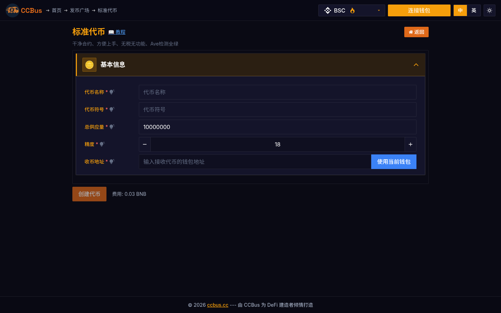

<div class="ccbus-hero">
  <div class="ccbus-hero-avatar">
    
  </div>
  <div class="ccbus-hero-content">
    <h1>第六章：区块链架构</h1>
    <div class="ccbus-teacher-label">🎙️ 本章讲师:<strong>Chain Hopper</strong> · 架构的"导游" — 带你看清 L1/L2 模块</div>
  </div>
</div>

<div class="chapter-intro">
<strong>本章导读</strong>

区块链不仅仅是一种技术，更是一种精心设计的系统架构。本章将深入探讨区块链的多层架构设计、核心组件、网络拓扑、数据结构以及不同类型区块链的架构特点。我们将学习如何设计高性能、可扩展的区块链系统，理解各层级之间的交互关系。

**学习目标：**
- 理解区块链分层架构设计
- 掌握P2P网络与数据传播机制
- 学习区块和交易的数据结构
- 了解不同区块链架构模式
- 探索高性能区块链设计方案
</div>


## 6.0 2025-2026 视角:为什么这一章要重新读

区块链架构正经历从 **monolithic(单体)** 到 **modular(模块化)** 的范式转变。2025-2026 年你需要理解的新分层:

**执行层 (Execution) + 结算层 (Settlement) + 共识层 (Consensus) + 数据可用性层 (DA) = 现代区块链架构**

1. **数据可用性(DA)层的爆发**:
   - **Celestia**(2023-10 主网):首个专用 DA 层,用数据可用性采样(DAS)实现高吞吐量
   - **EigenDA**(2024-Q2):基于 EigenLayer restaking 的 DA 层,经济模型与传统 L1 不同
   - **Avail**:Polygon 团队推出的通用 DA 层
   - **EIP-4844 Blob**(2024-03):以太坊原生 DA,blob 数据 18 天后过期,L2 成本降 100 倍
   - **PeerDAS (Fusaka 2026-Q2 计划)**:进一步扩展 blob 容量 4-8 倍

2. **共享排序器(Shared Sequencer)**:
   - **Espresso**:第一个生产级共享排序器,服务于 OP Stack 链
   - **Astria**:Celestia 生态的共享排序器
   - **Radius**:新兴共享排序器,聚焦跨链原子性
   - **优势**:跨链原子性(用户一笔交易可以同时影响多条 L2)、MEV 民主化、抗审查

3. **Based Rollup(由 L1 排序的 Rollup)** 与 **Native Rollup**:
   - **Based Rollup**(Justin Drake 提出):直接由 L1 验证者排序,无需独立 sequencer,继承 L1 抗审查性
   - **Native Rollup**:在 L1 节点内执行 rollup,实现极低延迟
   - **代表性项目**:Taiko(最早的 based rollup),Fuel(SVM-based),MegaETH(optimistic)

4. **应用链(Appchain)生态**:
   - **Cosmos SDK + IBC**:100+ 应用链,例如 dYdX(Perpetuals)、Berachain(Proof of Liquidity)
   - **OP Stack Superchain**:Base、OP Mainnet、Zora、Mode、Worldcoin 等共享排序和桥
   - **Polygon CDK**:Polygon zkEVM、Immutable、Astar 等共享 zkEVM 证明
   - **Arbitrum Stylus**:Rust + C++ 可以写 L2 合约,WASM 执行

### 🖥️ 真实案例:CCBus 的多链架构适配

CCBus 同时运行在 EVM 系(BSC、ETH、Base、Arbitrum、zkSync)、Solana 系(Solana)、Bitcoin 系(Bitcoin via Inscription)、Tron 系(TRC-20)等多个异构架构上,这意味着它的合约逻辑必须抽象成"执行层无关"的代码。下面是 CCBus 的标准代币界面,在 BSC、ETH、Solana 上的合约结构是平台自动适配的。



*图 6-1:CCBus 标准代币创建,展示多链架构适配。在 EVM 链上生成 ERC-20,在 Solana 上生成 SPL Token,两者的字节码完全不同。*

## 6.1 区块链分层架构

### 经典六层架构模型

区块链系统通常采用分层架构设计，每层负责特定功能，层与层之间通过定义良好的接口交互。

<div style="background: rgba(52, 81, 178, 0.06); padding: 1.5em; border-radius: 4px; margin: 2em 0;">
<svg class="svg-6-0" viewBox="0 0 750 550" xmlns="http://www.w3.org/2000/svg" style="width: 100%; max-width: 800px; display: block; margin: 0 auto;">
<defs>
<style>
      .svg-6-0 .arch-text-title { font-family: arial, sans-serif; font-size: 14px; fill: #1f2937; font-weight: bold; }
      .svg-6-0 .arch-text { font-family: arial, sans-serif; font-size: 10px; fill: #1f2937; }
      .svg-6-0 .arch-text-small { font-family: arial, sans-serif; font-size: 8px; fill: #1f2937; }
      .svg-6-0 .arch-layer-app { fill: rgba(223, 105, 25, 0.25); stroke: #df6919; stroke-width: 1.5; }
      .svg-6-0 .arch-layer-contract { fill: rgba(76, 156, 232, 0.25); stroke: #4c9be8; stroke-width: 1.5; }
      .svg-6-0 .arch-layer-consensus { fill: rgba(92, 184, 92, 0.25); stroke: #5cb85c; stroke-width: 1.5; }
      .svg-6-0 .arch-layer-network { fill: rgba(156, 89, 182, 0.25); stroke: #9c59b6; stroke-width: 1.5; }
      .svg-6-0 .arch-layer-data { fill: rgba(241, 196, 15, 0.25); stroke: rgba(245, 194, 66, 0.20); stroke-width: 1.5; }
      .svg-6-0 .arch-layer-infra { fill: rgba(52, 73, 94, 0.35); stroke: #34495e; stroke-width: 1.5; }
      .svg-6-0 .arch-arrow { stroke: #4c9be8; fill: none; stroke-width: 1; stroke-dasharray: 3,2; }
    </style>
    <marker id="arch-arrow-down" markerWidth="8" markerHeight="8" refX="8" refY="4" orient="auto">
      <polygon points="0 0, 8 4, 0 8" fill="#4c9be8"/>
    </marker>
  </defs>
  <text class="arch-text-title" x="375" y="25" text-anchor="middle">区块链六层架构模型</text>
  <rect class="arch-layer-app" x="50" y="50" width="650" height="70" rx="4"/>
  <text class="arch-text" x="70" y="70" font-weight="bold">应用层 (Application Layer)</text>
  <text class="arch-text-small" x="70" y="88">• DApps: 去中心化应用 (DeFi, NFT, DAO, GameFi)</text>
  <text class="arch-text-small" x="70" y="101">• SDK & API: 开发工具包与应用程序接口</text>
  <text class="arch-text-small" x="70" y="114">• Web3前端: 钱包连接、交易签名、状态查询</text>
  <text class="arch-text-small" x="550" y="88" fill="#df6919" font-weight="bold">用户交互层</text>
  <line class="arch-arrow" x1="375" y1="120" x2="375" y2="135" marker-end="url(#arch-arrow-down)"/>
  <rect class="arch-layer-contract" x="50" y="135" width="650" height="70" rx="4"/>
  <text class="arch-text" x="70" y="155" font-weight="bold">合约层 (Smart Contract Layer)</text>
  <text class="arch-text-small" x="70" y="173">• 虚拟机: EVM, WASM, Move VM</text>
  <text class="arch-text-small" x="70" y="186">• 智能合约: 业务逻辑、状态管理、事件触发</text>
  <text class="arch-text-small" x="70" y="199">• 合约标准: ERC-20, ERC-721, ERC-1155, ERC-4337</text>
  <text class="arch-text-small" x="550" y="173" fill="#4c9be8" font-weight="bold">业务逻辑层</text>
  <line class="arch-arrow" x1="375" y1="205" x2="375" y2="220" marker-end="url(#arch-arrow-down)"/>
  <rect class="arch-layer-consensus" x="50" y="220" width="650" height="70" rx="4"/>
  <text class="arch-text" x="70" y="240" font-weight="bold">共识层 (Consensus Layer)</text>
  <text class="arch-text-small" x="70" y="258">• 共识算法: PoW, PoS, DPoS, PBFT, PoA</text>
  <text class="arch-text-small" x="70" y="271">• 区块生产: 出块机制、验证者选择</text>
  <text class="arch-text-small" x="70" y="284">• 分叉处理: 最长链规则、确定性</text>
  <text class="arch-text-small" x="550" y="258" fill="#5cb85c" font-weight="bold">信任建立层</text>
  <line class="arch-arrow" x1="375" y1="290" x2="375" y2="305" marker-end="url(#arch-arrow-down)"/>
  <rect class="arch-layer-network" x="50" y="305" width="650" height="70" rx="4"/>
  <text class="arch-text" x="70" y="325" font-weight="bold">网络层 (Network Layer)</text>
  <text class="arch-text-small" x="70" y="343">• P2P网络: 对等节点发现与连接 (Kademlia, GossipSub)</text>
  <text class="arch-text-small" x="70" y="356">• 数据传播: 区块广播、交易池同步</text>
  <text class="arch-text-small" x="70" y="369">• 网络协议: TCP/IP, libp2p, DevP2P</text>
  <text class="arch-text-small" x="550" y="343" fill="#9c59b6" font-weight="bold">通信协调层</text>
  <line class="arch-arrow" x1="375" y1="375" x2="375" y2="390" marker-end="url(#arch-arrow-down)"/>
  <rect class="arch-layer-data" x="50" y="390" width="650" height="70" rx="4"/>
  <text class="arch-text" x="70" y="410" font-weight="bold">数据层 (Data Layer)</text>
  <text class="arch-text-small" x="70" y="428">• 区块结构: 区块头、区块体、交易列表</text>
  <text class="arch-text-small" x="70" y="441">• 数据结构: Merkle树、Patricia树、账户模型/UTXO</text>
  <text class="arch-text-small" x="70" y="454">• 密码学: 哈希函数、数字签名、零知识证明</text>
  <text class="arch-text-small" x="550" y="428" fill="rgba(245, 194, 66, 0.20)" font-weight="bold">数据组织层</text>
  <line class="arch-arrow" x1="375" y1="460" x2="375" y2="475" marker-end="url(#arch-arrow-down)"/>
  <rect class="arch-layer-infra" x="50" y="475" width="650" height="60" rx="4"/>
  <text class="arch-text" x="70" y="495" font-weight="bold">基础设施层 (Infrastructure Layer)</text>
  <text class="arch-text-small" x="70" y="513">• 存储引擎: LevelDB, RocksDB, IPFS, Arweave</text>
  <text class="arch-text-small" x="70" y="526">• 硬件资源: CPU、内存、磁盘、网络带宽</text>
  <text class="arch-text-small" x="550" y="513" fill="#34495e" font-weight="bold">物理支撑层</text>
</svg>
</div>

### 层级职责详解

| 层级 | 核心功能 | 关键技术 | 代表项目 |
|------|---------|---------|---------|
| **应用层** | 用户界面与交互 | Web3.js, Ethers.js, Wagmi | Uniswap, Aave, OpenSea |
| **合约层** | 业务逻辑执行 | Solidity, Rust, Move | ERC标准, DeFi协议 |
| **共识层** | 达成网络一致 | PoW, PoS, BFT | Nakamoto, Gasper, HotStuff |
| **网络层** | 节点通信 | libp2p, DevP2P | Gossip, Kademlia |
| **数据层** | 数据存储组织 | Merkle Tree, MPT | Bitcoin UTXO, Ethereum State |
| **基础设施层** | 底层资源支撑 | LevelDB, RocksDB | 本地存储, 分布式存储 |

## 6.2 P2P网络架构

### 对等网络拓扑

区块链采用去中心化的P2P网络结构，每个节点既是客户端也是服务器。

<div style="background: rgba(52, 81, 178, 0.06); padding: 1.5em; border-radius: 4px; margin: 2em 0;">
<svg class="svg-6-1" viewBox="0 0 750 500" xmlns="http://www.w3.org/2000/svg" style="width: 100%; max-width: 800px; display: block; margin: 0 auto;">
<defs>
<style>
      .svg-6-1 .p2p-text-title { font-family: arial, sans-serif; font-size: 14px; fill: #1f2937; font-weight: bold; }
      .svg-6-1 .p2p-text { font-family: arial, sans-serif; font-size: 10px; fill: #1f2937; }
      .svg-6-1 .p2p-text-small { font-family: arial, sans-serif; font-size: 8px; fill: #1f2937; }
      .svg-6-1 .p2p-node-full { fill: rgba(52, 81, 178, 0.15); stroke: #4c9be8; stroke-width: 1.5; }
      .svg-6-1 .p2p-node-light { fill: rgba(92, 184, 92, 0.25); stroke: #5cb85c; stroke-width: 1; }
      .svg-6-1 .p2p-node-archive { fill: rgba(223, 105, 25, 0.12); stroke: #df6919; stroke-width: 1.5; }
      .svg-6-1 .p2p-line-conn { stroke: #4c9be8; fill: none; stroke-width: 1; opacity: 0.5; }
      .svg-6-1 .p2p-line-sync { stroke: #5cb85c; fill: none; stroke-width: 1.2; stroke-dasharray: 4,2; }
    </style>
    <marker id="p2p-arrow" markerWidth="6" markerHeight="6" refX="6" refY="3" orient="auto">
      <polygon points="0 0, 6 3, 0 6" fill="#5cb85c"/>
    </marker>
  </defs>
  <text class="p2p-text-title" x="375" y="25" text-anchor="middle">区块链P2P网络拓扑结构</text>
  <circle class="p2p-node-archive" cx="375" cy="80" r="28"/>
  <text class="p2p-text-small" x="375" y="78" text-anchor="middle" font-weight="bold">归档节点</text>
  <text class="p2p-text-small" x="375" y="90" text-anchor="middle">Archive</text>
  <circle class="p2p-node-full" cx="200" cy="170" r="24"/>
  <text class="p2p-text-small" x="200" y="168" text-anchor="middle" font-weight="bold">全节点1</text>
  <text class="p2p-text-small" x="200" y="180" text-anchor="middle">Full Node</text>
  <circle class="p2p-node-full" cx="375" cy="200" r="24"/>
  <text class="p2p-text-small" x="375" y="198" text-anchor="middle" font-weight="bold">全节点2</text>
  <text class="p2p-text-small" x="375" y="210" text-anchor="middle">Full Node</text>
  <circle class="p2p-node-full" cx="550" cy="170" r="24"/>
  <text class="p2p-text-small" x="550" y="168" text-anchor="middle" font-weight="bold">全节点3</text>
  <text class="p2p-text-small" x="550" y="180" text-anchor="middle">Full Node</text>
  <circle class="p2p-node-light" cx="100" cy="280" r="20"/>
  <text class="p2p-text-small" x="100" y="280" text-anchor="middle">轻节点</text>
  <circle class="p2p-node-light" cx="200" cy="310" r="20"/>
  <text class="p2p-text-small" x="200" y="310" text-anchor="middle">轻节点</text>
  <circle class="p2p-node-light" cx="310" cy="330" r="20"/>
  <text class="p2p-text-small" x="310" y="330" text-anchor="middle">轻节点</text>
  <circle class="p2p-node-light" cx="440" cy="330" r="20"/>
  <text class="p2p-text-small" x="440" y="330" text-anchor="middle">轻节点</text>
  <circle class="p2p-node-light" cx="550" cy="310" r="20"/>
  <text class="p2p-text-small" x="550" y="310" text-anchor="middle">轻节点</text>
  <circle class="p2p-node-light" cx="650" cy="280" r="20"/>
  <text class="p2p-text-small" x="650" y="280" text-anchor="middle">轻节点</text>
  <line class="p2p-line-conn" x1="375" y1="108" x2="200" y2="146"/>
  <line class="p2p-line-conn" x1="375" y1="108" x2="375" y2="176"/>
  <line class="p2p-line-conn" x1="375" y1="108" x2="550" y2="146"/>
  <line class="p2p-line-conn" x1="200" y1="194" x2="375" y2="180"/>
  <line class="p2p-line-conn" x1="375" y1="224" x2="550" y2="194"/>
  <line class="p2p-line-conn" x1="550" y1="194" x2="200" y2="194"/>
  <line class="p2p-line-conn" x1="100" y1="280" x2="200" y2="190"/>
  <line class="p2p-line-conn" x1="200" y1="290" x2="200" y2="194"/>
  <line class="p2p-line-conn" x1="310" y1="310" x2="375" y2="224"/>
  <line class="p2p-line-conn" x1="440" y1="310" x2="375" y2="224"/>
  <line class="p2p-line-conn" x1="550" y1="290" x2="550" y2="194"/>
  <line class="p2p-line-conn" x1="650" y1="280" x2="550" y2="190"/>
  <line class="p2p-line-sync" x1="220" y1="160" x2="355" y2="190" marker-end="url(#p2p-arrow)"/>
  <text class="p2p-text-small" x="270" y="165" fill="#5cb85c">区块同步</text>
  <rect x="30" y="370" width="210" height="110" rx="4" fill="rgba(52, 81, 178, 0.07)" stroke="#4c9be8" stroke-width="1"/>
  <text class="p2p-text" x="135" y="388" text-anchor="middle" font-weight="bold">全节点 (Full Node)</text>
  <text class="p2p-text-small" x="40" y="405">• 存储完整区块链数据</text>
  <text class="p2p-text-small" x="40" y="418">• 独立验证所有交易和区块</text>
  <text class="p2p-text-small" x="40" y="431">• 参与网络共识</text>
  <text class="p2p-text-small" x="40" y="444">• 转发区块和交易</text>
  <text class="p2p-text-small" x="40" y="457">• 典型存储: 数百GB</text>
  <text class="p2p-text-small" x="40" y="470">  (以太坊全节点 ~800GB)</text>
  <rect x="260" y="370" width="210" height="110" rx="4" fill="rgba(92, 184, 92, 0.07)" stroke="#5cb85c" stroke-width="1"/>
  <text class="p2p-text" x="365" y="388" text-anchor="middle" font-weight="bold">轻节点 (Light Node)</text>
  <text class="p2p-text-small" x="270" y="405">• 仅存储区块头</text>
  <text class="p2p-text-small" x="270" y="418">• 使用SPV验证</text>
  <text class="p2p-text-small" x="270" y="431">• 依赖全节点获取数据</text>
  <text class="p2p-text-small" x="270" y="444">• 资源消耗低</text>
  <text class="p2p-text-small" x="270" y="457">• 典型存储: 数MB到数GB</text>
  <text class="p2p-text-small" x="270" y="470">• 适用于移动设备、钱包</text>
  <rect x="490" y="370" width="230" height="110" rx="4" fill="rgba(223, 105, 25, 0.06)" stroke="#df6919" stroke-width="1"/>
  <text class="p2p-text" x="605" y="388" text-anchor="middle" font-weight="bold">归档节点 (Archive Node)</text>
  <text class="p2p-text-small" x="500" y="405">• 存储所有历史状态</text>
  <text class="p2p-text-small" x="500" y="418">• 支持历史查询</text>
  <text class="p2p-text-small" x="500" y="431">• 区块链浏览器依赖</text>
  <text class="p2p-text-small" x="500" y="444">• 数据分析、审计用途</text>
  <text class="p2p-text-small" x="500" y="457">• 巨大存储需求</text>
  <text class="p2p-text-small" x="500" y="470">  (以太坊归档节点 >12TB)</text>
</svg>
</div>

### 节点发现与连接

**节点发现协议**：

1. **Kademlia DHT** (分布式哈希表)
   - 比特币、以太坊使用
   - 基于XOR距离度量
   - 节点ID: 160位哈希值
   - 每个节点维护k-buckets

2. **DNS种子节点**
   - 硬编码DNS地址
   - 返回活跃节点IP列表
   - 启动时快速发现节点

3. **Bootstrap节点**
   - 硬编码的初始节点列表
   - 提供稳定的接入点

**连接管理**：
- 维持8-125个活跃连接（以太坊典型值）
- 入站连接（被动接受）
- 出站连接（主动发起）
- 定期ping/pong保持连接活性

### 数据传播机制

<div style="background: rgba(52, 81, 178, 0.06); padding: 1.5em; border-radius: 4px; margin: 2em 0;">
<svg class="svg-6-2" viewBox="0 0 700 420" xmlns="http://www.w3.org/2000/svg" style="width: 100%; max-width: 800px; display: block; margin: 0 auto;">
<defs>
<style>
      .svg-6-2 .prop-text-title { font-family: arial, sans-serif; font-size: 14px; fill: #1f2937; font-weight: bold; }
      .svg-6-2 .prop-text { font-family: arial, sans-serif; font-size: 10px; fill: #1f2937; }
      .svg-6-2 .prop-text-small { font-family: arial, sans-serif; font-size: 8px; fill: #1f2937; }
      .svg-6-2 .prop-box-step { fill: rgba(52, 81, 178, 0.10); stroke: #4c9be8; stroke-width: 1; }
      .svg-6-2 .prop-circle-node { fill: rgba(92, 184, 92, 0.25); stroke: #5cb85c; stroke-width: 1; }
      .svg-6-2 .prop-wave { stroke: #df6919; stroke-width: 2; fill: none; opacity: 0.6; }
    </style>
    <marker id="prop-arrow" markerWidth="8" markerHeight="8" refX="8" refY="4" orient="auto">
      <polygon points="0 0, 8 4, 0 8" fill="#df6919"/>
    </marker>
  </defs>
  <text class="prop-text-title" x="350" y="25" text-anchor="middle">Gossip协议 - 数据传播机制</text>
  <rect class="prop-box-step" x="30" y="50" width="640" height="280" rx="4"/>
  <text class="prop-text" x="350" y="70" text-anchor="middle" font-weight="bold">Gossip (流言) 传播过程</text>
  <circle class="prop-circle-node" cx="100" cy="120" r="22"/>
  <text class="prop-text-small" x="100" y="118" text-anchor="middle" font-weight="bold">节点A</text>
  <text class="prop-text-small" x="100" y="130" text-anchor="middle">源节点</text>
  <rect x="140" y="105" width="100" height="30" rx="3" fill="rgba(223, 105, 25, 0.08)" stroke="#df6919" stroke-width="0.8"/>
  <text class="prop-text-small" x="190" y="124" text-anchor="middle">新交易/区块</text>
  <circle class="prop-circle-node" cx="280" cy="90" r="18"/>
  <text class="prop-text-small" x="280" y="93" text-anchor="middle">节点B</text>
  <circle class="prop-circle-node" cx="280" cy="150" r="18"/>
  <text class="prop-text-small" x="280" y="153" text-anchor="middle">节点C</text>
  <line class="prop-wave" x1="122" y1="120" x2="262" y2="90" marker-end="url(#prop-arrow)"/>
  <line class="prop-wave" x1="122" y1="120" x2="262" y2="150" marker-end="url(#prop-arrow)"/>
  <text class="prop-text-small" x="180" y="100" fill="#df6919">广播</text>
  <circle class="prop-circle-node" cx="380" cy="60" r="18"/>
  <text class="prop-text-small" x="380" y="63" text-anchor="middle">节点D</text>
  <circle class="prop-circle-node" cx="380" cy="120" r="18"/>
  <text class="prop-text-small" x="380" y="123" text-anchor="middle">节点E</text>
  <circle class="prop-circle-node" cx="380" cy="180" r="18"/>
  <text class="prop-text-small" x="380" y="183" text-anchor="middle">节点F</text>
  <line class="prop-wave" x1="298" y1="90" x2="362" y2="60" marker-end="url(#prop-arrow)"/>
  <line class="prop-wave" x1="298" y1="90" x2="362" y2="120" marker-end="url(#prop-arrow)"/>
  <line class="prop-wave" x1="298" y1="150" x2="362" y2="120" marker-end="url(#prop-arrow)"/>
  <line class="prop-wave" x1="298" y1="150" x2="362" y2="180" marker-end="url(#prop-arrow)"/>
  <text class="prop-text-small" x="330" y="75" fill="#df6919">转发</text>
  <circle class="prop-circle-node" cx="500" cy="90" r="18"/>
  <text class="prop-text-small" x="500" y="93" text-anchor="middle">节点G</text>
  <circle class="prop-circle-node" cx="500" cy="150" r="18"/>
  <text class="prop-text-small" x="500" y="153" text-anchor="middle">节点H</text>
  <circle class="prop-circle-node" cx="600" cy="120" r="18"/>
  <text class="prop-text-small" x="600" y="123" text-anchor="middle">节点I</text>
  <line class="prop-wave" x1="398" y1="120" x2="482" y2="90" marker-end="url(#prop-arrow)"/>
  <line class="prop-wave" x1="398" y1="120" x2="482" y2="150" marker-end="url(#prop-arrow)"/>
  <line class="prop-wave" x1="518" y1="90" x2="582" y2="120" marker-end="url(#prop-arrow)"/>
  <line class="prop-wave" x1="518" y1="150" x2="582" y2="120" marker-end="url(#prop-arrow)"/>
  <text class="prop-text-small" x="440" y="110" fill="#df6919">扩散</text>
  <rect x="40" y="210" width="300" height="110" rx="3" fill="rgba(52, 81, 178, 0.05)" stroke="#4c9be8" stroke-width="0.8"/>
  <text class="prop-text" x="190" y="228" text-anchor="middle" font-weight="bold">Gossip协议特点</text>
  <text class="prop-text-small" x="50" y="245">✓ 去中心化: 无需中央协调节点</text>
  <text class="prop-text-small" x="50" y="258">✓ 容错性强: 节点失效不影响整体传播</text>
  <text class="prop-text-small" x="50" y="271">✓ 指数扩散: O(log N)轮覆盖网络</text>
  <text class="prop-text-small" x="50" y="284">✓ 冗余传播: 同一数据多次接收</text>
  <text class="prop-text-small" x="50" y="297">✗ 带宽消耗: 重复消息占用资源</text>
  <text class="prop-text-small" x="50" y="310">✗ 延迟不确定: 传播时间有波动</text>
  <rect x="360" y="210" width="310" height="110" rx="3" fill="rgba(92, 184, 92, 0.1)" stroke="#5cb85c" stroke-width="0.8"/>
  <text class="prop-text" x="515" y="228" text-anchor="middle" font-weight="bold">优化策略</text>
  <text class="prop-text-small" x="370" y="245">• 去重机制: 使用哈希缓存已见消息</text>
  <text class="prop-text-small" x="370" y="258">• 选择性转发: 仅转发给部分邻居</text>
  <text class="prop-text-small" x="370" y="271">• Inv-Get模式: 先发清单，按需获取</text>
  <text class="prop-text-small" x="370" y="284">  - Bitcoin: inv → getdata → block</text>
  <text class="prop-text-small" x="370" y="297">• 压缩编码: 减少数据传输量</text>
  <text class="prop-text-small" x="370" y="310">• 优先级队列: 重要消息优先传播</text>
  <rect x="30" y="340" width="640" height="60" rx="3" fill="rgba(223, 105, 25, 0.05)" stroke="#df6919" stroke-width="0.8"/>
  <text class="prop-text" x="350" y="358" text-anchor="middle" font-weight="bold">传播性能指标</text>
  <text class="prop-text-small" x="40" y="375">• 传播时间: 从源节点到50%/90%节点的时间</text>
  <text class="prop-text-small" x="40" y="388">  - 以太坊: 平均2-5秒到达50%节点, 10-20秒到达90%节点</text>
  <text class="prop-text-small" x="400" y="375">• 带宽利用率: 有效数据 / 总传输量</text>
  <text class="prop-text-small" x="400" y="388">• 覆盖率: 最终接收到消息的节点比例</text>
</svg>
</div>

## 6.3 数据结构设计

### 区块结构

区块是区块链的基本数据单元，包含区块头和区块体两部分。

<div style="background: rgba(52, 81, 178, 0.06); padding: 1.5em; border-radius: 4px; margin: 2em 0;">
<svg class="svg-6-3" viewBox="0 0 750 520" xmlns="http://www.w3.org/2000/svg" style="width: 100%; max-width: 800px; display: block; margin: 0 auto;">
<defs>
<style>
      .svg-6-3 .blk-text-title { font-family: arial, sans-serif; font-size: 14px; fill: #1f2937; font-weight: bold; }
      .svg-6-3 .blk-text { font-family: arial, sans-serif; font-size: 10px; fill: #1f2937; }
      .svg-6-3 .blk-text-small { font-family: arial, sans-serif; font-size: 8px; fill: #1f2937; }
      .svg-6-3 .blk-box-header { fill: rgba(223, 105, 25, 0.25); stroke: #df6919; stroke-width: 1.5; }
      .svg-6-3 .blk-box-body { fill: rgba(76, 156, 232, 0.25); stroke: #4c9be8; stroke-width: 1.5; }
      .svg-6-3 .blk-box-field { fill: rgba(92, 184, 92, 0.07); stroke: #5cb85c; stroke-width: 1; }
      .svg-6-3 .blk-line-link { stroke: #4c9be8; fill: none; stroke-width: 1.2; stroke-dasharray: 3,2; }
    </style>
    <marker id="blk-arrow" markerWidth="8" markerHeight="8" refX="8" refY="4" orient="auto">
      <polygon points="0 0, 8 4, 0 8" fill="#4c9be8"/>
    </marker>
  </defs>
  <text class="blk-text-title" x="375" y="25" text-anchor="middle">区块结构详解 (以太坊为例)</text>
  <rect class="blk-box-header" x="50" y="50" width="650" height="220" rx="4"/>
  <text class="blk-text" x="70" y="70" font-weight="bold">区块头 (Block Header) - 固定大小 ~500字节</text>
  <rect class="blk-box-field" x="70" y="80" width="300" height="35" rx="3"/>
  <text class="blk-text-small" x="80" y="95" font-weight="bold">parentHash (32字节)</text>
  <text class="blk-text-small" x="80" y="108">父区块哈希，链接到前一个区块</text>
  <rect class="blk-box-field" x="380" y="80" width="300" height="35" rx="3"/>
  <text class="blk-text-small" x="390" y="95" font-weight="bold">stateRoot (32字节)</text>
  <text class="blk-text-small" x="390" y="108">状态树根哈希，记录账户状态</text>
  <rect class="blk-box-field" x="70" y="125" width="300" height="35" rx="3"/>
  <text class="blk-text-small" x="80" y="140" font-weight="bold">transactionsRoot (32字节)</text>
  <text class="blk-text-small" x="80" y="153">交易树根哈希，Merkle树根</text>
  <rect class="blk-box-field" x="380" y="125" width="300" height="35" rx="3"/>
  <text class="blk-text-small" x="390" y="140" font-weight="bold">receiptsRoot (32字节)</text>
  <text class="blk-text-small" x="390" y="153">收据树根哈希，执行结果</text>
  <rect class="blk-box-field" x="70" y="170" width="145" height="30" rx="3"/>
  <text class="blk-text-small" x="80" y="185" font-weight="bold">number</text>
  <text class="blk-text-small" x="80" y="195">区块号</text>
  <rect class="blk-box-field" x="225" y="170" width="145" height="30" rx="3"/>
  <text class="blk-text-small" x="235" y="185" font-weight="bold">timestamp</text>
  <text class="blk-text-small" x="235" y="195">时间戳</text>
  <rect class="blk-box-field" x="380" y="170" width="145" height="30" rx="3"/>
  <text class="blk-text-small" x="390" y="185" font-weight="bold">gasLimit</text>
  <text class="blk-text-small" x="390" y="195">Gas上限</text>
  <rect class="blk-box-field" x="535" y="170" width="145" height="30" rx="3"/>
  <text class="blk-text-small" x="545" y="185" font-weight="bold">gasUsed</text>
  <text class="blk-text-small" x="545" y="195">Gas消耗</text>
  <rect class="blk-box-field" x="70" y="210" width="145" height="30" rx="3"/>
  <text class="blk-text-small" x="80" y="225" font-weight="bold">miner</text>
  <text class="blk-text-small" x="80" y="235">矿工地址</text>
  <rect class="blk-box-field" x="225" y="210" width="145" height="30" rx="3"/>
  <text class="blk-text-small" x="235" y="225" font-weight="bold">difficulty</text>
  <text class="blk-text-small" x="235" y="235">难度值</text>
  <rect class="blk-box-field" x="380" y="210" width="145" height="30" rx="3"/>
  <text class="blk-text-small" x="390" y="225" font-weight="bold">nonce</text>
  <text class="blk-text-small" x="390" y="235">工作量证明</text>
  <rect class="blk-box-field" x="535" y="210" width="145" height="30" rx="3"/>
  <text class="blk-text-small" x="545" y="225" font-weight="bold">extraData</text>
  <text class="blk-text-small" x="545" y="235">额外数据</text>
  <text class="blk-text-small" x="70" y="258" font-style="italic">区块头包含元数据和Merkle根，用于快速验证和SPV客户端</text>
  <line class="blk-line-link" x1="375" y1="270" x2="375" y2="285" marker-end="url(#blk-arrow)"/>
  <rect class="blk-box-body" x="50" y="285" width="650" height="215" rx="4"/>
  <text class="blk-text" x="70" y="305" font-weight="bold">区块体 (Block Body) - 可变大小</text>
  <rect x="70" y="315" width="610" height="80" rx="3" fill="rgba(52, 81, 178, 0.07)" stroke="#4c9be8" stroke-width="0.8"/>
  <text class="blk-text" x="375" y="333" text-anchor="middle" font-weight="bold">交易列表 (Transactions)</text>
  <rect x="80" y="345" width="180" height="40" rx="2" fill="rgba(92, 184, 92, 0.1)" stroke="#5cb85c" stroke-width="0.5"/>
  <text class="blk-text-small" x="90" y="360">交易1: from → to</text>
  <text class="blk-text-small" x="90" y="373">value: 1.5 ETH, gas: 21000</text>
  <rect x="270" y="345" width="180" height="40" rx="2" fill="rgba(92, 184, 92, 0.1)" stroke="#5cb85c" stroke-width="0.5"/>
  <text class="blk-text-small" x="280" y="360">交易2: 合约调用</text>
  <text class="blk-text-small" x="280" y="373">data: 0x..., gas: 150000</text>
  <rect x="460" y="345" width="210" height="40" rx="2" fill="rgba(92, 184, 92, 0.1)" stroke="#5cb85c" stroke-width="0.5"/>
  <text class="blk-text-small" x="470" y="360">交易 N: ...</text>
  <text class="blk-text-small" x="470" y="373">平均每区块 150-200 笔交易</text>
  <rect x="70" y="405" width="295" height="80" rx="3" fill="rgba(223, 105, 25, 0.05)" stroke="#df6919" stroke-width="0.8"/>
  <text class="blk-text" x="217" y="423" text-anchor="middle" font-weight="bold">叔块 (Uncles/Ommers)</text>
  <text class="blk-text-small" x="80" y="440">• 近期被分叉的有效区块</text>
  <text class="blk-text-small" x="80" y="453">• 最多包含2个叔块</text>
  <text class="blk-text-small" x="80" y="466">• 叔块奖励: 降低孤块率</text>
  <text class="blk-text-small" x="80" y="479">• PoS后已移除</text>
  <rect x="385" y="405" width="295" height="80" rx="3" fill="rgba(52, 81, 178, 0.05)" stroke="#4c9be8" stroke-width="0.8"/>
  <text class="blk-text" x="532" y="423" text-anchor="middle" font-weight="bold">区块大小限制</text>
  <text class="blk-text-small" x="395" y="440">• 比特币: 1-4 MB (SegWit)</text>
  <text class="blk-text-small" x="395" y="453">• 以太坊: 30M Gas (~2-5 MB)</text>
  <text class="blk-text-small" x="395" y="466">• Solana: 无固定上限</text>
  <text class="blk-text-small" x="395" y="479">  由验证者性能决定</text>
</svg>
</div>

### 交易结构

```javascript
// 以太坊交易结构 (EIP-1559后)
{
  // 基本字段
  from: "0x742d35Cc6634C0532925a3b844Bc9e7595f0bEb",
  to: "0x5aAeb6053F3E94C9b9A09f33669435E7Ef1BeAed",
  value: "1000000000000000000",  // 1 ETH in Wei
  nonce: 25,                       // 交易序号
  
  // Gas相关 (EIP-1559)
  gasLimit: "21000",
  maxFeePerGas: "100000000000",          // 100 Gwei
  maxPriorityFeePerGas: "2000000000",    // 2 Gwei (小费)
  
  // 数据与签名
  data: "0x",                      // 合约调用数据
  chainId: 1,                      // 主网
  v: "0x1b",                       // 签名恢复值
  r: "0x88ff6cf0fefd94db46111149ae4bfc179e9b94721fffd821d38d16464b3f71d0",
  s: "0x45e0aff800961cfce805daef7016b9b675c137a6a41a548f7b60a3484c06a33a"
}
```

### 账户模型 vs UTXO模型

<div style="background: rgba(52, 81, 178, 0.06); padding: 1.5em; border-radius: 4px; margin: 2em 0;">
<svg class="svg-6-4" viewBox="0 0 750 450" xmlns="http://www.w3.org/2000/svg" style="width: 100%; max-width: 800px; display: block; margin: 0 auto;">
<defs>
<style>
      .svg-6-4 .acc-text-title { font-family: arial, sans-serif; font-size: 14px; fill: #1f2937; font-weight: bold; }
      .svg-6-4 .acc-text { font-family: arial, sans-serif; font-size: 10px; fill: #1f2937; }
      .svg-6-4 .acc-text-small { font-family: arial, sans-serif; font-size: 8px; fill: #1f2937; }
      .svg-6-4 .acc-box-account { fill: rgba(52, 81, 178, 0.10); stroke: #4c9be8; stroke-width: 1.2; }
      .svg-6-4 .acc-box-utxo { fill: rgba(223, 105, 25, 0.08); stroke: #df6919; stroke-width: 1.2; }
    </style>
</defs>
  <text class="acc-text-title" x="375" y="25" text-anchor="middle">账户模型 vs UTXO模型对比</text>
  <rect class="acc-box-account" x="30" y="50" width="330" height="370" rx="4"/>
  <text class="acc-text" x="195" y="72" text-anchor="middle" font-weight="bold">账户模型 (Account Model)</text>
  <text class="acc-text-small" x="40" y="90" font-style="italic">代表: 以太坊、Polkadot、Solana</text>
  <rect x="40" y="105" width="310" height="135" rx="3" fill="rgba(52, 81, 178, 0.07)" stroke="#4c9be8" stroke-width="0.8"/>
  <text class="acc-text" x="195" y="123" text-anchor="middle" font-weight="bold">全局状态树</text>
  <rect x="50" y="135" width="130" height="95" rx="2" fill="rgba(92, 184, 92, 0.1)" stroke="#5cb85c" stroke-width="0.5"/>
  <text class="acc-text-small" x="60" y="150" font-weight="bold">账户A</text>
  <text class="acc-text-small" x="60" y="163">地址: 0xAbc...</text>
  <text class="acc-text-small" x="60" y="176">余额: 10.5 ETH</text>
  <text class="acc-text-small" x="60" y="189">nonce: 25</text>
  <text class="acc-text-small" x="60" y="202">codeHash: 0x0</text>
  <text class="acc-text-small" x="60" y="215">storageRoot: 0x...</text>
  <rect x="190" y="135" width="150" height="95" rx="2" fill="rgba(223, 105, 25, 0.05)" stroke="#df6919" stroke-width="0.5"/>
  <text class="acc-text-small" x="200" y="150" font-weight="bold">智能合约B</text>
  <text class="acc-text-small" x="200" y="163">地址: 0xDef...</text>
  <text class="acc-text-small" x="200" y="176">余额: 0 ETH</text>
  <text class="acc-text-small" x="200" y="189">nonce: 1</text>
  <text class="acc-text-small" x="200" y="202">codeHash: 0x9a7...</text>
  <text class="acc-text-small" x="200" y="215">storage: mapping数据</text>
  <rect x="40" y="250" width="310" height="160" rx="3" fill="rgba(92, 184, 92, 0.1)" stroke="#5cb85c" stroke-width="0.8"/>
  <text class="acc-text" x="195" y="268" text-anchor="middle" font-weight="bold">优点</text>
  <text class="acc-text-small" x="50" y="283">✓ 状态直观: 余额一目了然</text>
  <text class="acc-text-small" x="50" y="296">✓ 编程简单: 适合智能合约</text>
  <text class="acc-text-small" x="50" y="309">✓ 空间效率: 不需要存储历史</text>
  <text class="acc-text-small" x="50" y="322">✓ 支持复杂逻辑: 状态可变</text>
  <text class="acc-text" x="195" y="342" text-anchor="middle" font-weight="bold">缺点</text>
  <text class="acc-text-small" x="50" y="357">✗ 并发处理难: 需要防止双花</text>
  <text class="acc-text-small" x="50" y="370">✗ 隐私较弱: 余额可追踪</text>
  <text class="acc-text-small" x="50" y="383">✗ 重放攻击: 需要nonce机制</text>
  <text class="acc-text-small" x="50" y="396">✗ 全局状态膨胀问题</text>
  <rect class="acc-box-utxo" x="390" y="50" width="330" height="370" rx="4"/>
  <text class="acc-text" x="555" y="72" text-anchor="middle" font-weight="bold">UTXO模型 (Unspent TX Output)</text>
  <text class="acc-text-small" x="400" y="90" font-style="italic">代表: 比特币、Cardano、Nervos</text>
  <rect x="400" y="105" width="310" height="135" rx="3" fill="rgba(223, 105, 25, 0.06)" stroke="#df6919" stroke-width="0.8"/>
  <text class="acc-text" x="555" y="123" text-anchor="middle" font-weight="bold">未花费输出集合</text>
  <rect x="410" y="135" width="140" height="85" rx="2" fill="rgba(52, 81, 178, 0.05)" stroke="#4c9be8" stroke-width="0.5"/>
  <text class="acc-text-small" x="420" y="150" font-weight="bold">UTXO 1</text>
  <text class="acc-text-small" x="420" y="163">TxID: 7a8b...</text>
  <text class="acc-text-small" x="420" y="176">Index: 0</text>
  <text class="acc-text-small" x="420" y="189">Amount: 2.5 BTC</text>
  <text class="acc-text-small" x="420" y="202">ScriptPubKey:</text>
  <text class="acc-text-small" x="425" y="212">OP_DUP OP_HASH160...</text>
  <rect x="560" y="135" width="140" height="85" rx="2" fill="rgba(92, 184, 92, 0.1)" stroke="#5cb85c" stroke-width="0.5"/>
  <text class="acc-text-small" x="570" y="150" font-weight="bold">UTXO 2</text>
  <text class="acc-text-small" x="570" y="163">TxID: 3c9d...</text>
  <text class="acc-text-small" x="570" y="176">Index: 1</text>
  <text class="acc-text-small" x="570" y="189">Amount: 0.8 BTC</text>
  <text class="acc-text-small" x="570" y="202">ScriptPubKey:</text>
  <text class="acc-text-small" x="575" y="212">OP_CHECKSIG</text>
  <rect x="400" y="250" width="310" height="160" rx="3" fill="rgba(223, 105, 25, 0.05)" stroke="#df6919" stroke-width="0.8"/>
  <text class="acc-text" x="555" y="268" text-anchor="middle" font-weight="bold">优点</text>
  <text class="acc-text-small" x="410" y="283">✓ 并发友好: UTXO独立，易并行</text>
  <text class="acc-text-small" x="410" y="296">✓ 隐私性强: 每次用新地址</text>
  <text class="acc-text-small" x="410" y="309">✓ 无重放攻击: UTXO一次性</text>
  <text class="acc-text-small" x="410" y="322">✓ 简单验证: 无需全局状态</text>
  <text class="acc-text" x="555" y="342" text-anchor="middle" font-weight="bold">缺点</text>
  <text class="acc-text-small" x="410" y="357">✗ 编程复杂: 不适合智能合约</text>
  <text class="acc-text-small" x="410" y="370">✗ 空间开销: 存储大量UTXO</text>
  <text class="acc-text-small" x="410" y="383">✗ 找零麻烦: 需要生成找零输出</text>
  <text class="acc-text-small" x="410" y="396">✗ 余额计算: 需遍历所有UTXO</text>
</svg>
</div>

## 6.4 状态存储与Merkle树

### Merkle Patricia Trie (MPT)

以太坊使用改进的Merkle树 - **Merkle Patricia Trie**，结合了Merkle树和Patricia树的优点。

**MPT特点**：
- 确定性：相同数据总是产生相同根哈希
- 高效验证：可以快速验证某个键值对的存在
- 节省空间：公共前缀共享路径

**节点类型**：
1. **Branch节点**：有17个子节点（16个十六进制字符 + 1个值）
2. **Extension节点**：压缩路径，避免单链
3. **Leaf节点**：存储实际值

```python
# 示例：验证账户余额
def verify_account_balance(address, balance, proof, state_root):
    """
    使用Merkle proof验证账户余额
    """
    # 计算账户键
    account_key = keccak256(address)
    
    # 从proof重建路径
    current_hash = keccak256(rlp_encode([balance, nonce, storage_root, code_hash]))
    
    for node in reversed(proof):
        current_hash = keccak256(node + current_hash)
    
    # 验证根哈希匹配
    return current_hash == state_root
```

### 状态膨胀问题

**问题**：随着时间推移，区块链状态持续增长

**以太坊状态大小**：
- 2020年：~40 GB
- 2023年：~100 GB
- 2025年：~150 GB

**解决方案**：

1. **状态租金 (State Rent)**
   - 账户需支付租金保持状态
   - 未支付租金的账户被归档

2. **状态过期 (State Expiry)**
   - EIP-4444提案
   - 旧状态从活跃集移除
   - 需要时通过proof恢复

3. **无状态客户端 (Stateless Clients)**
   - 不存储完整状态
   - 使用witness数据验证

4. **分片 (Sharding)**
   - 将状态分散到多个分片
   - 每个分片维护部分状态

## 6.5 不同区块链架构对比

### 单链 vs 多链 vs 分片

<div style="background: rgba(52, 81, 178, 0.06); padding: 1.5em; border-radius: 4px; margin: 2em 0;">
<svg class="svg-6-5" viewBox="0 0 750 480" xmlns="http://www.w3.org/2000/svg" style="width: 100%; max-width: 800px; display: block; margin: 0 auto;">
<defs>
<style>
      .svg-6-5 .comp-text-title { font-family: arial, sans-serif; font-size: 14px; fill: #1f2937; font-weight: bold; }
      .svg-6-5 .comp-text { font-family: arial, sans-serif; font-size: 10px; fill: #1f2937; }
      .svg-6-5 .comp-text-small { font-family: arial, sans-serif; font-size: 8px; fill: #1f2937; }
      .svg-6-5 .comp-box-single { fill: rgba(52, 81, 178, 0.10); stroke: #4c9be8; stroke-width: 1; }
      .svg-6-5 .comp-box-multi { fill: rgba(92, 184, 92, 0.10); stroke: #5cb85c; stroke-width: 1; }
      .svg-6-5 .comp-box-shard { fill: rgba(223, 105, 25, 0.08); stroke: #df6919; stroke-width: 1; }
      .svg-6-5 .comp-block { fill: rgba(52, 81, 178, 0.15); stroke: #4c9be8; stroke-width: 1; }
    </style>
</defs>
  <text class="comp-text-title" x="375" y="25" text-anchor="middle">区块链架构模式对比</text>
  <rect class="comp-box-single" x="30" y="50" width="220" height="400" rx="4"/>
  <text class="comp-text" x="140" y="70" text-anchor="middle" font-weight="bold">单链架构</text>
  <text class="comp-text-small" x="40" y="88" font-style="italic">Bitcoin, Ethereum (PoS前)</text>
  <rect class="comp-block" x="100" y="105" width="80" height="30" rx="2"/>
  <text class="comp-text-small" x="140" y="124" text-anchor="middle">Block N</text>
  <line x1="140" y1="135" x2="140" y2="150" stroke="#4c9be8" stroke-width="1.5" fill="none"/>
  <rect class="comp-block" x="100" y="150" width="80" height="30" rx="2"/>
  <text class="comp-text-small" x="140" y="169" text-anchor="middle">Block N+1</text>
  <line x1="140" y1="180" x2="140" y2="195" stroke="#4c9be8" stroke-width="1.5" fill="none"/>
  <rect class="comp-block" x="100" y="195" width="80" height="30" rx="2"/>
  <text class="comp-text-small" x="140" y="214" text-anchor="middle">Block N+2</text>
  <line x1="140" y1="225" x2="140" y2="240" stroke="#4c9be8" stroke-width="1.5" fill="none"/>
  <text class="comp-text-small" x="140" y="255" text-anchor="middle">...</text>
  <rect x="40" y="270" width="200" height="170" rx="3" fill="rgba(52, 81, 178, 0.05)" stroke="#4c9be8" stroke-width="0.5"/>
  <text class="comp-text" x="140" y="288" text-anchor="middle" font-weight="bold">特点</text>
  <text class="comp-text-small" x="50" y="305">✓ 简单可靠</text>
  <text class="comp-text-small" x="50" y="318">✓ 安全性高</text>
  <text class="comp-text-small" x="50" y="331">✓ 去中心化程度高</text>
  <text class="comp-text-small" x="50" y="344">✗ 吞吐量低</text>
  <text class="comp-text-small" x="50" y="357">✗ 延迟高</text>
  <text class="comp-text-small" x="50" y="373" font-weight="bold">性能:</text>
  <text class="comp-text-small" x="50" y="386">• BTC: ~7 TPS</text>
  <text class="comp-text-small" x="50" y="399">• ETH: ~15-30 TPS</text>
  <text class="comp-text-small" x="50" y="412">• 确认时间:</text>
  <text class="comp-text-small" x="55" y="425">  BTC 10分钟, ETH 12秒</text>
  <rect class="comp-box-multi" x="270" y="50" width="220" height="400" rx="4"/>
  <text class="comp-text" x="380" y="70" text-anchor="middle" font-weight="bold">多链架构</text>
  <text class="comp-text-small" x="280" y="88" font-style="italic">Polkadot, Cosmos</text>
  <rect x="290" y="105" width="70" height="25" rx="2" fill="rgba(223, 105, 25, 0.25)" stroke="#df6919" stroke-width="1"/>
  <text class="comp-text-small" x="325" y="121" text-anchor="middle" font-weight="bold">中继链</text>
  <line x1="325" y1="130" x2="290" y2="155" stroke="#5cb85c" stroke-width="1" fill="none"/>
  <line x1="325" y1="130" x2="325" y2="155" stroke="#5cb85c" stroke-width="1" fill="none"/>
  <line x1="325" y1="130" x2="360" y2="155" stroke="#5cb85c" stroke-width="1" fill="none"/>
  <rect x="275" y="155" width="45" height="20" rx="2" fill="rgba(92, 184, 92, 0.25)" stroke="#5cb85c" stroke-width="0.8"/>
  <text class="comp-text-small" x="297" y="169" text-anchor="middle">链A</text>
  <rect x="328" y="155" width="45" height="20" rx="2" fill="rgba(92, 184, 92, 0.25)" stroke="#5cb85c" stroke-width="0.8"/>
  <text class="comp-text-small" x="350" y="169" text-anchor="middle">链B</text>
  <rect x="381" y="155" width="45" height="20" rx="2" fill="rgba(92, 184, 92, 0.25)" stroke="#5cb85c" stroke-width="0.8"/>
  <text class="comp-text-small" x="403" y="169" text-anchor="middle">链C</text>
  <line x1="297" y1="175" x2="297" y2="190" stroke="#5cb85c" stroke-width="0.8" fill="none"/>
  <line x1="350" y1="175" x2="350" y2="190" stroke="#5cb85c" stroke-width="0.8" fill="none"/>
  <line x1="403" y1="175" x2="403" y2="190" stroke="#5cb85c" stroke-width="0.8" fill="none"/>
  <rect x="275" y="190" width="45" height="15" rx="2" fill="rgba(52, 81, 178, 0.10)" stroke="#4c9be8" stroke-width="0.5"/>
  <text class="comp-text-small" x="297" y="201" text-anchor="middle" font-size="7">DeFi</text>
  <rect x="328" y="190" width="45" height="15" rx="2" fill="rgba(52, 81, 178, 0.10)" stroke="#4c9be8" stroke-width="0.5"/>
  <text class="comp-text-small" x="350" y="201" text-anchor="middle" font-size="7">NFT</text>
  <rect x="381" y="190" width="45" height="15" rx="2" fill="rgba(52, 81, 178, 0.10)" stroke="#4c9be8" stroke-width="0.5"/>
  <text class="comp-text-small" x="403" y="201" text-anchor="middle" font-size="7">Game</text>
  <line x1="297" y1="205" x2="297" y2="220" stroke="#5cb85c" stroke-width="0.8" fill="none"/>
  <line x1="350" y1="205" x2="350" y2="220" stroke="#5cb85c" stroke-width="0.8" fill="none"/>
  <line x1="403" y1="205" x2="403" y2="220" stroke="#5cb85c" stroke-width="0.8" fill="none"/>
  <rect x="275" y="220" width="45" height="15" rx="2" fill="rgba(52, 81, 178, 0.10)" stroke="#4c9be8" stroke-width="0.5"/>
  <text class="comp-text-small" x="297" y="231" text-anchor="middle" font-size="7">Block</text>
  <rect x="328" y="220" width="45" height="15" rx="2" fill="rgba(52, 81, 178, 0.10)" stroke="#4c9be8" stroke-width="0.5"/>
  <text class="comp-text-small" x="350" y="231" text-anchor="middle" font-size="7">Block</text>
  <rect x="381" y="220" width="45" height="15" rx="2" fill="rgba(52, 81, 178, 0.10)" stroke="#4c9be8" stroke-width="0.5"/>
  <text class="comp-text-small" x="403" y="231" text-anchor="middle" font-size="7">Block</text>
  <rect x="280" y="270" width="200" height="170" rx="3" fill="rgba(92, 184, 92, 0.1)" stroke="#5cb85c" stroke-width="0.5"/>
  <text class="comp-text" x="380" y="288" text-anchor="middle" font-weight="bold">特点</text>
  <text class="comp-text-small" x="290" y="305">✓ 专用链优化</text>
  <text class="comp-text-small" x="290" y="318">✓ 跨链通信</text>
  <text class="comp-text-small" x="290" y="331">✓ 灵活扩展</text>
  <text class="comp-text-small" x="290" y="344">✗ 复杂性高</text>
  <text class="comp-text-small" x="290" y="357">✗ 安全性依赖中继链</text>
  <text class="comp-text-small" x="290" y="373" font-weight="bold">性能:</text>
  <text class="comp-text-small" x="290" y="386">• Polkadot: ~1000 TPS</text>
  <text class="comp-text-small" x="290" y="399">  (跨所有平行链)</text>
  <text class="comp-text-small" x="290" y="412">• Cosmos: 可变</text>
  <text class="comp-text-small" x="295" y="425">  每条链独立</text>
  <rect class="comp-box-shard" x="510" y="50" width="220" height="400" rx="4"/>
  <text class="comp-text" x="620" y="70" text-anchor="middle" font-weight="bold">分片架构</text>
  <text class="comp-text-small" x="520" y="88" font-style="italic">Ethereum 2.0, NEAR, Zilliqa</text>
  <rect x="560" y="105" width="120" height="25" rx="2" fill="rgba(223, 105, 25, 0.25)" stroke="#df6919" stroke-width="1"/>
  <text class="comp-text-small" x="620" y="121" text-anchor="middle" font-weight="bold">信标链/协调层</text>
  <line x1="560" y1="130" x2="540" y2="155" stroke="#df6919" stroke-width="1" fill="none"/>
  <line x1="620" y1="130" x2="620" y2="155" stroke="#df6919" stroke-width="1" fill="none"/>
  <line x1="680" y1="130" x2="700" y2="155" stroke="#df6919" stroke-width="1" fill="none"/>
  <rect x="525" y="155" width="40" height="20" rx="2" fill="rgba(76, 156, 232, 0.25)" stroke="#4c9be8" stroke-width="0.8"/>
  <text class="comp-text-small" x="545" y="169" text-anchor="middle">分片0</text>
  <rect x="600" y="155" width="40" height="20" rx="2" fill="rgba(76, 156, 232, 0.25)" stroke="#4c9be8" stroke-width="0.8"/>
  <text class="comp-text-small" x="620" y="169" text-anchor="middle">分片1</text>
  <rect x="675" y="155" width="40" height="20" rx="2" fill="rgba(76, 156, 232, 0.25)" stroke="#4c9be8" stroke-width="0.8"/>
  <text class="comp-text-small" x="695" y="169" text-anchor="middle">分片N</text>
  <line x1="545" y1="175" x2="545" y2="190" stroke="#4c9be8" stroke-width="0.8" fill="none"/>
  <line x1="620" y1="175" x2="620" y2="190" stroke="#4c9be8" stroke-width="0.8" fill="none"/>
  <line x1="695" y1="175" x2="695" y2="190" stroke="#4c9be8" stroke-width="0.8" fill="none"/>
  <rect x="530" y="190" width="30" height="40" rx="2" fill="rgba(92, 184, 92, 0.07)" stroke="#5cb85c" stroke-width="0.5"/>
  <text class="comp-text-small" x="545" y="203" text-anchor="middle" font-size="6">Blk 1</text>
  <text class="comp-text-small" x="545" y="213" text-anchor="middle" font-size="6">Blk 2</text>
  <text class="comp-text-small" x="545" y="223" text-anchor="middle" font-size="6">Blk 3</text>
  <rect x="605" y="190" width="30" height="40" rx="2" fill="rgba(92, 184, 92, 0.07)" stroke="#5cb85c" stroke-width="0.5"/>
  <text class="comp-text-small" x="620" y="203" text-anchor="middle" font-size="6">Blk 1</text>
  <text class="comp-text-small" x="620" y="213" text-anchor="middle" font-size="6">Blk 2</text>
  <text class="comp-text-small" x="620" y="223" text-anchor="middle" font-size="6">Blk 3</text>
  <rect x="680" y="190" width="30" height="40" rx="2" fill="rgba(92, 184, 92, 0.07)" stroke="#5cb85c" stroke-width="0.5"/>
  <text class="comp-text-small" x="695" y="203" text-anchor="middle" font-size="6">Blk 1</text>
  <text class="comp-text-small" x="695" y="213" text-anchor="middle" font-size="6">Blk 2</text>
  <text class="comp-text-small" x="695" y="223" text-anchor="middle" font-size="6">Blk 3</text>
  <rect x="520" y="270" width="200" height="170" rx="3" fill="rgba(223, 105, 25, 0.05)" stroke="#df6919" stroke-width="0.5"/>
  <text class="comp-text" x="620" y="288" text-anchor="middle" font-weight="bold">特点</text>
  <text class="comp-text-small" x="530" y="305">✓ 高吞吐量</text>
  <text class="comp-text-small" x="530" y="318">✓ 并行处理</text>
  <text class="comp-text-small" x="530" y="331">✓ 同构扩展</text>
  <text class="comp-text-small" x="530" y="344">✗ 跨分片通信复杂</text>
  <text class="comp-text-small" x="530" y="357">✗ 安全性分散</text>
  <text class="comp-text-small" x="530" y="373" font-weight="bold">性能:</text>
  <text class="comp-text-small" x="530" y="386">• ETH 2.0: 目标 ~100k TPS</text>
  <text class="comp-text-small" x="530" y="399">• NEAR: ~100k TPS</text>
  <text class="comp-text-small" x="530" y="412">• Zilliqa: ~2800 TPS</text>
  <text class="comp-text-small" x="535" y="425">  (6个分片)</text>
</svg>
</div>

### 主流区块链架构对比

| 项目 | 架构类型 | 共识机制 | TPS | 区块时间 | 最终性 |
|------|---------|---------|-----|---------|--------|
| **Bitcoin** | 单链 | PoW | ~7 | 10分钟 | 6个区块确认 |
| **Ethereum** | 单链 | PoS (Gasper) | ~15-30 | 12秒 | 2个epoch (~13分钟) |
| **Solana** | 单链 + PoH | PoS + PoH | 3,000-5,000 | 0.4秒 | ~1秒 |
| **Polkadot** | 多链 | NPoS + GRANDPA | ~1,000 | 6秒 | 即时 |
| **Cosmos** | 多链 | Tendermint BFT | ~10,000 | 1-3秒 | 即时 |
| **Avalanche** | 多子网 | Avalanche共识 | ~4,500 | 1-2秒 | <2秒 |
| **NEAR** | 分片 | Nightshade (DPoS) | ~100,000 | 1秒 | 2-3秒 |


### 6.7 模块化数据可用性(DA)层:从 EigenDA 到 PeerDAS


*图: CCBus 多链市场概览 — 跨 DA 层的统一数据视图*


**什么是数据可用性(DA)?**

数据可用性指"任何人能否下载并验证某个区块的所有交易数据"。如果数据不可用,链上虽然有"状态根",但无法重建完整状态。这就是**数据可用性问题**。

**为什么需要独立的 DA 层?**

- **传统 L1(ETH、Solana)**:DA + 执行 + 共识在同一链上,所有节点都要存储全量数据
- **模块化 L1**:DA 由专用层(Celestia、EigenDA、Avail)提供,执行链只需要从 DA 层下载数据
- **优势**:执行链节点存储压力小,可以独立扩展吞吐量

**Celestia(2023-10 主网):第一个专用 DA 层**

- **核心技术**:数据可用性采样(DAS,Data Availability Sampling)
- 节点只需下载部分数据 + 校验其他节点的承诺,即可高概率确认数据可用
- 命名空间 Merkle 树(NMT)允许多 Rollup 共享 Celestia 空间
- **2026 真实项目**:Manta、Movement、Berachain(EVM-L1,Celestia 同步但作为结算层)

**EigenDA(2024-Q2 主网):基于 EigenLayer 的 DA**

- **经济模型**:Operator 在 EigenLayer 质押 ETH,获得提供 DA 服务的资格
- **吞吐量**:高达 10 MB/s
- **2026 真实项目**:Mantle、Cyber、Caldera 等 rollup 选择 EigenDA

**Avail(Polygon 团队,2024-Q3 主网)**

- 与 Celestia 类似,但支持 KZG 承诺
- **2026 真实项目**:Lens、Centrifuge、Space ID

**EIP-4844 Blob(2024-03, Cancun 升级)**

- 以太坊原生的"短期 DA"
- blob 数据 18 天后过期
- 相比 calldata,blob 更便宜(目标 3 个,最大 6 个,每个 125KB)
- **2026 真实数据**:Blob gas 收费 0.001 gwei,blob 日使用量 1.2M

**PeerDAS(2026-Q2 计划,Fusaka 升级)**

- DAS 引入以太坊自身
- 节点只需采样部分 blob 即可
- blob 容量再扩 4-8 倍

**对比表**:

| DA 方案 | 吞吐量 | 成本 | 信任模型 | 生态 |
|---|---|---|---|---|
| **Ethereum L1 calldata** | 低 | 高 | PoS | 所有 L2 |
| **EIP-4844 Blob** | 中 | 极低 | PoS | 所有 L2 |
| **Celestia** | 高 | 低 | PoS(独立) | Manta、Movement |
| **EigenDA** | 极高 | 中 | Restaking | Mantle、Cyber |
| **Avail** | 高 | 低 | PoS(独立) | Centrifuge |

**对开发者的建议**:
- 主网 EVM 链 → 选 EIP-4844 blob(便宜且安全)
- 高吞吐应用(SocialFi、GameFi)→ 选 Celestia 或 EigenDA
- 混合策略:用 Celestia 做长期存储,blob 做短期成本优化

## 6.6 高性能区块链设计

### 性能优化策略

<div style="background: rgba(52, 81, 178, 0.06); padding: 1.5em; border-radius: 4px; margin: 2em 0;">
<svg class="svg-6-6" viewBox="0 0 700 450" xmlns="http://www.w3.org/2000/svg" style="width: 100%; max-width: 800px; display: block; margin: 0 auto;">
<defs>
<style>
      .svg-6-6 .perf-text-title { font-family: arial, sans-serif; font-size: 14px; fill: #1f2937; font-weight: bold; }
      .svg-6-6 .perf-text { font-family: arial, sans-serif; font-size: 10px; fill: #1f2937; }
      .svg-6-6 .perf-text-small { font-family: arial, sans-serif; font-size: 8px; fill: #1f2937; }
      .svg-6-6 .perf-box-opt { fill: rgba(52, 81, 178, 0.10); stroke: #4c9be8; stroke-width: 1; }
    </style>
</defs>
  <text class="perf-text-title" x="350" y="25" text-anchor="middle">高性能区块链优化策略</text>
  <rect class="perf-box-opt" x="30" y="50" width="320" height="180" rx="4"/>
  <text class="perf-text" x="190" y="70" text-anchor="middle" font-weight="bold">1. 并行执行</text>
  <text class="perf-text-small" x="40" y="90" font-weight="bold">Solana - Sealevel并行运行时</text>
  <text class="perf-text-small" x="40" y="105">• 交易预先声明读写集</text>
  <text class="perf-text-small" x="40" y="118">• 无冲突交易并行执行</text>
  <text class="perf-text-small" x="40" y="131">• 利用多核CPU</text>
  <text class="perf-text-small" x="40" y="147" font-weight="bold">Aptos - Block-STM</text>
  <text class="perf-text-small" x="40" y="162">• 乐观并发控制</text>
  <text class="perf-text-small" x="40" y="175">• 冲突检测与重执行</text>
  <text class="perf-text-small" x="40" y="188">• 软件事务内存 (STM)</text>
  <text class="perf-text-small" x="40" y="203">• 性能提升: 8-16x</text>
  <rect class="perf-box-opt" x="370" y="50" width="310" height="180" rx="4"/>
  <text class="perf-text" x="525" y="70" text-anchor="middle" font-weight="bold">2. 数据可用性采样 (DAS)</text>
  <text class="perf-text-small" x="380" y="90">• 轻客户端随机采样区块</text>
  <text class="perf-text-small" x="380" y="103">• 无需下载完整区块</text>
  <text class="perf-text-small" x="380" y="116">• 使用纠删码 (Erasure Coding)</text>
  <text class="perf-text-small" x="380" y="132" font-weight="bold">Celestia实现:</text>
  <text class="perf-text-small" x="380" y="147">• 区块分为多个chunk</text>
  <text class="perf-text-small" x="380" y="160">• 节点随机采样少量chunk</text>
  <text class="perf-text-small" x="380" y="173">• 统计学保证数据可用</text>
  <text class="perf-text-small" x="380" y="186">• 支持超大区块 (GB级)</text>
  <text class="perf-text-small" x="380" y="203">• 带宽降低: ~99%</text>
  <rect class="perf-box-opt" x="30" y="250" width="320" height="180" rx="4"/>
  <text class="perf-text" x="190" y="270" text-anchor="middle" font-weight="bold">3. 流水线与异步</text>
  <text class="perf-text-small" x="40" y="290" font-weight="bold">Solana - 8级流水线</text>
  <text class="perf-text-small" x="40" y="305">1. 数据获取 (Fetch)</text>
  <text class="perf-text-small" x="40" y="318">2. GPU签名验证 (SigVerify)</text>
  <text class="perf-text-small" x="40" y="331">3. Banking (执行)</text>
  <text class="perf-text-small" x="40" y="344">4. PoH生成 (Proof of History)</text>
  <text class="perf-text-small" x="40" y="357">5. Entry广播</text>
  <text class="perf-text-small" x="40" y="370">6. Shred分片</text>
  <text class="perf-text-small" x="40" y="383">7. Turbine传播</text>
  <text class="perf-text-small" x="40" y="396">8. Archivers存储</text>
  <text class="perf-text-small" x="40" y="412">• 各阶段并行运行</text>
  <rect class="perf-box-opt" x="370" y="250" width="310" height="180" rx="4"/>
  <text class="perf-text" x="525" y="270" text-anchor="middle" font-weight="bold">4. 专用硬件加速</text>
  <text class="perf-text-small" x="380" y="290" font-weight="bold">GPU加速:</text>
  <text class="perf-text-small" x="380" y="305">• 签名验证 (ECDSA, Ed25519)</text>
  <text class="perf-text-small" x="380" y="318">• 哈希计算 (Keccak, SHA-256)</text>
  <text class="perf-text-small" x="380" y="331">• Merkle树构建</text>
  <text class="perf-text-small" x="380" y="347" font-weight="bold">FPGA/ASIC:</text>
  <text class="perf-text-small" x="380" y="362">• PoW挖矿 (Bitcoin ASIC)</text>
  <text class="perf-text-small" x="380" y="375">• VDF计算 (Chia, Ethereum)</text>
  <text class="perf-text-small" x="380" y="391" font-weight="bold">性能提升:</text>
  <text class="perf-text-small" x="380" y="406">• GPU签名验证: 100-1000x</text>
  <text class="perf-text-small" x="380" y="419">• 吞吐量: >50,000 sig/s</text>
</svg>
</div>

### Solana架构创新

**Proof of History (PoH)**：
- 加密时钟，证明事件顺序
- SHA-256哈希链：$H_{n+1} = SHA256(H_n)$
- 无需等待共识确定顺序
- 使交易并行处理成为可能

**Gulf Stream**：
- 无内存池设计
- 交易直接转发给leader
- 减少确认延迟

**Turbine**：
- 块传播协议
- 将块分片成小数据包
- 使用纠删码
- 减少带宽需求

### 模块化区块链

**概念**：将区块链功能解耦到独立层

1. **执行层** (Execution Layer)
   - 处理交易和智能合约
   - 例如：Arbitrum, Optimism

2. **数据可用性层** (Data Availability Layer)
   - 存储交易数据
   - 例如：Celestia, EigenDA

3. **共识层** (Consensus Layer)
   - 排序和最终确定
   - 例如：Ethereum, Tendermint

4. **结算层** (Settlement Layer)
   - 争议解决和桥接
   - 例如：Ethereum主网

**优势**：
- 专业化优化
- 灵活组合
- 降低成本
- 提高可扩展性

<div class="ccbus-teacher-credits">
  <div class="ccbus-teacher-credits-avatar">
    
  </div>
  <div class="ccbus-teacher-credits-body">
    本章讲师:<strong>Chain Hopper</strong> — 架构的"导游" — 带你看清 L1/L2 模块<br />
    <span style="font-size: 0.85em; color: var(--vp-c-text-3);">📚 下一章 [第七章：Layer 2 扩展方案] 将由另一位 CCBus 讲师带你继续。</span>
  </div>
</div>

<div class="chapter-footer">

## 本章总结

本章全面探讨了区块链的架构设计，从分层模型到网络通信，从数据结构到性能优化：

**核心要点**：
1. **六层架构**：应用层、合约层、共识层、网络层、数据层、基础设施层
2. **P2P网络**：节点类型、发现协议、Gossip数据传播
3. **数据结构**：区块/交易结构、账户模型 vs UTXO、Merkle树
4. **架构模式**：单链、多链、分片的权衡
5. **性能优化**：并行执行、DAS、流水线、硬件加速
6. **模块化趋势**：执行/DA/共识/结算分离

**关键对比**：
- **账户模型**：简单直观，适合智能合约（以太坊）
- **UTXO模型**：并发友好，隐私性强（比特币）
- **单链架构**：安全可靠，性能受限
- **分片架构**：高性能，复杂度高
- **模块化架构**：灵活组合，新兴趋势

**设计权衡**：
区块链架构设计本质上是在**去中心化、安全性、可扩展性**之间寻找平衡。不同应用场景需要不同的架构选择。

**下一步学习**：
- 深入Layer 2扩展方案（第7章）
- 了解跨链与互操作性（第8章）
- 探索DeFi协议架构（第10章）

---

**参考资源**：
- [Ethereum Architecture](https://ethereum.org/en/developers/docs/)
- [Solana Architecture Overview](https://docs.solana.com/cluster/overview)
- [Polkadot Wiki](https://wiki.polkadot.network/docs/learn-architecture)
- [The Modular Blockchain Thesis](https://celestia.org/learn/)

</div>
