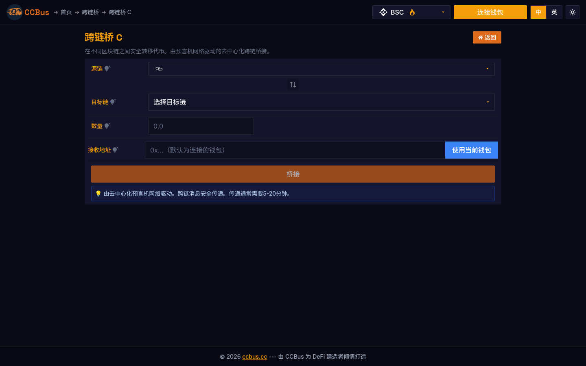
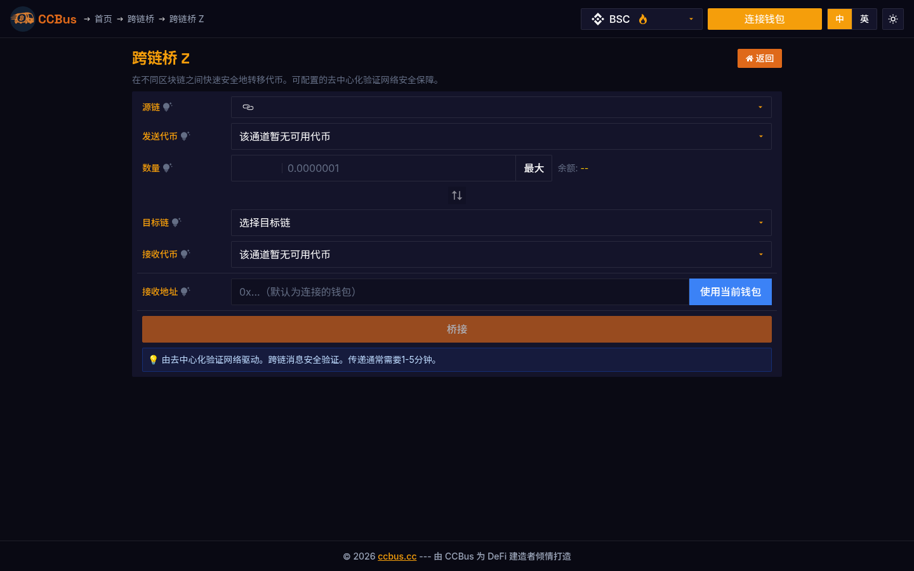
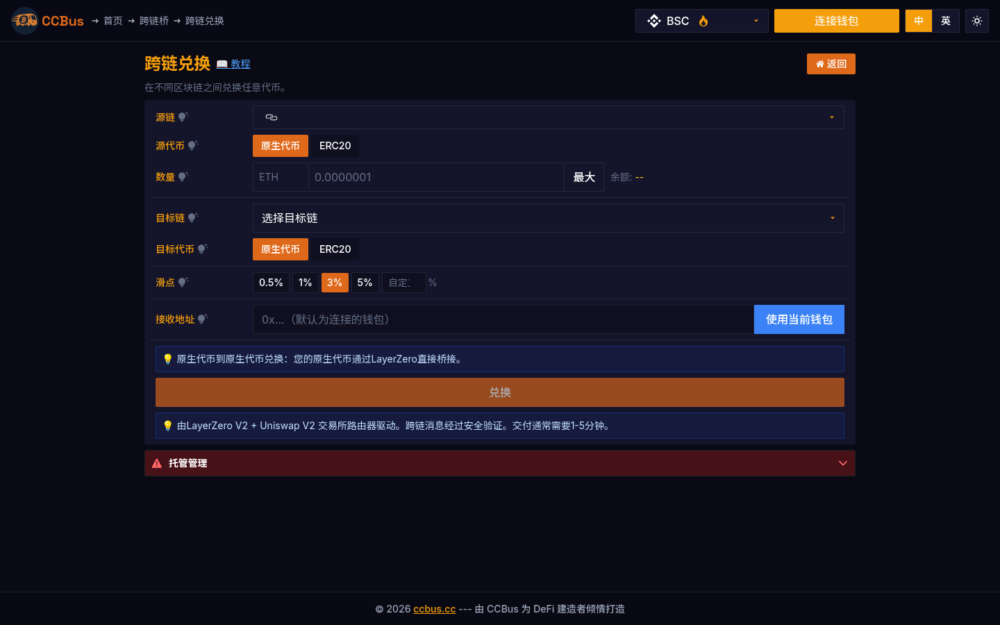

<div class="ccbus-hero">
  <div class="ccbus-hero-avatar">
    
  </div>
  <div class="ccbus-hero-content">
    <h1>第八章：互操作性与跨链</h1>
    <div class="ccbus-teacher-label">🎙️ 本章讲师:<strong>Chain Hopper</strong> · 跨链的"桥梁工程师" — 主业</div>
  </div>
</div>

<div class="chapter-intro">

**学习目标**：
- 理解区块链互操作性的重要性和挑战
- 掌握跨链技术的主要实现方式
- 了解跨链桥的工作原理和安全风险
- 学习IBC、Polkadot、Cosmos等互操作性协议
- 探索跨链通信的未来发展方向

**本章关键词**：跨链桥、互操作性、IBC协议、中继链、资产转移、消息传递、侧链、公证人机制

</div>


## 8.0 2025-2026 视角:为什么这一章要重新读

跨链已经从"桥"演化为"意图(intent)"。2025-2026 年的主流方案:

1. **LayerZero V2 (2024-Q3) + WireLib 通用消息**:
   - 全链桥接,OFT (Omnichain Fungible Token) 标准
   - 支持 BSC、ETH、Solana、Base、Arbitrum、zkSync、Linea、Scroll 等 50+ 链
   - **2026 真实项目**:Stargate(OFT 桥)、Tether(USDT 全链)、PancakeSwap(全链 DEX)、Radiant(全链借贷)

2. **Wormhole NTT (Native Token Transfer, 2024-Q4)**:
   - 与 OFT 不同的实现路径,基于 Wormhole 守护者签名
   - 支持更多链(70+)
   - **2026 真实项目**:Sky(原 MakerDAO)、Karura、Acala(Polkadot 系)

3. **Chainlink CCIP (Cross-Chain Interoperability Protocol)**:
   - 链下 OCR + 链上验证
   - 风险分级管理(双向、多签)
   - **2026 真实项目**:Aave 跨链版(GHO 跨链)、Synthetix v3

4. **Across Protocol**:意图式桥的代表
   - 2 秒到达(无需等待目的链最终性)
   - Optimistic verification(类似 Optimism)
   - **2026 数据**:日交易量 5 亿+,桥接 TVL 5 亿美元

5. **deBridge DLN (DeBridge Liquidity Network)**:
   - 跨链意图的另一个流派
   - 求解器竞标 + 链上结算
   - **2026 真实项目**:1inch Fusion+、Matcha、ParaSwap 集成

6. **基于 ZK 的跨链(ZK Light Client)**:
   - **zkBridge**(2023-08,2024 升级):用 ZK 证明验证源链共识
   - **Electron Labs**:用 ZK 证明比特币到 EVM
   - **Lagrange**:跨链 ZK 证明计算
   - **2026 优势**:无信任,无中间人,完全去中心化验证

7. **Axelar GMP (General Message Passing)**:
   - 通过 PoS 验证者集合的安全模型
   - 集成 Squid、Satellite 等跨链 dApp
   - 2026 持续主导应用链间的桥接

### 🖥️ 真实案例:CCBus 的三层跨链架构

CCBus 提供了三种跨链入口:

- **跨链兑换(Cross-chain Swap)**:基于意图(intent-based),用户表达"我想用 100 USDC 在 BSC 换 base 上的 ETH",由求解器(solver)竞标完成。
- **跨链桥 C(LayerZero)**:通用消息桥,适合合约级跨链调用。
- **跨链桥 Z(zkBridge)**:零知识证明验证,适合大额资产转移。





*图 8-1 & 8-2:CCBus 跨链桥的两种实现路径。**LayerZero 的 optimistic 模型**与**zkBridge 的有效性证明模型**是当前跨链安全权衡的两条主线。*

## 8.1 为什么需要互操作性？

### 区块链孤岛问题

目前区块链生态系统存在严重的**碎片化**问题：

**现状统计** (2025年数据)：
- 活跃的公链数量：**150+**
- 以太坊 Layer 2 数量：**50+**
- 总锁定价值 (TVL)：**$200B+**
- 跨链桥锁定价值：**$25B+**

**问题表现**：

1. **资产孤立**：
   - 比特币无法直接在以太坊上使用
   - 以太坊资产无法在Solana上交易
   - 用户需在多个链上持有不同资产

2. **流动性分散**：
   - 同一资产在不同链上价格不一致
   - DEX流动性被分割到多个链
   - 交易深度不足，滑点大

3. **用户体验差**：
   - 需要多个钱包管理不同链
   - 跨链操作复杂、耗时长
   - Gas费需要原生代币支付

4. **开发者困境**：
   - 无法复用其他链的智能合约
   - 难以构建跨链DApp
   - 生态系统封闭

<div style="background: rgba(52, 81, 178, 0.06); padding: 1.5em; border-radius: 4px; margin: 2em 0;">
<svg class="svg-8-0" viewBox="0 0 800 450" xmlns="http://www.w3.org/2000/svg" style="width: 100%; max-width: 900px; display: block; margin: 0 auto;">
<defs>
<style>
.svg-8-0 .inter-title { font-family: arial, sans-serif; font-size: 16px; fill: #1f2937; font-weight: bold; }
.svg-8-0 .inter-chain { font-family: arial, sans-serif; font-size: 14px; fill: #1f2937; font-weight: bold; }
.svg-8-0 .inter-text { font-family: arial, sans-serif; font-size: 11px; fill: #1f2937; }
.svg-8-0 .inter-small { font-family: arial, sans-serif; font-size: 9px; fill: #b0a090; }
.svg-8-0 .inter-chain-circle { fill: rgba(52, 81, 178, 0.15); stroke: #4c9be8; stroke-width: 2; }
.svg-8-0 .inter-bridge-line { stroke: #df6919; stroke-width: 2; stroke-dasharray: 5,5; fill: none; }
.svg-8-0 .inter-arrow { fill: #df6919; }
.svg-8-0 .inter-isolated { stroke: #dc3545; stroke-width: 2; stroke-dasharray: 3,3; fill: none; }
</style>
</defs>
<text x="400" y="25" text-anchor="middle" class="inter-title">区块链孤岛问题示意图</text>
<text x="400" y="45" text-anchor="middle" class="inter-small">当前：各链独立运作，资产和数据无法直接交互</text>
<circle cx="200" cy="150" r="60" class="inter-chain-circle"/>
<text x="200" y="145" text-anchor="middle" class="inter-chain">比特币</text>
<text x="200" y="162" text-anchor="middle" class="inter-text">BTC: $50K</text>
<text x="200" y="175" text-anchor="middle" class="inter-small">PoW共识</text>
<circle cx="600" cy="150" r="60" class="inter-chain-circle"/>
<text x="600" y="145" text-anchor="middle" class="inter-chain">以太坊</text>
<text x="600" y="162" text-anchor="middle" class="inter-text">ETH: $3K</text>
<text x="600" y="175" text-anchor="middle" class="inter-small">PoS共识</text>
<circle cx="150" cy="320" r="60" class="inter-chain-circle"/>
<text x="150" y="315" text-anchor="middle" class="inter-chain">Solana</text>
<text x="150" y="332" text-anchor="middle" class="inter-text">SOL: $100</text>
<text x="150" y="345" text-anchor="middle" class="inter-small">高TPS</text>
<circle cx="400" cy="320" r="60" class="inter-chain-circle"/>
<text x="400" y="315" text-anchor="middle" class="inter-chain">Polygon</text>
<text x="400" y="332" text-anchor="middle" class="inter-text">MATIC: $1</text>
<text x="400" y="345" text-anchor="middle" class="inter-small">Layer 2</text>
<circle cx="650" cy="320" r="60" class="inter-chain-circle"/>
<text x="650" y="315" text-anchor="middle" class="inter-chain">BSC</text>
<text x="650" y="332" text-anchor="middle" class="inter-text">BNB: $400</text>
<text x="650" y="345" text-anchor="middle" class="inter-small">EVM兼容</text>
<ellipse cx="200" cy="150" rx="65" ry="65" class="inter-isolated"/>
<ellipse cx="600" cy="150" rx="65" ry="65" class="inter-isolated"/>
<ellipse cx="150" cy="320" rx="65" ry="65" class="inter-isolated"/>
<ellipse cx="400" cy="320" rx="65" ry="65" class="inter-isolated"/>
<ellipse cx="650" cy="320" rx="65" ry="65" class="inter-isolated"/>
<rect x="50" y="405" width="160" height="35" fill="rgba(220, 53, 69, 0.2)" stroke="#dc3545" stroke-width="1" rx="4"/>
<text x="60" y="420" class="inter-text" fill="#dc3545">❌ 无法直接转移资产</text>
<text x="60" y="435" class="inter-text" fill="#dc3545">❌ 无法调用其他链合约</text>
<rect x="320" y="405" width="160" height="35" fill="rgba(223, 105, 25, 0.08)" stroke="#df6919" stroke-width="1" rx="4"/>
<text x="330" y="420" class="inter-text" fill="#df6919">⚠️  流动性分散</text>
<text x="330" y="435" class="inter-text" fill="#df6919">⚠️  用户体验差</text>
<rect x="590" y="405" width="160" height="35" fill="rgba(52, 81, 178, 0.10)" stroke="#4c9be8" stroke-width="1" rx="4"/>
<text x="600" y="420" class="inter-text" fill="#4c9be8">💡 需要跨链解决方案</text>
<text x="600" y="435" class="inter-text" fill="#4c9be8">💡 实现互操作性</text>
</svg>
</div>

### 互操作性的价值

**互操作性** (Interoperability) 能够带来：

1. **统一流动性**：
   - 资产可在多链间自由流动
   - 提高资本效率
   - 减少价格差异和套利空间

2. **增强可组合性**：
   - DApp可调用多链智能合约
   - 构建跨链金融产品
   - 实现更复杂的业务逻辑

3. **改善用户体验**：
   - 一个钱包管理多链资产
   - 自动路由到最优链
   - 降低学习成本

4. **促进创新**：
   - 利用不同链的优势特性
   - 以太坊安全性 + Solana高性能
   - 构建真正的"多链"应用

---

## 8.2 跨链桥的工作原理

### 跨链桥分类

**按信任模型分类**：

<div style="background: rgba(52, 81, 178, 0.06); padding: 1.5em; border-radius: 4px; margin: 2em 0;">
<svg class="svg-8-1" viewBox="0 0 850 500" xmlns="http://www.w3.org/2000/svg" style="width: 100%; max-width: 950px; display: block; margin: 0 auto;">
<defs>
<style>
.svg-8-1 .bridge-title { font-family: arial, sans-serif; font-size: 16px; fill: #1f2937; font-weight: bold; }
.svg-8-1 .bridge-type { font-family: arial, sans-serif; font-size: 14px; fill: #1f2937; font-weight: bold; }
.svg-8-1 .bridge-text { font-family: arial, sans-serif; font-size: 11px; fill: #1f2937; }
.svg-8-1 .bridge-small { font-family: arial, sans-serif; font-size: 9px; fill: #b0a090; }
.svg-8-1 .bridge-box { fill: rgba(52, 81, 178, 0.10); stroke: #4c9be8; stroke-width: 2; }
.svg-8-1 .bridge-trusted { fill: rgba(223, 105, 25, 0.08); stroke: #df6919; stroke-width: 2; }
.svg-8-1 .bridge-trustless { fill: rgba(92, 184, 92, 0.10); stroke: #5cb85c; stroke-width: 2; }
.svg-8-1 .bridge-arrow { stroke: #1f2937; stroke-width: 1.5; fill: none; marker-end: url(#arrowBridge); }
</style>
<marker id="arrowBridge" markerWidth="10" markerHeight="10" refX="9" refY="3" orient="auto" markerUnits="strokeWidth">
<path d="M0,0 L0,6 L9,3 z" fill="#1f2937"/>
</marker>
</defs>
<text x="425" y="25" text-anchor="middle" class="bridge-title">跨链桥分类与对比</text>
<text x="425" y="45" text-anchor="middle" class="bridge-small">按信任模型和实现方式分类</text>
<rect x="50" y="70" width="750" height="60" class="bridge-box" rx="8"/>
<text x="425" y="95" text-anchor="middle" class="bridge-type">跨链桥 (Cross-Chain Bridges)</text>
<text x="425" y="115" text-anchor="middle" class="bridge-text">连接不同区块链，实现资产和数据转移的基础设施</text>
<line x1="425" y1="130" x2="200" y2="160" class="bridge-arrow"/>
<line x1="425" y1="130" x2="650" y2="160" class="bridge-arrow"/>
<rect x="50" y="170" width="300" height="280" class="bridge-trusted" rx="8"/>
<text x="200" y="195" text-anchor="middle" class="bridge-type">1️⃣ 信任型桥 (Trusted)</text>
<text x="60" y="220" class="bridge-text" font-weight="bold">🔸 特点：</text>
<text x="70" y="238" class="bridge-text">• 依赖中心化验证者/托管方</text>
<text x="70" y="254" class="bridge-text">• 第三方保管锁定资产</text>
<text x="70" y="270" class="bridge-text">• 速度快、成本低</text>
<text x="60" y="295" class="bridge-text" font-weight="bold">🔸 代表项目：</text>
<text x="70" y="313" class="bridge-text">• Multichain (已停运)</text>
<text x="70" y="329" class="bridge-text">• Wormhole (多签验证者)</text>
<text x="70" y="345" class="bridge-text">• Ronin Bridge</text>
<text x="60" y="370" class="bridge-text" font-weight="bold">🔸 风险：</text>
<text x="70" y="388" class="bridge-text" fill="#df6919">❌ 单点故障风险</text>
<text x="70" y="404" class="bridge-text" fill="#df6919">❌ 需要信任第三方</text>
<text x="70" y="420" class="bridge-text" fill="#df6919">❌ 验证者可能作恶</text>
<text x="70" y="440" class="bridge-small">例：Ronin Bridge被黑客盗取$625M</text>
<rect x="500" y="170" width="300" height="280" class="bridge-trustless" rx="8"/>
<text x="650" y="195" text-anchor="middle" class="bridge-type">2️⃣ 去信任型桥 (Trustless)</text>
<text x="510" y="220" class="bridge-text" font-weight="bold">🔸 特点：</text>
<text x="520" y="238" class="bridge-text">• 基于密码学验证</text>
<text x="520" y="254" class="bridge-text">• 轻客户端/中继链验证</text>
<text x="520" y="270" class="bridge-text">• 去中心化安全保障</text>
<text x="510" y="295" class="bridge-text" font-weight="bold">🔸 代表项目：</text>
<text x="520" y="313" class="bridge-text">• IBC (Cosmos生态)</text>
<text x="520" y="329" class="bridge-text">• Polkadot XCMP</text>
<text x="520" y="345" class="bridge-text">• Rainbow Bridge (NEAR)</text>
<text x="510" y="370" class="bridge-text" font-weight="bold">🔸 优势：</text>
<text x="520" y="388" class="bridge-text" fill="#5cb85c">✅ 无需信任第三方</text>
<text x="520" y="404" class="bridge-text" fill="#5cb85c">✅ 密码学安全保证</text>
<text x="520" y="420" class="bridge-text" fill="#5cb85c">✅ 继承源链安全性</text>
<text x="520" y="440" class="bridge-small">挑战：实现复杂、成本较高</text>
<rect x="50" y="465" width="180" height="25" fill="rgba(223, 105, 25, 0.12)" stroke="#df6919" stroke-width="1" rx="4"/>
<text x="140" y="482" text-anchor="middle" class="bridge-text">信任型：速度 ⚡⚡⚡ 安全 🔒</text>
<rect x="620" y="465" width="180" height="25" fill="rgba(92, 184, 92, 0.15)" stroke="#5cb85c" stroke-width="1" rx="4"/>
<text x="710" y="482" text-anchor="middle" class="bridge-text">去信任型：速度 ⚡ 安全 🔒🔒🔒</text>
</svg>
</div>

### 典型跨链桥工作流程

以 **资产跨链转移** 为例（ETH → BSC）：

<div style="background: rgba(52, 81, 178, 0.06); padding: 1.5em; border-radius: 4px; margin: 2em 0;">
<svg class="svg-8-2" viewBox="0 0 900 550" xmlns="http://www.w3.org/2000/svg" style="width: 100%; max-width: 1000px; display: block; margin: 0 auto;">
<defs>
<style>
.svg-8-2 .flow-title { font-family: arial, sans-serif; font-size: 16px; fill: #1f2937; font-weight: bold; }
.svg-8-2 .flow-step { font-family: arial, sans-serif; font-size: 13px; fill: #1f2937; font-weight: bold; }
.svg-8-2 .flow-text { font-family: arial, sans-serif; font-size: 11px; fill: #1f2937; }
.svg-8-2 .flow-small { font-family: arial, sans-serif; font-size: 9px; fill: #b0a090; }
.svg-8-2 .flow-box { fill: rgba(52, 81, 178, 0.10); stroke: #4c9be8; stroke-width: 2; }
.svg-8-2 .flow-chain { fill: rgba(223, 105, 25, 0.08); stroke: #df6919; stroke-width: 2; }
.svg-8-2 .flow-bridge { fill: rgba(92, 184, 92, 0.10); stroke: #5cb85c; stroke-width: 2; }
.svg-8-2 .flow-arrow { stroke: #1f2937; stroke-width: 2; fill: none; marker-end: url(#arrowFlow); }
.svg-8-2 .flow-arrow-bi { stroke: #5cb85c; stroke-width: 2; fill: none; }
</style>
<marker id="arrowFlow" markerWidth="10" markerHeight="10" refX="9" refY="3" orient="auto" markerUnits="strokeWidth">
<path d="M0,0 L0,6 L9,3 z" fill="#1f2937"/>
</marker>
</defs>
<text x="450" y="25" text-anchor="middle" class="flow-title">跨链桥资产转移流程 (Lock & Mint 模式)</text>
<text x="450" y="45" text-anchor="middle" class="flow-small">示例：将 100 ETH 从以太坊转移到 BSC</text>
<rect x="50" y="70" width="200" height="100" class="flow-chain" rx="8"/>
<text x="150" y="95" text-anchor="middle" class="flow-step">源链：以太坊</text>
<text x="60" y="115" class="flow-text">• 用户地址：0xABC...</text>
<text x="60" y="132" class="flow-text">• 余额：100 ETH</text>
<text x="60" y="149" class="flow-text">• 操作：锁定资产</text>
<rect x="350" y="70" width="200" height="100" class="flow-bridge" rx="8"/>
<text x="450" y="95" text-anchor="middle" class="flow-step">跨链桥合约</text>
<text x="360" y="115" class="flow-text">• 托管合约：Lock</text>
<text x="360" y="132" class="flow-text">• 验证者网络</text>
<text x="360" y="149" class="flow-text">• 中继服务</text>
<rect x="650" y="70" width="200" height="100" class="flow-chain" rx="8"/>
<text x="750" y="95" text-anchor="middle" class="flow-step">目标链：BSC</text>
<text x="660" y="115" class="flow-text">• 用户地址：0xABC...</text>
<text x="660" y="132" class="flow-text">• 余额：0 WETH</text>
<text x="660" y="149" class="flow-text">• 操作：铸造资产</text>
<line x1="250" y1="120" x2="350" y2="120" class="flow-arrow"/>
<line x1="550" y1="120" x2="650" y2="120" class="flow-arrow"/>
<rect x="50" y="200" width="800" height="60" class="flow-box" rx="8"/>
<text x="450" y="225" text-anchor="middle" class="flow-step">步骤 1️⃣：用户在源链锁定资产</text>
<text x="60" y="247" class="flow-text">用户调用以太坊桥合约的 lock(100 ETH, targetChain=BSC) 函数，将 100 ETH 锁定在托管合约中</text>
<rect x="50" y="280" width="800" height="60" class="flow-box" rx="8"/>
<text x="450" y="305" text-anchor="middle" class="flow-step">步骤 2️⃣：验证者监听并确认事件</text>
<text x="60" y="327" class="flow-text">验证者节点监听以太坊事件，等待区块确认（如12个区块），达成多签共识后生成证明</text>
<rect x="50" y="360" width="800" height="60" class="flow-box" rx="8"/>
<text x="450" y="385" text-anchor="middle" class="flow-step">步骤 3️⃣：中继将证明提交到目标链</text>
<text x="60" y="407" class="flow-text">中继服务将验证者签名和锁定证明提交到 BSC 的桥合约 submitProof(proof, signatures)</text>
<rect x="50" y="440" width="800" height="60" class="flow-box" rx="8"/>
<text x="450" y="465" text-anchor="middle" class="flow-step">步骤 4️⃣：目标链铸造等值包装资产</text>
<text x="60" y="487" class="flow-text">BSC 桥合约验证证明后，为用户铸造 100 WETH（Wrapped ETH），用户可在 BSC 上使用</text>
<rect x="50" y="515" width="400" height="25" fill="rgba(92, 184, 92, 0.10)" stroke="#5cb85c" stroke-width="1" rx="4"/>
<text x="60" y="532" class="flow-text">✅ 完成：源链锁定 100 ETH，目标链获得 100 WETH</text>
<rect x="500" y="515" width="350" height="25" fill="rgba(223, 105, 25, 0.08)" stroke="#df6919" stroke-width="1" rx="4"/>
<text x="510" y="532" class="flow-text">⚠️  反向操作：销毁 WETH → 解锁 ETH（Burn & Unlock）</text>
</svg>
</div>

**关键机制**：

1. **Lock & Mint** (锁定与铸造)：
   - 源链锁定原生资产
   - 目标链铸造等值包装资产
   - 1:1 锚定关系

2. **Burn & Unlock** (销毁与解锁)：
   - 反向操作流程
   - 目标链销毁包装资产
   - 源链解锁原生资产

3. **验证机制**：
   - **多签验证**：M-of-N 验证者签名（如 7/10）
   - **轻客户端验证**：目标链运行源链轻节点
   - **中继网络**：去中心化中继传递消息

---

## 8.3 主流跨链协议

### IBC (Inter-Blockchain Communication)

**Cosmos 生态的跨链通信协议**，是目前最成熟的去信任跨链方案。

<div style="background: rgba(52, 81, 178, 0.06); padding: 1.5em; border-radius: 4px; margin: 2em 0;">
<svg class="svg-8-3" viewBox="0 0 850 600" xmlns="http://www.w3.org/2000/svg" style="width: 100%; max-width: 950px; display: block; margin: 0 auto;">
<defs>
<style>
.svg-8-3 .ibc-title { font-family: arial, sans-serif; font-size: 16px; fill: #1f2937; font-weight: bold; }
.svg-8-3 .ibc-layer { font-family: arial, sans-serif; font-size: 13px; fill: #1f2937; font-weight: bold; }
.svg-8-3 .ibc-text { font-family: arial, sans-serif; font-size: 11px; fill: #1f2937; }
.svg-8-3 .ibc-small { font-family: arial, sans-serif; font-size: 9px; fill: #b0a090; }
.svg-8-3 .ibc-box { fill: rgba(52, 81, 178, 0.10); stroke: #4c9be8; stroke-width: 2; }
.svg-8-3 .ibc-app { fill: rgba(223, 105, 25, 0.08); stroke: #df6919; stroke-width: 2; }
.svg-8-3 .ibc-transport { fill: rgba(92, 184, 92, 0.10); stroke: #5cb85c; stroke-width: 2; }
.svg-8-3 .ibc-arrow { stroke: #1f2937; stroke-width: 1.5; fill: none; marker-end: url(#arrowIBC); }
.svg-8-3 .ibc-data { stroke: #df6919; stroke-width: 2; fill: none; stroke-dasharray: 5,5; }
</style>
<marker id="arrowIBC" markerWidth="10" markerHeight="10" refX="9" refY="3" orient="auto" markerUnits="strokeWidth">
<path d="M0,0 L0,6 L9,3 z" fill="#1f2937"/>
</marker>
</defs>
<text x="425" y="25" text-anchor="middle" class="ibc-title">IBC 协议架构 (Inter-Blockchain Communication)</text>
<text x="425" y="45" text-anchor="middle" class="ibc-small">Cosmos 生态的标准化跨链通信协议 - 基于轻客户端验证</text>
<rect x="50" y="70" width="350" height="480" fill="rgba(52, 81, 178, 0.05)" stroke="#4c9be8" stroke-width="2" stroke-dasharray="5,5" rx="8"/>
<text x="225" y="95" text-anchor="middle" class="ibc-layer">区块链 A (Cosmos Hub)</text>
<rect x="450" y="70" width="350" height="480" fill="rgba(92, 184, 92, 0.1)" stroke="#5cb85c" stroke-width="2" stroke-dasharray="5,5" rx="8"/>
<text x="625" y="95" text-anchor="middle" class="ibc-layer">区块链 B (Osmosis)</text>
<rect x="70" y="115" width="310" height="80" class="ibc-app" rx="6"/>
<text x="225" y="140" text-anchor="middle" class="ibc-layer">应用层 (IBC Application)</text>
<text x="80" y="162" class="ibc-text">• ICS-20: 代币转移</text>
<text x="80" y="178" class="ibc-text">• ICS-27: 跨链账户 (ICA)</text>
<text x="80" y="194" class="ibc-text">• 自定义应用模块</text>
<rect x="470" y="115" width="310" height="80" class="ibc-app" rx="6"/>
<text x="625" y="140" text-anchor="middle" class="ibc-layer">应用层 (IBC Application)</text>
<text x="480" y="162" class="ibc-text">• ICS-20: 代币转移</text>
<text x="480" y="178" class="ibc-text">• ICS-27: 跨链账户 (ICA)</text>
<text x="480" y="194" class="ibc-text">• 自定义应用模块</text>
<path d="M 380,155 Q 425,155 470,155" class="ibc-data"/>
<text x="425" y="150" text-anchor="middle" class="ibc-small" fill="#df6919">数据包</text>
<rect x="70" y="220" width="310" height="100" class="ibc-box" rx="6"/>
<text x="225" y="245" text-anchor="middle" class="ibc-layer">IBC 核心层 (IBC/TAO)</text>
<text x="80" y="267" class="ibc-text">• ICS-2: 客户端语义</text>
<text x="80" y="283" class="ibc-text">• ICS-3: 连接握手</text>
<text x="80" y="299" class="ibc-text">• ICS-4: 通道与数据包</text>
<text x="80" y="315" class="ibc-text">• ICS-23: 向量承诺证明</text>
<rect x="470" y="220" width="310" height="100" class="ibc-box" rx="6"/>
<text x="625" y="245" text-anchor="middle" class="ibc-layer">IBC 核心层 (IBC/TAO)</text>
<text x="480" y="267" class="ibc-text">• ICS-2: 客户端语义</text>
<text x="480" y="283" class="ibc-text">• ICS-3: 连接握手</text>
<text x="480" y="299" class="ibc-text">• ICS-4: 通道与数据包</text>
<text x="480" y="315" class="ibc-text">• ICS-23: 向量承诺证明</text>
<line x1="225" y1="320" x2="225" y2="340" class="ibc-arrow"/>
<line x1="625" y1="320" x2="625" y2="340" class="ibc-arrow"/>
<rect x="70" y="340" width="310" height="80" class="ibc-transport" rx="6"/>
<text x="225" y="365" text-anchor="middle" class="ibc-layer">轻客户端 (Light Client)</text>
<text x="80" y="387" class="ibc-text">• 存储区块链 B 的状态根</text>
<text x="80" y="403" class="ibc-text">• 验证区块链 B 的证明</text>
<text x="80" y="419" class="ibc-text">• Tendermint 共识验证</text>
<rect x="470" y="340" width="310" height="80" class="ibc-transport" rx="6"/>
<text x="625" y="365" text-anchor="middle" class="ibc-layer">轻客户端 (Light Client)</text>
<text x="480" y="387" class="ibc-text">• 存储区块链 A 的状态根</text>
<text x="480" y="403" class="ibc-text">• 验证区块链 A 的证明</text>
<text x="480" y="419" class="ibc-text">• Tendermint 共识验证</text>
<path d="M 380,380 Q 425,380 470,380" class="ibc-arrow"/>
<path d="M 470,400 Q 425,400 380,400" class="ibc-arrow"/>
<text x="425" y="375" text-anchor="middle" class="ibc-small">状态证明 →</text>
<text x="425" y="415" text-anchor="middle" class="ibc-small">← 确认回执</text>
<rect x="70" y="440" width="310" height="100" class="ibc-box" rx="6"/>
<text x="225" y="465" text-anchor="middle" class="ibc-layer">区块链 A 共识层</text>
<text x="80" y="487" class="ibc-text">• Tendermint BFT 共识</text>
<text x="80" y="503" class="ibc-text">• 区块生成和验证</text>
<text x="80" y="519" class="ibc-text">• 状态根哈希：0xABC...</text>
<text x="80" y="535" class="ibc-text">• 高度：#1,234,567</text>
<rect x="470" y="440" width="310" height="100" class="ibc-box" rx="6"/>
<text x="625" y="465" text-anchor="middle" class="ibc-layer">区块链 B 共识层</text>
<text x="480" y="487" class="ibc-text">• Tendermint BFT 共识</text>
<text x="480" y="503" class="ibc-text">• 区块生成和验证</text>
<text x="480" y="519" class="ibc-text">• 状态根哈希：0xDEF...</text>
<text x="480" y="535" class="ibc-text">• 高度：#2,345,678</text>
<rect x="50" y="565" width="380" height="25" fill="rgba(92, 184, 92, 0.15)" stroke="#5cb85c" stroke-width="1" rx="4"/>
<text x="60" y="582" class="ibc-text">✅ 优势：无需信任第三方，继承源链安全性</text>
<rect x="470" y="565" width="330" height="25" fill="rgba(223, 105, 25, 0.12)" stroke="#df6919" stroke-width="1" rx="4"/>
<text x="480" y="582" class="ibc-text">⚠️  要求：双方链必须支持轻客户端验证</text>
</svg>
</div>

**IBC 核心特性**：

1. **去信任验证**：
   - 轻客户端验证对方链状态
   - 基于密码学证明，无需信任中介
   - 继承源链的安全性

2. **标准化协议**：
   - ICS-20: 代币转移标准
   - ICS-27: 跨链账户 (Interchain Accounts)
   - ICS-721: NFT 转移标准

3. **应用生态** (2025年数据)：
   - **连接链数量**：100+ Cosmos 生态链
   - **IBC 转账量**：每月 $5B+
   - **应用案例**：Osmosis DEX、Kujira、Stride 流动质押

**IBC 工作流程**：

```javascript
// ICS-20 代币转移示例
// 用户在 Cosmos Hub 上调用
transfer(
    receiver: "osmo1abc...",  // Osmosis 地址
    amount: 100 ATOM,
    source_port: "transfer",
    source_channel: "channel-0",
    timeout_height: 1000000
)

// 流程：
// 1. Cosmos Hub 锁定 100 ATOM
// 2. 生成 IBC 数据包和 Merkle 证明
// 3. 中继器提交数据包到 Osmosis
// 4. Osmosis 轻客户端验证 Cosmos Hub 状态
// 5. Osmosis 铸造 100 IBC/ATOM
```

### Polkadot XCMP

**Polkadot 的跨链消息传递协议** (Cross-Consensus Message Format)。

**架构特点**：

1. **中继链 + 平行链**：
   - **中继链** (Relay Chain)：负责安全和跨链通信
   - **平行链** (Parachains)：独立业务链，共享安全
   - **桥接链** (Bridges)：连接外部链（如以太坊、比特币）

2. **共享安全模型**：
   - 所有平行链共享中继链验证者
   - 统一的安全性保障
   - 降低平行链启动成本

3. **XCMP 消息传递**：
   ```rust
   // XCM (Cross-Consensus Message) 示例
   // 从 Acala 平行链发送消息到 Moonbeam 平行链

   let message = Xcm(vec![
       WithdrawAsset((Here, 100_000_000_000).into()),
       BuyExecution {
           fees: (Here, 10_000_000_000).into(),
           weight_limit: Unlimited
       },
       DepositAsset {
           assets: All.into(),
           beneficiary: AccountId32 {
               id: dest_account.into()
           }.into(),
       },
   ]);

   send_xcm(Parachain(2004), message)?; // 2004 = Moonbeam ID
   ```

**Polkadot 生态** (2025年数据)：
- **平行链数量**：50+ 活跃平行链
- **平行链插槽拍卖**：每12周一次
- **代表项目**：Acala、Moonbeam、Astar、Phala

---

## 8.4 跨链桥安全风险

### 历史重大安全事件

跨链桥是 **DeFi 最大的攻击目标**，历史上发生多起重大安全事故。

<div style="background: rgba(52, 81, 178, 0.06); padding: 1.5em; border-radius: 4px; margin: 2em 0;">
<svg class="svg-8-4" viewBox="0 0 900 500" xmlns="http://www.w3.org/2000/svg" style="width: 100%; max-width: 1000px; display: block; margin: 0 auto;">
<defs>
<style>
.svg-8-4 .risk-title { font-family: arial, sans-serif; font-size: 16px; fill: #1f2937; font-weight: bold; }
.svg-8-4 .risk-event { font-family: arial, sans-serif; font-size: 12px; fill: #1f2937; font-weight: bold; }
.svg-8-4 .risk-text { font-family: arial, sans-serif; font-size: 10px; fill: #1f2937; }
.svg-8-4 .risk-small { font-family: arial, sans-serif; font-size: 9px; fill: #b0a090; }
.svg-8-4 .risk-critical { fill: rgba(220, 53, 69, 0.3); stroke: #dc3545; stroke-width: 2; }
.svg-8-4 .risk-high { fill: rgba(223, 105, 25, 0.12); stroke: #df6919; stroke-width: 2; }
.svg-8-4 .risk-timeline { stroke: #4c9be8; stroke-width: 3; fill: none; }
</style>
</defs>
<text x="450" y="25" text-anchor="middle" class="risk-title">跨链桥重大安全事件时间线</text>
<text x="450" y="45" text-anchor="middle" class="risk-small">2021-2024年，跨链桥损失超 $30 亿美元</text>
<line x1="50" y1="80" x2="850" y2="80" class="risk-timeline"/>
<circle cx="150" cy="80" r="5" fill="#dc3545"/>
<circle cx="350" cy="80" r="5" fill="#dc3545"/>
<circle cx="550" cy="80" r="5" fill="#df6919"/>
<circle cx="750" cy="80" r="5" fill="#df6919"/>
<text x="150" y="100" text-anchor="middle" class="risk-small">2022.03</text>
<text x="350" y="100" text-anchor="middle" class="risk-small">2022.08</text>
<text x="550" y="100" text-anchor="middle" class="risk-small">2022.02</text>
<text x="750" y="100" text-anchor="middle" class="risk-small">2023.07</text>
<rect x="30" y="120" width="240" height="110" class="risk-critical" rx="6"/>
<text x="150" y="140" text-anchor="middle" class="risk-event">🔴 Ronin Bridge</text>
<text x="40" y="160" class="risk-text">损失：$625M (史上最大)</text>
<text x="40" y="175" class="risk-text">攻击方式：</text>
<text x="50" y="190" class="risk-text">• 黑客控制 5/9 验证者私钥</text>
<text x="50" y="205" class="risk-text">• 伪造提款交易</text>
<text x="50" y="220" class="risk-text">• 盗取 173,600 ETH + USDC</text>
<rect x="330" y="120" width="240" height="110" class="risk-critical" rx="6"/>
<text x="450" y="140" text-anchor="middle" class="risk-event">🔴 Nomad Bridge</text>
<text x="340" y="160" class="risk-text">损失：$190M</text>
<text x="340" y="175" class="risk-text">攻击方式：</text>
<text x="350" y="190" class="risk-text">• 初始化函数漏洞</text>
<text x="350" y="205" class="risk-text">• 任何人可伪造消息</text>
<text x="350" y="220" class="risk-text">• 免费提取资金</text>
<rect x="630" y="120" width="240" height="110" class="risk-high" rx="6"/>
<text x="750" y="140" text-anchor="middle" class="risk-event">🟠 Wormhole</text>
<text x="640" y="160" class="risk-text">损失：$325M</text>
<text x="640" y="175" class="risk-text">攻击方式：</text>
<text x="650" y="190" class="risk-text">• 签名验证绕过</text>
<text x="650" y="205" class="risk-text">• 铸造 120,000 假 ETH</text>
<text x="650" y="220" class="risk-text">• Jump Crypto 全额赔付</text>
<rect x="330" y="250" width="240" height="110" class="risk-high" rx="6"/>
<text x="450" y="270" text-anchor="middle" class="risk-event">🟠 Multichain</text>
<text x="340" y="290" class="risk-text">损失：$126M</text>
<text x="340" y="305" class="risk-text">事件：</text>
<text x="350" y="320" class="risk-text">• CEO 失联，私钥丢失</text>
<text x="350" y="335" class="risk-text">• 异常提款，项目停运</text>
<text x="350" y="350" class="risk-text">• 中心化风险典型案例</text>
<rect x="50" y="380" width="800" height="100" fill="rgba(220, 53, 69, 0.2)" stroke="#dc3545" stroke-width="2" rx="8"/>
<text x="450" y="405" text-anchor="middle" class="risk-event">常见攻击向量总结</text>
<text x="60" y="425" class="risk-text">1️⃣ <tspan font-weight="bold">验证者私钥泄露</tspan>：多签钱包被攻破，控制验证者私钥</text>
<text x="60" y="442" class="risk-text">2️⃣ <tspan font-weight="bold">智能合约漏洞</tspan>：签名验证、重入、访问控制等合约 bug</text>
<text x="60" y="459" class="risk-text">3️⃣ <tspan font-weight="bold">中心化风险</tspan>：依赖单点（如 Multichain CEO 私钥）</text>
<text x="60" y="476" class="risk-text">4️⃣ <tspan font-weight="bold">共识攻击</tspan>：轻客户端实现缺陷，伪造链状态</text>
<rect x="50" y="490" width="400" height="20" fill="rgba(220, 53, 69, 0.4)" rx="4"/>
<text x="60" y="504" class="risk-text" fill="#dc3545">💀 跨链桥累计损失 (2021-2024)：超 $30 亿美元</text>
<rect x="500" y="490" width="350" height="20" fill="rgba(223, 105, 25, 0.4)" rx="4"/>
<text x="510" y="504" class="risk-text" fill="#df6919">⚠️  占 DeFi 总黑客攻击损失的 ~60%</text>
</svg>
</div>

### 安全最佳实践

**对用户**：
1. ✅ 优先选择去信任型桥（如 IBC）
2. ✅ 检查桥的审计报告和安全记录
3. ✅ 大额转账分批进行
4. ✅ 验证目标地址正确性

**对开发者**：
1. 🔒 **多重验证**：
   - 多签 + 时间锁
   - 至少 7/10 验证者签名
   - 24-48小时提款延迟

2. 🔒 **形式化验证**：
   - 关键合约形式化证明
   - 漏洞赏金计划
   - 持续安全审计

3. 🔒 **去中心化**：
   - 验证者集合去中心化
   - 避免单点故障
   - 开源代码和运营透明

---

## 8.5 新兴跨链技术

### LayerZero 全链互操作性协议

**LayerZero** 是一种轻量级消息传递协议，实现全链（Omnichain）互操作性。

**核心创新**：

1. **超轻节点** (Ultra Light Node, ULN)：
   - 不存储所有区块头（传统轻客户端需要）
   - 按需获取所需区块头
   - 降低验证成本

2. **双重验证机制**：
   ```
   Oracle (预言机)：提供区块头
        +
   Relayer (中继器)：提供交易证明
        ↓
   目标链验证：只有当两者数据一致才接受
   ```

3. **用户可配置安全**：
   - 用户可选择自己的 Oracle 和 Relayer
   - 也可使用默认的 LayerZero Labs 服务
   - 平衡去中心化和成本

**应用案例**：
- **Stargate Finance**：全链流动性协议，TVL $400M+
- **Aptos Bridge**：连接 Aptos 和 EVM 链
- **Omnichain NFT**：NFT 可在多链间转移

**代码示例**：
```javascript
// LayerZero 跨链消息发送
interface ILayerZeroEndpoint {
    function send(
        uint16 _dstChainId,        // 目标链 ID
        bytes calldata _destination, // 目标合约地址
        bytes calldata _payload,     // 消息内容
        address payable _refundAddress,
        address _zroPaymentAddress,
        bytes calldata _adapterParams
    ) external payable;
}

// 示例：从以太坊发送消息到 BSC
lzEndpoint.send{value: msg.value}(
    102,  // BSC Chain ID in LayerZero
    abi.encodePacked(destAddress),
    abi.encode(user, amount),
    payable(msg.sender),
    address(0),
    bytes("")
);
```

### Axelar Network

**去中心化跨链网络**，通过 PoS 验证者集合实现跨链通信。

**架构特点**：

1. **通用消息传递** (GMP - General Message Passing)：
   - 不仅传递资产，还可传递任意消息
   - 支持跨链智能合约调用
   - 类似"跨链 RPC"

2. **验证者网络**：
   - PoS 验证者网络（类似 Cosmos）
   - 多链网关合约
   - 阈值签名方案 (TSS)

3. **支持链** (2025年数据)：
   - **EVM 链**：以太坊、BSC、Polygon、Avalanche、Fantom 等
   - **非EVM链**：Cosmos、Terra 2.0、Osmosis
   - **总计**：60+ 条链

**示例场景**：
```javascript
// 用户在以太坊上调用 BSC 的合约
// 通过 Axelar 实现跨链合约调用

// 以太坊端
axelarGateway.callContract(
    "binance",  // 目标链名称
    bscContractAddress,
    abi.encode(functionSignature, params)
);

// Axelar 验证者网络验证并中继消息

// BSC 端自动执行
function execute(
    bytes32 commandId,
    string calldata sourceChain,
    string calldata sourceAddress,
    bytes calldata payload
) external {
    // 执行跨链调用的业务逻辑
}
```

### Chainlink CCIP

**Chainlink Cross-Chain Interoperability Protocol** - 企业级跨链标准。

**核心特性**：

1. **可编程代币转移**：
   - 转移代币 + 附带消息
   - 目标链自动执行逻辑
   - 支持复杂的跨链 DeFi 场景

2. **风险管理网络** (Risk Management Network)：
   - 独立监控网络异常
   - 可暂停可疑交易
   - 额外的安全层

3. **速率限制**：
   - 单笔转账上限
   - 时间窗口内总量限制
   - 防止大规模资金外流

**代码示例**：
```javascript
// CCIP 跨链代币转移 + 消息
import "@chainlink/contracts-ccip/src/v0.8/ccip/interfaces/IRouterClient.sol";

IRouterClient router = IRouterClient(ccipRouterAddress);

Client.EVM2AnyMessage memory message = Client.EVM2AnyMessage({
    receiver: abi.encode(receiverAddress),
    data: abi.encode(userData),  // 附带消息
    tokenAmounts: tokenAmounts,  // 转移的代币
    feeToken: feeTokenAddress,
    extraArgs: ""
});

uint256 fees = router.getFee(destinationChainSelector, message);
router.ccipSend{value: fees}(destinationChainSelector, message);
```

---


### 8.7 意图式跨链(Intent-based):2024-2026 主流化



*图: CCBus 跨链兑换 — 意图式跨链的 UI 范本*


**传统跨链的问题**:
- 用户必须自己选桥、选源链、选目标链
- 用户必须接受"最优路径"被路由器决定,可能不是最优
- 用户必须等待 L1/L2 最终性(几分钟到几天)

**意图式跨链的核心**:
- 用户**只表达"我要什么"**(intent)
- 求解器(solver/relayer)竞标执行
- 用户无需了解技术细节

**意图式跨链流程**:
1. 用户签名一个意图:`将 100 USDC 在 BSC 换为 Base 上的 ETH,最低获得 0.03 ETH`
2. 求解器监控链上意图池,竞标出价
3. 胜出求解器执行跨链(可能用 Stargate、Across、自己的流动性)
4. 用户在 2-10 秒内收到目标链上的 ETH

**生产级意图式项目(2025-2026)**:

| 项目 | 类型 | 描述 |
|---|---|---|
| **UniswapX** | DEX 意图 | 荷兰拍,MEV 保护 |
| **Across Protocol** | 跨链意图 | 2 秒到达,Optimistic 验证 |
| **deBridge DLN** | 跨链意图 | 求解器竞标 + 链上结算 |
| **1inch Fusion** | DEX 意图 | 求解器网络 |
| **CoW Swap** | DEX 意图 | 批量结算 + CoW |
| **Squid Router** | 跨链意图 | 集成 Across + Stargate |
| **KIP Protocol** | AI 驱动意图 | AI 求解器 |

**意图式 vs 传统跨链对比**:

| 维度 | 传统桥(Stargate) | 意图式(Across DLN) |
|---|---|---|
| 用户体验 | 选源链/桥/目标链 | 只表达意图 |
| 速度 | 5-30 分钟 | 2-10 秒 |
| 最优路径 | 由路由器决定 | 由求解器竞标决定 |
| MEV 风险 | 高 | 低(求解器承担) |
| 成本 | 中 | 低(竞争压价) |
| 失败回滚 | 慢 | 快速(求解器垫付) |

**意图的标准化(2024-2025)**:

- **ERC-7683**(Across + Uniswap 联合提出):意图标准,任何钱包/dApp 可以用同一份 intent 调用任何 solver
- **ERC-7715**:意图授权标准,链下身份可以代理授权
- **1inch 意图标准**:为 Fusion+ 定制
- **CoW Swap Coincidence-of-Wants**:批量结算算法

**意图式跨链的 2026 真实数据**:
- **UniswapX 流量**:占 DEX 总量 30%+
- **Across 日交易量**:5 亿+
- **deBridge DLN 日交易量**:1 亿+
- **意图式总占 2026 跨链桥流量**:60%+

**挑战**:
- **求解器中心化**:少数大型求解器占据大部分订单
- **求解器串通风险**:求解器可能形成卡特尔
- **信任假设**:Optimistic 验证需要欺诈证明
- **监管风险**:求解器是"中介",可能被认定为 money transmitter

## 8.6 跨链未来展望

### 趋势与挑战

<div style="background: rgba(52, 81, 178, 0.06); padding: 1.5em; border-radius: 4px; margin: 2em 0;">
<svg class="svg-8-5" viewBox="0 0 850 550" xmlns="http://www.w3.org/2000/svg" style="width: 100%; max-width: 950px; display: block; margin: 0 auto;">
<defs>
<style>
.svg-8-5 .future-title { font-family: arial, sans-serif; font-size: 16px; fill: #1f2937; font-weight: bold; }
.svg-8-5 .future-cat { font-family: arial, sans-serif; font-size: 13px; fill: #1f2937; font-weight: bold; }
.svg-8-5 .future-text { font-family: arial, sans-serif; font-size: 11px; fill: #1f2937; }
.svg-8-5 .future-small { font-family: arial, sans-serif; font-size: 9px; fill: #b0a090; }
.svg-8-5 .future-trend { fill: rgba(92, 184, 92, 0.10); stroke: #5cb85c; stroke-width: 2; }
.svg-8-5 .future-challenge { fill: rgba(223, 105, 25, 0.08); stroke: #df6919; stroke-width: 2; }
</style>
</defs>
<text x="425" y="25" text-anchor="middle" class="future-title">跨链技术发展趋势与挑战</text>
<text x="425" y="45" text-anchor="middle" class="future-small">从"链间桥梁"到"全链互操作性"</text>
<rect x="50" y="70" width="370" height="220" class="future-trend" rx="8"/>
<text x="235" y="95" text-anchor="middle" class="future-cat">🚀 发展趋势</text>
<text x="60" y="120" class="future-text" font-weight="bold">1️⃣ 从资产桥到全链互操作</text>
<text x="70" y="138" class="future-text">• 不仅转移代币，还要传递消息</text>
<text x="70" y="153" class="future-text">• 跨链智能合约调用成为标配</text>
<text x="70" y="168" class="future-text">• 例：LayerZero、Axelar GMP</text>
<text x="60" y="193" class="future-text" font-weight="bold">2️⃣ 标准化与模块化</text>
<text x="70" y="211" class="future-text">• 跨链通信标准：IBC、XCMP</text>
<text x="70" y="226" class="future-text">• 可组合的跨链模块</text>
<text x="70" y="241" class="future-text">• 互操作性成为基础设施</text>
<text x="60" y="266" class="future-text" font-weight="bold">3️⃣ 意图驱动的跨链</text>
<text x="70" y="284" class="future-text">• 用户表达意图，系统自动路由</text>
<rect x="430" y="70" width="370" height="220" class="future-challenge" rx="8"/>
<text x="615" y="95" text-anchor="middle" class="future-cat">⚠️  主要挑战</text>
<text x="440" y="120" class="future-text" font-weight="bold">1️⃣ 安全性是最大障碍</text>
<text x="450" y="138" class="future-text">• 跨链桥是黑客首要目标</text>
<text x="450" y="153" class="future-text">• 需要更好的形式化验证</text>
<text x="450" y="168" class="future-text">• 保险和风险管理机制</text>
<text x="440" y="193" class="future-text" font-weight="bold">2️⃣ 信任假设的权衡</text>
<text x="450" y="211" class="future-text">• 去信任 = 高成本、低速度</text>
<text x="450" y="226" class="future-text">• 信任型 = 低成本、高风险</text>
<text x="450" y="241" class="future-text">• 需要创新的信任模型</text>
<text x="440" y="266" class="future-text" font-weight="bold">3️⃣ 流动性碎片化</text>
<text x="450" y="284" class="future-text">• 包装资产泛滥（WETH、WBTC...）</text>
<rect x="50" y="310" width="750" height="220" fill="rgba(52, 81, 178, 0.10)" stroke="#4c9be8" stroke-width="2" rx="8"/>
<text x="425" y="335" text-anchor="middle" class="future-cat">🌐 未来愿景：全链生态系统 (Omnichain Ecosystem)</text>
<text x="60" y="360" class="future-text" font-weight="bold">用户视角：</text>
<text x="70" y="378" class="future-text">• 不需要关心资产在哪条链上</text>
<text x="70" y="393" class="future-text">• 钱包自动选择最优链执行交易</text>
<text x="70" y="408" class="future-text">• Gas 费可用任意代币支付</text>
<text x="70" y="423" class="future-text">• 跨链操作如同单链一样简单</text>
<text x="60" y="448" class="future-text" font-weight="bold">开发者视角：</text>
<text x="70" y="466" class="future-text">• 编写一次合约，部署到所有链</text>
<text x="70" y="481" class="future-text">• 可调用任意链的智能合约</text>
<text x="70" y="496" class="future-text">• 统一的开发工具和标准</text>
<text x="70" y="511" class="future-text">• 流动性在全链间自由流动</text>
<rect x="50" y="540" width="750" height="20" fill="rgba(92, 184, 92, 0.15)" stroke="#5cb85c" stroke-width="1" rx="4"/>
<text x="60" y="554" class="future-text">💡 核心理念：区块链不应该是孤岛，而应该是互联互通的全球网络</text>
</svg>
</div>

### 关键技术方向

1. **零知识证明跨链桥**：
   - 使用 ZK-SNARK 验证跨链消息
   - 隐私保护 + 高效验证
   - 项目：zkBridge、Electron Labs

2. **意图中心化架构** (Intent-Centric)：
   - 用户表达"我想在链B用资产A购买资产C"
   - Solver 网络竞价执行意图
   - 抽象掉跨链复杂性
   - 项目：UniswapX、Across Protocol

3. **账户抽象 + 跨链**：
   - ERC-4337 账户抽象
   - 跨链账户统一管理
   - 一个地址控制多链资产

---

<div class="ccbus-teacher-credits">
  <div class="ccbus-teacher-credits-avatar">
    
  </div>
  <div class="ccbus-teacher-credits-body">
    本章讲师:<strong>Chain Hopper</strong> — 跨链的"桥梁工程师" — 主业<br />
    <span style="font-size: 0.85em; color: var(--vp-c-text-3);">📚 下一章 [第九章：高级密码学] 将由另一位 CCBus 讲师带你继续。</span>
  </div>
</div>

<div class="chapter-footer">

## 本章总结

本章深入探讨了区块链互操作性和跨链技术：

**核心要点**：
- 区块链孤岛问题导致流动性分散、用户体验差
- 跨链桥分为**信任型**（依赖验证者）和**去信任型**（密码学验证）
- 主流跨链协议：**IBC**（Cosmos）、**XCMP**（Polkadot）
- 跨链桥是黑客主要攻击目标，历史损失 $30B+
- 新兴技术：LayerZero、Axelar、Chainlink CCIP
- 未来趋势：从资产桥到全链互操作性

**安全建议**：
- 优先使用去信任型跨链协议
- 警惕中心化桥的单点故障风险
- 大额转账分批进行，验证目标地址

**学习资源**：
- [IBC Protocol Specification](https://github.com/cosmos/ibc)
- [Polkadot Cross-Chain Guide](https://wiki.polkadot.network/docs/learn-crosschain)
- [LayerZero Documentation](https://layerzero.gitbook.io/)
- [Chainlink CCIP](https://docs.chain.link/ccip)

**下一章预告**：
第九章将探讨**高级密码学**，包括零知识证明、多方计算、同态加密等前沿技术。

</div>
