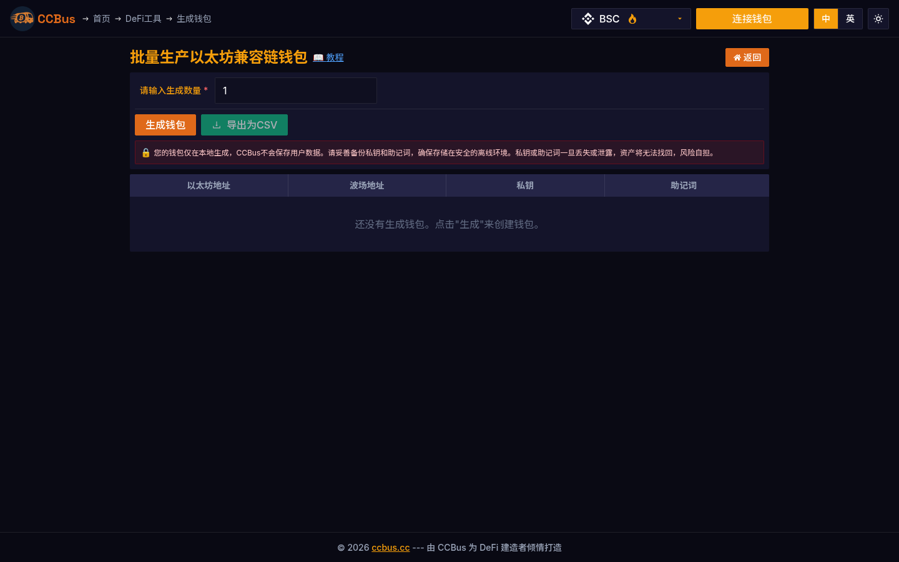

# 第九章：高级密码学

<div class="chapter-intro">

**学习目标**：
- 理解零知识证明的原理和应用
- 掌握多方安全计算的基本概念
- 学习同态加密和门限密码学
- 了解可验证随机函数（VRF）
- 探索密码学在区块链隐私保护中的应用

**本章关键词**：零知识证明、zk-SNARK、zk-STARK、多方计算、同态加密、门限签名、VRF、隐私保护

</div>


## 9.0 2025-2026 视角:为什么这一章要重新读

前沿密码学在 2025-2026 年实现了三件大事:**ZK 性能突破(证明时间从分钟级降到亚秒级)、FHE 全同态加密实用化(Zama fhEVM)、MPC 钱包大规模落地(fireblocks、Safe、Lit Protocol)**。本章既讲解这些技术的数学原理,也给出真实的产品形态。

### 🖥️ 真实案例:CCBus 批量钱包背后的密码学

CCBus 的批量钱包生成功能,本质上是客户端 MPC 友好的密钥派生——每个钱包的助记词通过BIP-32/BIP-39/BIP-44 标准从单个熵源派生,但派生过程的熵分离(separation of entropy)做到了密码学级别独立。下图展示了批量生成 100 个 EVM 钱包的界面。



*图 9-1:CCBus 批量钱包生成。背后使用了 BIP-39 助记词标准(2048 词表)与 BIP-32 HD 钱包派生树,这种**分层确定性钱包**(Hierarchical Deterministic Wallet)是 2026 年加密钱包的事实标准。*

---

## 9.1 零知识证明 (Zero-Knowledge Proof)

### 什么是零知识证明？

**零知识证明** (ZKP) 允许证明者向验证者证明某个陈述是真的，而**不透露任何额外信息**。

**经典例子：阿里巴巴洞穴**

<div style="background: rgba(32, 55, 76, 0.5); padding: 1.5em; border-radius: 8px; margin: 2em 0;">
<svg viewBox="0 0 800 500" xmlns="http://www.w3.org/2000/svg" style="width: 100%; max-width: 900px; display: block; margin: 0 auto;">
<defs>
<style>
.zkp-title { font-family: arial, sans-serif; font-size: 16px; fill: #f0e6d2; font-weight: bold; }
.zkp-text { font-family: arial, sans-serif; font-size: 11px; fill: #f0e6d2; }
.zkp-small { font-family: arial, sans-serif; font-size: 9px; fill: #b0a090; }
.zkp-cave { fill: rgba(78, 93, 108, 0.3); stroke: #4e5d6c; stroke-width: 2; }
.zkp-path { fill: none; stroke: #4c9be8; stroke-width: 2; }
.zkp-door { fill: rgba(220, 53, 69, 0.5); stroke: #dc3545; stroke-width: 2; }
.zkp-person { fill: #df6919; }
.zkp-arrow { stroke: #5cb85c; stroke-width: 2; fill: none; marker-end: url(#arrowZKP); }
</style>
<marker id="arrowZKP" markerWidth="10" markerHeight="10" refX="9" refY="3" orient="auto" markerUnits="strokeWidth">
<path d="M0,0 L0,6 L9,3 z" fill="#5cb85c"/>
</marker>
</defs>
<text x="400" y="25" text-anchor="middle" class="zkp-title">零知识证明经典例子：阿里巴巴洞穴</text>
<text x="400" y="45" text-anchor="middle" class="zkp-small">证明者知道密码，但不透露密码内容</text>
<ellipse cx="400" cy="250" rx="250" ry="180" class="zkp-cave"/>
<path d="M 400,70 L 400,150" class="zkp-path" stroke-width="30"/>
<text x="400" y="95" text-anchor="middle" class="zkp-text">入口</text>
<path d="M 400,150 Q 300,200 250,300" class="zkp-path" stroke-width="20"/>
<path d="M 400,150 Q 500,200 550,300" class="zkp-path" stroke-width="20"/>
<text x="200" y="280" class="zkp-text">路径 A</text>
<text x="600" y="280" class="zkp-text">路径 B</text>
<path d="M 250,300 Q 300,380 400,400" class="zkp-path" stroke-width="20"/>
<path d="M 550,300 Q 500,380 400,400" class="zkp-path" stroke-width="20"/>
<rect x="385" y="390" width="30" height="40" class="zkp-door" rx="3"/>
<text x="400" y="415" text-anchor="middle" class="zkp-text" font-size="10" fill="#f0e6d2">🔒</text>
<text x="400" y="450" text-anchor="middle" class="zkp-text">魔法门（需要密码）</text>
<circle cx="400" cy="120" r="15" class="zkp-person"/>
<text x="400" y="125" text-anchor="middle" class="zkp-text" font-size="12" fill="#f0e6d2">P</text>
<text x="465" y="125" class="zkp-text">证明者 (Prover)</text>
<circle cx="400" cy="40" r="15" fill="#4c9be8"/>
<text x="400" y="45" text-anchor="middle" class="zkp-text" font-size="12" fill="#f0e6d2">V</text>
<text x="465" y="45" class="zkp-text">验证者 (Verifier)</text>
<rect x="20" y="70" width="320" height="160" fill="rgba(76, 156, 232, 0.2)" stroke="#4c9be8" stroke-width="2" rx="6"/>
<text x="180" y="90" text-anchor="middle" class="zkp-text" font-weight="bold">🔄 协议流程：</text>
<text x="30" y="110" class="zkp-text">1️⃣ P 进入洞穴，V 在入口等待</text>
<text x="30" y="130" class="zkp-text">2️⃣ P 随机选择路径 A 或 B 进入</text>
<text x="30" y="150" class="zkp-text">3️⃣ V 随机要求 P 从路径 A 或 B 出来</text>
<text x="30" y="170" class="zkp-text">4️⃣ 如果 P 知道密码，总能从指定路径出来</text>
<text x="30" y="190" class="zkp-text">5️⃣ 如果 P 不知道密码，只有 50% 概率成功</text>
<text x="30" y="210" class="zkp-text">6️⃣ 重复 n 次，作弊概率降至 (1/2)^n</text>
<rect x="460" y="70" width="320" height="160" fill="rgba(92, 184, 92, 0.2)" stroke="#5cb85c" stroke-width="2" rx="6"/>
<text x="620" y="90" text-anchor="middle" class="zkp-text" font-weight="bold">✅ 零知识性质：</text>
<text x="470" y="110" class="zkp-text">• <tspan font-weight="bold">完备性</tspan>：知道密码的人总能证明</text>
<text x="470" y="130" class="zkp-text">• <tspan font-weight="bold">可靠性</tspan>：不知道密码的人无法伪造</text>
<text x="470" y="150" class="zkp-text">• <tspan font-weight="bold">零知识</tspan>：V 不知道密码是什么</text>
<text x="470" y="180" class="zkp-small">V 只知道：P 确实知道密码</text>
<text x="470" y="200" class="zkp-small">V 不知道：密码具体是什么</text>
<text x="470" y="220" class="zkp-small">V 无法向他人证明：没有学到任何信息</text>
<rect x="20" y="460" width="760" height="30" fill="rgba(223, 105, 25, 0.2)" stroke="#df6919" stroke-width="1" rx="4"/>
<text x="30" y="480" class="zkp-text">💡 区块链应用：证明交易有效（余额足够、签名正确）但不透露具体余额、接收者等隐私信息</text>
</svg>
</div>

**零知识证明的三个性质**：

1. **完备性** (Completeness)：
   - 如果陈述为真，诚实的证明者总能说服验证者
   - $P(\text{Verifier accepts} | \text{Statement is true}) = 1$

2. **可靠性** (Soundness)：
   - 如果陈述为假，作弊的证明者无法说服验证者（除了可忽略的概率）
   - $P(\text{Verifier accepts} | \text{Statement is false}) \approx 0$

3. **零知识** (Zero-Knowledge)：
   - 验证者除了"陈述为真"之外，不学到任何额外信息
   - 验证过程可被模拟，无法向他人转述证明

---

## 9.2 zk-SNARK 与 zk-STARK

### zk-SNARK (零知识简洁非交互式知识论证)

**zk-SNARK**: Zero-Knowledge Succinct Non-Interactive Argument of Knowledge

<div style="background: rgba(32, 55, 76, 0.5); padding: 1.5em; border-radius: 8px; margin: 2em 0;">
<svg viewBox="0 0 900 550" xmlns="http://www.w3.org/2000/svg" style="width: 100%; max-width: 1000px; display: block; margin: 0 auto;">
<defs>
<style>
.snark-title { font-family: arial, sans-serif; font-size: 16px; fill: #f0e6d2; font-weight: bold; }
.snark-subtitle { font-family: arial, sans-serif; font-size: 13px; fill: #f0e6d2; font-weight: bold; }
.snark-text { font-family: arial, sans-serif; font-size: 11px; fill: #f0e6d2; }
.snark-small { font-family: arial, sans-serif; font-size: 9px; fill: #b0a090; }
.snark-box { fill: rgba(76, 156, 232, 0.2); stroke: #4c9be8; stroke-width: 2; }
.snark-setup { fill: rgba(223, 105, 25, 0.2); stroke: #df6919; stroke-width: 2; }
.snark-prove { fill: rgba(92, 184, 92, 0.2); stroke: #5cb85c; stroke-width: 2; }
.snark-arrow { stroke: #f0e6d2; stroke-width: 2; fill: none; marker-end: url(#arrowSnark); }
</style>
<marker id="arrowSnark" markerWidth="10" markerHeight="10" refX="9" refY="3" orient="auto" markerUnits="strokeWidth">
<path d="M0,0 L0,6 L9,3 z" fill="#f0e6d2"/>
</marker>
</defs>
<text x="450" y="25" text-anchor="middle" class="snark-title">zk-SNARK vs zk-STARK 对比</text>
<text x="450" y="45" text-anchor="middle" class="snark-small">两种主流零知识证明系统</text>
<rect x="50" y="70" width="380" height="430" class="snark-box" rx="8"/>
<text x="240" y="95" text-anchor="middle" class="snark-subtitle">zk-SNARK</text>
<text x="240" y="115" text-anchor="middle" class="snark-small">Succinct Non-interactive ARgument of Knowledge</text>
<rect x="60" y="130" width="360" height="100" class="snark-setup" rx="6"/>
<text x="240" y="150" text-anchor="middle" class="snark-text" font-weight="bold">🔧 可信设置 (Trusted Setup)</text>
<text x="70" y="170" class="snark-text">• 需要 CRS (Common Reference String)</text>
<text x="70" y="186" class="snark-text">• 生成证明密钥 (pk) 和验证密钥 (vk)</text>
<text x="70" y="202" class="snark-text">• 必须销毁"有毒废料" (toxic waste)</text>
<text x="70" y="218" class="snark-text">• 风险：如果泄露可伪造证明</text>
<rect x="60" y="245" width="360" height="110" class="snark-prove" rx="6"/>
<text x="240" y="265" text-anchor="middle" class="snark-text" font-weight="bold">✅ 优势</text>
<text x="70" y="285" class="snark-text">• 证明尺寸小：~200 字节</text>
<text x="70" y="301" class="snark-text">• 验证速度快：~5-10 毫秒</text>
<text x="70" y="317" class="snark-text">• Gas 成本低：以太坊上 ~240k gas</text>
<text x="70" y="333" class="snark-text">• 技术成熟：Zcash、Tornado Cash</text>
<text x="70" y="349" class="snark-text">• 支持通用计算</text>
<rect x="60" y="370" width="360" height="120" fill="rgba(220, 53, 69, 0.2)" stroke="#dc3545" stroke-width="2" rx="6"/>
<text x="240" y="390" text-anchor="middle" class="snark-text" font-weight="bold">⚠️  劣势</text>
<text x="70" y="410" class="snark-text">• 需要可信设置（每个电路独立）</text>
<text x="70" y="426" class="snark-text">• 不抗量子攻击（基于椭圆曲线）</text>
<text x="70" y="442" class="snark-text">• 设置泄露风险</text>
<text x="70" y="458" class="snark-text">• 证明生成慢：几秒到几分钟</text>
<text x="70" y="474" class="snark-text">• Groth16: 最快但每电路需新设置</text>
<rect x="470" y="70" width="380" height="430" class="snark-box" rx="8"/>
<text x="660" y="95" text-anchor="middle" class="snark-subtitle">zk-STARK</text>
<text x="660" y="115" text-anchor="middle" class="snark-small">Scalable Transparent ARgument of Knowledge</text>
<rect x="480" y="130" width="360" height="100" fill="rgba(92, 184, 92, 0.3)" stroke="#5cb85c" stroke-width="2" rx="6"/>
<text x="660" y="150" text-anchor="middle" class="snark-text" font-weight="bold">🔓 无需可信设置 (Transparent)</text>
<text x="490" y="170" class="snark-text">• 使用公开随机性</text>
<text x="490" y="186" class="snark-text">• 基于哈希函数（如 Rescue）</text>
<text x="490" y="202" class="snark-text">• 无"有毒废料"风险</text>
<text x="490" y="218" class="snark-text">• 更去中心化和安全</text>
<rect x="480" y="245" width="360" height="110" class="snark-prove" rx="6"/>
<text x="660" y="265" text-anchor="middle" class="snark-text" font-weight="bold">✅ 优势</text>
<text x="490" y="285" class="snark-text">• 无需可信设置</text>
<text x="490" y="301" class="snark-text">• 抗量子攻击（基于哈希）</text>
<text x="490" y="317" class="snark-text">• 证明生成快：高度并行化</text>
<text x="490" y="333" class="snark-text">• 可扩展性好：处理大计算</text>
<text x="490" y="349" class="snark-text">• 项目：StarkNet、StarkEx</text>
<rect x="480" y="370" width="360" height="120" fill="rgba(220, 53, 69, 0.2)" stroke="#dc3545" stroke-width="2" rx="6"/>
<text x="660" y="390" text-anchor="middle" class="snark-text" font-weight="bold">⚠️  劣势</text>
<text x="490" y="410" class="snark-text">• 证明尺寸大：~100-200 KB</text>
<text x="490" y="426" class="snark-text">• 验证时间长：~50-100 毫秒</text>
<text x="490" y="442" class="snark-text">• Gas 成本高：以太坊上 ~1-5M gas</text>
<text x="490" y="458" class="snark-text">• 技术较新，生态发展中</text>
<text x="490" y="474" class="snark-text">• 链上验证成本昂贵</text>
<rect x="50" y="515" width="400" height="25" fill="rgba(76, 156, 232, 0.3)" stroke="#4c9be8" stroke-width="1" rx="4"/>
<text x="60" y="533" class="snark-text">📊 zk-SNARK 应用：Zcash, Tornado Cash, Polygon zkEVM</text>
<rect x="500" y="515" width="350" height="25" fill="rgba(92, 184, 92, 0.3)" stroke="#5cb85c" stroke-width="1" rx="4"/>
<text x="510" y="533" class="snark-text">📊 zk-STARK 应用：StarkNet, StarkEx (dYdX, Sorare)</text>
</svg>
</div>

### zk-SNARK 工作流程

```
步骤 1️⃣：可信设置 (Setup)
  电路 C → Setup(C) → (pk, vk)
  - pk: 证明密钥 (proving key)
  - vk: 验证密钥 (verification key)
  - 销毁随机数 τ (toxic waste)

步骤 2️⃣：生成证明 (Prove)
  证明者 P：
  - 输入：公开输入 x, 私密见证 w, pk
  - 计算：π = Prove(pk, x, w)
  - 输出：证明 π (~200 bytes)

步骤 3️⃣：验证证明 (Verify)
  验证者 V：
  - 输入：公开输入 x, 证明 π, vk
  - 计算：Verify(vk, x, π) → {accept, reject}
  - 时间：~5-10 ms
```

**Groth16 算法**（最流行的 zk-SNARK）：

$$
\begin{aligned}
&\text{证明包含 3 个群元素：} \\
&\pi = (A, B, C) \in \mathbb{G}_1 \times \mathbb{G}_2 \times \mathbb{G}_1 \\
\\
&\text{验证等式：} \\
&e(A, B) = e(\alpha, \beta) \cdot e(L, \gamma) \cdot e(C, \delta)
\end{aligned}
$$

其中 $e$ 是双线性配对函数。

### 应用案例

**1. Zcash (隐私货币)**：
```javascript
// 隐藏交易金额和接收者
// 证明：我有足够的余额，且交易有效
proof = GenerateProof({
    public_input: nullifier,  // 防止双花
    private_witness: {
        value: 100,           // 金额（隐藏）
        sender_key: sk,       // 发送者私钥（隐藏）
        receiver_addr: addr   // 接收者地址（隐藏）
    }
});

// 链上只验证证明，不知道具体金额
VerifyProof(proof) → true/false
```

**2. Tornado Cash (隐私混币)**：
- 用户存款时生成秘密 (secret + nullifier)
- 存款哈希 commitment = Hash(secret, nullifier) 记录到链上
- 提款时提供 ZK 证明：知道某个 commitment 的原像
- 无法关联存款和提款地址

**3. zkSync Era (Layer 2 扩容)**：
- 将数千笔交易打包到一个区块
- 生成单个 zk-SNARK 证明
- 以太坊只需验证一个证明 → 节省 Gas

---

## 9.3 多方安全计算 (MPC)

### MPC 基本概念

**多方安全计算** (Secure Multi-Party Computation) 允许多方在不泄露各自私密输入的情况下，共同计算一个函数。

<div style="background: rgba(32, 55, 76, 0.5); padding: 1.5em; border-radius: 8px; margin: 2em 0;">
<svg viewBox="0 0 850 520" xmlns="http://www.w3.org/2000/svg" style="width: 100%; max-width: 950px; display: block; margin: 0 auto;">
<defs>
<style>
.mpc-title { font-family: arial, sans-serif; font-size: 16px; fill: #f0e6d2; font-weight: bold; }
.mpc-text { font-family: arial, sans-serif; font-size: 11px; fill: #f0e6d2; }
.mpc-small { font-family: arial, sans-serif; font-size: 9px; fill: #b0a090; }
.mpc-party { fill: rgba(76, 156, 232, 0.3); stroke: #4c9be8; stroke-width: 2; }
.mpc-secret { fill: rgba(220, 53, 69, 0.3); stroke: #dc3545; stroke-width: 2; }
.mpc-result { fill: rgba(92, 184, 92, 0.3); stroke: #5cb85c; stroke-width: 2; }
.mpc-line { stroke: #f0e6d2; stroke-width: 1.5; stroke-dasharray: 5,5; fill: none; }
</style>
</defs>
<text x="425" y="25" text-anchor="middle" class="mpc-title">多方安全计算 (MPC) 示例：百万富翁问题</text>
<text x="425" y="45" text-anchor="middle" class="mpc-small">Alice 和 Bob 想知道谁更富有，但不想透露各自的财富值</text>
<circle cx="200" cy="150" r="60" class="mpc-party"/>
<text x="200" y="145" text-anchor="middle" class="mpc-text" font-size="14" fill="#f0e6d2">👨 Alice</text>
<text x="200" y="165" text-anchor="middle" class="mpc-text">财富：$2M</text>
<rect x="140" y="180" width="120" height="30" class="mpc-secret" rx="4"/>
<text x="200" y="200" text-anchor="middle" class="mpc-text" fill="#dc3545">🔒 私密输入</text>
<circle cx="650" cy="150" r="60" class="mpc-party"/>
<text x="650" y="145" text-anchor="middle" class="mpc-text" font-size="14" fill="#f0e6d2">👩 Bob</text>
<text x="650" y="165" text-anchor="middle" class="mpc-text">财富：$3M</text>
<rect x="590" y="180" width="120" height="30" class="mpc-secret" rx="4"/>
<text x="650" y="200" text-anchor="middle" class="mpc-text" fill="#dc3545">🔒 私密输入</text>
<rect x="325" y="100" width="200" height="100" fill="rgba(223, 105, 25, 0.2)" stroke="#df6919" stroke-width="2" rx="8"/>
<text x="425" y="125" text-anchor="middle" class="mpc-text" font-weight="bold">MPC 协议</text>
<text x="335" y="145" class="mpc-text">安全计算函数：</text>
<text x="335" y="165" class="mpc-text">f(x₁, x₂) = (x₁ > x₂)</text>
<text x="335" y="185" class="mpc-text">输出：Bob 更富有</text>
<line x1="260" y1="150" x2="325" y2="150" class="mpc-line"/>
<line x1="525" y1="150" x2="590" y2="150" class="mpc-line"/>
<rect x="100" y="250" width="650" height="100" fill="rgba(76, 156, 232, 0.2)" stroke="#4c9be8" stroke-width="2" rx="8"/>
<text x="425" y="275" text-anchor="middle" class="mpc-text" font-weight="bold">🔄 MPC 协议步骤</text>
<text x="110" y="295" class="mpc-text">1️⃣ Alice 将财富 $2M 秘密分享成多个份额：s₁, s₂, s₃</text>
<text x="110" y="315" class="mpc-text">2️⃣ Bob 将财富 $3M 秘密分享成多个份额：t₁, t₂, t₃</text>
<text x="110" y="335" class="mpc-text">3️⃣ 双方交换部分份额，共同计算比较电路</text>
<rect x="100" y="370" width="300" height="130" class="mpc-result" rx="8"/>
<text x="250" y="395" text-anchor="middle" class="mpc-text" font-weight="bold">✅ Alice 学到：</text>
<text x="110" y="415" class="mpc-text">• Bob 更富有 ✓</text>
<text x="110" y="435" class="mpc-text">• 不知道 Bob 有多少钱 ✓</text>
<text x="110" y="455" class="mpc-text">• 不知道差距是多少 ✓</text>
<text x="110" y="475" class="mpc-small">仅知道计算结果，不知道对方输入</text>
<rect x="450" y="370" width="300" height="130" class="mpc-result" rx="8"/>
<text x="600" y="395" text-anchor="middle" class="mpc-text" font-weight="bold">✅ Bob 学到：</text>
<text x="460" y="415" class="mpc-text">• Bob 更富有 ✓</text>
<text x="460" y="435" class="mpc-text">• 不知道 Alice 有多少钱 ✓</text>
<text x="460" y="455" class="mpc-text">• 不知道差距是多少 ✓</text>
<text x="460" y="475" class="mpc-small">双方获得相同结果，但隐私受保护</text>
</svg>
</div>

### MPC 核心技术

**1. 秘密分享 (Secret Sharing)**：

Shamir 秘密分享方案：
- 将秘密 $s$ 分割成 $n$ 个份额
- 任意 $t$ 个份额可恢复秘密
- 少于 $t$ 个份额无法获得任何信息

$$
\begin{aligned}
&\text{多项式构造：} \\
&f(x) = s + a_1 x + a_2 x^2 + \cdots + a_{t-1} x^{t-1} \\
&\text{份额：} s_i = f(i) \quad (i = 1, 2, \ldots, n)
\end{aligned}
$$

**2. 混淆电路 (Garbled Circuits - Yao's Protocol)**：

- 将计算表示为布尔电路
- 加密每个逻辑门的真值表
- 一方生成电路，另一方执行
- 执行过程中不知道中间值含义

**3. 不经意传输 (Oblivious Transfer, OT)**：

```
1-out-of-2 OT 协议：
  发送者：持有两个消息 (m₀, m₁)
  接收者：想获取 m_b，不让发送者知道 b

  结果：
  - 接收者获得 m_b
  - 发送者不知道 b 的值
  - 接收者不知道 m_{1-b}
```

### 区块链中的 MPC 应用

**1. 门限签名 (Threshold Signature)**：

多方协作生成签名，无需重构私钥。

```javascript
// 3-of-5 门限签名
// 5 个参与方共享私钥，任意 3 方可生成签名

// 密钥生成阶段
KeyGen(n=5, t=3) → (pk, sk_shares[5])
// 每方持有 sk_shares[i]，无人知道完整 sk

// 签名阶段（3 方参与）
MPC_Sign(msg, {sk_shares[1], sk_shares[3], sk_shares[5]}) → signature

// 验证
Verify(pk, msg, signature) → true
```

**应用案例**：
- **钱包安全**：ZenGo、Fireblocks（2-of-2 或 2-of-3 MPC 钱包）
- **托管服务**：交易所热钱包，多方共管资产
- **去中心化验证者**：以太坊验证者密钥分布式管理

**2. 链上隐私计算**：

```javascript
// Secret Network 使用 MPC + TEE
// 在加密状态下执行智能合约

contract PrivateAuction {
    // 密封竞价：所有人提交加密的竞价
    function submitBid(bytes encryptedBid) public {
        // 存储加密竞价，无人知道具体金额
    }

    // MPC 计算最高竞价，不泄露其他竞价
    function revealWinner() public {
        // 使用 MPC 协议找出最高竞价者
        // 只公开获胜者和价格，其他竞价保密
    }
}
```

---

## 9.4 同态加密 (Homomorphic Encryption)

### 什么是同态加密？

**同态加密**允许在加密数据上直接进行计算，解密后得到正确结果。

<div style="background: rgba(32, 55, 76, 0.5); padding: 1.5em; border-radius: 8px; margin: 2em 0;">
<svg viewBox="0 0 850 450" xmlns="http://www.w3.org/2000/svg" style="width: 100%; max-width: 950px; display: block; margin: 0 auto;">
<defs>
<style>
.he-title { font-family: arial, sans-serif; font-size: 16px; fill: #f0e6d2; font-weight: bold; }
.he-text { font-family: arial, sans-serif; font-size: 11px; fill: #f0e6d2; }
.he-small { font-family: arial, sans-serif; font-size: 9px; fill: #b0a090; }
.he-box { fill: rgba(76, 156, 232, 0.2); stroke: #4c9be8; stroke-width: 2; }
.he-encrypt { fill: rgba(223, 105, 25, 0.2); stroke: #df6919; stroke-width: 2; }
.he-compute { fill: rgba(92, 184, 92, 0.2); stroke: #5cb85c; stroke-width: 2; }
.he-arrow { stroke: #f0e6d2; stroke-width: 2; fill: none; marker-end: url(#arrowHE); }
</style>
<marker id="arrowHE" markerWidth="10" markerHeight="10" refX="9" refY="3" orient="auto" markerUnits="strokeWidth">
<path d="M0,0 L0,6 L9,3 z" fill="#f0e6d2"/>
</marker>
</defs>
<text x="425" y="25" text-anchor="middle" class="he-title">同态加密 (Homomorphic Encryption) 工作原理</text>
<text x="425" y="45" text-anchor="middle" class="he-small">在加密数据上计算，解密后得到正确结果</text>
<rect x="50" y="80" width="180" height="100" class="he-encrypt" rx="8"/>
<text x="140" y="105" text-anchor="middle" class="he-text" font-weight="bold">🔢 明文数据</text>
<text x="140" y="130" text-anchor="middle" class="he-text" font-size="14">a = 5</text>
<text x="140" y="150" text-anchor="middle" class="he-text" font-size="14">b = 3</text>
<text x="140" y="170" text-anchor="middle" class="he-small">客户端持有</text>
<line x1="230" y1="130" x2="290" y2="130" class="he-arrow"/>
<text x="260" y="120" text-anchor="middle" class="he-small">Encrypt(pk)</text>
<rect x="290" y="80" width="180" height="100" class="he-box" rx="8"/>
<text x="380" y="105" text-anchor="middle" class="he-text" font-weight="bold">🔒 密文数据</text>
<text x="380" y="130" text-anchor="middle" class="he-text" font-size="14">E(5) = 0x7a3f...</text>
<text x="380" y="150" text-anchor="middle" class="he-text" font-size="14">E(3) = 0x9b2c...</text>
<text x="380" y="170" text-anchor="middle" class="he-small">发送到服务器</text>
<line x1="380" y1="180" x2="380" y2="230" class="he-arrow"/>
<rect x="290" y="230" width="180" height="100" class="he-compute" rx="8"/>
<text x="380" y="255" text-anchor="middle" class="he-text" font-weight="bold">⚙️ 密文计算</text>
<text x="380" y="280" text-anchor="middle" class="he-text">E(5) ⊕ E(3)</text>
<text x="380" y="300" text-anchor="middle" class="he-text">= E(5 + 3)</text>
<text x="380" y="320" text-anchor="middle" class="he-small">服务器不知道明文</text>
<line x1="290" y1="280" x2="230" y2="280" class="he-arrow"/>
<text x="260" y="270" text-anchor="middle" class="he-small">返回密文结果</text>
<rect x="50" y="230" width="180" height="100" class="he-encrypt" rx="8"/>
<text x="140" y="255" text-anchor="middle" class="he-text" font-weight="bold">🔓 解密结果</text>
<text x="140" y="280" text-anchor="middle" class="he-text">Decrypt(sk, E(8))</text>
<text x="140" y="300" text-anchor="middle" class="he-text" font-size="14">= 8 ✓</text>
<text x="140" y="320" text-anchor="middle" class="he-small">客户端解密验证</text>
<rect x="520" y="80" width="280" height="250" fill="rgba(76, 156, 232, 0.15)" stroke="#4c9be8" stroke-width="2" stroke-dasharray="5,5" rx="8"/>
<text x="660" y="105" text-anchor="middle" class="he-text" font-weight="bold">同态性质</text>
<text x="530" y="130" class="he-text">• <tspan font-weight="bold">加法同态</tspan>：</text>
<text x="540" y="150" class="he-text">E(a) ⊕ E(b) = E(a + b)</text>
<text x="530" y="175" class="he-text">• <tspan font-weight="bold">乘法同态</tspan>：</text>
<text x="540" y="195" class="he-text">E(a) ⊗ E(b) = E(a × b)</text>
<text x="530" y="220" class="he-text">• <tspan font-weight="bold">全同态</tspan> (FHE)：</text>
<text x="540" y="240" class="he-text">支持任意计算电路</text>
<text x="540" y="260" class="he-text">f(E(a), E(b)) = E(f(a, b))</text>
<text x="530" y="285" class="he-small">算法：Paillier (加法), RSA (乘法),</text>
<text x="530" y="305" class="he-small">CKKS, TFHE (全同态)</text>
<rect x="50" y="360" width="750" height="70" fill="rgba(92, 184, 92, 0.2)" stroke="#5cb85c" stroke-width="2" rx="8"/>
<text x="425" y="385" text-anchor="middle" class="he-text" font-weight="bold">🌐 区块链应用场景</text>
<text x="60" y="405" class="he-text">• <tspan font-weight="bold">隐私投票</tspan>：加密选票，同态计数，公开结果</text>
<text x="60" y="420" class="he-text">• <tspan font-weight="bold">私密竞价</tspan>：加密竞价，同态比较，找出最高价</text>
</svg>
</div>

### 同态加密类型

| 类型 | 支持操作 | 代表算法 | 性能 |
|------|---------|---------|------|
| **部分同态** | 仅加法 或 仅乘法 | Paillier (加法), RSA (乘法) | 快 ⚡⚡⚡ |
| **层次同态** (LHE) | 有限次数的加法和乘法 | BGV, BFV | 中 ⚡⚡ |
| **全同态** (FHE) | 任意电路（无限次加法和乘法） | CKKS, TFHE, FHEW | 慢 ⚡ |

**全同态加密的挑战**：
- **性能开销大**：计算速度慢 1000-1000000 倍
- **密文膨胀**：加密后数据变大（如 1KB → 1MB）
- **噪声累积**：每次运算增加噪声，需 bootstrapping 清理

### 区块链应用

**Zama (TFHE-based)** - 支持智能合约全同态加密计算：

```javascript
// fhEVM: 同态加密 EVM
import "fhevm/lib/TFHE.sol";

contract PrivateAuction {
    // 加密的竞价
    mapping(address => euint32) encryptedBids;

    function submitBid(bytes calldata encryptedBid) public {
        // 存储加密竞价
        encryptedBids[msg.sender] = TFHE.asEuint32(encryptedBid);
    }

    function findWinner() public view returns (address) {
        euint32 maxBid = TFHE.asEuint32(0);
        address winner;

        // 在加密状态下比较竞价！
        for (address bidder : bidders) {
            euint32 bid = encryptedBids[bidder];
            ebool isGreater = TFHE.gt(bid, maxBid);
            maxBid = TFHE.cmux(isGreater, bid, maxBid);
            // cmux: 同态条件选择
        }

        return winner; // 只公开获胜者
    }
}
```

---

## 9.5 门限密码学与 VRF

### 门限签名 (Threshold Signature)

**t-of-n 门限签名**：n 个参与方共享私钥，任意 t 个参与方可生成有效签名。

<div style="background: rgba(32, 55, 76, 0.5); padding: 1.5em; border-radius: 8px; margin: 2em 0;">
<svg viewBox="0 0 800 450" xmlns="http://www.w3.org/2000/svg" style="width: 100%; max-width: 900px; display: block; margin: 0 auto;">
<defs>
<style>
.tss-title { font-family: arial, sans-serif; font-size: 16px; fill: #f0e6d2; font-weight: bold; }
.tss-text { font-family: arial, sans-serif; font-size: 11px; fill: #f0e6d2; }
.tss-small { font-family: arial, sans-serif; font-size: 9px; fill: #b0a090; }
.tss-party { fill: rgba(76, 156, 232, 0.3); stroke: #4c9be8; stroke-width: 2; }
.tss-active { fill: rgba(92, 184, 92, 0.3); stroke: #5cb85c; stroke-width: 3; }
.tss-inactive { fill: rgba(78, 93, 108, 0.2); stroke: #4e5d6c; stroke-width: 2; stroke-dasharray: 5,5; }
.tss-sig { fill: rgba(223, 105, 25, 0.3); stroke: #df6919; stroke-width: 2; }
</style>
</defs>
<text x="400" y="25" text-anchor="middle" class="tss-title">门限签名 (Threshold Signature) - 3-of-5 示例</text>
<text x="400" y="45" text-anchor="middle" class="tss-small">5 个参与方共享私钥，任意 3 方可生成签名</text>
<rect x="50" y="70" width="700" height="130" fill="rgba(76, 156, 232, 0.15)" stroke="#4c9be8" stroke-width="2" stroke-dasharray="5,5" rx="8"/>
<text x="400" y="95" text-anchor="middle" class="tss-text" font-weight="bold">阶段 1️⃣：分布式密钥生成 (DKG)</text>
<circle cx="150" cy="150" r="30" class="tss-party"/>
<text x="150" y="155" text-anchor="middle" class="tss-text">P₁</text>
<circle cx="280" cy="150" r="30" class="tss-party"/>
<text x="280" y="155" text-anchor="middle" class="tss-text">P₂</text>
<circle cx="410" cy="150" r="30" class="tss-party"/>
<text x="410" y="155" text-anchor="middle" class="tss-text">P₃</text>
<circle cx="540" cy="150" r="30" class="tss-party"/>
<text x="540" y="155" text-anchor="middle" class="tss-text">P₄</text>
<circle cx="670" cy="150" r="30" class="tss-party"/>
<text x="670" y="155" text-anchor="middle" class="tss-text">P₅</text>
<text x="150" y="195" text-anchor="middle" class="tss-small">sk_share₁</text>
<text x="280" y="195" text-anchor="middle" class="tss-small">sk_share₂</text>
<text x="410" y="195" text-anchor="middle" class="tss-small">sk_share₃</text>
<text x="540" y="195" text-anchor="middle" class="tss-small">sk_share₄</text>
<text x="670" y="195" text-anchor="middle" class="tss-small">sk_share₅</text>
<rect x="250" y="115" width="300" height="20" fill="rgba(223, 105, 25, 0.3)" stroke="#df6919" stroke-width="1" rx="4"/>
<text x="400" y="128" text-anchor="middle" class="tss-small" fill="#df6919">公钥 pk（所有人共享同一个公钥）</text>
<rect x="50" y="220" width="700" height="200" fill="rgba(92, 184, 92, 0.15)" stroke="#5cb85c" stroke-width="2" stroke-dasharray="5,5" rx="8"/>
<text x="400" y="245" text-anchor="middle" class="tss-text" font-weight="bold">阶段 2️⃣：门限签名生成（3 方参与：P₁, P₃, P₅）</text>
<circle cx="200" cy="310" r="30" class="tss-active"/>
<text x="200" y="315" text-anchor="middle" class="tss-text">P₁</text>
<text x="200" y="350" text-anchor="middle" class="tss-small" fill="#5cb85c">✓ 参与</text>
<circle cx="340" cy="310" r="30" class="tss-inactive"/>
<text x="340" y="315" text-anchor="middle" class="tss-text">P₂</text>
<text x="340" y="350" text-anchor="middle" class="tss-small" fill="#4e5d6c">✗ 离线</text>
<circle cx="480" cy="310" r="30" class="tss-active"/>
<text x="480" y="315" text-anchor="middle" class="tss-text">P₃</text>
<text x="480" y="350" text-anchor="middle" class="tss-small" fill="#5cb85c">✓ 参与</text>
<circle cx="620" cy="310" r="30" class="tss-inactive"/>
<text x="620" y="315" text-anchor="middle" class="tss-text">P₄</text>
<text x="620" y="350" text-anchor="middle" class="tss-small" fill="#4e5d6c">✗ 拒绝</text>
<circle cx="200" cy="390" r="30" class="tss-active"/>
<text x="200" y="395" text-anchor="middle" class="tss-text">P₅</text>
<text x="200" y="430" text-anchor="middle" class="tss-small" fill="#5cb85c">✓ 参与</text>
<rect x="320" y="370" width="260" height="60" class="tss-sig" rx="8"/>
<text x="450" y="395" text-anchor="middle" class="tss-text" font-weight="bold">🔏 最终签名</text>
<text x="450" y="415" text-anchor="middle" class="tss-text">σ = Sign(msg, {sk₁, sk₃, sk₅})</text>
<line x1="230" y1="310" x2="320" y2="390" stroke="#5cb85c" stroke-width="2"/>
<line x1="480" y1="340" x2="450" y2="370" stroke="#5cb85c" stroke-width="2"/>
<line x1="230" y1="390" x2="320" y2="400" stroke="#5cb85c" stroke-width="2"/>
<rect x="50" y="445" width="700" height="35" fill="rgba(223, 105, 25, 0.2)" stroke="#df6919" stroke-width="1" rx="4"/>
<text x="60" y="465" class="tss-text">💡 关键特性：无需重构完整私钥 sk，参与方协作生成签名份额，聚合后得到有效签名</text>
</svg>
</div>

**ECDSA 门限签名**（最流行）：
- 用于比特币、以太坊等 ECDSA 链
- 算法：GG20, CGGMP21
- 应用：Fireblocks, ZenGo, Coinbase Prime

**BLS 门限签名**：
- 签名可聚合：多个签名合并为一个
- 用于以太坊 2.0 验证者
- 算法：基于配对的 BLS 签名

### 可验证随机函数 (VRF)

**VRF** (Verifiable Random Function) 生成可验证的伪随机数。

**性质**：
1. **伪随机性**：输出看起来随机
2. **唯一性**：对于给定输入和密钥，输出唯一
3. **可验证性**：任何人可验证输出正确性

**工作流程**：
```
密钥生成：(pk, sk) ← KeyGen()

随机数生成：
  输入：seed (如区块高度)
  输出：(randomness, proof) ← VRF_Prove(sk, seed)

验证：
  VRF_Verify(pk, seed, randomness, proof) → {true, false}
```

**Chainlink VRF 示例**：

```javascript
import "@chainlink/contracts/src/v0.8/VRFConsumerBase.sol";

contract DiceGame is VRFConsumerBase {
    bytes32 internal keyHash;
    uint256 internal fee;

    // 请求随机数
    function rollDice() public returns (bytes32 requestId) {
        require(LINK.balanceOf(address(this)) >= fee);
        return requestRandomness(keyHash, fee);
    }

    // Chainlink VRF 回调
    function fulfillRandomness(bytes32 requestId, uint256 randomness)
        internal override
    {
        uint256 diceRoll = (randomness % 6) + 1; // 1-6
        // 使用骰子结果...
    }
}
```

**应用场景**：
- **随机抽奖**：NFT Mint、空投白名单
- **游戏**：掷骰子、抽卡
- **共识**：随机选择验证者（Algorand）

---

## 9.6 隐私保护技术对比

<div style="background: rgba(32, 55, 76, 0.5); padding: 1.5em; border-radius: 8px; margin: 2em 0;">
<svg viewBox="0 0 900 600" xmlns="http://www.w3.org/2000/svg" style="width: 100%; max-width: 1000px; display: block; margin: 0 auto;">
<defs>
<style>
.priv-title { font-family: arial, sans-serif; font-size: 16px; fill: #f0e6d2; font-weight: bold; }
.priv-header { font-family: arial, sans-serif; font-size: 12px; fill: #f0e6d2; font-weight: bold; }
.priv-text { font-family: arial, sans-serif; font-size: 10px; fill: #f0e6d2; }
.priv-small { font-family: arial, sans-serif; font-size: 8px; fill: #b0a090; }
.priv-cell { fill: rgba(76, 156, 232, 0.15); stroke: #4c9be8; stroke-width: 1; }
.priv-header-cell { fill: rgba(223, 105, 25, 0.3); stroke: #df6919; stroke-width: 2; }
</style>
</defs>
<text x="450" y="25" text-anchor="middle" class="priv-title">区块链隐私保护技术对比</text>
<text x="450" y="45" text-anchor="middle" class="priv-small">各种密码学技术的特点、性能与应用场景</text>
<rect x="50" y="60" width="160" height="40" class="priv-header-cell" rx="4"/>
<text x="130" y="85" text-anchor="middle" class="priv-header">技术</text>
<rect x="210" y="60" width="140" height="40" class="priv-header-cell" rx="4"/>
<text x="280" y="85" text-anchor="middle" class="priv-header">隐私保护</text>
<rect x="350" y="60" width="140" height="40" class="priv-header-cell" rx="4"/>
<text x="420" y="85" text-anchor="middle" class="priv-header">性能</text>
<rect x="490" y="60" width="140" height="40" class="priv-header-cell" rx="4"/>
<text x="560" y="85" text-anchor="middle" class="priv-header">证明大小</text>
<rect x="630" y="60" width="220" height="40" class="priv-header-cell" rx="4"/>
<text x="740" y="85" text-anchor="middle" class="priv-header">典型应用</text>
<rect x="50" y="100" width="160" height="60" class="priv-cell" rx="4"/>
<text x="130" y="125" text-anchor="middle" class="priv-text" font-weight="bold">zk-SNARK</text>
<text x="130" y="145" text-anchor="middle" class="priv-small">(Groth16)</text>
<rect x="210" y="100" width="140" height="60" class="priv-cell" rx="4"/>
<text x="280" y="125" text-anchor="middle" class="priv-text">完全隐藏</text>
<text x="280" y="145" text-anchor="middle" class="priv-small">零知识</text>
<rect x="350" y="100" width="140" height="60" class="priv-cell" rx="4"/>
<text x="420" y="120" text-anchor="middle" class="priv-text">验证快 ⚡⚡⚡</text>
<text x="420" y="135" text-anchor="middle" class="priv-small">~5-10 ms</text>
<text x="420" y="150" text-anchor="middle" class="priv-small">证明慢 ⏱️⏱️</text>
<rect x="490" y="100" width="140" height="60" class="priv-cell" rx="4"/>
<text x="560" y="125" text-anchor="middle" class="priv-text">极小</text>
<text x="560" y="145" text-anchor="middle" class="priv-small">~200 bytes</text>
<rect x="630" y="100" width="220" height="60" class="priv-cell" rx="4"/>
<text x="740" y="120" text-anchor="middle" class="priv-text">Zcash, Tornado</text>
<text x="740" y="135" text-anchor="middle" class="priv-text">Polygon zkEVM</text>
<text x="740" y="150" text-anchor="middle" class="priv-small">zkSync, Aztec</text>
<rect x="50" y="160" width="160" height="60" class="priv-cell" rx="4"/>
<text x="130" y="185" text-anchor="middle" class="priv-text" font-weight="bold">zk-STARK</text>
<rect x="210" y="160" width="140" height="60" class="priv-cell" rx="4"/>
<text x="280" y="185" text-anchor="middle" class="priv-text">完全隐藏</text>
<text x="280" y="205" text-anchor="middle" class="priv-small">零知识</text>
<rect x="350" y="160" width="140" height="60" class="priv-cell" rx="4"/>
<text x="420" y="180" text-anchor="middle" class="priv-text">验证中 ⚡⚡</text>
<text x="420" y="195" text-anchor="middle" class="priv-small">~50-100 ms</text>
<text x="420" y="210" text-anchor="middle" class="priv-small">证明快 ⏱️</text>
<rect x="490" y="160" width="140" height="60" class="priv-cell" rx="4"/>
<text x="560" y="185" text-anchor="middle" class="priv-text">大</text>
<text x="560" y="205" text-anchor="middle" class="priv-small">~100-200 KB</text>
<rect x="630" y="160" width="220" height="60" class="priv-cell" rx="4"/>
<text x="740" y="180" text-anchor="middle" class="priv-text">StarkNet</text>
<text x="740" y="195" text-anchor="middle" class="priv-text">StarkEx (dYdX)</text>
<text x="740" y="210" text-anchor="middle" class="priv-small">Mina Protocol</text>
<rect x="50" y="220" width="160" height="60" class="priv-cell" rx="4"/>
<text x="130" y="245" text-anchor="middle" class="priv-text" font-weight="bold">MPC</text>
<text x="130" y="265" text-anchor="middle" class="priv-small">(门限签名)</text>
<rect x="210" y="220" width="140" height="60" class="priv-cell" rx="4"/>
<text x="280" y="245" text-anchor="middle" class="priv-text">输入隐藏</text>
<text x="280" y="265" text-anchor="middle" class="priv-small">协作计算</text>
<rect x="350" y="220" width="140" height="60" class="priv-cell" rx="4"/>
<text x="420" y="245" text-anchor="middle" class="priv-text">中 ⚡⚡</text>
<text x="420" y="265" text-anchor="middle" class="priv-small">需多轮交互</text>
<rect x="490" y="220" width="140" height="60" class="priv-cell" rx="4"/>
<text x="560" y="245" text-anchor="middle" class="priv-text">小</text>
<text x="560" y="265" text-anchor="middle" class="priv-small">签名 ~64 bytes</text>
<rect x="630" y="220" width="220" height="60" class="priv-cell" rx="4"/>
<text x="740" y="240" text-anchor="middle" class="priv-text">Fireblocks, ZenGo</text>
<text x="740" y="255" text-anchor="middle" class="priv-text">多签钱包</text>
<text x="740" y="270" text-anchor="middle" class="priv-small">托管服务</text>
<rect x="50" y="280" width="160" height="60" class="priv-cell" rx="4"/>
<text x="130" y="305" text-anchor="middle" class="priv-text" font-weight="bold">同态加密</text>
<text x="130" y="325" text-anchor="middle" class="priv-small">(FHE)</text>
<rect x="210" y="280" width="140" height="60" class="priv-cell" rx="4"/>
<text x="280" y="305" text-anchor="middle" class="priv-text">完全隐藏</text>
<text x="280" y="325" text-anchor="middle" class="priv-small">密文计算</text>
<rect x="350" y="280" width="140" height="60" class="priv-cell" rx="4"/>
<text x="420" y="305" text-anchor="middle" class="priv-text">慢 ⚡</text>
<text x="420" y="325" text-anchor="middle" class="priv-small">1000-10000x</text>
<rect x="490" y="280" width="140" height="60" class="priv-cell" rx="4"/>
<text x="560" y="305" text-anchor="middle" class="priv-text">极大</text>
<text x="560" y="325" text-anchor="middle" class="priv-small">膨胀 100-1000x</text>
<rect x="630" y="280" width="220" height="60" class="priv-cell" rx="4"/>
<text x="740" y="300" text-anchor="middle" class="priv-text">Zama (fhEVM)</text>
<text x="740" y="315" text-anchor="middle" class="priv-text">Secret Network</text>
<text x="740" y="330" text-anchor="middle" class="priv-small">隐私投票</text>
<rect x="50" y="340" width="160" height="60" class="priv-cell" rx="4"/>
<text x="130" y="365" text-anchor="middle" class="priv-text" font-weight="bold">VRF</text>
<text x="130" y="385" text-anchor="middle" class="priv-small">(可验证随机)</text>
<rect x="210" y="340" width="140" height="60" class="priv-cell" rx="4"/>
<text x="280" y="365" text-anchor="middle" class="priv-text">不可预测</text>
<text x="280" y="385" text-anchor="middle" class="priv-small">随机性保证</text>
<rect x="350" y="340" width="140" height="60" class="priv-cell" rx="4"/>
<text x="420" y="365" text-anchor="middle" class="priv-text">快 ⚡⚡⚡</text>
<text x="420" y="385" text-anchor="middle" class="priv-small">~1-5 ms</text>
<rect x="490" y="340" width="140" height="60" class="priv-cell" rx="4"/>
<text x="560" y="365" text-anchor="middle" class="priv-text">小</text>
<text x="560" y="385" text-anchor="middle" class="priv-small">~200 bytes</text>
<rect x="630" y="340" width="220" height="60" class="priv-cell" rx="4"/>
<text x="740" y="360" text-anchor="middle" class="priv-text">Chainlink VRF</text>
<text x="740" y="375" text-anchor="middle" class="priv-text">Algorand</text>
<text x="740" y="390" text-anchor="middle" class="priv-small">随机抽奖、游戏</text>
<rect x="50" y="400" width="160" height="60" class="priv-cell" rx="4"/>
<text x="130" y="425" text-anchor="middle" class="priv-text" font-weight="bold">混币器</text>
<text x="130" y="445" text-anchor="middle" class="priv-small">(Mixer)</text>
<rect x="210" y="400" width="140" height="60" class="priv-cell" rx="4"/>
<text x="280" y="425" text-anchor="middle" class="priv-text">去关联</text>
<text x="280" y="445" text-anchor="middle" class="priv-small">地址匿名</text>
<rect x="350" y="400" width="140" height="60" class="priv-cell" rx="4"/>
<text x="420" y="425" text-anchor="middle" class="priv-text">快 ⚡⚡⚡</text>
<text x="420" y="445" text-anchor="middle" class="priv-small">链上操作</text>
<rect x="490" y="400" width="140" height="60" class="priv-cell" rx="4"/>
<text x="560" y="425" text-anchor="middle" class="priv-text">标准交易</text>
<text x="560" y="445" text-anchor="middle" class="priv-small">~200 bytes</text>
<rect x="630" y="400" width="220" height="60" class="priv-cell" rx="4"/>
<text x="740" y="420" text-anchor="middle" class="priv-text">Tornado Cash</text>
<text x="740" y="435" text-anchor="middle" class="priv-text">Railgun</text>
<text x="740" y="450" text-anchor="middle" class="priv-small">隐私转账</text>
<rect x="50" y="480" width="800" height="100" fill="rgba(92, 184, 92, 0.2)" stroke="#5cb85c" stroke-width="2" rx="8"/>
<text x="450" y="505" text-anchor="middle" class="priv-header">技术选择建议</text>
<text x="60" y="525" class="priv-text">• <tspan font-weight="bold">隐私转账</tspan>：zk-SNARK (Tornado Cash 模式) - 小证明、低成本</text>
<text x="60" y="543" class="priv-text">• <tspan font-weight="bold">扩容 + 隐私</tspan>：zk-STARK (StarkNet) - 无需可信设置、抗量子</text>
<text x="60" y="561" class="priv-text">• <tspan font-weight="bold">密钥管理</tspan>：MPC 门限签名 - 去中心化托管、无单点故障</text>
<text x="60" y="579" class="priv-text">• <tspan font-weight="bold">密文计算</tspan>：同态加密 - 隐私投票、竞价（性能慢但完全隐私）</text>
</svg>
</div>

---

<div class="chapter-footer">

## 本章总结

本章深入探讨了区块链中的高级密码学技术：

**核心要点**：
- **零知识证明**：证明陈述为真而不透露额外信息（完备性、可靠性、零知识）
- **zk-SNARK vs zk-STARK**：SNARK 证明小、验证快但需可信设置；STARK 无需设置、抗量子但证明大
- **MPC**：多方协作计算，无需泄露私密输入，应用于门限签名、隐私计算
- **同态加密**：在密文上直接计算，解密后得到正确结果，全同态加密 (FHE) 支持任意计算
- **门限签名**：n 方共享私钥，t 方可生成签名，用于安全的密钥管理
- **VRF**：生成可验证的伪随机数，确保不可预测性和唯一性

**技术对比**：
| 隐私需求 | 推荐技术 | 典型项目 |
|---------|---------|---------|
| 隐私转账 | zk-SNARK | Zcash, Tornado Cash |
| Layer 2 扩容 | zk-SNARK/STARK | zkSync, StarkNet |
| 密钥管理 | MPC 门限签名 | Fireblocks, ZenGo |
| 密文计算 | 同态加密 | Zama fhEVM |
| 随机数 | VRF | Chainlink VRF |

**学习资源**：
- [Zero Knowledge Proofs: An Illustrated Primer](https://blog.cryptographyengineering.com/2014/11/27/zero-knowledge-proofs-illustrated-primer/)
- [zk-SNARKs: A Gentle Introduction](https://www.di.ens.fr/~nitulesc/files/Survey-SNARKs.pdf)
- [Awesome Zero Knowledge Proofs](https://github.com/matter-labs/awesome-zero-knowledge-proofs)
- [MPC Alliance](https://www.mpcalliance.org/)

**下一章预告**：
第十章将探讨 **DeFi (去中心化金融)**，包括 AMM、借贷协议、衍生品等核心机制。

</div>
